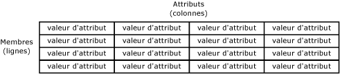
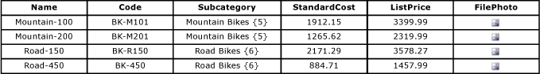
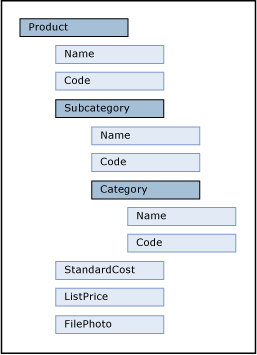

# Entités (services de données de référence)

[!INCLUDE[appliesto-ss-xxxx-xxxx-xxx-md-winonly](../includes/appliesto-ss-xxxx-xxxx-xxx-md-winonly.md)]

  Les entités sont des objets contenus dans des modèles [!INCLUDE[ssMDSshort](../includes/ssmdsshort-md.md)] . Chaque entité contient des membres, qui correspondent aux lignes de données de référence que vous gérez.  
  
## Quel est le nombre approprié d'entités ?  
 Les modèles peuvent contenir autant d'entités que vous souhaitez gérer. Chaque entité doit regrouper un type semblable de données. Par exemple, vous pouvez souhaiter utiliser une entité pour tous vos comptes d'entreprise, ou pour votre liste principale d'employés.  
  
 En général, il existe une ou plusieurs entités centrales qui sont importantes pour votre entreprise, et auxquelles d'autres objets dans le modèle sont associés. Par exemple, un modèle Product peut comporter une entité centrale appelée Product associée à des entités appelées Subcategory et Category. Toutefois, vous n'avez pas besoin d'avoir une entité centrale. Selon vos besoins, vous pouvez utiliser plusieurs entités que vous considérez d'importance égale.  
  
## Lien entre les entités et les autres objets de modèle  
 Vous pouvez considérer une entité comme une table qui contient des données de référence, dans laquelle les lignes représentent des membres et les colonnes des attributs.  
  
   
  
 Vous devez remplir l'entité avec une liste des données de référence que vous souhaitez gérer.  
  
 Les entités permettent de générer des hiérarchies dérivées, qui sont des hiérarchies basées sur le niveau et sur plusieurs entités. Pour plus d’informations, consultez [Hiérarchies dérivées &#40;Master Data Services&#41;](../master-data-services/derived-hierarchies-master-data-services.md).  
  
 Les entités peuvent également être activées pour contenir des hiérarchies explicites (structures déséquilibrées basées sur une seule entité) et des collections (combinaisons uniques de sous-ensembles de membres). Pour plus d’informations, consultez [Hiérarchies explicites &#40;Master Data Services&#41;](../master-data-services/explicit-hierarchies-master-data-services.md) et [Collections &#40;Master Data Services&#41;](../master-data-services/collections-master-data-services.md).  
  
## Utilisation d'entités en tant que listes contraintes  
 Lorsque les utilisateurs affectent des attributs aux membres d'une entité, vous pouvez les forcer à choisir dans une liste contrainte de valeurs. Pour cela, vous devez vous servir d'une entité pour remplir une liste de valeurs pour l'attribut. Cet attribut est qualifié d'attribut basé sur un domaine. Pour plus d’informations, consultez [Attributs basés sur un domaine &#40;Master Data Services&#41;](../master-data-services/domain-based-attributes-master-data-services.md).  
  
## Entités de base  
 Une entité de base est un point de départ pour les utilisateurs qui parcourent les objets du modèle. Une entité de base détermine la disposition de l’écran lorsqu’un utilisateur ouvre la zone fonctionnelle **Explorateur** et clique sur **Explorateur** dans la barre de menus. Pour spécifier une entité comme entité de base, accédez à la zone fonctionnelle **Administration de système** . Dans la page **Vue du modèle** , faites glisser l’entité du contrôle d’arborescence à droite vers le nom du modèle dans le contrôle d’arborescence à gauche.  
  
## Sécurité d'une entité  
 Vous pouvez accorder aux utilisateurs l'autorisation d'accès à une entité, y compris aux objets de modèle associés. Pour plus d’informations, consultez [Autorisations d’entité &#40;Master Data Services&#41;](../master-data-services/entity-permissions-master-data-services.md).  
  
## Exemples d'entités  
 L'exemple suivant montre un entité comportant les attributs suivants : Name, Code, Subcategory, StandardCost, ListPrice et FilePhoto. Ces attributs décrivent les membres. Chaque membre est représenté par une ligne unique de valeurs d'attribut.  
  
   
  
 Dans l'exemple suivant, l'entité Product est l'entité centrale. L'entité Subcategory est un attribut basé sur un domaine de l'entité Product. L'entité Category est un attribut basé sur un domaine de l'entité Subcategory. StandardCost et ListPrice sont des attributs de forme libre de l'entité Product, et FilePhoto est un attribut de fichier de l'entité Product.  
  
   
  
> [!NOTE]  
>  Il s'agit d'un exemple basé sur l'interface utilisateur de [!INCLUDE[ssMDSmdm](../includes/ssmdsmdm-md.md)] . La structure de l'arborescence hiérarchique affiche les relations entre les entités et les attributs basés sur un domaine. Elle est conçue pour afficher les relations plutôt que pour représenter les niveaux d'importance.  
  
## Related Tasks  
  
|Description de la tâche|Rubrique|  
|----------------------|-----------|  
|Créez une entité.|[Créer une entité &#40;Master Data Services&#41;](../master-data-services/create-an-entity-master-data-services.md)|  
|Modifiez le nom d'une entité existante.|[Modifier une entité &#40;Master Data Services&#41;](../master-data-services/edit-an-entity-master-data-services.md)|  
|Supprimez une entité existante.|[Supprimer une entité &#40;Master Data Services&#41;](../master-data-services/delete-an-entity-master-data-services.md)|  
|Affectez une autorisation à des entités.|[Affecter des autorisations d’objet de modèle &#40;Master Data Services&#41;](../master-data-services/assign-model-object-permissions-master-data-services.md)|  
  
## Contenu associé  
  
-   [Modèles &#40;Master Data Services&#41;](../master-data-services/models-master-data-services.md)  
  
-   [Membres &#40;Master Data Services&#41;](../master-data-services/members-master-data-services.md)  
  
-   [Attributs &#40;Master Data Services&#41;](../master-data-services/attributes-master-data-services.md)  
  
  
