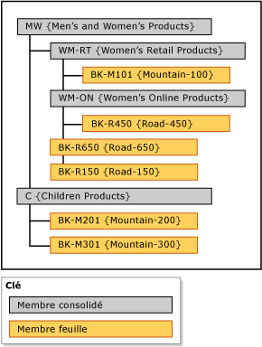

# Hiérarchies explicites (services de données de référence)

[!INCLUDE[appliesto-ss-xxxx-xxxx-xxx-md-winonly](../includes/appliesto-ss-xxxx-xxxx-xxx-md-winonly.md)]

  Dans [!INCLUDE[ssMDSshort](../includes/ssmdsshort-md.md)], une hiérarchie explicite organise les membres d'une seule entité comme vous le souhaitez. La structure peut être déséquilibrée et contrairement aux hiérarchies dérivées, les hiérarchies explicites ne sont pas basées sur des relations d'attributs basés sur un domaine.  
  
> [!NOTE]  
>  La hiérarchie explicite est déconseillée.  
  
## Les membres consolidés regroupent d'autres membres  
 Une hiérarchie explicite utilise des membres consolidés que vous créez en vue de regrouper d'autres membres. Ces membres consolidés ne peuvent appartenir qu'à une seule hiérarchie explicite à la fois. Une hiérarchie explicite inclut également tous les membres feuille de l'entité associée.  
  
 Une hiérarchie explicite peut être déséquilibrée, ce qui signifie qu'elle peut se terminer à des niveaux différents simultanément. Chaque membre consolidé peut avoir un nombre illimité de membres consolidés et feuille en dessous, ou n'en avoir aucun. Les membres feuille peuvent se trouver sous un membre consolidé unique ou sous plusieurs niveaux de membres consolidés.  
  
> [!NOTE]  
>  Avant de pouvoir créer une hiérarchie explicite, l'entité doit être activée pour les hiérarchies explicites.  
  
## Types de hiérarchies explicites  
 Il existe deux types de hiérarchies explicites : obligatoire et non obligatoire.  
  
### Hiérarchie explicite obligatoire  
 Une hiérarchie explicite obligatoire est une hiérarchie dans laquelle tous les membres feuille doivent être inclus dans l'arborescence hiérarchique. Par défaut, tous les membres sont inclus à la racine de l'arborescence. Vous pouvez réorganiser les membres autant que nécessaire.  
  
### Hiérarchie explicite non obligatoire  
 Une hiérarchie explicite non obligatoire est une hiérarchie dans laquelle tous les membres feuille se trouvent dans un nœud **Inutilisé** créé par le système. Vous pouvez déplacer des membres hors de ce nœud lorsque vous en avez besoin. Le reste des membres peut rester dans le nœud **Inutilisé** .  
  
 Lorsque vous utilisez des hiérarchies explicites non obligatoires, toute création de rapports ou analyse faites sur la hiérarchie peuvent ne pas correspondre à celles effectuées sur les hiérarchies obligatoires.  
  
## Règles  
 Les règles suivantes s'appliquent aux hiérarchies explicites (à la fois obligatoire et non obligatoire).  
  
-   Chaque membre feuille ne peut être inclus dans la hiérarchie qu'une fois.  
  
-   Tous les membres consolidés doivent être inclus dans une hiérarchie.  
  
-   Les membres consolidés ne peuvent pas être dans plusieurs hiérarchies explicites.  
  
-   Les membres consolidés dans l'arborescence hiérarchique n'ont pas à contenir des membres feuille en dessous.  
  
-   Si vous supprimez une hiérarchie explicite, tous les membres consolidés utilisés dans la hiérarchie sont supprimés.  
  
-   Si vous supprimez un membre consolidé qui était dans une hiérarchie explicite, tous les membres feuille regroupés selon ce membre consolidé sont déplacés vers la racine.  
  
## Hiérarchies explicites et hiérarchies dérivées  
 Le tableau suivant répertorie certaines différences entre les hiérarchies explicites et dérivées.  
  
|Hiérarchies explicites|Hiérarchies dérivées|  
|--------------------------|-------------------------|  
|La structure est définie par l'utilisateur|La structure est dérivée des relations entre les attributs basés sur un domaine|  
|Contient les membres d'une seule entité|Contient les membres de plusieurs entités|  
|Utilise les membres consolidés pour regrouper d'autres membres|Utilise des membres feuille d'une entité pour regrouper des membres feuille d'une autre entité|  
|Peut être déséquilibré|Contient toujours un nombre cohérent de niveaux|  
  
## Exemple de hiérarchie explicite  
 Dans l'exemple suivant, l'entité Product contient les membres feuille suivants : BK-M101 {Mountain-100}, BK-M201 {Mountain-200}, BK-M301 {Mountain-300}, BK-R150 {Road-150}, BK-R450 {Road-450} et BK-R650 {Road-650}.  
  
 Pour synthétiser ces membres feuille à des points de consolidation spécifiques, vous pouvez créer des membres consolidés dans l'entité Product. Insérez les membres consolidés à des niveaux de l'arborescence hiérarchique où vous souhaitez synthétiser les membres feuille. Il n'existe aucune limitation quant à l'emplacement où vous insérez vos membres consolidés ; toutefois, chaque membre (feuille ou consolidé) ne peut être utilisé qu'une fois.  
  
   
  
 Les membres consolidés peuvent être utilisés pour regrouper des membres à tout niveau, et les membres feuille et consolidés sont triés dans l'ordre que vous déterminez.  
  
## Related Tasks  
  
|Description de la tâche|Rubrique|  
|----------------------|-----------|  
|Créer une hiérarchie explicite.|[Créer une hiérarchie explicite &#40;Master Data Services&#41;](../master-data-services/create-an-explicit-hierarchy-master-data-services.md)|  
|Modifier le nom d'une hiérarchie explicite existante.|[Modifier le nom d’une hiérarchie explicite &#40;Master Data Services&#41;](../master-data-services/change-an-explicit-hierarchy-name-master-data-services.md)|  
|Supprimer une hiérarchie explicite existante.|[Supprimer une hiérarchie explicite &#40;Master Data Services&#41;](../master-data-services/delete-an-explicit-hierarchy-master-data-services.md)|  
|||  
  
## Contenu associé  
  
-   [Hiérarchies dérivées &#40;Master Data Services&#41;](../master-data-services/derived-hierarchies-master-data-services.md)  
  
-   [Collections &#40;Master Data Services&#41;](../master-data-services/collections-master-data-services.md)  
  
  
