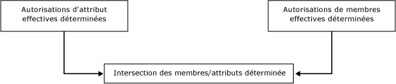
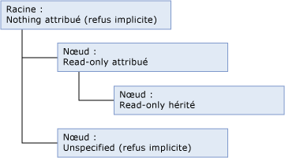
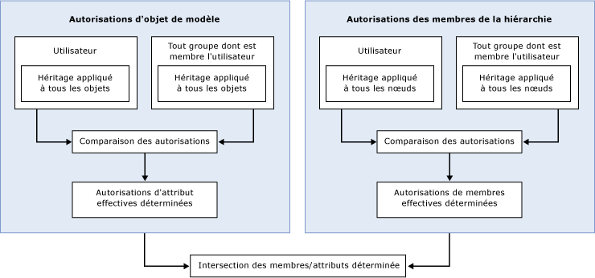

# Mode de détermination des autorisations (Master Data Services)

[!INCLUDE[appliesto-ss-xxxx-xxxx-xxx-md-winonly](../includes/appliesto-ss-xxxx-xxxx-xxx-md-winonly.md)]

  Dans [!INCLUDE[ssMDSshort](../includes/ssmdsshort-md.md)], la méthode la plus simple pour configurer la sécurité est d'affecter des autorisations d'objet de modèle à un groupe dont l'utilisateur est membre.  
  
 La sécurité devient plus complexe lorsque :  
  
-   sont attribués à la fois des autorisations d'objet de modèle et des autorisations des membres de la hiérarchie ;  
  
-   l'utilisateur appartient à des groupes et l'autorisation est attribuée à la fois à l'utilisateur et aux groupes ;  
  
-   l'utilisateur appartient à des groupes et l'autorisation est attribuée à plusieurs groupes.  
  
## Autorisations attribuées à un seul groupe ou utilisateur  
 Si vous attribuez des autorisations à un seul groupe ou utilisateur, les autorisations sont déterminées selon le flux de travail suivant.  
  
   
  
### Étape 1 : les autorisations d'attribut effectives sont déterminées.  
 La liste suivante décrit comment sont déterminées les autorisations d'attribut effectives :  
  
-   Les autorisations attribuées aux objets de modèle déterminent les attributs auxquels un utilisateur peut accéder.  
  
-   Tous les objets de modèle héritent automatiquement de l'autorisation de l'objet le plus proche à un niveau supérieur dans la structure du modèle.  
  
-   Tout objet situé au même niveau que l'entité est refusé implicitement.  
  
-   Tout objet situé à un niveau supérieur obtient un accès de navigation. Pour plus d’informations, consultez [Accès de navigation &#40;Master Data Services&#41;](../master-data-services/navigational-access-master-data-services.md).  
  
 Dans cet exemple, l’autorisation **Lecture** est attribuée à une entité et héritée par son attribut, qui se trouve à un niveau inférieur dans la structure du modèle. Le modèle fournit un accès de navigation à cette entité et son attribut. L'autre entité dans le modèle ne dispose d'aucune autorisation explicite attribuée et n'hérite d'aucune autorisation, donc elle est refusée implicitement.  
  
   
  
### Étape 2 : si les autorisations des membres de la hiérarchie sont attribuées, les autorisations de membre effectives sont déterminées.  
 La liste suivante explique comment les autorisations des membres de la hiérarchie effectives sont déterminées :  
  
-   Les autorisations attribuées aux nœuds de la hiérarchie déterminent les membres auxquels un utilisateur peut accéder.  
  
-   Tous les nœuds dans une hiérarchie héritent automatiquement de l'autorisation de l'objet le plus proche à un niveau supérieur dans la structure de la hiérarchie.  
  
-   Tout nœud situé au même niveau est refusé implicitement.  
  
-   Tout nœud situé aux niveaux supérieurs auquel aucune autorisation n'est attribuée est refusé implicitement.  
  
 Dans cet exemple, l’autorisation **Lecture** est attribuée à un nœud de la hiérarchie, puis héritée par un nœud à un niveau inférieur dans la structure de hiérarchie. La racine n'a aucune autorisation attribuée, donc elle est refusée implicitement. L'autre nœud dans la structure de hiérarchie ne dispose d'aucune autorisation explicite attribuée et n'hérite d'aucune autorisation, donc il est refusé implicitement.  
  
   
  
### Étape 3 : l'intersection des autorisations d'attribut et de membre est déterminée.  
 Si les autorisations d'attribut effectives sont différentes des autorisations de membre effectives, les autorisations doivent être déterminées pour chaque valeur d'attribut individuelle. Pour plus d’informations, consultez [Chevauchement des autorisations de modèle et de membre &#40;Master Data Services&#41;](../master-data-services/overlapping-model-and-member-permissions-master-data-services.md).  
  
## Autorisations attribuées à plusieurs groupes  
 Si un utilisateur appartient à un ou plusieurs groupes et que les autorisations sont attribuées à la fois à l'utilisateur et aux groupes, le flux de travail devient plus complexe.  
  
   
  
 Dans ce cas, le chevauchement des autorisations de l'utilisateur et du groupe doit être résolu avant que les autorisations de l'objet de modèle et des membres de la hiérarchie puissent être comparées. Pour plus d’informations, consultez [Chevauchement des autorisations d’accès &#40;Master Data Services&#41;](../master-data-services/overlapping-user-and-group-permissions-master-data-services.md).  
  
##  Voir aussi  
 [Chevauchement des autorisations d’accès &#40;Master Data Services&#41;](../master-data-services/overlapping-user-and-group-permissions-master-data-services.md)   
 [Chevauchement des autorisations de modèle et de membre &#40;Master Data Services&#41;](../master-data-services/overlapping-model-and-member-permissions-master-data-services.md)  
  
  
