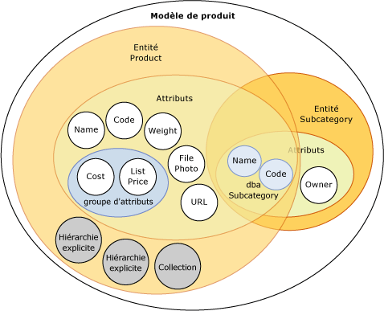
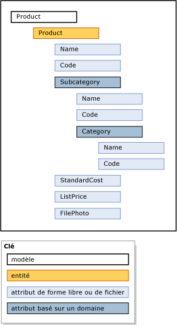

# Modèles (services de données de référence)

[!INCLUDE[appliesto-ss-xxxx-xxxx-xxx-md-winonly](../includes/appliesto-ss-xxxx-xxxx-xxx-md-winonly.md)]

  Les modèles constituent le niveau d'organisation des données le plus élevé dans [!INCLUDE[ssMDSshort](../includes/ssmdsshort-md.md)]. Un modèle définit la structure des données dans votre solution de gestion des données de référence. Un modèle contient les objets suivants :  
  
-   Entités  
  
-   Attributs et groupes d'attributs  
  
-   Hiérarchies explicites et dérivées  
  
-   Collections  
  
 Les modèles organisent la structure de vos données de référence. Votre implémentation [!INCLUDE[ssMDSshort](../includes/ssmdsshort-md.md)] peut avoir un ou plusieurs modèles regroupant chacun des types de données similaires. En général, les données de référence peuvent figurer dans l'une des quatre catégories suivantes : personnes, lieux, choses ou concepts. Par exemple, vous pouvez créer un modèle Product pour contenir des données relatives à un produit ou un modèle Customer pour contenir des données relatives à un client.  
  
 Vous pouvez affecter aux utilisateurs et groupes l'autorisation d'afficher et de mettre à jour des objets dans le modèle. Si vous ne donnez pas d'autorisation sur le modèle, il n'est pas affiché.  
  
 À tout moment, vous pouvez créer des copies des données de référence dans un modèle. Ces copies sont appelées versions.  
  
 Lorsque vous avez défini un modèle dans un environnement de test, vous pouvez le déployer, avec ou sans les données correspondantes, de l'environnement de test vers un environnement de production. Vous n'avez ainsi plus besoin de recréer vos modèles dans votre environnement de production.  
  
## Relations entre les modèles et les autres objets  
 Un modèle contient des entités. Les entités contiennent des attributs, des hiérarchies explicites et des collections. Les attributs peuvent être contenus dans des groupes d'attributs. Les attributs basés sur un domaine existent lorsqu'une entité sert d'attribut à une autre entité.  
  
 Cette image montre les relations entre les objets dans un modèle.  
  
   
  
> [!NOTE]  
>  Les hiérarchies dérivées sont également des objets de modèle, mais ils ne figurent pas dans l'image. Les hiérarchies dérivées sont dérivées des relations d'attributs basés sur un domaine qui existent entre les entités. Consultez [Hiérarchies dérivées &#40;Master Data Services&#41;](../master-data-services/derived-hierarchies-master-data-services.md) pour plus d’informations.  
  
 Les données de référence sont les données contenues dans les objets de modèle. Dans [!INCLUDE[ssMDSshort](../includes/ssmdsshort-md.md)], les données de référence sont stockées en tant que membres dans une entité.  
  
 Les objets de modèle sont conservés dans la zone fonctionnelle **Administration de système** de l'interface utilisateur de [!INCLUDE[ssMDSmdm](../includes/ssmdsmdm-md.md)] .  
  
## Exemple de modèle  
 Dans l'exemple suivant, les objets dans le modèle Product regroupent logiquement les données relatives au produit.  
  
   
  
 D'autres modèles courants figurent ci-dessous :  
  
-   Accounts, qui peut inclure des entités, telles que les comptes de bilans, les comptes de résultats, les statistiques et le type de compte.  
  
-   Customer, qui peut inclure des entités, telles que le sexe, l'éducation, la profession et l'état civil.  
  
-   Geography, qui peut inclure des entités, telles que les codes postaux, villes, comtés, états, provinces, régions, territoires, pays et continents.  
  
## Related Tasks  
  
|Description de la tâche|Rubrique|  
|----------------------|-----------|  
|Créer un modèle pour organiser vos données de référence.|[Créer un modèle &#40;Master Data Services&#41;](../master-data-services/create-a-model-master-data-services.md)|  
|Modifier le nom d'un modèle existant.|[Modifier un modèle &#40;Master Data Services&#41;](../master-data-services/edit-model-master-data-services.md)|  
|Supprimer un modèle existant.|[Supprimer un modèle &#40;Master Data Services&#41;](../master-data-services/delete-a-model-master-data-services.md)|  
  
## Contenu associé  
  
-   [Vue d’ensemble de Master Data Services &#40;MDS&#41;](../master-data-services/master-data-services-overview-mds.md)  
  
-   [Entités &#40;Master Data Services&#41;](../master-data-services/entities-master-data-services.md)  
  
-   [Attributs &#40;Master Data Services&#41;](../master-data-services/attributes-master-data-services.md)  
  
-   [Déploiement de modèles &#40;Master Data Services&#41;](../master-data-services/deploying-models-master-data-services.md)  
  
-   [Autorisations d’objet de modèle &#40;Master Data Services&#41;](../master-data-services/model-object-permissions-master-data-services.md)  
  
  
