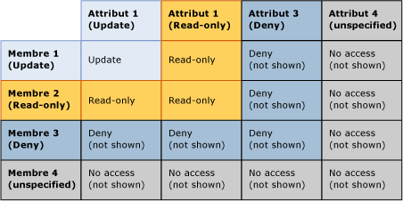
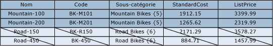
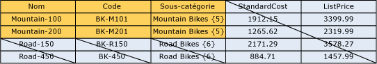

# Chevauchement des autorisations de modèle et de membre (Master Data Services)

[!INCLUDE[appliesto-ss-xxxx-xxxx-xxx-md-winonly](../includes/appliesto-ss-xxxx-xxxx-xxx-md-winonly.md)]

  Une autorisation attribuée à un membre et une autorisation attribuée à un objet de modèle peuvent se chevaucher. Lorsque des chevauchements se produisent, l'autorisation la plus restrictive entre en vigueur.  
  
 Si un membre a une autorisation qui est différente de celle de son objet de modèle correspondant, les règles suivantes s'appliquent :  
  
-   **Refuser** remplace toutes les autres autorisations.  
  
-   L’autorisation**Admin** au niveau du modèle remplace toutes les autres autorisations ; elle est remplacée par une autorisation de type Tous les accès (CRUD) pour les sous-niveaux.  
  
-   L’autorisation d’accès effective chevauche les autorisations des membres et attributs.  
  
     Par exemple, si les membres possèdent des autorisations **Créer** et **Mettre à jour**, l’autorisation des attributs sera **Mettre à jour**. L’autorisation effective sera **Mettre à jour**.  
  
 L'image suivante montre les autorisations appliquées sur une valeur d'attribut individuelle lorsque les autorisations d'attribut sont différentes des autorisations de membre.  
  
   
  
## Exemple 1  
   
  
 Sous l'onglet **Modèles** , l'entité Product a l'autorisation **Mise à jour** attribuée. Tous les attributs dans l'entité héritent de cette autorisation.  
  
 Sous l'onglet **Membres de hiérarchie** , le nœud de sous-catégorie Mountain Bikes dans une hiérarchie dérivée a l'autorisation **Mise à jour** attribuée.  
  
 Résultat : dans **Explorateur**, l'utilisateur a l'autorisation **Mise à jour** sur toutes les valeurs d'attribut de tous les membres qui se trouvent dans le nœud Mountain Bikes. Tous les autres membres et attributs sont masqués.  
  
   
  
## Exemple 2  
   
  
 Sous l'onglet **Modèles** , l'attribut Subcategory a l'autorisation **Mise à jour** attribuée.  
  
 Sous l’onglet **Membres de hiérarchie** , le nœud de sous-catégorie Mountain Bikes dans une hiérarchie dérivée a l’autorisation **Lecture** attribuée explicitement.  
  
 Résultat : dans **Explorateur**, l’utilisateur a l’autorisation **Lecture** sur les valeurs d’attribut Subcategory des membres qui se trouvent dans le nœud Mountain Bikes. Tous les autres membres et attributs sont masqués.  
  
   
  
## Exemple 3  
   
  
 Sous l’onglet **Modèles** , l’attribut Subcategory se voit attribuer l’autorisation **Lecture** .  
  
 Sous l'onglet **Membres de hiérarchie** , le nœud de sous-catégorie Mountain Bikes dans une hiérarchie dérivée a l'autorisation **Mise à jour** attribuée explicitement.  
  
 Résultat : dans l’ **Explorateur**, l’utilisateur a l’autorisation **Lecture** sur les valeurs d’attribut. Tous les autres membres et attributs sont masqués.  
  
   
  
##  Voir aussi  
 [Mode de détermination des autorisations &#40;Master Data Services&#41;](../master-data-services/how-permissions-are-determined-master-data-services.md)   
 [Chevauchement des autorisations des utilisateurs et des groupes &#40;Master Data Services&#41;](../master-data-services/overlapping-user-and-group-permissions-master-data-services.md)  
  
  
