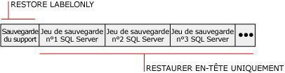

# Historique de sauvegarde et informations d'en-tête (SQL Server)
[!INCLUDE[appliesto-ss-xxxx-xxxx-xxx-md](../../includes/appliesto-ss-xxxx-xxxx-xxx-md.md)]
  Un historique complet de toutes les opérations de restauration et de sauvegarde [!INCLUDE[ssNoVersion](../../includes/ssnoversion-md.md)] sur une instance de serveur est stocké dans la base de données **msdb** . Cette rubrique présente les tables d'historique de sauvegarde et de restauration, ainsi que les instructions [!INCLUDE[tsql](../../includes/tsql-md.md)] servant à accéder à l'historique de sauvegarde. Elle explique également dans quels cas il est utile d'afficher la liste des fichiers journaux de base de données et de transactions et dans quelles circonstances utiliser les informations d'en-tête de support ou les informations d'en-tête de sauvegarde.  
  
> [!IMPORTANT]  
>  Pour minimiser le risque de perdre les modifications apportées récemment à votre historique de sauvegarde et de restauration, sauvegardez fréquemment **msdb** . Pour plus d’informations sur les bases de données système que vous devez sauvegarder, consultez [Sauvegarder et restaurer des bases de données système &#40;SQL Server&#41;](../../relational-databases/backup-restore/back-up-and-restore-of-system-databases-sql-server.md).  
  
 **Dans cette rubrique :**  
  
-   [Tables d'historique de sauvegarde et de restauration](#BnRHistoryTables)  
  
-   [Instructions Transact-SQL permettant d'accéder à l'historique de sauvegarde](#TsqlStatementsForBackupHistory)  
  
-   [Fichiers journaux de base de données et de transactions](#ListDbTlogFiles)  
  
-   [Informations d'en-tête de support](#MediaHeader)  
  
-   [Informations d'en-tête de sauvegarde](#BackupHeader)  
  
-   [Comparaison des informations d'en-tête de support et d'en-tête de sauvegarde](#CompareMediaHeaderBackupHeader)  
  
-   [Vérification de la sauvegarde](#Verification)  
  
-   [Tâches associées](#RelatedTasks)  
  
##   Tables d'historique de sauvegarde et de restauration  
 Cette section présente les tables d'historique qui stockent les métadonnées de restauration et de sauvegarde dans la base de données système **msdb** .  
  
|Table d'historique|Description|  
|-------------------|-----------------|  
|[backupfile](../../relational-databases/system-tables/backupfile-transact-sql.md)|Cette table contient une ligne pour chaque fichier de données ou fichier journal sauvegardé.|  
|[backupfilegroup](../../relational-databases/system-tables/backupfilegroup-transact-sql.md)|Contient une ligne pour chaque groupe de fichiers d'un jeu de sauvegarde.|  
|[backupmediafamily](../../relational-databases/system-tables/backupmediafamily-transact-sql.md)|Cette table contient une ligne pour chaque famille de supports de sauvegardes. Si une famille de supports réside dans un support de sauvegarde miroir, elle a une ligne distincte pour chaque miroir du support de sauvegarde.|  
|[backupmediaset](../../relational-databases/system-tables/backupmediaset-transact-sql.md)|Contient une ligne pour chaque support de sauvegarde.|  
|[backupset](../../relational-databases/system-tables/backupset-transact-sql.md)|Contient une ligne pour chaque jeu de sauvegarde.|  
|[restorefile](../../relational-databases/system-tables/restorefile-transact-sql.md)|Contient une ligne pour chaque fichier restauré. Sont inclus les fichiers restaurés indirectement par nom de groupe de fichiers.|  
|[restorefilegroup](../../relational-databases/system-tables/restorefilegroup-transact-sql.md)|Contient une ligne par groupe de fichiers restaurés.|  
|[restorehistory](../../relational-databases/system-tables/restorehistory-transact-sql.md)|Contient une ligne par opération de restauration.|  
  
> [!NOTE]  
>  Lorsqu'une restauration est effectuée, les tables d'historique de sauvegarde et les tables d'historique de restauration sont modifiées.  
  
##   Instructions Transact-SQL permettant d'accéder à l'historique de sauvegarde  
 Les instructions d'information de restauration correspondent aux informations stockées dans certaines tables d'historique de sauvegarde.  
  
> [!IMPORTANT]  
>  Les instructions Transact-SQL RESTORE FILELISTONLY, RESTORE HEADERONLY, RESTORE LABELONLY et RESTORE VERIFYONLY nécessitent l'autorisation CREATE DATABASE. Cette nécessité sécurise vos fichiers de sauvegarde et protège vos informations de sauvegarde de façon plus complète que dans les versions précédentes. Pour plus d’informations sur cette autorisation, consultez [Autorisations de base de données GRANT &#40;Transact-SQL&#41;](../../t-sql/statements/grant-database-permissions-transact-sql.md).  
  
|Instructions d'information|Table d'historique de sauvegarde|Description|  
|---------------------------|--------------------------|-----------------|  
|[RESTORE FILELISTONLY](../../t-sql/statements/restore-statements-filelistonly-transact-sql.md)|[backupfile](../../relational-databases/system-tables/backupfile-transact-sql.md)|Renvoie un ensemble de résultats qui contient une liste des fichiers journaux et des fichiers de la base de données contenus dans le jeu de sauvegardes spécifié.   Pour plus d'informations, consultez « Liste des fichiers de base de données et du journal des transactions », plus loin dans cette rubrique.|  
|[RESTORE HEADERONLY](../../t-sql/statements/restore-statements-headeronly-transact-sql.md)|[backupset](../../relational-databases/system-tables/backupset-transact-sql.md)|Récupère toutes les informations d'en-tête de sauvegarde pour tous les jeux de sauvegardes d'une unité de sauvegarde particulière. L'exécution de RESTORE HEADERONLY aboutit à un ensemble de résultats.   Pour plus d'informations, consultez « Affichage des informations de l'en-tête de sauvegarde » plus loin dans cette rubrique.|  
|[RESTORE LABELONLY](../../t-sql/statements/restore-statements-labelonly-transact-sql.md)|[backupmediaset](../../relational-databases/system-tables/backupmediaset-transact-sql.md)|Renvoie un ensemble de résultats contenant des informations relatives au support de sauvegarde d'une unité de sauvegarde spécifiée.   Pour plus d'informations, consultez « Affichage des informations de l'en-tête du support » plus loin dans cette rubrique.|  
  
##   Fichiers journaux de base de données et de transactions  
 Les informations affichées dans la liste des fichiers journaux de base de données et de transactions d'une sauvegarde comprennent le nom logique, le nom physique, le type de fichier (base de données ou journal), l'appartenance à un groupe de fichiers, la taille de fichier (en octets), la taille de fichier maximale autorisée et la taille de croissance de fichier prédéfinie (en octets). Ces informations sont utiles, dans les cas suivants, pour déterminer les noms des fichiers dans une sauvegarde de base de données avant de la restaurer lorsque :  
  
-   vous avez perdu une unité de disque contenant un ou plusieurs fichiers pour une base de données ;  
  
     Vous pouvez dresser une liste des fichiers de la sauvegarde de la base de données pour déterminer les fichiers affectés et les restaurer sur une unité différente lors de la restauration de l'intégralité de la base de données ou ne restaurer que ces fichiers et appliquer toutes les sauvegardes du journal des transactions créées depuis la dernière sauvegarde de la base de données.  
  
-   vous restaurez une base de données d'un serveur vers un autre, mais la structure du répertoire et le mappage du disque n'existent pas sur le serveur.  
  
     L'énumération des fichiers dans la sauvegarde vous permet de déterminer les fichiers qui sont affectés. La sauvegarde peut par exemple contenir un fichier à restaurer sur le lecteur E alors que le serveur de destination n'a pas de lecteur E. Le fichier doit être déplacé vers un autre emplacement, tel que le lecteur Z quand le fichier est restauré.  
  
##   Informations d'en-tête de support  
 L'affichage de l'en-tête de support présente les informations relatives au support lui-même et non pas aux sauvegardes se trouvant sur le support. Les informations d'en-tête de support affichées comprennent le nom du support, sa description, le nom du logiciel utilisé pour créer l'en-tête de support et la date à laquelle l'en-tête de support a été écrit.  
  
> [!NOTE]  
>  L'affichage de l'en-tête de support est rapide.  
  
 Pour plus d’informations, consultez [Comparaison des informations d’en-tête de support et d’en-tête de sauvegarde](#CompareMediaHeaderBackupHeader), plus loin dans cette rubrique.  
  
##   Informations d'en-tête de sauvegarde  
 L'affichage de l'en-tête de sauvegarde présente les informations relatives à tous les jeux de sauvegarde [!INCLUDE[ssNoVersion](../../includes/ssnoversion-md.md)] ou non-[!INCLUDE[ssNoVersion](../../includes/ssnoversion-md.md)] , qui se trouvent sur le support. Les informations qui sont affichées comprennent les types de périphériques de sauvegardes utilisés, les types de sauvegarde (par exemple base de données, transaction, fichier ou base de données différentielle) et les informations de date/heure de début et de fin de sauvegarde. Ces informations sont utiles lorsque vous devez déterminer le jeu de sauvegarde à restaurer sur la bande ou les sauvegardes contenues sur le support.  
  
> [!NOTE]  
>  L'affichage des informations d'en-tête de sauvegarde peut prendre du temps pour les bandes de grande capacité car la totalité du support doit être balayée pour pouvoir afficher les informations concernant chaque sauvegarde du support.  
  
 Pour plus d’informations, consultez [Comparaison des informations d’en-tête de support et d’en-tête de sauvegarde](#CompareMediaHeaderBackupHeader), plus loin dans cette rubrique.  
  
### Quel jeu de sauvegarde restaurer  
 Vous pouvez utiliser les informations de l'en-tête de sauvegarde pour identifier le jeu de sauvegarde à restaurer. Le moteur de base de données numérote chaque jeu de sauvegarde sur le support de sauvegarde. Cela vous permet d'identifier le jeu de sauvegarde à restaurer à l'aide de sa position sur le support. Par exemple, le support suivant contient trois jeux de sauvegarde.  
  
   
  
 Pour restaurer un jeu de sauvegarde spécifique, précisez le numéro d'ordre de ce jeu. Par exemple, pour restaurer le deuxième jeu de sauvegarde, spécifiez 2 comme jeu de sauvegarde à restaurer.  
  
##   Comparaison des informations d'en-tête de support et d'en-tête de sauvegarde  
 La tableau suivant donne un exemple des différences entre l’affichage des informations de l’en-tête de sauvegarde et de l’en-tête de support. L'obtention de l'en-tête de support ne nécessite que la récupération des informations au début de la bande. L'obtention de l'en-tête de sauvegarde nécessite d'analyser la bande entière pour examiner l'en-tête de chaque jeu de sauvegarde.  
  
   
  
> [!NOTE]  
>  Si vous utilisez des jeux de supports ayant plusieurs familles de supports, l'en-tête de support et le jeu de sauvegarde sont écrits sur toutes les familles. Par conséquent, il suffit de fournir une seule famille de supports pour ces opérations de rapport.  
  
 Pour plus d'informations sur l'affichage de l'en-tête de support, consultez « Affichage des informations de l'en-tête du support » plus haut dans cette rubrique.  
  
 Pour plus d'informations sur l'affichage des informations d'en-tête de sauvegarde pour tous les jeux de sauvegardes d'une unité de sauvegarde, consultez « Informations d'en-tête de sauvegarde » plus haut dans cette rubrique.  
  
##   Vérification de la sauvegarde  
 Bien qu'elle ne soit pas obligatoire, la vérification d'une sauvegarde est une pratique utile. Cette opération porte sur l'intégrité physique de la sauvegarde ; elle permet de s'assurer que tous les fichiers de la sauvegarde sont lisibles et exploitables et que vous pouvez restaurer la sauvegarde en cas de besoin. Notez que la vérification ne porte pas sur la structure des données de la sauvegarde. Cependant, si la sauvegarde a été créée à l'aide de WITH CHECKSUMS, sa vérification à l'aide de WITH CHECKSUMS peut fournir une bonne indication de la fiabilité des données de la sauvegarde.  
  
##   Tâches associées  
 **Pour supprimer les anciennes lignes des tables d'historique de sauvegarde et de restauration**  
  
-   [sp_delete_backuphistory &#40;Transact-SQL&#41;](../../relational-databases/system-stored-procedures/sp-delete-backuphistory-transact-sql.md)  
  
 **Pour supprimer toutes les lignes relatives à une base de données spécifique dans les tables d'historique de sauvegarde et de restauration**  
  
-   [sp_delete_database_backuphistory &#40;Transact-SQL&#41;](../../relational-databases/system-stored-procedures/sp-delete-database-backuphistory-transact-sql.md)  
  
 **Pour afficher les données et les fichiers journaux dans un jeu de sauvegarde**  
  
-   [RESTORE FILELISTONLY &#40;Transact-SQL&#41;](../../t-sql/statements/restore-statements-filelistonly-transact-sql.md)  
  
-   <xref:Microsoft.SqlServer.Management.Smo.Restore.ReadFileList%2A> (SMO)  
  
 **Pour afficher les informations d'en-tête de support**  
  
-   [RESTORE LABELONLY &#40;Transact-SQL&#41;](../../t-sql/statements/restore-statements-labelonly-transact-sql.md)  
  
-   [Afficher les propriétés et le contenu d’une unité de sauvegarde logique &#40;SQL Server&#41;](../../relational-databases/backup-restore/view-the-properties-and-contents-of-a-logical-backup-device-sql-server.md)  
  
-   [Afficher le contenu d’un fichier ou d’une bande de sauvegarde &#40;SQL Server&#41;](../../relational-databases/backup-restore/view-the-contents-of-a-backup-tape-or-file-sql-server.md)  
  
-   <xref:Microsoft.SqlServer.Management.Smo.Restore.ReadMediaHeader%2A> (SMO)  
  
 **Pour afficher les informations d'en-tête de sauvegarde**  
  
-   [RESTORE HEADERONLY &#40;Transact-SQL&#41;](../../t-sql/statements/restore-statements-headeronly-transact-sql.md)  
  
-   [Afficher le contenu d’un fichier ou d’une bande de sauvegarde &#40;SQL Server&#41;](../../relational-databases/backup-restore/view-the-contents-of-a-backup-tape-or-file-sql-server.md)  
  
-   [Afficher les propriétés et le contenu d’une unité de sauvegarde logique &#40;SQL Server&#41;](../../relational-databases/backup-restore/view-the-properties-and-contents-of-a-logical-backup-device-sql-server.md)  
  
-   <xref:Microsoft.SqlServer.Management.Smo.Restore.ReadBackupHeader%2A> (SMO)  
  
 **Pour supprimer les anciennes lignes des tables d'historique de sauvegarde et de restauration**  
  
-   [sp_delete_backuphistory &#40;Transact-SQL&#41;](../../relational-databases/system-stored-procedures/sp-delete-backuphistory-transact-sql.md)  
  
 **Pour supprimer toutes les lignes relatives à une base de données spécifique dans les tables d'historique de sauvegarde et de restauration**  
  
-   [sp_delete_database_backuphistory &#40;Transact-SQL&#41;](../../relational-databases/system-stored-procedures/sp-delete-database-backuphistory-transact-sql.md)  
  
 **Pour afficher les informations d'en-tête de support**  
  
-   [RESTORE LABELONLY &#40;Transact-SQL&#41;](../../t-sql/statements/restore-statements-labelonly-transact-sql.md)  
  
-   [Afficher les propriétés et le contenu d’une unité de sauvegarde logique &#40;SQL Server&#41;](../../relational-databases/backup-restore/view-the-properties-and-contents-of-a-logical-backup-device-sql-server.md)  
  
-   [Afficher le contenu d’un fichier ou d’une bande de sauvegarde &#40;SQL Server&#41;](../../relational-databases/backup-restore/view-the-contents-of-a-backup-tape-or-file-sql-server.md)  
  
-   <xref:Microsoft.SqlServer.Management.Smo.Restore.ReadMediaHeader%2A> (SMO)  
  
 **Pour afficher les informations d'en-tête de sauvegarde**  
  
-   [RESTORE HEADERONLY &#40;Transact-SQL&#41;](../../t-sql/statements/restore-statements-headeronly-transact-sql.md)  
  
-   [Afficher le contenu d’un fichier ou d’une bande de sauvegarde &#40;SQL Server&#41;](../../relational-databases/backup-restore/view-the-contents-of-a-backup-tape-or-file-sql-server.md)  
  
-   [Afficher les propriétés et le contenu d’une unité de sauvegarde logique &#40;SQL Server&#41;](../../relational-databases/backup-restore/view-the-properties-and-contents-of-a-logical-backup-device-sql-server.md)  
  
-   <xref:Microsoft.SqlServer.Management.Smo.Restore.ReadBackupHeader%2A> (SMO)  
  
 **Pour afficher les fichiers dans un jeu de sauvegarde**  
  
-   [Afficher les fichiers de données et les fichiers journaux dans un jeu de sauvegarde &#40;SQL Server&#41;](../../relational-databases/backup-restore/view-the-data-and-log-files-in-a-backup-set-sql-server.md)  
  
-   [RESTORE HEADERONLY &#40;Transact-SQL&#41;](../../t-sql/statements/restore-statements-headeronly-transact-sql.md)  
  
 **Pour vérifier une sauvegarde**  
  
-   [RESTORE VERIFYONLY &#40;Transact-SQL&#41;](../../t-sql/statements/restore-statements-verifyonly-transact-sql.md)  
  
-   <xref:Microsoft.SqlServer.Management.Smo.Restore.SqlVerify%2A> (SMO)  
  
##  Voir aussi  
 [BACKUP &#40;Transact-SQL&#41;](../../t-sql/statements/backup-transact-sql.md)   
 [Jeux de supports, familles de supports et jeux de sauvegarde &#40;SQL Server&#41;](../../relational-databases/backup-restore/media-sets-media-families-and-backup-sets-sql-server.md)   
 [Unités de sauvegarde &#40;SQL Server&#41;](../../relational-databases/backup-restore/backup-devices-sql-server.md)   
 [Jeux de supports de sauvegarde en miroir &#40;SQL Server&#41;](../../relational-databases/backup-restore/mirrored-backup-media-sets-sql-server.md)   
 [Erreurs de support possibles pendant les opérations de sauvegarde et de restauration &#40;SQL Server&#41;](../../relational-databases/backup-restore/possible-media-errors-during-backup-and-restore-sql-server.md)  
  
  
