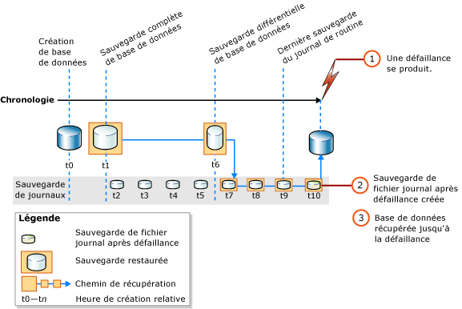

# <a name="complete-database-restores-full-recovery-model"></a>Restaurations complètes de bases de données (mode de récupération complète)
[!INCLUDE[appliesto-ss-xxxx-xxxx-xxx-md](../../includes/appliesto-ss-xxxx-xxxx-xxx-md.md)]

  Lors d'une restauration complète de base de données, le but est de restaurer la totalité de la base de données. L'ensemble de la base de données est hors ligne pendant la durée de la restauration. Avant qu'une partie quelconque de la base de données ne puisse être mise en ligne, toutes les données sont récupérées dans un état cohérent où toutes les parties de la base de données sont chronologiquement synchronisées et aucune transaction non validée n'existe.  
  
 Dans le mode de récupération complète, après avoir restauré vos sauvegardes de données, vous devez restaurer toutes les sauvegardes ultérieures des journaux de transactions, puis récupérer la base de données. Vous pouvez restaurer une base de données vers un *point de récupération* spécifique dans l'une de ces sauvegardes de fichiers journaux. Ce point de récupération peut correspondre à une date et une heure spécifiques, une transaction marquée ou un numéro séquentiel dans le journal (LSN, Log Sequence Number).  
  
 Lorsque vous restaurez une base de données, en particulier en mode de restauration complète ou de récupération utilisant les journaux des transactions, vous devez utiliser une séquence de restauration unique. Une *séquence de restauration* consiste en une ou plusieurs opérations de restauration déplaçant des données entre une ou plusieurs phases de restauration.  
  
> [!IMPORTANT]  
>  Nous vous recommandons de ne pas attacher ni restaurer de bases de données provenant de sources inconnues ou non approuvées. Ces bases de données peuvent contenir du code malveillant qui peut exécuter du code [!INCLUDE[tsql](../../includes/tsql-md.md)] imprévisible ou causer des erreurs en modifiant le schéma ou la structure physique de la base de données. Avant d’utiliser une base de données issue d’une source inconnue ou non approuvée, exécutez [DBCC CHECKDB](../../t-sql/database-console-commands/dbcc-checkdb-transact-sql.md) sur la base de données sur un serveur autre qu’un serveur de production et examinez également le code, notamment les procédures stockées ou tout autre code défini par l’utilisateur, de la base de données.  
  
 **Dans cette rubrique :**  
  
-   [Restauration d'une base de données jusqu'au point de défaillance](#PointOfFailure)  
  
-   [Restauration d'une base de données jusqu'à un point dans une sauvegarde de fichier journal](#PointWithinBackup)  
  
-   [Tâches associées](#RelatedTasks)  
  
> [!NOTE]  
>  Pour plus d’informations sur la prise en charge de sauvegardes provenant de versions antérieures de [!INCLUDE[ssNoVersion](../../includes/ssnoversion-md.md)], consultez la section « Prise en charge de la compatibilité » de [RESTORE &#40;Transact-SQL&#41;](../../t-sql/statements/restore-statements-transact-sql.md).  
  
##  <a name="PointOfFailure"></a> Restauration d'une base de données jusqu'au point de défaillance  
 Généralement, la récupération d'une base de données jusqu'au point de défaillance comprend les étapes de base suivantes :  
  
1.  Sauvegardez le journal des transactions actives (connu sous le nom de fin du journal). Cela entraîne la création d'une sauvegarde de la fin du journal. Si le journal des transactions actives n'est pas disponible, toutes les transactions contenues dans cette partie du journal sont perdues.  
  
    > [!IMPORTANT]  
    >  Dans le mode de récupération utilisant les journaux de transactions, la sauvegarde de tout journal contenant des opérations journalisées en bloc nécessite un accès à tous les fichiers de données dans la base de données. Si les fichiers de données ne sont pas accessibles, le journal des transactions ne peut pas être sauvegardé. Dans ce cas, vous devez répéter manuellement tous les changements effectués depuis la dernière sauvegarde du journal.  
  
     Pour plus d’informations, consultez [Sauvegardes de la fin du journal &#40;SQL Server&#41;](../../relational-databases/backup-restore/tail-log-backups-sql-server.md).  
  
2.  Restaurez la sauvegarde complète de base de données la plus récente sans récupérer la base de données (RESTORE DATABASE *nom_base_de_données* FROM *unité_sauvegarde* WITH NORECOVERY).  
  
3.  S’il existe des sauvegardes différentielles, restaurez la plus récente sans récupérer la base de données (RESTORE DATABASE *nom_base_de_données* FROM *unité_sauvegarde_différentielle* WITH NORECOVERY).  
  
     La restauration de la sauvegarde différentielle la plus récente réduit le nombre de sauvegardes de fichiers journaux qui doivent être restaurées.  
  
4.  En commençant par la première sauvegarde du journal des transactions qui a été créée après la sauvegarde que vous venez de restaurer, restaurez les journaux en séquence avec l'instruction NORECOVERY.  
  
5.  Récupérez la base de données (RESTORE DATABASE *nom_base_de_données* WITH RECOVERY). Cette étape peut également être combinée avec la restauration de la dernière sauvegarde du journal.  
  
 L'illustration suivante montre cette séquence de restauration. Après une défaillance (1), une sauvegarde de la fin du journal est créée (2). Ensuite, la base de données est restaurée jusqu'au point de défaillance. Cela implique la restauration d'une sauvegarde de base de données suivie d'une sauvegarde différentielle, ainsi que de chaque sauvegarde de journal effectuée après la sauvegarde différentielle, y compris la sauvegarde de la fin du journal.  
  
   
  
> [!NOTE]  
>  Quand vous restaurez une sauvegarde de base de données sur une instance de serveur différente, consultez [Copier des bases de données avec la sauvegarde et la restauration](../../relational-databases/databases/copy-databases-with-backup-and-restore.md).  
  
###  <a name="TsqlSyntax"></a> Syntaxe de base de l'instruction Transact-SQL RESTORE  
 La syntaxe [RESTORE](../../t-sql/statements/restore-statements-transact-sql.md)[!INCLUDE[tsql](../../includes/tsql-md.md)] de base pour la séquence de restauration dans l’illustration précédente est la suivante :  
  
1.  RESTORE DATABASE *database* FROM *full database backup* WITH NORECOVERY;  
  
2.  RESTORE DATABASE *base_de_données* FROM *sauvegarde_base_de_données_complète* WITH NORECOVERY;  
  
3.  RESTORE LOG *base_de_données* FROM *sauvegarde_journal* WITH NORECOVERY;  
  
     Répétez cette étape de restauration pour chaque sauvegarde de fichier journal supplémentaire.  
  
4.  RESTORE DATABASE *database* WITH RECOVERY;  
  
###  <a name="ExampleToPoFTsql"></a> Exemple : récupération jusqu'au point de défaillance (Transact-SQL)  
 L'exemple [!INCLUDE[tsql](../../includes/tsql-md.md)] suivant indique les principales options d'une séquence de restauration qui restaure la base de données jusqu'au point de défaillance. L'exemple crée une sauvegarde de la fin du journal de la base de données. Ensuite, il restaure une sauvegarde complète de base de données et une sauvegarde de fichier journal, puis restaure la sauvegarde de la fin du journal. L'exemple récupère la base de données dans une dernière étape séparée.  
  
> [!NOTE]  
>  Cet exemple utilise une sauvegarde de base de données et une sauvegarde du journal créées dans la section « Utilisation des sauvegardes de base de données en mode de récupération complète » dans [Sauvegardes complètes de bases de données &#40;SQL Server&#41;](../../relational-databases/backup-restore/full-database-backups-sql-server.md). Avant la sauvegarde de la base de données, l'exemple de base de données de [!INCLUDE[ssSampleDBobject](../../includes/sssampledbobject-md.md)] a été défini pour utiliser le mode de récupération complète.  
  
```  
USE master;  
--Create tail-log backup.  
BACKUP LOG AdventureWorks2012   
TO DISK = 'Z:\SQLServerBackups\AdventureWorksFullRM.bak'    
   WITH NORECOVERY;   
GO  
--Restore the full database backup (from backup set 1).  
RESTORE DATABASE AdventureWorks2012   
  FROM DISK = 'Z:\SQLServerBackups\AdventureWorksFullRM.bak'   
  WITH FILE=1,   
    NORECOVERY;  
  
--Restore the regular log backup (from backup set 2).  
RESTORE LOG AdventureWorks2012   
  FROM DISK = 'Z:\SQLServerBackups\AdventureWorksFullRM.bak'   
  WITH FILE=2,   
    NORECOVERY;  
  
--Restore the tail-log backup (from backup set 3).  
RESTORE LOG AdventureWorks2012   
  FROM DISK = 'Z:\SQLServerBackups\AdventureWorksFullRM.bak'  
  WITH FILE=3,   
    NORECOVERY;  
GO  
--recover the database:  
RESTORE DATABASE AdventureWorks2012 WITH RECOVERY;  
GO  
```  
  
##  <a name="PointWithinBackup"></a> Restauration d'une base de données jusqu'à un point dans une sauvegarde de fichier journal  
 En mode de récupération complète, une restauration complète de base de données peut généralement être récupérée jusqu'à une date et une heure, une transaction marquée ou un LSN dans une sauvegarde de fichier journal. Cependant, en mode de récupération utilisant les journaux des transactions, si la sauvegarde du journal contient des modifications journalisées en bloc, la récupération jusqu'à une date et heure est impossible.  
  
### <a name="sample-point-in-time-restore-scenarios"></a>Exemples de scénarios de restauration jusqu'à une date et heure  
 L'exemple suivant suppose un système de bases de données critique pour lequel une sauvegarde complète est créée chaque nuit à minuit, une sauvegarde différentielle chaque heure tous les jours du lundi au samedi et une sauvegarde du journal des transactions toutes les 10 minutes pendant la journée. Pour restaurer la base de données telle qu'elle était à 5h19 mercredi : Vous devez effectuer les opérations suivantes :  
  
1.  Restaurez la sauvegarde complète de la base de données créée mardi à minuit.  
  
2.  Restaurez la sauvegarde différentielle de base de données créée à 5h00 mercredi.  
  
3.  Appliquez la sauvegarde de journal des transactions qui a été créée à 5h10 mercredi.  
  
4.  Appliquez la sauvegarde de journal des transactions qui a été créée à 5h20 mercredi, en précisant que la procédure de récupération ne s'applique qu'aux transactions ayant eu lieu avant 5h19.  
  
 Puis, si la base de données doit être restaurée à son état initial à 3h04 le jeudi matin, mais que la sauvegarde différentielle créée le jeudi à 3h00 n'est pas disponible, effectuez les opérations suivantes :  
  
1.  Restaurez la sauvegarde de base de données qui a été créée mercredi à minuit.  
  
2.  Restaurez la sauvegarde différentielle de base de données créée à 2h00 jeudi.  
  
3.  Appliquez toutes les sauvegardes de journal des transactions créées entre 2h10 et 3h00 jeudi.  
  
4.  Appliquez la sauvegarde de journal des transactions qui a été créée à 3h10 jeudi, en arrêtant le processus de récupération à 3h04.  
  
> [!NOTE]  
>  Pour obtenir un exemple de restauration de point-à-temps, consultez [Restaurer une base de données SQL Server jusqu’à une limite dans le temps &#40;mode de récupération complète&#41;](../../relational-databases/backup-restore/restore-a-sql-server-database-to-a-point-in-time-full-recovery-model.md).  
  
##  <a name="RelatedTasks"></a> Tâches associées  
 **Pour restaurer une sauvegarde complète de base de données**  
  
-   [Restaurer une sauvegarde de base de données à l’aide de SSMS](../../relational-databases/backup-restore/restore-a-database-backup-using-ssms.md)  
  
-   [Restaurer une base de données à un nouvel emplacement &#40;SQL Server&#41;](../../relational-databases/backup-restore/restore-a-database-to-a-new-location-sql-server.md)  
  
 **Pour restaurer une sauvegarde différentielle de base de données**  
  
-   [Restaurer une sauvegarde différentielle de base de données &#40;SQL Server&#41;](../../relational-databases/backup-restore/restore-a-differential-database-backup-sql-server.md)  
  
 **Pour restaurer une sauvegarde de journal des transactions**  
  
-   [Restaurer une sauvegarde de journal des transactions &#40;SQL Server&#41;](../../relational-databases/backup-restore/restore-a-transaction-log-backup-sql-server.md)  
  
 **Pour restaurer une sauvegarde à l'aide de SMO (SQL Server Management Objects)**  
  
-   <xref:Microsoft.SqlServer.Management.Smo.Restore.SqlRestore%2A>  
  
 **Pour restaurer une base de données jusqu'à un point dans une sauvegarde de fichier journal**  
  
-   [Restaurer une base de données SQL Server jusqu’à une limite dans le temps &#40;mode de récupération complète&#41;](../../relational-databases/backup-restore/restore-a-sql-server-database-to-a-point-in-time-full-recovery-model.md)  
  
-   [Récupération de bases de données associées contenant une transaction marquée](../../relational-databases/backup-restore/recovery-of-related-databases-that-contain-marked-transaction.md)  
  
-   [Récupérer un numéro séquentiel dans le journal &#40;SQL Server&#41;](../../relational-databases/backup-restore/recover-to-a-log-sequence-number-sql-server.md)  
  
## <a name="see-also"></a> Voir aussi  
 [RESTORE &#40;Transact-SQL&#41;](../../t-sql/statements/restore-statements-transact-sql.md)   
 [BACKUP &#40;Transact-SQL&#41;](../../t-sql/statements/backup-transact-sql.md)   
 [Appliquer les sauvegardes du journal des transactions &#40;SQL Server&#41;](../../relational-databases/backup-restore/apply-transaction-log-backups-sql-server.md)   
 [sp_addumpdevice &#40;Transact-SQL&#41;](../../relational-databases/system-stored-procedures/sp-addumpdevice-transact-sql.md)   
 [Sauvegardes complètes de bases de données &#40;SQL Server&#41;](../../relational-databases/backup-restore/full-database-backups-sql-server.md)   
 [Sauvegardes différentielles &#40;SQL Server&#41;](../../relational-databases/backup-restore/differential-backups-sql-server.md)   
 [Vue d’ensemble de la sauvegarde &#40;SQL Server&#41;](../../relational-databases/backup-restore/backup-overview-sql-server.md)   
 [Vue d’ensemble de la restauration et de la récupération &#40;SQL Server&#41;](../../relational-databases/backup-restore/restore-and-recovery-overview-sql-server.md)  
  
  
