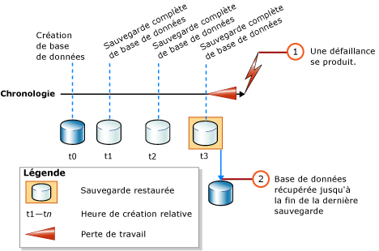
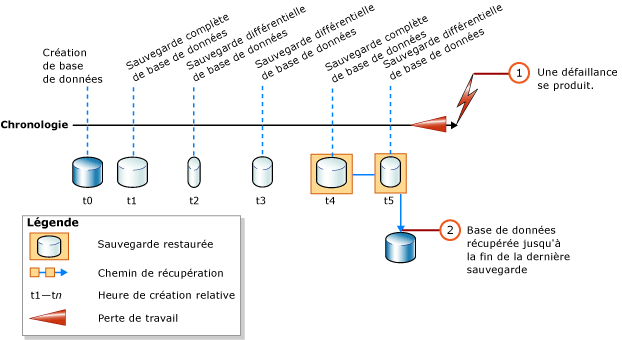

# <a name="complete-database-restores-simple-recovery-model"></a>Restaurations complètes de bases de données (mode de récupération simple)
[!INCLUDE[appliesto-ss-xxxx-xxxx-xxx-md](../../includes/appliesto-ss-xxxx-xxxx-xxx-md.md)]

  Lors d'une restauration complète de base de données, le but est de restaurer la totalité de la base de données. L'ensemble de la base de données est hors ligne pendant la durée de la restauration. Avant qu'une partie quelconque de la base de données ne puisse être mise en ligne, toutes les données sont récupérées dans un état cohérent où toutes les parties de la base de données sont chronologiquement synchronisées et aucune transaction non validée n'existe.  
  
 En mode de récupération simple, la base de données ne peut pas être restaurée à un certain point chronologique dans une sauvegarde spécifique.  
  
> [!IMPORTANT]  
>  Nous vous recommandons de ne pas attacher ni restaurer de bases de données provenant de sources inconnues ou non approuvées. Ces bases de données peuvent contenir du code malveillant qui peut exécuter du code [!INCLUDE[tsql](../../includes/tsql-md.md)] imprévisible ou causer des erreurs en modifiant le schéma ou la structure physique de la base de données. Avant d’utiliser une base de données issue d’une source inconnue ou non approuvée, exécutez [DBCC CHECKDB](../../t-sql/database-console-commands/dbcc-checkdb-transact-sql.md) sur la base de données sur un serveur autre qu’un serveur de production et examinez également le code, notamment les procédures stockées ou tout autre code défini par l’utilisateur, de la base de données.  
  
 **Dans cette rubrique :**  
  
-   [Vue d'ensemble de la restauration de la base de données en mode de récupération simple](#Overview)  
  
-   [Tâches associées](#RelatedTasks)  
  
> [!NOTE]  
>  Pour plus d’informations sur la prise en charge de sauvegardes provenant de versions antérieures de [!INCLUDE[ssNoVersion](../../includes/ssnoversion-md.md)], consultez la section « Prise en charge de la compatibilité » de [RESTORE &#40;Transact-SQL&#41;](../../t-sql/statements/restore-statements-transact-sql.md).  
  
##  <a name="Overview"></a> Vue d'ensemble de la restauration de la base de données en mode de récupération simple  
 Une restauration de base de données complète en mode de récupération simple s'effectue à l'aide d'une ou de deux instructions [RESTORE](../../t-sql/statements/restore-statements-transact-sql.md) , selon qu'il faille ou non restaurer une sauvegarde de base de données différentielle. Si vous utilisez uniquement une sauvegarde complète de base de données, restaurez simplement la sauvegarde la plus récente, tel qu'indiqué dans l'illustration suivante.  
  
   
  
 Si vous utilisez également une sauvegarde de base de données différentielle, restaurez la sauvegarde complète de base de données la plus récente sans récupérer la base de données, puis restaurez la sauvegarde de base de données différentielle la plus récente et récupérez la base de données. L'illustration ci-dessous montre ce processus.  
  
   
  
> [!NOTE]  
>  Si vous envisagez de restaurer une sauvegarde de base de données sur une instance de serveur différente, consultez [Copier des bases de données avec la sauvegarde et la restauration](../../relational-databases/databases/copy-databases-with-backup-and-restore.md).  
  
###  <a name="TsqlSyntax"></a> Syntaxe de base de l'instruction Transact-SQL RESTORE  
 La syntaxe [!INCLUDE[tsql](../../includes/tsql-md.md)][RESTORE](../../t-sql/statements/restore-statements-transact-sql.md) de base pour la restauration d’une sauvegarde complète de base de données est :  
  
 RESTORE DATABASE *database_name* FROM *backup_device* [ WITH NORECOVERY ]  
  
> [!NOTE]  
>  Utilisez la commande WITH NORECOVERY si vous envisagez de restaurer aussi une sauvegarde de base de données différentielle.  
  
 La syntaxe de base [RESTORE](../../t-sql/statements/restore-statements-transact-sql.md) pour la restauration d'une sauvegarde de base de données est :  
  
 RESTORE DATABASE *database_name* FROM *backup_device* WITH RECOVERY  
  
###  <a name="Example"></a> Exemple (Transact-SQL)  
 L'exemple ci-dessous illustre d'abord l'utilisation de l'instruction [BACKUP](../../t-sql/statements/backup-transact-sql.md) pour créer une sauvegarde complète et une sauvegarde différentielle de la base de données [!INCLUDE[ssSampleDBobject](../../includes/sssampledbobject-md.md)] . L'exemple restaure ensuite ces sauvegardes dans l'ordre. La base de données est restaurée dans l'état qui était le sien à la fin de la sauvegarde différentielle de base de données.  
  
 L'exemple illustre les options importantes d'une séquence de restauration dans le cadre d'un scénario de restauration complète de base de données. Une *séquence de restauration* consiste en une ou plusieurs opérations de restauration déplaçant des données entre une ou plusieurs phases de restauration. La syntaxe et les détails qui ne sont pas pertinents sont omis. Si vous récupérez une base de données, nous vous recommandons de spécifier explicitement l'option RECOVERY par souci de clarté, bien qu'il s'agisse de l'option par défaut.  
  
> [!NOTE]  
>  L’exemple commence par une instruction [ALTER DATABASE](../../t-sql/statements/alter-database-transact-sql.md) qui affecte au mode de récupération la valeur `SIMPLE`.  
  
```  
USE master;  
--Make sure the database is using the simple recovery model.  
ALTER DATABASE AdventureWorks2012 SET RECOVERY SIMPLE;  
GO  
-- Back up the full AdventureWorks2012 database.  
BACKUP DATABASE AdventureWorks2012   
TO DISK = 'Z:\SQLServerBackups\AdventureWorks2012.bak'   
  WITH FORMAT;  
GO  
--Create a differential database backup.  
BACKUP DATABASE AdventureWorks2012   
TO DISK = 'Z:\SQLServerBackups\AdventureWorks2012.bak'  
   WITH DIFFERENTIAL;  
GO  
--Restore the full database backup (from backup set 1).  
RESTORE DATABASE AdventureWorks2012   
FROM DISK = 'Z:\SQLServerBackups\AdventureWorks2012.bak'   
   WITH FILE=1, NORECOVERY;  
--Restore the differential backup (from backup set 2).  
RESTORE DATABASE AdventureWorks2012   
FROM DISK = 'Z:\SQLServerBackups\AdventureWorks2012.bak'   
   WITH FILE=2, RECOVERY;  
GO  
```  
  
##  <a name="RelatedTasks"></a> Tâches associées  
 **Pour restaurer une sauvegarde complète de base de données**  
  
-   [Restaurer une sauvegarde de base de données en mode de récupération simple &#40;Transact-SQL&#41;](../../relational-databases/backup-restore/restore-a-database-backup-under-the-simple-recovery-model-transact-sql.md)  
  
-   [Restaurer une sauvegarde de base de données à l’aide de SSMS](../../relational-databases/backup-restore/restore-a-database-backup-using-ssms.md)  
  
-   [Restaurer une base de données à un nouvel emplacement &#40;SQL Server&#41;](../../relational-databases/backup-restore/restore-a-database-to-a-new-location-sql-server.md)  
  
 **Pour restaurer une sauvegarde différentielle de base de données**  
  
-   [Restaurer une sauvegarde différentielle de base de données &#40;SQL Server&#41;](../../relational-databases/backup-restore/restore-a-differential-database-backup-sql-server.md)  
  
 **Pour restaurer une sauvegarde à l'aide de SMO (SQL Server Management Objects)**  
  
-   <xref:Microsoft.SqlServer.Management.Smo.Restore.SqlRestore%2A>  
  
## <a name="see-also"></a> Voir aussi  
 [RESTORE &#40;Transact-SQL&#41;](../../t-sql/statements/restore-statements-transact-sql.md)   
 [BACKUP &#40;Transact-SQL&#41;](../../t-sql/statements/backup-transact-sql.md)   
 [sp_addumpdevice &#40;Transact-SQL&#41;](../../relational-databases/system-stored-procedures/sp-addumpdevice-transact-sql.md)   
 [Sauvegardes complètes de bases de données &#40;SQL Server&#41;](../../relational-databases/backup-restore/full-database-backups-sql-server.md)   
 [Sauvegardes différentielles &#40;SQL Server&#41;](../../relational-databases/backup-restore/differential-backups-sql-server.md)   
 [Vue d’ensemble de la sauvegarde &#40;SQL Server&#41;](../../relational-databases/backup-restore/backup-overview-sql-server.md)   
 [Vue d’ensemble de la restauration et de la récupération &#40;SQL Server&#41;](../../relational-databases/backup-restore/restore-and-recovery-overview-sql-server.md)  
  
  
