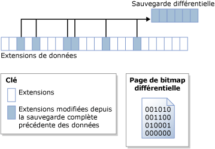

# Sauvegardes différentielles (SQL Server)
[!INCLUDE[appliesto-ss-xxxx-xxxx-xxx-md](../../includes/appliesto-ss-xxxx-xxxx-xxx-md.md)]
  Cette rubrique relative à la sauvegarde et à la restauration concerne toutes les bases de données [!INCLUDE[ssNoVersion](../../includes/ssnoversion-md.md)] .  
  
 Une sauvegarde différentielle est basée sur la sauvegarde complète des données précédente la plus récente. Une sauvegarde différentielle enregistre uniquement les modifications effectuées depuis la toute dernière sauvegarde complète. La sauvegarde complète sur laquelle une sauvegarde différentielle est basée s'appelle la *base* de la différentielle. Les sauvegardes complètes, à l'exception des sauvegardes de copie uniquement, peuvent servir de base à une série de sauvegardes différentielles, y compris les sauvegardes de base de données, partielles et de fichiers. La sauvegarde de base d'une sauvegarde différentielle de fichiers peut faire partie d'une sauvegarde complète, d'une sauvegarde de fichiers ou d'une sauvegarde partielle.  
  
  
##   Avantages  
  
-   La création d'une sauvegarde différentielle peut être très rapide par rapport à la création d'une sauvegarde complète. Une sauvegarde différentielle enregistre uniquement les modifications effectuées depuis la toute dernière sauvegarde complète sur laquelle la sauvegarde différentielle est basée. Cela facilite la réalisation de sauvegardes des données fréquentes et réduit ainsi le risque de perte de données. Toutefois, avant de restaurer une sauvegarde différentielle, vous devez restaurer la base associée. Par conséquent, la restauration à partir d'une sauvegarde différentielle nécessitera plus de mesures et de temps que la restauration à partir d'une sauvegarde complète, car deux fichiers de sauvegarde sont requis.  
  
-   Les sauvegardes différentielles sont particulièrement utiles dans les cas où un sous-ensemble de base de données est modifié plus fréquemment que le reste de la base de données. En pareil cas, les sauvegardes différentielles vous permettent d'effectuer des sauvegardes régulières sans les contraintes liées aux sauvegardes complètes.  
  
-   En mode de récupération complète, l'utilisation des sauvegardes différentielles peut réduire le nombre de sauvegardes de journaux à restaurer.  
  
##   Vue d'ensemble des sauvegardes différentielles  
 Une sauvegarde différentielle capture l’état de toutes les *extensions* (collections de huit pages physiquement contiguës) qui ont changé entre la création de la base différentielle et celle de la sauvegarde différentielle. Cela signifie que la taille d'une sauvegarde différentielle donnée dépend de la quantité de données qui a changé depuis la base. De manière générale, plus une base est ancienne, plus une nouvelle sauvegarde différentielle est volumineuse. Dans une série de sauvegardes différentielles, une extension fréquemment mise à jour contiendra probablement des données différentes dans chaque sauvegarde différentielle.  
  
 La figure ci-dessous illustre le fonctionnement d'une sauvegarde différentielle. La figure montre 24 extensions de données, dont six ont changé. La sauvegarde différentielle contient seulement ces six extensions de données. L'opération de sauvegarde différentielle s'appuie sur une page bitmap qui contient un bit pour chaque extension. Pour chaque extension mise à jour depuis la base, le bit a la valeur 1 dans le bitmap.  
  
   
  
> [!NOTE]  
>  Une sauvegarde de copie seule ne met pas à jour la bitmap différentielle. Par conséquent, une sauvegarde de copie seule n'affecte pas les sauvegardes différentielles ultérieures.  
  
 Une sauvegarde différentielle effectuée peu de temps après sa base est généralement beaucoup plus petite que la base différentielle. Vous gagnez ainsi du temps de sauvegarde et de l'espace de stockage. En revanche, au gré des modifications apportées à la base de données, la différence entre cette dernière et une base différentielle spécifique augmente avec le temps. Plus le temps écoulé entre une sauvegarde différentielle et sa base augmente, plus la taille de la sauvegarde différentielle peut être importante. Au bout du compte, cela signifie que la taille des sauvegardes différentielles peut atteindre celle de la base différentielle. Une sauvegarde différentielle considérable perd les avantages d'une sauvegarde plus rapide et plus réduite.  
  
 À mesure que la taille des sauvegardes différentielles augmente, la restauration d'une sauvegarde différentielle peut accroître considérablement le temps nécessaire à la restauration d'une base de données. Nous vous recommandons donc d'effectuer une nouvelle sauvegarde complète selon une périodicité fixe pour établir une nouvelle base différentielle des données. Par exemple, vous pouvez effectuer une sauvegarde complète hebdomadaire de la base de données dans son entier (soit une sauvegarde complète de la base de données), puis des séries régulières de sauvegardes de bases de données différentielles au cours de la semaine.  
  
 Au moment de la restauration, pour pouvoir restaurer une sauvegarde différentielle, vous devez restaurer sa base. Ensuite, pour amener la base de données jusqu'au stade de la création de la sauvegarde différentielle, il vous suffit de restaurer la sauvegarde différentielle la plus récente. En règle générale, vous restaurez la sauvegarde complète la plus récente suivie de la sauvegarde différentielle la plus récente qui est basée sur cette sauvegarde.  
  
## Sauvegardes différentielles de bases de données avec des tables mémoire optimisées  
 Pour plus d’informations sur les sauvegardes différentielles et les bases de données avec les tables optimisées en mémoire, consultez [Sauvegarde d’une base de données avec des tables optimisées en mémoire](../../relational-databases/in-memory-oltp/backing-up-a-database-with-memory-optimized-tables.md).  
  
##   Sauvegardes différentielles des bases de données en lecture seule  
 Pour les bases de données en lecture seule, les sauvegardes complètes utilisées seules sont plus aisées à gérer que lorsqu'elles sont utilisées avec des sauvegardes différentielles. Lorsqu'une base de données est en lecture seule, les opérations de sauvegarde et les autres opérations ne peuvent pas modifier les métadonnées contenues dans le fichier. Ainsi, les métadonnées nécessaires à une sauvegarde différentielle, telles que le numéro séquentiel dans le journal de début de la sauvegarde différentielle (LSN de base différentiel), sont stockées dans la base de données **master** . Si la base différentielle s'effectue lorsque la base de données est en lecture seule, la bitmap différentielle indique un nombre de modifications qui est supérieur au nombre réel depuis la sauvegarde de base. Les données supplémentaires sont lues par la sauvegarde mais ne sont pas écrites dans celle-ci, car **differential_base_lsn** stocké dans la table système [backupset](../../relational-databases/system-tables/backupset-transact-sql.md) sert à déterminer si les données ont changé depuis la base.  
  
 Lorsqu'une base de données en lecture seule est reconstruite, restaurée ou détachée et rattachée, les informations de base différentielle sont perdues. Cela tient au fait que la base de données **master** n'est pas synchronisée avec la base de données utilisateur. Le [!INCLUDE[ssDEnoversion](../../includes/ssdenoversion-md.md)] ne peut pas détecter, ni éviter ce problème. Les sauvegardes différentielles suivantes ne reposent pas sur la dernière sauvegarde complète et peuvent fournir des résultats inattendus. Pour créer une base différentielle, nous vous recommandons de créer une sauvegarde complète de la base de données.  
  
### Méthodes recommandées pour l'utilisation des sauvegardes différentielles avec une base de données en lecture seule  
 Après avoir créé une sauvegarde complète d’une base de données en lecture seule, sauvegardez la base de données **master** si vous voulez créer ensuite une sauvegarde différentielle.  
  
 Si vous perdez la base de données **master** , restaurez-la avant de restaurer une sauvegarde différentielle d'une base de données utilisateur.  
  
 Si vous détachez et attachez une base de données en lecture seule pour laquelle vous envisagez ensuite d’utiliser des sauvegardes différentielles, créez dès que possible une sauvegarde complète de la base de données en lecture seule et de la base de données **master** .  
  
##   Tâches associées  
  
-   [Créer une sauvegarde différentielle de base de données &#40;SQL Server&#41;](../../relational-databases/backup-restore/create-a-differential-database-backup-sql-server.md)  
  
-   [Restaurer une sauvegarde différentielle de base de données &#40;SQL Server&#41;](../../relational-databases/backup-restore/restore-a-differential-database-backup-sql-server.md)  
  
  
##  Voir aussi  
 [Vue d’ensemble de la sauvegarde &#40;SQL Server&#41;](../../relational-databases/backup-restore/backup-overview-sql-server.md)   
 [Sauvegardes complètes de bases de données &#40;SQL Server&#41;](../../relational-databases/backup-restore/full-database-backups-sql-server.md)   
 [Restaurations complètes de bases de données &#40;mode de récupération complète&#41;](../../relational-databases/backup-restore/complete-database-restores-full-recovery-model.md)   
 [Restaurations complètes de bases de données &#40;mode de récupération simple&#41;](../../relational-databases/backup-restore/complete-database-restores-simple-recovery-model.md)   
 [Sauvegardes des journaux de transactions &#40;SQL Server&#41;](../../relational-databases/backup-restore/transaction-log-backups-sql-server.md)  
  
  
