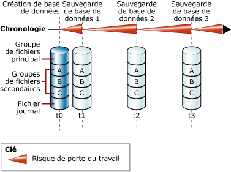
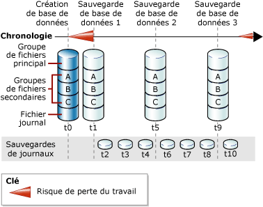

# <a name="full-database-backups-sql-server"></a>Sauvegardes complètes de bases de données (SQL Server)
[!INCLUDE[appliesto-ss-xxxx-xxxx-xxx-md](../../includes/appliesto-ss-xxxx-xxxx-xxx-md.md)]
  Une sauvegarde complète de base de données permet de sauvegarder l'intégralité d'une base de données. Ce type de sauvegarde comprend une partie du journal des transactions afin que toute la base de données puisse être récupérée après la restauration d'une sauvegarde complète de la base de données. Les sauvegardes complètes de base de données représentent la base de données à l'issue de l'opération de sauvegarde.  
  
> [!TIP]  
>  À mesure que la taille d'une base de données augmente, les sauvegardes complètes de base de données nécessitent davantage de temps et d'espace de stockage. Par conséquent, pour les bases de données volumineuses, il est conseillé de compléter les sauvegardes complètes avec une série de *sauvegardes différentielles de base de données*. Pour plus d’informations, consultez [Sauvegardes différentielles &#40;SQL Server&#41;](../../relational-databases/backup-restore/differential-backups-sql-server.md).  
  
> [!IMPORTANT]  
>  TRUSTWORTHY a la valeur OFF pour une sauvegarde de base de données. Pour plus d’informations sur la façon d’affecter la valeur ON à TRUSTWORTHY, consultez [Options ALTER DATABASE SET &#40;Transact-SQL&#41;](../../t-sql/statements/alter-database-transact-sql-set-options.md).  
  
 **Dans cette rubrique :**  
  
-   [Sauvegardes de base de données en mode de récupération simple](#DbBuRMs)  
  
-   [Sauvegardes de base de données en mode de récupération complète](#DbBuRMf)  
  
-   [Utiliser une sauvegarde complète pour restaurer la base de données](#RestoreDbBu)  
  
-   [Tâches associées](#RelatedTasks)  
  
##  <a name="DbBuRMs"></a> Sauvegardes de base de données en mode de récupération simple  
 En mode de récupération simple, après chaque sauvegarde, la base de données est exposée à des pertes de travaux potentielles en cas de sinistre. Le risque de perte de travail augmente après chaque mise à jour et ce, jusqu'à la sauvegarde suivante, après laquelle le risque de perte de travail redevient nul et un nouveau cycle de risque de perte de travail commence. Le risque de perte de travail augmente au fil du temps entre les sauvegardes. La figure ci-dessous montre le risque de perte de travail pour une stratégie de sauvegarde qui utilise uniquement des sauvegardes complètes de base de données.  
  
   
  
### <a name="example-includetsqlincludestsql-mdmd"></a>Exemple ([!INCLUDE[tsql](../../includes/tsql-md.md)])  
 L'exemple ci-dessous illustre la création d'une sauvegarde complète de base de données à l'aide de WITH FORMAT afin de remplacer les sauvegardes existantes et créer un jeu de supports.  
  
```  
-- Back up the AdventureWorks2012 database to new media set.  
BACKUP DATABASE AdventureWorks2012  
    TO DISK = 'Z:\SQLServerBackups\AdventureWorksSimpleRM.bak'   
    WITH FORMAT;  
GO  
```  
  
##  <a name="DbBuRMf"></a> Sauvegardes de base de données en mode de récupération complète  
 Pour les bases de données qui font appel au mode de récupération complète et au mode de récupération utilisant les journaux de transactions, les sauvegardes de base de données sont nécessaires, mais pas suffisantes. Les sauvegardes des journaux de transactions sont également requises. La figure ci-dessous montre la stratégie de sauvegarde la moins complexe possible en mode de restauration complète.  
  
   
  
 Pour plus d’informations sur la façon de créer des sauvegardes de journaux, consultez [Sauvegardes des journaux de transactions &#40;SQL Server&#41;](../../relational-databases/backup-restore/transaction-log-backups-sql-server.md).  
  
### <a name="example-includetsqlincludestsql-mdmd"></a>Exemple ([!INCLUDE[tsql](../../includes/tsql-md.md)])  
 L'exemple ci-dessous illustre la création d'une sauvegarde complète de base de données à l'aide de WITH FORMAT afin de remplacer les sauvegardes existantes et créer un jeu de supports. Puis, l'exemple sauvegarde le journal des transactions. Dans la réalité, vous seriez amené à effectuer une série de sauvegardes de fichier journal normales. Dans le cadre de cet exemple, l'exemple de base de données [!INCLUDE[ssSampleDBobject](../../includes/sssampledbobject-md.md)] est défini pour utiliser le mode de récupération complète.  
  
```  
USE master;  
ALTER DATABASE AdventureWorks2012 SET RECOVERY FULL;  
GO  
-- Back up the AdventureWorks2012 database to new media set (backup set 1).  
BACKUP DATABASE AdventureWorks2012  
  TO DISK = 'Z:\SQLServerBackups\AdventureWorks2012FullRM.bak'   
  WITH FORMAT;  
GO  
--Create a routine log backup (backup set 2).  
BACKUP LOG AdventureWorks2012 TO DISK = 'Z:\SQLServerBackups\AdventureWorks2012FullRM.bak';  
GO  
```  
  
##  <a name="RestoreDbBu"></a> Utiliser une sauvegarde complète pour restaurer la base de données  
 Vous pouvez recréer une base de données dans son intégralité en la restaurant à n'importe quel emplacement, en une seule étape, à partir d'une sauvegarde complète de base de données. La sauvegarde contient une partie suffisante du journal des transactions pour vous permettre de récupérer la base de données à l'issue de l'opération de sauvegarde. La base de données restaurée retrouve l'état qui était le sien à l'issue de la sauvegarde de base de données sans les transactions non validées. Dans le mode de récupération complète, vous devez restaurer toutes les sauvegardes ultérieures des journaux de transactions. Une fois la base de données récupérée, les transactions non validées sont restaurées.  
  
 Pour plus d’informations, consultez [Restaurations complètes de bases de données &#40;mode de récupération simple&#41;](../../relational-databases/backup-restore/complete-database-restores-simple-recovery-model.md) ou [Restaurations complètes de bases de données &#40;mode de récupération complète&#41;](../../relational-databases/backup-restore/complete-database-restores-full-recovery-model.md).  
  
##  <a name="RelatedTasks"></a> Tâches associées  
 **Pour créer une sauvegarde de base de données complète**  
  
-   [Créer une sauvegarde complète de base de données &#40;SQL Server&#41;](../../relational-databases/backup-restore/create-a-full-database-backup-sql-server.md)  
  
-   <xref:Microsoft.SqlServer.Management.Smo.Backup.SqlBackup%2A> (SMO)  
  
 **Pour planifier des travaux de sauvegarde**  
  
 [Utiliser l'Assistant Plan de maintenance](../../relational-databases/maintenance-plans/use-the-maintenance-plan-wizard.md)  
  
## <a name="see-also"></a> Voir aussi  
 [Sauvegarde et restauration des bases de données SQL Server](../../relational-databases/backup-restore/back-up-and-restore-of-sql-server-databases.md)   
 [Vue d’ensemble de la sauvegarde &#40;SQL Server&#41;](../../relational-databases/backup-restore/backup-overview-sql-server.md)   
 [Sauvegarde et restauration de bases de données Analysis Services](../../analysis-services/multidimensional-models/backup-and-restore-of-analysis-services-databases.md)  
  
  
