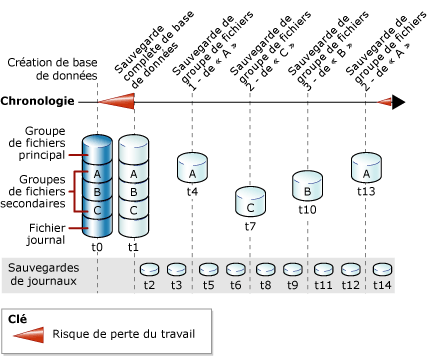

# Sauvegardes de fichiers complètes (SQL Server)
[!INCLUDE[appliesto-ss-xxxx-xxxx-xxx-md](../../includes/appliesto-ss-xxxx-xxxx-xxx-md.md)]
  Cette rubrique concerne les bases de données [!INCLUDE[ssNoVersion](../../includes/ssnoversion-md.md)] qui contiennent plusieurs fichiers ou groupes de fichiers.  
  
 Les fichiers d'une base de données [!INCLUDE[ssNoVersion](../../includes/ssnoversion-md.md)] peuvent être sauvegardés et restaurés individuellement. De plus, vous pouvez spécifier un groupe de fichiers entier au lieu de spécifier chaque fichier constitutif individuellement. Notez que si un fichier dans un groupe de fichiers est hors connexion (par exemple parce que le fichier est en cours de restauration), la totalité du groupe de fichiers est hors connexion et ne peut être sauvegardée.  
  
 Des sauvegardes de fichiers de groupes de fichiers en lecture seule peuvent être associées à des sauvegardes partielles. Les sauvegardes partielles incluent tous les groupes de fichiers en lecture-écriture et, éventuellement, un ou plusieurs groupes de fichiers en lecture seule. Pour plus d’informations, consultez [Sauvegardes partielles &#40;SQL Server&#41;](../../relational-databases/backup-restore/partial-backups-sql-server.md).  
  
 Une sauvegarde de fichiers peut servir de *base différentielle* pour des sauvegardes différentielles de fichiers. Pour plus d’informations, consultez [Sauvegardes différentielles &#40;SQL Server&#41;](../../relational-databases/backup-restore/differential-backups-sql-server.md).  
  
> [!NOTE]  
>  Les sauvegardes complètes de fichiers sont généralement appelées *sauvegardes de fichiers*, sauf quand elles sont comparées explicitement à des *sauvegardes différentielles de fichiers*.  
  
 **Dans cette rubrique :**  
  
-   [Avantages des sauvegardes de fichiers](#Benefits)  
  
-   [Inconvénients des sauvegardes de fichiers](#Disadvantages)  
  
-   [Vue d'ensemble des sauvegardes de fichiers](#Overview)  
  
-   [Tâches associées](#RelatedTasks)  
  
##   Avantages des sauvegardes de fichiers  
 Les sauvegardes de fichiers présentent les avantages suivants par rapport aux sauvegardes de base de données :  
  
-   L'utilisation de sauvegardes de fichiers peut augmenter la vitesse de récupération, car elle vous permet de restaurer uniquement les fichiers endommagés sans restaurer le reste de la base de données.  
  
     Par exemple, si une base de données est constituée de plusieurs fichiers situés sur des disques différents et qu'un disque est défectueux, seul le fichier du disque défectueux doit être restauré. Le fichier endommagé peut être restauré rapidement, l'opération prenant moins de temps que la restauration d'une base de données entière.  
  
-   Les sauvegardes de fichiers permettent une grande flexibilité dans la planification et la gestion des supports par rapport aux sauvegardes de bases de données complètes, lesquelles peuvent devenir impossibles à gérer si les bases de données sont particulièrement volumineuses. Cette flexibilité accrue des sauvegardes de fichiers ou de groupes de fichiers est également utile pour les bases de données volumineuses contenant des données avec différentes caractéristiques de mise à jour.  
  
##   Inconvénients des sauvegardes de fichiers  
  
-   Le principal inconvénient des sauvegardes de fichiers par rapport aux sauvegardes de bases de données complètes est la complexité administrative supplémentaire. Les tâches de gestion et de suivi d'un jeu complet de sauvegardes prennent beaucoup de temps et peuvent dépasser l'espace nécessaire pour les sauvegardes de bases de données complètes.  
  
-   Une défaillance du support peut rendre une base de données complète irrécupérable s'il n'existe aucune sauvegarde du fichier endommagé. Vous devez donc gérer un jeu complet de sauvegardes de fichiers et, en modes de restauration complète et de récupération utilisant les journaux de transactions, une ou plusieurs sauvegardes de journaux qui couvrent au minimum l'intervalle entre la première sauvegarde de fichiers complète et la dernière.  
  
##   Vue d'ensemble des sauvegardes de fichiers  
 Une sauvegarde complète de fichiers sauvegarde toutes les données d'un ou de plusieurs fichiers ou groupes de fichiers. Par défaut, les sauvegardes de fichiers contiennent suffisamment d'enregistrements de journaux pour restaurer par progression le fichier jusqu'à la fin de l'opération de sauvegarde.  
  
 La sauvegarde d'un fichier ou d'un groupe de fichiers en lecture seule est identique pour chaque mode de récupération. En mode de restauration complète, un jeu complet de sauvegardes complètes de fichiers associé à un nombre suffisant de sauvegardes de journaux pour couvrir toutes les sauvegardes de fichiers est équivalent à une sauvegarde complète de la base de données.  
  
 Une seule opération de sauvegarde de fichier peut être effectuée à la fois. Vous pouvez sauvegarder plusieurs fichiers à la fois, mais cette procédure peut augmenter la durée de récupération si vous avez besoin de restaurer un seul fichier. Cela tient au fait que toute la sauvegarde devra être lue pour localiser ce fichier.  
  
> [!NOTE]  
>  Les fichiers individuels peuvent être restaurés à partir d'une sauvegarde de base de données. Toutefois, la localisation et la restauration d'un fichier à partir d'une sauvegarde de base de données prennent plus de temps qu'à partir d'une sauvegarde de fichiers.  
  
### Sauvegardes de fichiers et le mode de récupération simple  
 En mode de récupération simple, vous devez sauvegarder conjointement tous les fichiers en lecture-écriture. Vous pouvez ainsi garantir que la base de données peut être restaurée dans un état cohérent dans le temps. Plutôt que de spécifier individuellement chaque fichier ou groupe de fichier en lecture-écriture, utilisez l'option READ_WRITE_FILEGROUPS. Cette option sauvegarde tous les groupes de fichiers en lecture-écriture dans la base de données. Une sauvegarde qui est créée en spécifiant READ_WRITE_FILEGROUPS est appelée une « sauvegarde partielle ». Pour plus d’informations, consultez [Sauvegardes partielles &#40;SQL Server&#41;](../../relational-databases/backup-restore/partial-backups-sql-server.md).  
  
### Sauvegardes de fichiers et mode de récupération complète  
 En mode de récupération complète, vous devez sauvegarder le journal des transactions, sans tenir compte du reste de votre stratégie de sauvegarde. Un jeu complet de sauvegardes complètes de fichiers associé à un nombre suffisant de sauvegardes de journaux pour couvrir toutes les sauvegardes de fichiers à partir de la première sauvegarde de fichiers, est équivalent à une sauvegarde complète de la base de données.  
  
 La restauration d'une base de données à l'aide seulement de sauvegardes de journaux et de fichiers peut être complexe. Aussi, dans la mesure du possible, il est recommandé d'effectuer une sauvegarde complète de base de données et de commencer les sauvegardes des journaux avant la première sauvegarde de fichiers. La figure ci-dessous illustre une stratégie dans laquelle une sauvegarde complète de base de données est effectuée (à l'instant t1) peu après la création de la base de données (à l'instant t0). Cette première sauvegarde de base de données permet aux sauvegardes des journaux de transactions de démarrer. Les sauvegardes des journaux de transactions sont planifiées à intervalles définis. Les sauvegardes de fichiers sont effectuées à l'intervalle qui répond au mieux aux besoins de l'entreprise concernant la base de données. Cette figure montre la sauvegarde individuelle de chacun des quatre groupes de fichiers. L'ordre de leur sauvegarde (A, C, B, A) correspond aux besoins de l'entreprise concernant la base de données.  
  
   
  
> [!NOTE]  
>  En mode de restauration complète, vous devez restaurer par progression le journal des transactions lors de la restauration d'une sauvegarde de fichiers en lecture-écriture pour que le fichier soit cohérent avec le reste de la base de données. Pour éviter de restaurer par progression de nombreuses sauvegardes du journal des transactions, envisagez l'utilisation de sauvegardes différentielles de fichiers. Pour plus d’informations, consultez [Sauvegardes différentielles &#40;SQL Server&#41;](../../relational-databases/backup-restore/differential-backups-sql-server.md).  
  
##   Tâches associées  
 **Pour créer une sauvegarde d'un fichier ou d'un groupe de fichiers**  
  
-   [Sauvegarder des fichiers et des groupes de fichiers &#40;SQL Server&#41;](../../relational-databases/backup-restore/back-up-files-and-filegroups-sql-server.md)  
  
-   <xref:Microsoft.SqlServer.Management.Smo.Backup.SqlBackup%2A> (SMO)  
  
> [!NOTE]  
>  Les sauvegardes de fichiers ne sont pas prises en charge par l'Assistant Plan de maintenance.  
  
##  Voir aussi  
 [BACKUP &#40;Transact-SQL&#41;](../../t-sql/statements/backup-transact-sql.md)   
 [Vue d’ensemble de la sauvegarde &#40;SQL Server&#41;](../../relational-databases/backup-restore/backup-overview-sql-server.md)   
 [Sauvegarde et restauration : interopérabilité et coexistence &#40;SQL Server&#41;](../../relational-databases/backup-restore/backup-and-restore-interoperability-and-coexistence-sql-server.md)   
 [Sauvegardes différentielles &#40;SQL Server&#41;](../../relational-databases/backup-restore/differential-backups-sql-server.md)   
 [Restaurations de fichiers &#40;mode de récupération simple&#41;](../../relational-databases/backup-restore/file-restores-simple-recovery-model.md)   
 [Restaurations de fichiers &#40;mode de récupération complète&#41;](../../relational-databases/backup-restore/file-restores-full-recovery-model.md)   
 [Restauration en ligne &#40;SQL Server&#41;](../../relational-databases/backup-restore/online-restore-sql-server.md)   
 [Restaurations fragmentaires &#40;SQL Server&#41;](../../relational-databases/backup-restore/piecemeal-restores-sql-server.md)  
  
  
