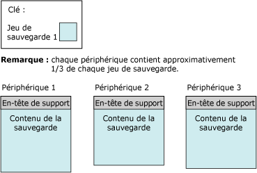
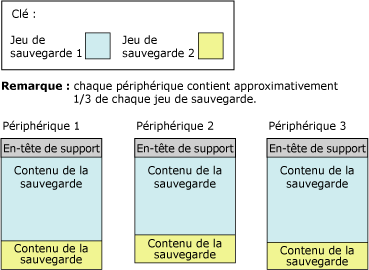

# <a name="media-sets-media-families-and-backup-sets-sql-server"></a>Jeux de supports, familles de supports et jeux de sauvegarde (SQL Server)
[!INCLUDE[appliesto-ss-xxxx-xxxx-xxx-md](../../includes/appliesto-ss-xxxx-xxxx-xxx-md.md)]
  **Cette rubrique présente la terminologie de base des supports de sauvegarde propre aux sauvegardes et restaurations dans [!INCLUDE[ssNoVersion](../../includes/ssnoversion-md.md)] . Cette rubrique s'adresse aux lecteurs qui font leurs premiers pas dans [!INCLUDE[ssNoVersion](../../includes/ssnoversion-md.md)].** 
  
  Cette rubrique décrit le format utilisé par [!INCLUDE[ssNoVersion](../../includes/ssnoversion-md.md)] pour les supports de sauvegarde, la correspondance entre le support de sauvegarde et les unités de sauvegarde, l'organisation des sauvegardes sur le support de sauvegarde, et plusieurs considérations relatives aux jeux de supports et aux familles de supports. La rubrique décrit également les étapes de l'initialisation ou la mise en forme du support de sauvegarde avant de l'utiliser pour la première fois ou de remplacer un jeu de supports ancien par un nouveau, comment remplacer d'anciens jeux de sauvegarde dans un jeu de supports, et comment ajouter de nouveaux jeux de sauvegarde à un jeu de supports.  
  
>**REMARQUE !** Pour plus d’informations sur la sauvegarde SQL Server dans le service de stockage d’objets blob Microsoft Azure, consultez [Sauvegarde et restauration SQL Server avec le service de stockage d’objets blob Microsoft Azure](../../relational-databases/backup-restore/sql-server-backup-and-restore-with-microsoft-azure-blob-storage-service.md).  
   
##  <a name="TermsAndDefinitions"></a> Termes  
 **jeu de supports**  
 Ensemble ordonné de supports de sauvegarde (bandes ou fichiers disque) sur lequel une ou plusieurs opérations de sauvegarde ont été écrites en utilisant un type et un nombre fixes d'unités de sauvegarde.  
  
 **famille de supports**  
 Sauvegardes créées sur une seule unité qui n'est pas mise en miroir ou sur un ensemble d'unités en miroir dans un jeu de supports  
  
**jeu de sauvegarde**  
 Contenu de sauvegarde ajouté à un jeu de supports par une opération de sauvegarde réussie.  
  

##  <a name="OvMediaSetsFamiliesBackupSets"></a> Vue d’ensemble des jeux de supports, familles de supports et jeux de sauvegarde  
 Les sauvegardes d'un ou de plusieurs supports de sauvegarde constituent un seul jeu de supports. Un *jeu de supports* est un ensemble ordonné de *supports de sauvegarde*, de bandes, de fichiers disque ou d’objets blob Azure auxquels une ou plusieurs opérations de sauvegarde ont été appliquées en utilisant un type et un nombre fixes d’unités de sauvegarde. Un jeu de supports donné utilise des lecteurs de bandes, lecteurs de disque ou objets blob Azure, mais pas une combinaison de deux ou plus. 
 
**Exemple :** Les unités de sauvegarde associées à un jeu de supports peuvent être les trois lecteurs de bandes `\\.\TAPE0`, `\\.\TAPE1`et `\\.\TAPE2`. Ce support de sauvegarde contient uniquement des bandes, en commençant avec au minimum trois bandes (une par lecteur). Le type et le nombre d'unités de sauvegarde sont établis lors de la création d'un support de sauvegarde ; il n'est pas possible de les modifier. Cependant, si nécessaire, il est possible de remplacer entre les opérations de sauvegarde et de restauration une unité donnée par une unité du même type.  
  
 Un jeu de supports est créé sur le support de sauvegarde en formatant le support au cours d'une opération de sauvegarde. Pour plus d'informations, consultez [Création d'un jeu de supports](#CreatingMediaSet), plus loin dans cette rubrique. Après le formatage, chaque fichier ou bande contient un en-tête de support pour le jeu de supports et est prêt à recevoir le contenu de la sauvegarde. Lorsque l'en-tête est en place, l'opération de sauvegarde se poursuit pour sauvegarder les données spécifiées sur le support de sauvegarde de toutes les unités de sauvegarde spécifiées pour l'opération.  
  
> **REMARQUE !** Il est possible de mettre en miroir les supports de sauvegarde pour la protection contre les volumes de sauvegarde endommagés (bande ou fichier sur disque). Pour plus d'informations, consultez [Jeux de supports de sauvegarde en miroir &#40;SQL Server&#41;](../../relational-databases/backup-restore/mirrored-backup-media-sets-sql-server.md).  
  
 Les sauvegardes compressées et non compressées ne peuvent pas se produire simultanément dans un jeu de supports. Toutes les éditions de [!INCLUDE[ssKatmai](../../includes/sskatmai-md.md)] ou versions ultérieures peuvent lire des sauvegardes compressées. Pour plus d’informations, consultez [Compression de sauvegardes &#40;SQL Server&#41;](../../relational-databases/backup-restore/backup-compression-sql-server.md).  

  
## <a name="media-families"></a>Familles de supports  
 Les sauvegardes créées sur une seule unité qui n'est pas mise en miroir ou sur un ensemble d'unités en miroir dans un jeu de supports constituent une *famille de supports*. Le nombre d'unités de sauvegarde utilisées pour le support de sauvegarde détermine le nombre de familles de supports d'un support de sauvegarde. Si, par exemple, un support de sauvegarde utilise deux unités de sauvegarde qui ne sont pas mises en miroir, il contient deux familles de supports.  
  
Dans un support de sauvegarde en miroir, chaque famille de support est mise en miroir. Par exemple, si six unités de sauvegarde sont utilisées pour formater un support de sauvegarde, il y a trois familles de supports contenant chacune deux copies équivalentes des données de sauvegarde. Pour plus d’informations sur les jeux de supports en miroir, consultez [Jeux de supports de sauvegarde en miroir &#40;SQL Server&#41;](../../relational-databases/backup-restore/mirrored-backup-media-sets-sql-server.md).  
  
 Chaque bande ou disque d'une famille de supports est affecté à un *numéro de séquence de support*. Le numéro de séquence de support d'un disque est toujours 1. Dans une famille de supports sur bande, ce numéro de séquence est 1 pour la bande initiale, 2 pour la deuxième bande, etc. Pour plus d'informations, consultez [Jeux de supports, familles de supports et jeux de sauvegarde (SQL Server)](../../relational-databases/backup-restore/media-sets-media-families-and-backup-sets-sql-server.md).
  
## <a name="the-media-header"></a>En-tête de support  
 Chaque volume de support de sauvegarde (fichier sur disque ou bande) contient un en-tête de support créé par la première opération de sauvegarde qui utilise la bande (ou le disque). Cet en-tête reste intact jusqu'à ce que le support soit reformaté.  
  
 L'en-tête de support contient toutes les informations indispensables à l'identification du support (fichier sur disque ou bande) et son emplacement dans la famille de supports à laquelle il appartient. Les informations indiquent les éléments suivants :  
  
-   Nom du support.  
  
     Le nom du support est facultatif, mais nous recommandons l'utilisation de noms cohérents qui identifient clairement votre support. Le nom d'un support est affecté par toute personne qui formate le support.  
  
-   Numéro d'identification unique du support de sauvegarde.  
  
-   Nombre de familles de supports contenues dans le support de sauvegarde  
  
-   Le numéro de séquence de la famille de supports contient ce support.  
  
-   Numéro d'identification unique de la famille de supports.  
  
-   Numéro de séquence de ce support dans la famille. Pour un fichier sur disque, cette valeur est toujours égale à 1.  
  
-   Si la description du support contient une étiquette de support MTF ou une description du support.  
  
    >**REMARQUE !** Tous les supports utilisés pour les opérations de sauvegarde ou de restauration sont sous un format de sauvegarde standard appelé [!INCLUDE[msCoName](../../includes/msconame-md.md)] Tape Format (MTF). Ce format permet aux utilisateurs de spécifier une étiquette de bande qui contient une description spécifique à MTF. [!INCLUDE[ssNoVersion](../../includes/ssnoversion-md.md)] préserve les étiquettes de support MTF écrites par une autre application, mais n'écrit pas d'étiquettes de support MTF.  
  
-   Étiquette au format de bande [!INCLUDE[msCoName](../../includes/msconame-md.md)] ou description du support au format texte libre.  
  
-   Nom du logiciel de sauvegarde qui a écrit l'étiquette du support de sauvegarde.  
  
-   Numéro d'identification unique du fournisseur du logiciel qui a formaté le support.  
  
-   Date et heure de création de l'étiquette.  
  
-   Nombre de miroirs dans le jeu (1 à 4) ; 1 indique une unité non mise en miroir.  
  
 [!INCLUDE[ssCurrent](../../includes/sscurrent-md.md)] peut traiter des supports formatés par des versions [!INCLUDE[ssNoVersion](../../includes/ssnoversion-md.md)]antérieures.  
  
## <a name="backup-sets"></a>Jeux de sauvegarde  
 Une sauvegarde réussie ajoute un seul *jeu de sauvegarde* au jeu de supports. Le jeu de sauvegarde est décrit selon le support de sauvegarde auquel appartient la sauvegarde. Si le support de sauvegarde se compose d'une seule famille de supports, celle-ci contient tout le jeu de sauvegarde. Si le support de sauvegarde se compose de plusieurs familles de supports, le jeu de sauvegarde est réparti entre elles. Sur chaque support, le jeu de sauvegarde contient un en-tête qui le décrit.  
  
 Cet exemple illustre une instruction [!INCLUDE[tsql](../../includes/tsql-md.md)] qui crée un jeu de supports nommé `MyAdvWorks_MediaSet_1` pour la base de données [!INCLUDE[ssSampleDBobject](../../includes/sssampledbobject-md.md)] en utilisant trois lecteurs de bandes comme unités de sauvegarde :  
  
```  
BACKUP DATABASE AdventureWorks2012  
TO TAPE = '\\.\tape0', TAPE = '\\.\tape1', TAPE = '\\.\tape2'  
WITH   
   FORMAT,  
   MEDIANAME = 'MyAdvWorks_MediaSet_1'  
```  
  
 Lorsqu'elle réussit, la sauvegarde a pour résultat un nouveau support de sauvegarde qui contient un nouvel en-tête et un jeu de sauvegarde réparti sur les trois bandes. La figure ci-dessous illustre ces résultats :  
  
   
  
 Généralement, après la création d'un support de sauvegarde, les sauvegardes suivantes, l'une après l'autre, ajoutent leurs jeux de sauvegarde au support. Tous les supports utilisés par un jeu de sauvegarde forment le support, quel que soit le nombre de supports ou d'unités de sauvegarde concernés. Les jeux de sauvegarde sont numérotés consécutivement par leur position dans le support de sauvegarde, ce qui permet de spécifier le jeu de sauvegarde à restaurer.  
  
 Chaque sauvegarde sur un support doit écrire sur le même nombre et le même type d'unités de sauvegarde. Avec plusieurs unités, comme avec le premier jeu de sauvegarde, le contenu de chaque sauvegarde suivante est réparti sur les supports de sauvegarde de toutes les unités. Pour continuer avec l'exemple ci-dessus, une deuxième sauvegarde (différentielle) ajoute les informations au même support de sauvegarde :  
  
```  
BACKUP DATABASE AdventureWorks2012  
TO TAPE = '\\.\tape0', TAPE = '\\.\tape1', TAPE = '\\.\tape2'  
WITH   
   NOINIT,  
   MEDIANAME = 'AdventureWorksMediaSet1',  
   DIFFERENTIAL  
```  
  
> **REMARQUE !** NOINIT est l'option par défaut, mais elle indiquée pour des raisons de clarté.  
  
 Si la deuxième sauvegarde réussit, elle écrit le deuxième jeu de sauvegarde sur le support de sauvegarde en répartissant ainsi le contenu de la sauvegarde :  
  
   
  
 Au cours de la restauration de sauvegardes, vous pouvez utiliser l'option FILE pour spécifier les sauvegardes à utiliser. L’exemple suivant illustre l’utilisation des clauses FILE **=***numéro_fichier_jeu_sauvegardes* lors de la restauration d’une sauvegarde complète de la base de données [!INCLUDE[ssSampleDBobject](../../includes/sssampledbobject-md.md)] suivie d’une sauvegarde différentielle sur le même jeu de supports. Le jeu de supports fait appel à trois bandes de sauvegardes qui figurent sur les lecteurs de bande `\\.\tape0`, `tape1`, et `tape2`.  
  
```  
RESTORE DATABASE AdventureWorks2012 FROM TAPE = '\\.\tape0', TAPE = '\\.\tape1', TAPE = '\\.\tape2'  
   WITH   
   MEDIANAME = 'AdventureWorksMediaSet1',  
   FILE=1,   
   NORECOVERY;  
RESTORE DATABASE AdventureWorks2012 FROM TAPE = '\\.\tape0', TAPE = '\\.\tape1', TAPE = '\\.\tape2'   
   WITH   
   MEDIANAME = 'AdventureWorksMediaSet1',  
   FILE=2,   
   RECOVERY;  
GO  
```  
  
 Pour plus d’informations sur les tables d’historique qui conservent les informations sur les jeux de supports, familles de supports et jeux de sauvegarde, consultez [Historique de sauvegarde et informations d’en-tête &#40;SQL Server&#41;](../../relational-databases/backup-restore/backup-history-and-header-information-sql-server.md).  
  
 Le nombre de supports de sauvegarde d'un support de sauvegarde dépend de plusieurs facteurs :  
  
-   Nombre d'unités de sauvegarde  
  
-   Type des unités de sauvegarde  
  
-   Nombre de jeux de sauvegarde  

  
##  <a name="CreatingMediaSet"></a> Creating a new media set  
 Pour créer un jeu de supports, vous devez formater le support destinataire (une ou plusieurs bandes ou un ou plusieurs fichiers disque). Le processus de formatage modifie le support destinataire de la sauvegarde comme suit :  
  
1.  Suppression de l'ancien en-tête (s'il en existait un), du contenu antérieur du support destinataire de la sauvegarde.  
  
     Le formatage d'une unité de bande supprime la totalité du contenu antérieur de la bande actuellement montée. Le formatage d'un disque n'affecte que le fichier spécifié pour l'opération de sauvegarde.  
  
2.  Écriture d'un nouvel en-tête de support sur le support de sauvegarde (bande ou fichier disque) de chaque unité de sauvegarde.  

  
##  <a name="UseExistingMediaSet"></a> Sauvegarde sur un jeu de supports existant  
 Pour effectuer une sauvegarde sur un jeu de supports existant, vous disposez des deux options suivantes :  
  
-   Ajouter au jeu de sauvegarde existant.  
  
     Pour que l'espace disponible soit utilisé au mieux, les nouveaux jeux de sauvegarde sont généralement ajoutés au support de sauvegarde existant. L'ajout au jeu de sauvegarde préserve toute sauvegarde antérieure. Pour plus d'informations, consultez [Ajout aux jeux de sauvegarde existants](#Appending), plus loin dans cette section.  

L'ajout, qui est le comportement par défaut de l'instruction BACKUP, peut être explicitement spécifié à l'aide de l'option NOINIT.  
  
-   Remplacer tous les jeux de sauvegarde existants par la sauvegarde actuelle, sans toucher à l'en-tête de support actuel.  
  
     [!INCLUDE[ssNoVersion](../../includes/ssnoversion-md.md)] comporte des protections destinées à vous empêcher de remplacer accidentellement un support. Toutefois, la sauvegarde peut remplacer automatiquement les jeux de sauvegarde qui ont atteint une date d'expiration prédéfinie.  
  
     Pour les en-têtes de bande, il peut être judicieux de les laisser en place. Pour plus d'informations, consultez [Remplacement des jeux de sauvegarde](#Overwriting), plus loin dans cette section.  

    >  Le remplacement des jeux de sauvegarde existants est spécifié à l'aide de l'option INIT de l'instruction BACKUP.  
  
##  <a name="Appending"></a> Appending to existing backup sets  
 Les sauvegardes effectuées à des moments différents, à partir de bases de données identiques ou différentes, peuvent être stockées sur le même support. En ajoutant un autre jeu de sauvegarde au support existant, le contenu précédent du support reste intact, et la nouvelle sauvegarde est écrite à la fin de la dernière sauvegarde du support.  
  
 Par défaut, [!INCLUDE[ssNoVersion](../../includes/ssnoversion-md.md)] ajoute toujours les nouvelles sauvegardes en fin de support. L'ajout ne peut avoir lieu qu'à la fin du support. Par exemple, lorsqu'un support contient cinq jeux de sauvegardes, il n'est pas possible d'ignorer les trois premiers jeux de sauvegardes pour écraser le quatrième avec un nouveau jeu de sauvegarde.  
  
 Si vous utilisez BACKUP WITH NOREWIND pour une sauvegarde sur bande, celle-ci sera conservée ouverte à la fin de l’opération. Cela vous permet d’exécuter d’autres sauvegardes sur la bande sans devoir la rembobiner, puis de repartir en avant pour retrouver le dernier jeu de sauvegarde. Vous pouvez trouver la liste des lecteurs de bandes ouverts dans la vue de gestion dynamique **sys.dm_io_backup_tapes** ; pour plus d’informations, consultez [sys.dm_io_backup_tapes &#40;Transact-SQL&#41;](../../relational-databases/system-dynamic-management-views/sys-dm-io-backup-tapes-transact-sql.md).  
  
 Les sauvegardes Microsoft Windows et [!INCLUDE[ssNoVersion](../../includes/ssnoversion-md.md)] peuvent partager le même support, mais elles ne sont pas interopérables. [!INCLUDE[ssNoVersion](../../includes/ssnoversion-md.md)] ne peut sauvegarder les données Windows.  
  
> **IMPORTANT !** Les sauvegardes compressées et non compressées ne peuvent pas se produire simultanément dans un jeu de supports. Toutes les éditions de [!INCLUDE[ssKatmai](../../includes/sskatmai-md.md)] ou versions ultérieures peuvent lire des sauvegardes compressées. Pour plus d’informations, consultez [Compression de sauvegardes &#40;SQL Server&#41;](../../relational-databases/backup-restore/backup-compression-sql-server.md).  
  
 
##  <a name="Overwriting"></a> Overwriting backup sets  
 Le remplacement des jeux de sauvegarde existants est spécifié à l'aide de l'option INIT de l'instruction BACKUP. Cette option remplace tous les jeux de sauvegarde sur le support et conserve l'en-tête de support, s'il existe. S'il n'existe aucun en-tête de support, elle en crée un.  
  
 Pour les en-têtes de bande, il peut être judicieux de les laisser en place. Pour les supports de sauvegarde sur disque, seuls les fichiers utilisés par les unités de sauvegarde spécifiées dans l'opération de sauvegarde sont remplacés. Les autres fichiers du disque ne sont pas concernés. Lors du remplacement des sauvegardes, l'en-tête de support existant est conservé et la nouvelle sauvegarde est créée comme étant la première sauvegarde sur l'unité de sauvegarde. S'il n'existe pas d'en-tête, un en-tête de support valide avec un nom et une description de support est automatiquement écrit. Si l'en-tête de support existant n'est pas valide, l'opération de sauvegarde s'arrête. Si le support est vide, le nouvel en-tête de support est généré avec les options éventuelles MEDIANAME, MEDIAPASSWORD et MEDIADESCRIPTION.  
  
 
 Un support de sauvegarde n'est pas remplacé lorsque l'une des conditions ci-dessous est remplie :  
  
-   Toutes les sauvegardes présentes sur le support ne sont pas encore arrivées à expiration. (Si l'option SKIP est spécifiée, l'expiration n'est pas vérifiée.)  
  
     La date d'expiration précise que la sauvegarde expire et qu'elle peut être remplacée par une autre sauvegarde. Vous pouvez préciser la date d'expiration lors de la création d'une sauvegarde. Par défaut, la date d’expiration est déterminée par la définition de l’option **media retention** avec **sp_configure**. Pour plus d'informations, consultez [sp_configure &#40;Transact-SQL&#41;](../../relational-databases/system-stored-procedures/sp-configure-transact-sql.md).  
  
-   Le nom du support, fourni le cas échéant, ne correspond pas au nom du support de sauvegarde.  
  
     Le nom du support est un nom descriptif utilisé pour identifier facilement le support.  
  
 Cependant, vous pouvez ignorer ces contrôles de façon explicite si vous êtes sûr de vouloir remplacer le support existant, par exemple si vous savez que les sauvegardes sur bande ne vous sont plus utiles.  
  
 Si le support de sauvegarde est protégé par mot de passe Microsoft Windows, Microsoft SQL Server n'écrit pas dessus. Pour remplacer un support protégé par mot de passe, vous devez le réinitialiser.  
  

  
##  <a name="SequenceNumbers"></a> Numéros de séquence  
 L'ordre est important pour l'utilisation de plusieurs familles de supports dans un jeu de supports ou de plusieurs supports de sauvegarde dans une même famille. Par conséquent, la sauvegarde attribue des numéros de séquence comme suit :  
  
-   Familles de supports séquentielles dans un support de sauvegarde  
  
     Dans un support de sauvegarde, les familles sont numérotées séquentiellement en fonction de leur position dans le support. Le numéro de la famille de supports est enregistré dans la colonne **family_sequence_number** de la table **backupmediafamily** .  
  
-   Supports physiques dans une famille de supports  
  
     Un numéro de séquence de support indique l'ordre du support physique dans une famille de supports. Le premier numéro est 1 pour le premier support de sauvegarde. Ce support de sauvegarde est référencé par le chiffre 1, le deuxième support (première bande de sauvegarde consécutive) par le chiffre 2 et ainsi de suite. Lorsque la sauvegarde est restaurée, les numéros de séquence des supports garantissent que l'opérateur qui effectue la restauration de la sauvegarde monte le support approprié dans l'ordre approprié.  
  
###  <a name="MultipleDevices"></a> Plusieurs unités  
 Lorsque vous utilisez plusieurs lecteurs de bandes ou fichiers disque, vous devez tenir compte des considérations suivantes :  
  
-   Pour la sauvegarde :  
  
     Le support de sauvegarde complet, créé par une opération de sauvegarde, doit être utilisé par toutes les opérations de sauvegarde suivantes. Par exemple, lorsqu'un support de sauvegarde est créé à l'aide de deux unités de sauvegarde sur bande, toutes les opérations de sauvegarde suivantes, impliquant le même support de sauvegarde, devront utiliser deux unités de sauvegarde.  
  
-   Pour la restauration :  
  
     Pour une restauration à partir d'une sauvegarde de disque et pour une restauration en ligne, vous devez monter simultanément toutes les familles de supports. Pour une restauration hors connexion à partir d'une sauvegarde sur bande, vous pouvez traiter les familles de supports avec moins d'unités de sauvegarde. Chaque famille de supports doit être complètement traitée avant de démarrer le traitement d'une autre famille de supports. Les familles de supports sont toujours traitées en parallèle, sauf si la restauration a lieu sur une seule unité.  
  
##  <a name="RelatedTasks"></a> Tâches associées  
 **Créer un jeu de supports**  
  
-   [Créer une sauvegarde complète de base de données &#40;SQL Server&#41;](../../relational-databases/backup-restore/create-a-full-database-backup-sql-server.md) (option **Sauvegarder sur un nouveau support de sauvegarde et effacer tous les jeux de sauvegarde existants**)  
  
-   [BACKUP &#40;Transact-SQL&#41;](../../t-sql/statements/backup-transact-sql.md) (option FORMAT)  
  
-   <xref:Microsoft.SqlServer.Management.Smo.Backup.FormatMedia%2A>  
  
 **Ajouter une nouvelle sauvegarde à un support existant**  
  
-   [Créer une sauvegarde complète de base de données &#40;SQL Server&#41;](../../relational-databases/backup-restore/create-a-full-database-backup-sql-server.md) (option **Ajouter au jeu de sauvegarde existant**)  
  
-   [BACKUP &#40;Transact-SQL&#41;](../../t-sql/statements/backup-transact-sql.md) (option NOINIT)  
  
 **Remplacer des jeux de sauvegarde existants**  
  
-   [Créer une sauvegarde complète de base de données &#40;SQL Server&#41;](../../relational-databases/backup-restore/create-a-full-database-backup-sql-server.md) (option **Remplacer tous les jeux de sauvegarde existants**)  
  
-   [BACKUP &#40;Transact-SQL&#41;](../../t-sql/statements/backup-transact-sql.md) (option INIT)  
  
 **Définir la date d’expiration**  
  
-   [Définir la date d’expiration d’une sauvegarde &#40;SQL Server&#41;](../../relational-databases/backup-restore/set-the-expiration-date-on-a-backup-sql-server.md)  
  
 **Afficher la séquence des supports et les numéros de séquence des familles**  
  
-   [Afficher les propriétés et le contenu d’une unité de sauvegarde logique &#40;SQL Server&#41;](../../relational-databases/backup-restore/view-the-properties-and-contents-of-a-logical-backup-device-sql-server.md)  
  
-   [backupmediafamily &#40;Transact-SQL&#41;](../../relational-databases/system-tables/backupmediafamily-transact-sql.md) (colonne **family_sequence_number**)  
  
 **Afficher les jeux de sauvegarde sur une unité de sauvegarde spécifique**  
  
-   [Afficher les fichiers de données et les fichiers journaux dans un jeu de sauvegarde &#40;SQL Server&#41;](../../relational-databases/backup-restore/view-the-data-and-log-files-in-a-backup-set-sql-server.md)  
  
-   [Afficher les propriétés et le contenu d’une unité de sauvegarde logique &#40;SQL Server&#41;](../../relational-databases/backup-restore/view-the-properties-and-contents-of-a-logical-backup-device-sql-server.md)  
  
-   [RESTORE HEADERONLY &#40;Transact-SQL&#41;](../../t-sql/statements/restore-statements-headeronly-transact-sql.md)  
  
 **Lire l’en-tête du support sur une unité de sauvegarde**  
  
-   [RESTORE LABELONLY &#40;Transact-SQL&#41;](../../t-sql/statements/restore-statements-labelonly-transact-sql.md)  
 
  
## <a name="see-also"></a>Voir aussi  
 [Sauvegarde et restauration des bases de données SQL Server](../../relational-databases/backup-restore/back-up-and-restore-of-sql-server-databases.md)   
 [Erreurs de support possibles pendant les opérations de sauvegarde et de restauration &#40;SQL Server&#41;](../../relational-databases/backup-restore/possible-media-errors-during-backup-and-restore-sql-server.md)   
 [Historique de sauvegarde et informations d’en-tête &#40;SQL Server&#41;](../../relational-databases/backup-restore/backup-history-and-header-information-sql-server.md)   
 [Jeux de supports de sauvegarde en miroir &#40;SQL Server&#41;](../../relational-databases/backup-restore/mirrored-backup-media-sets-sql-server.md)   
 [BACKUP &#40;Transact-SQL&#41;](../../t-sql/statements/backup-transact-sql.md)   
 [RESTORE &#40;Transact-SQL&#41;](../../t-sql/statements/restore-statements-transact-sql.md)   
 [RESTORE REWINDONLY &#40;Transact-SQL&#41;](../../t-sql/statements/restore-statements-rewindonly-transact-sql.md)   
 [sp_configure &#40;Transact-SQL&#41;](../../relational-databases/system-stored-procedures/sp-configure-transact-sql.md)  
  
  
