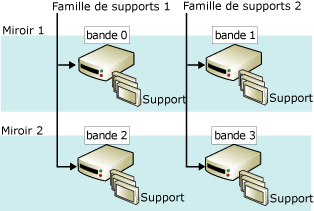

# Jeux de supports de sauvegarde en miroir (SQL Server)
[!INCLUDE[appliesto-ss-xxxx-xxxx-xxx-md](../../includes/appliesto-ss-xxxx-xxxx-xxx-md.md)]
    
> [!NOTE]  
>  Les jeux de supports de sauvegarde en miroir sont uniquement pris en charge dans l'édition Enterprise de [!INCLUDE[ssNoVersion](../../includes/ssnoversion-md.md)].  
  
 La mise en miroir d'un support de sauvegarde augmente la fiabilité des sauvegardes en réduisant l'impact des dysfonctionnements des unités de sauvegarde. Ces dysfonctionnements représentent une menace très sérieuse car une sauvegarde constitue la dernière protection possible contre une perte de données. À mesure que la taille des bases de données augmente, le risque de perte irrécupérable d'une sauvegarde suite à la défaillance d'une unité ou d'un support de sauvegarde se fait plus présent. La mise en miroir des supports augmente la fiabilité des sauvegardes grâce au concept de redondance.  
  
> [!NOTE]  
>  Pour plus d’informations sur les supports de sauvegarde en général, consultez [Jeux de supports, familles de supports et jeux de sauvegarde &#40;SQL Server&#41;](../../relational-databases/backup-restore/media-sets-media-families-and-backup-sets-sql-server.md).  
  
 **Dans cette rubrique :**  
  
-   [Vue d'ensemble des jeux de supports mis en miroir](#OverviewofMirroredMediaSets)  
  
-   [Configuration matérielle requise pour les miroirs de sauvegarde](#HardwareReqs)  
  
-   [Tâches associées](#RelatedTasks)  
  
##   Vue d'ensemble des jeux de supports mis en miroir  
 La mise en miroir est une des propriétés du jeu de supports. Un *support de sauvegarde miroir* se compose de plusieurs copies (*miroirs*) du support de sauvegarde. Un support de sauvegarde contient une ou plusieurs familles de supports, chacun correspondant à une unité de sauvegarde. Par exemple, si la clause TO de l'instruction BACKUP DATABASE répertorie trois unités, BACKUP répartit les données sur trois familles de support, une par unité. Le nombre de familles de supports et de miroirs est défini lors de la création du jeu de supports (par une instruction BACKUP DATABASE qui spécifie WITH FORMAT).  
  
 Un jeu de supports mis en miroir possède deux à quatre miroirs. Chaque miroir contient toutes les familles de supports dans le jeu de supports. Les miroirs nécessitent le même nombre d'unités, une seule par famille de supports. Chaque miroir nécessite une unité de sauvegarde séparée pour chaque famille de supports. Par exemple, un jeu de supports miroir qui comprend quatre familles de supports avec trois miroirs nécessitent douze unités de sauvegarde. Toutes ces unités doivent être équivalentes. Par exemple, les lecteurs de bande ayant le même numéro de modèle et le même fabricant.  
  
 La figure ci-dessous montre un exemple d'un support de sauvegarde miroir composé de deux familles de supports avec deux miroirs. Chaque famille de supports contient trois volumes de supports qui sont sauvegardés une fois par miroir.  
  
   
  
 Les volumes correspondants sur les miroirs possèdent un contenu identique. Il sont donc interchangeables en cas de restauration. Par exemple, dans la figure précédente, le troisième volume de tape2 est interchangeable avec le troisième volume de tape0.  
  
 Le [!INCLUDE[ssDEnoversion](../../includes/ssdenoversion-md.md)] garantit que les supports mis en miroir ont un contenu identique en synchronisant les écritures sur les unités. Lorsqu'un des miroirs est saturé, tous les miroirs sont redimensionnés en même temps.  
  
> [!IMPORTANT]  
>  Un support de sauvegarde miroir ne peut pas être implicitement brisé (scindé) par la suppression d'un miroir. Si une bande ou un disque d'un miroir est endommagé ou reformaté, le miroir ne peut plus être utilisé pour d'autres sauvegardes. Si au moins un miroir complet reste intact, le support de sauvegarde peut être lu. Si tous les miroirs perdent une famille de supports donnée, le jeu de supports est inutilisable.  
  
 Les opérations de sauvegarde et de restauration n'ont pas les mêmes exigences en matière de présence de la totalité des miroirs. Pour qu'une opération de sauvegarde écrive (c'est-à-dire crée ou agrandisse) un jeu de supports mis en miroir, tous les miroirs doivent être présents. En revanche, lors de la restauration d'une sauvegarde à partir d'un jeu de supports mis en miroir, vous ne pouvez spécifier qu'un seul miroir pour chaque famille de supports. Vous pouvez restaurer à partir de moins d'unités que de familles, mais chaque famille de supports n'est traitée qu'une seule fois. En cas d'erreurs, cependant, l'utilisation d'autres miroirs permet une résolution rapide de certains problèmes de restauration. Vous pouvez remplacer un volume de supports endommagé par le volume correspondant d'un autre miroir. Ceci est dû au fait que les instructions RESTORE et RESTORE VERIFYONLY prennent en charge le remplacement des supports endommagés par le volume de support de sauvegarde correspondant d'un autre miroir.  
  
##   Configuration matérielle requise pour les miroirs de sauvegarde  
 La mise en miroir s'applique aussi bien aux disques qu'aux bandes (les disques ne prennent pas en charge les bandes consécutives). Toutes les unités de sauvegarde pour une simple opération de sauvegarde ou de restauration doivent être du même type (disque ou bande).  
  
 Ensuite, vous devez utiliser des unités similaires qui ont les mêmes propriétés. Le non-respect de cette règle entraîne l'affichage du message d'erreur 3212. Pour éviter le risque d'une discordance d'unités, utilisez des unités entièrement équivalentes, comme des lecteurs ayant le même numéro de modèle et provenant du même fabricant.  
  
##   Tâches associées  
 **Pour effectuer une sauvegarde sur une unité de sauvegarde mise en miroir**  
  
-   [Sauvegarder sur un support de sauvegarde miroir &#40;Transact-SQL&#41;](../../relational-databases/backup-restore/back-up-to-a-mirrored-media-set-transact-sql.md)  
  
##  Voir aussi  
 [Erreurs de support possibles pendant les opérations de sauvegarde et de restauration &#40;SQL Server&#41;](../../relational-databases/backup-restore/possible-media-errors-during-backup-and-restore-sql-server.md)   
 [RESTORE VERIFYONLY &#40;Transact-SQL&#41;](../../t-sql/statements/restore-statements-verifyonly-transact-sql.md)   
 [Unités de sauvegarde &#40;SQL Server&#41;](../../relational-databases/backup-restore/backup-devices-sql-server.md)   
 [Jeux de supports, familles de supports et jeux de sauvegarde &#40;SQL Server&#41;](../../relational-databases/backup-restore/media-sets-media-families-and-backup-sets-sql-server.md)  
  
  
