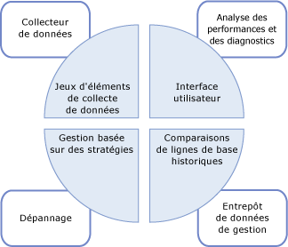

# Collecte de données
[!INCLUDE[appliesto-ss-xxxx-xxxx-xxx-md](../../includes/appliesto-ss-xxxx-xxxx-xxx-md.md)]
  Le collecteur de données est un composant de [!INCLUDE[ssCurrent](../../includes/sscurrent-md.md)] qui recueille différents jeux de données. La collecte de données peut s'exécuter de façon constante ou selon une planification définie par l'utilisateur. Le collecteur de données stocke les données recueillies dans une base de données relationnelle appelée entrepôt de données de gestion.  
  
## Qu’est-ce que le collecteur de données ? 
 Le collecteur de données est un composant majeur de la plateforme de collecte de données pour [!INCLUDE[ssCurrent](../../includes/sscurrent-md.md)] et les outils fournis par [!INCLUDE[ssNoVersion](../../includes/ssnoversion-md.md)]. Le collecteur de données centralise la collecte de données sur vos serveurs et applications de base de données. Ce point de collecte peut obtenir des données de diverses sources et n'est pas limité aux données de performance, contrairement à SQL Trace.  
  
 Le collecteur de données vous permet d'ajuster l'étendue de la collecte de données pour l'adapter à vos environnements de test et de production. Le collecteur de données utilise également un entrepôt de données, une base de données relationnelle qui vous permet de gérer les données que vous collectez en définissant pour elles différentes périodes de rétention.  
  
 Le collecteur de données prend en charge le paramétrage dynamique de la collecte de données et il est extensible via son API. Pour plus d’informations, consultez [Programmation du collecteur de données](http://msdn.microsoft.com/library/53b4752b-055d-4716-b2bc-75b4cce84101).  
  
 L'illustration suivante montre l'intégration du collecteur de données dans la stratégie globale de la collecte et de la gestion de données dans [!INCLUDE[ssCurrent](../../includes/sscurrent-md.md)].  
  
   
  
## Concepts  
 Le collecteur de données est intégré à l’Agent [!INCLUDE[ssNoVersion](../../includes/ssnoversion-md.md)] et à [!INCLUDE[ssISnoversion](../../includes/ssisnoversion-md.md)], et il utilise ces deux composants de manière intensive. Avant de vous servir du collecteur de données, vous devez donc comprendre certains concepts liés à chacun de ces composants [!INCLUDE[ssNoVersion](../../includes/ssnoversion-md.md)] .  
  
 L’Agent [!INCLUDE[ssNoVersion](../../includes/ssnoversion-md.md)] permet de planifier et d’exécuter des travaux de collecte. Vous devez maîtriser les concepts suivants :  
  
-   Travail  
  
-   Étape du travail  
  
-   Planification du travail  
  
-   Sous-système  
  
-   Comptes proxy  
  
 Pour plus d’informations, consultez [Tâches d’administration automatisée &#40;SQL Server Agent&#41;](http://msdn.microsoft.com/library/541ee5ac-2c9f-4b74-b4f0-13b7bd5920b0).  
  
 [!INCLUDE[ssISnoversion](../../includes/ssisnoversion-md.md)] ([!INCLUDE[ssIS](../../includes/ssis-md.md)]) permet d’exécuter des packages qui collectent des données provenant de fournisseurs de données individuels. Vous devez maîtriser les outils et les concepts [!INCLUDE[ssIS](../../includes/ssis-md.md)] suivants :  
  
-   Package [!INCLUDE[ssIS](../../includes/ssis-md.md)]  
  
-   Configuration de package [!INCLUDE[ssIS](../../includes/ssis-md.md)]  
  
 Pour plus d’informations, consultez [Integration Services &#40;SSIS&#41;, packages](../../integration-services/integration-services-ssis-packages.md).  
  
## Terminologie  
 **cible**  
 Une instance de [!INCLUDE[ssDE](../../includes/ssde-md.md)] dans une édition de [!INCLUDE[ssNoVersion](../../includes/ssnoversion-md.md)] qui prend en charge la collecte de données. Pour plus d’informations sur les éditions prises en charge, consultez la section « Simplicité de gestion » de [Fonctionnalités prises en charge par les éditions de SQL Server 2016](~/sql-server/editions-and-supported-features-for-sql-server-2016.md).  
  
 Une *racine cible* définit une sous-arborescence dans la hiérarchie cible. Un *jeu de cibles* désigne le groupe de cibles obtenu après l’application d’un filtre à une sous-arborescence définie par une racine cible. Une racine cible peut être une base de données, une instance de [!INCLUDE[ssNoVersion](../../includes/ssnoversion-md.md)]ou une instance d'ordinateur.  
  
**type de cible**  
 Type de cible présentant des caractéristiques et un comportement spécifiques. Par exemple, une cible d'instance [!INCLUDE[ssNoVersion](../../includes/ssnoversion-md.md)] possède des caractéristiques différentes d'une cible de base de données [!INCLUDE[ssNoVersion](../../includes/ssnoversion-md.md)] .  
  
 **fournisseur de données**  
 Source de données connue, spécifique à un type de cible, qui fournit des données à un type de collecteur.  
  
**type de collecteur**  
 Wrapper logique autour des packages [!INCLUDE[ssIS](../../includes/ssis-md.md)] qui fournissent le mécanisme permettant de collecter les données et les télécharger dans l'entrepôt de données de gestion.  
  
 **élément de collection**  
 Instance d'un type de collecteur. Un élément de collecte est créé avec un jeu de propriétés d'entrée et une fréquence de collecte spécifiques.  
  
 **jeu d’éléments de collecte**  
 Groupe d'éléments de collecte. Un jeu d'éléments de collection est une unité de collecte de données avec laquelle un utilisateur peut interagir par le biais de l'interface utilisateur.  
  
 **mode de collecte**  
 Manière dont les données sont recueillies et stockées. Le mode de collecte peut être avec mise en cache ou sans mise en cache. Le mode avec mise en cache prend en charge la collecte continue, alors que le mode sans mise en cache est destiné à une collecte à la demande ou à un instantané de collecte.  
  
 **entrepôt de données de gestion**  
 Base de données relationnelle utilisée pour stocker les données collectées.  
  
 L'illustration suivante montre les dépendances et les relations entre les différents composants du collecteur de données.  
  
   
  
 Tel qu'indiqué dans l'illustration, le fournisseur de données est externe au collecteur de données et, par définition, entretient une relation implicite avec la cible. Le fournisseur de données est spécifique à une cible particulière (par exemple, un service [!INCLUDE[ssNoVersion](../../includes/ssnoversion-md.md)] tel que le moteur relationnel) et fournit des données telles que les vues système dans [!INCLUDE[ssNoVersion](../../includes/ssnoversion-md.md)], les compteurs de l'analyseur de performances et les fournisseurs WMI, qui peuvent être consommées par le collecteur de données.  
  
 Le type de collecteur est spécifique à un type de cible, en fonction de l'association logique entre un fournisseur de données et un type de cible. Le type de collecteur définit la manière dont les données sont collectées à partir d'un fournisseur de données spécifique (en utilisant des paramètres schématisés) et spécifie le schéma de stockage des données. Le schéma de fournisseur de données et le schéma de stockage sont requis pour stocker les données collectées. Le type de collecteur fournit également l'emplacement de l'entrepôt de données de gestion, qui peut résider sur l'ordinateur exécutant la collecte de données ou sur un autre ordinateur.  
  
 Un élément de collecte, tel qu'indiqué dans l'illustration, est une instance d'un type de collecteur spécifique, paramétrable avec des paramètres d'entrée, tels que le schéma XML pour le type de collecteur. Tous les éléments de collecte doivent fonctionner sur la même racine cible ou sur une racine cible vide. Cela permet au collecteur de données de combiner différents types de collecteurs à partir du système d'exploitation ou d'une racine cible spécifique, mais pas à partir d'autres racines cibles.  
  
 Un élément de collection possède une fréquence de collecte définie qui détermine la fréquence d'instantanés de valeurs. Bien qu'il s'agisse d'un bloc de construction pour un jeu d'éléments de collecte, un élément de collecte ne peut pas exister de manière autonome.  
  
 Les jeux d'éléments de collection sont définis et déployés sur une instance de serveur et peuvent être exécutés indépendamment les uns des autres. Chaque jeu d'éléments de collection peut être appliqué à une cible correspondant aux types de cibles de tous les types de collecteurs appartenant à un jeu d'éléments de collection. Le jeu d'éléments de collection est exécuté par un ou plusieurs travaux de l'Agent [!INCLUDE[ssNoVersion](../../includes/ssnoversion-md.md)] , et les données sont téléchargées dans l'entrepôt de données de gestion selon une planification prédéfinie.  
  
 Toutes les données recueillies par les différentes instances du jeu d'éléments de collection sont téléchargées dans l'entrepôt de données de gestion selon la même planification. Cette planification est définie comme une planification partagée de l'Agent [!INCLUDE[ssNoVersion](../../includes/ssnoversion-md.md)] et peut être utilisée par plusieurs jeux d'éléments de collection. Les jeux d'éléments de collection sont activés ou désactivés comme des entités uniques alors que les éléments de collection ne peuvent pas être activés ou désactivés individuellement.  
  
 Lorsque vous créez ou mettez à jour un jeu d'éléments de collection, vous pouvez configurer le mode de collecte pour collecter des données et les télécharger vers l'entrepôt de données de gestion. Le type de planification est déterminé par le type de collecte : avec mise en cache ou sans mise en cache. Si la collecte s'effectue avec mise en cache, la collecte et le téléchargement des données s'exécutent sur deux travaux distincts. La collecte s'exécute selon une planification qui commence au démarrage de l'Agent [!INCLUDE[ssNoVersion](../../includes/ssnoversion-md.md)] et selon la fréquence spécifiée dans l'élément de collecte. Le téléchargement s'exécute en fonction de la planification spécifiée par l'utilisateur.  
  
 Dans le cadre d'une collecte sans mise en cache, la collecte et le téléchargement des données s'exécutent sur un même travail, mais en deux étapes. La collecte s'effectue au cours de la première étape et le téléchargement au cours de la deuxième. Une collecte à la demande ne requiert aucune planification.  
  
 Après l'activation d'un jeu d'éléments de collecte, la collecte de données peut démarrer, selon une planification ou à la demande. Lorsque la collecte de données démarre, l'Agent [!INCLUDE[ssNoVersion](../../includes/ssnoversion-md.md)] génère un processus pour le collecteur de données, qui à son tour charge les packages [!INCLUDE[ssISnoversion](../../includes/ssisnoversion-md.md)] pour le jeu d'éléments de collection. Les éléments de collection, qui représentent des types de collections, rassemblent des données à partir des fournisseurs de données appropriés sur les cibles spécifiées. Au terme du cycle de collecte, ces données sont téléchargées dans l'entrepôt de données de gestion.  
  
## Choses que vous pouvez faire  
  
|Description|Rubrique|  
|----------------------|-----------|  
|Gérer différents aspects de la collecte de données, tels que l’activation ou la désactivation de la collecte de données, la modification de la configuration d’un jeu d’éléments de collecte ou la consultation des données dans l’entrepôt de données de gestion.|[Gérer la collecte de données](../../relational-databases/data-collection/manage-data-collection.md)|  
|Utiliser des rapports pour obtenir des informations afin de contrôler la capacité système et de résoudre les problèmes de performances système.|[Rapports de jeux d’éléments de collecte de données système](../../relational-databases/data-collection/system-data-collection-set-reports.md)|  
|Utiliser l’entrepôt de données de gestion pour collecter des données d’un serveur qui est une cible de collecte de données.|[entrepôt de données de gestion](../../relational-databases/data-collection/management-data-warehouse.md)| 
|Exploiter les fonctions de trace côté serveur de SQL Server Profiler pour exporter une définition de trace que vous pouvez utiliser afin de créer un jeu d’éléments de collecte qui utilise le type de collecteur Trace SQL générique.| [Utiliser SQL Server Profiler pour créer un jeu d’éléments de collecte Trace SQL (SQL Server Management Studio)](https://msdn.microsoft.com/library/cc645955(v=sql.130).aspx)
  
  

