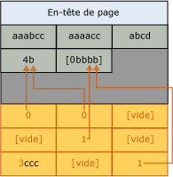

# Implémentation de la compression de page
[!INCLUDE[appliesto-ss-asdb-xxxx-xxx-md](../../includes/appliesto-ss-asdb-xxxx-xxx-md.md)]

  Cette rubrique récapitule la manière dont le [!INCLUDE[ssDE](../../includes/ssde-md.md)] implémente la compression de page. Elle fournit des informations de base qui vous aideront à planifier l'espace de stockage dont vous avez besoin pour vos données.  
  
 La compression de page est identique pour les tables, les partitions de table, les index et les partitions d'index. La compression de page qui est décrite ci-dessous pour une table peut s'appliquer de la même manière à tous les autres types d'objets. Dans les exemples qui suivent, les chaînes de caractères sont compressées, mais la compression de préfixe et la compression de dictionnaire appliquent les mêmes principes aux autres types de données.  
  
 La compression du niveau feuille des tables et des index avec la compression de page regroupe trois opérations réalisées dans l'ordre suivant :  
  
1.  Compression de ligne  
  
2.  Compression de préfixe  
  
3.  Compression de dictionnaire  
  
 Lorsque vous utilisez la compression de page, les pages qui ne sont pas au niveau feuille sont compressées en utilisant uniquement la compression de ligne. Pour plus d’informations sur la compression de ligne, consultez [Implémentation de la compression de ligne](../../relational-databases/data-compression/row-compression-implementation.md).  
  
## Compression de préfixe  
 Pour chaque page compressée, la compression de préfixe utilise les étapes suivantes :  
  
1.  Pour chaque colonne, une valeur est identifiée qui peut être utilisée pour réduire l'espace de stockage des valeurs dans chaque colonne.  
  
2.  Une ligne qui représente les valeurs de préfixe de chaque colonne est créée et stockée dans la structure des informations de compression qui suit immédiatement l'en-tête de page.  
  
3.  Les valeurs de préfixe répétées dans la colonne sont remplacées par une référence au préfixe correspondant. Si la valeur d'une ligne ne correspond pas exactement à la valeur de préfixe sélectionnée, une correspondance partielle peut encore être indiquée.  
  
 L'illustration suivante montre un exemple de page d'une table avant la compression de préfixe.  
  
   
  
 L'illustration suivante montre la même page après compression de préfixe. Le préfixe est déplacé vers l'en-tête et les valeurs des colonnes sont remplacées par des références au préfixe.  
  
   
  
 Dans la première colonne de la première ligne, la valeur 4b indique que les quatre premiers caractères du préfixe (aaab) sont présents pour cette ligne, de même que le caractère b. Cela donne donc la valeur aaabb, qui est la valeur d'origine.  
  
## Compression de dictionnaire  
 Une fois la compression de préfixe terminée, la compression de dictionnaire est appliquée. La compression de dictionnaire recherche les valeurs répétées n'importe où dans la page et les stocke dans la zone des informations de compression. Contrairement à la compression de préfixe, la compression de dictionnaire n'est pas limitée à une seule colonne. La compression de dictionnaire peut remplacer des valeurs répétées qui apparaissent n'importe où sur une page. L'illustration suivante montre la même page après compression de dictionnaire.  
  
   
  
 Notez que la valeur 4b a été référencée à partir de colonnes différentes de la page.  
  
## Lorsque la compression de page se produit  
 Lorsqu'une table est créée avec compression de page, aucune compression ne se produit. Toutefois, les métadonnées de la table indiquent que la compression de page doit être utilisée. Lorsque des données sont ajoutées à la première page de données, une compression de ligne est appliquée aux données. Dans la mesure où la page n'est pas pleine, la compression de page ne procure aucun avantage. Lorsque la page est pleine, la ligne suivante à ajouter lance l'opération de compression de page. La page entière est examinée ; chaque colonne est évaluée pour la compression de préfixe, puis, toutes les colonnes sont évaluées pour la compression de dictionnaire. Si la compression de page a créé suffisamment de place sur la page pour insérer une ligne supplémentaire, la ligne est ajoutée, puis la compression de ligne et la compression de page sont appliquées aux données. Si l'espace gagné par la compression de page moins l'espace requis pour la structure des informations de compression n'est pas significatif, la compression de page n'est pas utilisée pour cette page. Soit les prochaines lignes rentrent dans la nouvelle page, soit elles ne rentrent pas et une nouvelle page est ajoutée à la table. Comme pour la première page, la compression de page n'est pas directement appliquée à la nouvelle page.  
  
 Lorsqu'une table existante contenant des données est convertie en compression de page, chaque page est reconstruite et évaluée. La reconstruction de toutes les pages provoque la reconstruction de la table, de l'index ou de la partition.  
  
##  Voir aussi  
 [Compression de données](../../relational-databases/data-compression/data-compression.md)   
 [Implémentation de la compression de ligne](../../relational-databases/data-compression/row-compression-implementation.md)  
  
  
