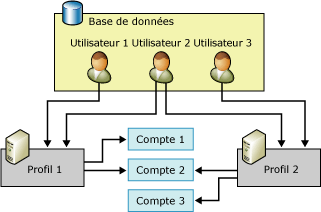

# Objets de configuration de la messagerie de base de données
[!INCLUDE[appliesto-ss-xxxx-xxxx-xxx-md](../../includes/appliesto-ss-xxxx-xxxx-xxx-md.md)]
  La messagerie de base de données fournit deux objets de configuration : les objets de configuration de base de données vous permettent de configurer les paramètres que la messagerie de base de données doit utiliser lors de l'envoi d'un message électronique à partir de votre application de base de données ou Agent [!INCLUDE[ssNoVersion](../../includes/ssnoversion-md.md)] .  
  
-   Comptes de messagerie de base de données  
  
-   Profils de messagerie de base de données  
  
  
##   Relation entre les objets configuration de la messagerie de base de données  
 La figure montre deux profils, trois comptes et trois utilisateurs. L'Utilisateur 1 a accès au Profil 1, lequel utilise le Compte 1 et le Compte 2. L'Utilisateur 3 a accès au Profil 2, lequel utilise le Compte 2 et le Compte 3. L'Utilisateur 2 a accès au Profil 1 et au Profil 2.  
  
   
  
  
##   Compte de messagerie de base de données  
 Un compte de messagerie de base de données contient les informations qui permettent à Microsoft [!INCLUDE[ssNoVersion](../../includes/ssnoversion-md.md)] d'envoyer des messages électroniques à un serveur SMTP. Chacun contient des informations propres à un serveur de messagerie particulier.  
  
 Une messagerie de base de données accepte trois méthodes d'authentification pour communiquer avec un serveur SMTP :  
  
-   Authentification Windows : la messagerie de base de données utilise les informations d’identification du compte de service Windows du [!INCLUDE[ssDEnoversion](../../includes/ssdenoversion-md.md)] pour l’authentification sur le serveur SMTP.  
  
-   Authentification de base : la messagerie de base de données utilise le nom d'utilisateur et le mot de passe spécifiés pour s'authentifier sur le serveur SMTP.  
  
-   Authentification anonyme : utilisez cette option lorsque le serveur SMTP ne nécessite pas d'authentification.  La messagerie de base de données n'utilise pas d'informations d'identification pour s'authentifier sur le serveur SMTP.  
  
 Les informations de compte sont stockées dans la base de données **msdb** . Chaque compte comprend les informations suivantes :  
  
-   Nom du compte  
  
-   Description du compte  
  
-   Adresse de messagerie du compte  
  
-   Nom d'affichage du compte  
  
-   Adresse de messagerie de réponse à utiliser pour le compte  
  
-   Nom du serveur de messagerie  
  
-   Type du serveur de messagerie. Pour [!INCLUDE[msCoName](../../includes/msconame-md.md)] [!INCLUDE[ssNoVersion](../../includes/ssnoversion-md.md)], il s’agit toujours de SMTP (Simple Mail Transfer Protocol).  
  
-   Numéro de port du serveur de messagerie  
  
-   Une colonne de bits indiquant si la connexion au serveur de messagerie SMTP s'effectue via SSL (Secure Sockets Layer).  
  
-   Une colonne de bits indiquant si la connexion au serveur SMTP s'effectue au moyen des informations d'identification configurées pour [!INCLUDE[ssDEnoversion](../../includes/ssdenoversion-md.md)].  
  
-   Nom d'utilisateur à utiliser pour l'authentification auprès du serveur de messagerie, si celui-ci requiert l'authentification  
  
-   Mot de passe à utiliser pour l'authentification auprès du serveur de messagerie, si celui-ci requiert l'authentification  
  
 L'Assistant Configuration de la messagerie de base de données permet de créer et de gérer des comptes facilement. Vous pouvez également utiliser les procédures stockées de configuration de **msdb** pour créer et gérer des comptes.  
  
  
##   Profil de messagerie de base de données  
 Un profil de messagerie de base de données est une collection triée de comptes de messagerie de base de données apparentés. Les applications qui envoient du courrier à l'aide de la messagerie de base de données spécifient des profils au lieu d'utiliser directement des comptes. Séparer les informations sur les serveurs de messagerie des objets utilisés par l'application permet d'améliorer la flexibilité et la fiabilité : les profils assurent le basculement automatique ; ainsi, si un serveur de messagerie ne répond pas, la messagerie de base de données peut envoyer directement le courrier à un autre serveur de messagerie. Les administrateurs de base de données peuvent ajouter, supprimer ou reconfigurer des comptes sans avoir à modifier le code de l'application, ni les étapes de travail.  
  
 En outre, les profils permettent aux administrateurs de base de données de contrôler l'accès à la messagerie électronique. L’adhésion à **DatabaseMailUserRole** est obligatoire pour envoyer des messages à l’aide de la messagerie de base de données. Les profils offrent une souplesse supplémentaire aux administrateurs en leur permettant de contrôler les expéditeurs de messages et les comptes utilisés.  
  
 Un profil peut être public ou privé.  
  
 Les**profils publics** sont disponibles pour tous les membres du rôle de base de données **DatabaseMailUserRole** de la base de données **msdb** . Ils permettent à tous les membres du rôle **DatabaseMailUserRole** d’envoyer des messages électroniques en utilisant ce profil.  
  
 Les**profils privés** sont définis pour les principaux de sécurité dans la base de données **msdb** . Ils permettent uniquement aux utilisateurs de base de données spécifiés, aux rôles et aux membres du rôle de serveur fixe **sysadmin** d’envoyer du courrier en utilisant ce profil. Par défaut, un profil est privé et permet l’accès uniquement aux membres du rôle de serveur fixe **sysadmin** . Pour utiliser un profil privé, **sysadmin** doit attribuer aux utilisateurs l’autorisation d’utiliser le profil. En outre, l’autorisation EXECUTE de la procédure stockée **sp_send_dbmail** est attribuée seulement aux membres du rôle **DatabaseMailUserRole**. Un administrateur système doit ajouter l’utilisateur au rôle de base de données **DatabaseMailUserRole** pour que l’utilisateur puisse envoyer des messages électroniques.  
  
 Les profils améliorent la fiabilité dans les situations où un serveur de messagerie n'est plus accessible ou en mesure de traiter les messages. Chaque compte du profil possède un numéro de séquence. Le numéro de séquence détermine l'ordre d'utilisation des comptes de messagerie de base de données dans le profil. Pour un nouveau message électronique, la messagerie de base de données utilise le dernier compte qui a envoyé un message correctement ou, si aucun message n'a été envoyé, le compte qui possède le plus petit numéro de séquence. Si ce compte échoue, la messagerie de base de données utilise le compte qui possède le numéro de séquence plus élevé suivant, et ainsi de suite jusqu'à ce qu'elle envoie le message correctement ou que le compte qui possède le numéro de séquence le plus élevé échoue. Si le compte qui a le numéro de séquence le plus élevé échoue, la messagerie de base de données interrompt les tentatives d’envoi du courrier électronique pour la durée configurée dans le paramètre **AccountRetryDelay** de **sysmail_configure_sp**, puis relance le processus de tentative d’envoi du courrier électronique en commençant à partir du numéro de séquence le moins élevé. Utilisez le paramètre **AccountRetryAttempts** de **sysmail_configure_sp**pour configurer le nombre de fois que le processus de messagerie externe tente d’envoyer le message électronique à l’aide de chaque compte du profil spécifié.  
  
 Si plusieurs comptes possèdent le même numéro de séquence, la messagerie de base de données utilise uniquement l'un d'eux pour un message électronique donné. Dans ce cas, la messagerie de base de données exclut toute garantie en ce qui concerne le compte utilisé pour ce numéro de séquence ou l'utilisation du même compte d'un message à un autre.  
  
  
##   Tâches de configuration de la messagerie de base de données  
 Le tableau suivant décrit les tâches de configuration de la messagerie de base de données.  
  
|Tâche de configuration|Lien de rubrique|  
|------------------------|----------------|  
|Décrit comment créer des comptes de messagerie de base de données|[Créer un compte de messagerie de base de données](../../relational-databases/database-mail/create-a-database-mail-account.md)|  
|Décrit comment créer des profils de messagerie de base de données|[Créer un profil de messagerie de base de données](../../relational-databases/database-mail/create-a-database-mail-profile.md)|  
|Décrit comment configurer la messagerie de base de données|[Configuration de la Messagerie de base de données](../../relational-databases/database-mail/configure-database-mail.md)|  
|Décrit comment créer un script de configuration de messagerie de base de données à l'aide de modèles||  
  
  
##   Tâches de configuration de base de données supplémentaires (procédures stockées système)  
 Les procédures stockées pour la configuration de la messagerie de base de données se situent dans la base de données **msdb** .  
  
 Les tableaux suivants répertorient les procédures stockées utilisées pour la configuration et la gestion de la messagerie de base de données.  
  
### Paramètres de messagerie de base de données  
  
|Nom   |Description|  
|----------|-----------------|  
|[sysmail_configure_sp (Transact-SQL)](../../relational-databases/system-stored-procedures/sysmail-configure-sp-transact-sql.md)|Modifie les paramètres de configuration de la messagerie de base de données.|  
|[sysmail_help_configure_sp (Transact-SQL)](../../relational-databases/system-stored-procedures/sysmail-help-configure-sp-transact-sql.md)|Affiche les paramètres de configuration pour la messagerie de base de données.|  
  
### Comptes et profils  
  
|Nom   |Description|  
|----------|-----------------|  
|[sysmail_add_profileaccount_sp (Transact-SQL)](../../relational-databases/system-stored-procedures/sysmail-add-profileaccount-sp-transact-sql.md)|Ajoute un compte de messagerie dans un profil de messagerie de base de données.|  
|[sysmail_delete_account_sp (Transact-SQL)](../../relational-databases/system-stored-procedures/sysmail-delete-account-sp-transact-sql.md)|Supprime un compte de messagerie de base de données.|  
|[sysmail_delete_profile_sp (Transact-SQL)](../../relational-databases/system-stored-procedures/sysmail-delete-profile-sp-transact-sql.md)|Supprime un profil de messagerie de base de données.|  
|[sysmail_delete_profileaccount_sp (Transact-SQL)](../../relational-databases/system-stored-procedures/sysmail-delete-profileaccount-sp-transact-sql.md)|Supprime un compte d'un profil de messagerie de base de données.|  
|[sysmail_help_account_sp (Transact-SQL)](../../relational-databases/system-stored-procedures/sysmail-help-account-sp-transact-sql.md)|Affiche des informations concernant les comptes de messagerie de base de données.|  
|[sysmail_help_profile_sp (Transact-SQL)](../../relational-databases/system-stored-procedures/sysmail-help-profile-sp-transact-sql.md)|Affiche des informations concernant un ou plusieurs profils de messagerie de base de données.|  
|[sysmail_help_profileaccount_sp (Transact-SQL)](../../relational-databases/system-stored-procedures/sysmail-help-profileaccount-sp-transact-sql.md)|Affiche les comptes associés à un ou plusieurs profils de messagerie de base de données.|  
|[sysmail_update_account_sp (Transact-SQL)](../../relational-databases/system-stored-procedures/sysmail-update-account-sp-transact-sql.md)|Met à jour les informations dans un compte de messagerie de base de données existant.|  
|[sysmail_update_profile_sp (Transact-SQL)](../../relational-databases/system-stored-procedures/sysmail-update-profile-sp-transact-sql.md)|Modifie la description ou le nom d'un profil de messagerie de base de données.|  
|[sysmail_update_profileaccount_sp (Transact-SQL)](../../relational-databases/system-stored-procedures/sysmail-update-profileaccount-sp-transact-sql.md)|Met à jour le numéro de séquence d'un compte dans un profil de messagerie de base de données.|  
  
### Sécurité  
  
|Nom   |Description|  
|----------|-----------------|  
|[sysmail_add_principalprofile_sp (Transact-SQL)](../../relational-databases/system-stored-procedures/sysmail-add-principalprofile-sp-transact-sql.md)|Autorise un principal de la base de données à utiliser un profil de messagerie de base de données.|  
|[sysmail_delete_principalprofile_sp (Transact-SQL)](../../relational-databases/system-stored-procedures/sysmail-delete-principalprofile-sp-transact-sql.md)|Supprime l'autorisation d'utiliser un profil de messagerie de base de données public ou privé accordée à un utilisateur de base de données.|  
|[sysmail_help_principalprofile_sp (Transact-SQL)](../../relational-databases/system-stored-procedures/sysmail-help-principalprofile-sp-transact-sql.md)|Affiche les informations de profil de messagerie de base de données pour l'utilisateur de base de données spécifié.|  
|[sysmail_update_principalprofile_sp (Transact-SQL)](../../relational-databases/system-stored-procedures/sysmail-update-principalprofile-sp-transact-sql.md)|Met à jour les informations liées aux autorisations de l'utilisateur de base de données spécifié.|  
  
### État du système  
  
|Nom   |Description|  
|----------|-----------------|  
|[sysmail_start_sp &#40;Transact-SQL&#41;](../../relational-databases/system-stored-procedures/sysmail-start-sp-transact-sql.md)|Démarre le programme externe de messagerie de base de données et la file d'attente du Service Broker SQL associé.|  
|[sysmail_stop_sp &#40;Transact-SQL&#41;](../../relational-databases/system-stored-procedures/sysmail-stop-sp-transact-sql.md)|Arrête le programme externe de messagerie de base de données et la file d'attente du Service Broker SQL associé.|  
|[sysmail_help_status_sp &#40;Transact-SQL&#41;](../../relational-databases/system-stored-procedures/sysmail-help-status-sp-transact-sql.md)|Indique si la messagerie de base de données est démarrée.|  
  
##   Références supplémentaires  
  
-   [Journal et audits de la messagerie de base de données](../../relational-databases/database-mail/database-mail-log-and-audits.md)  
  
  
  
