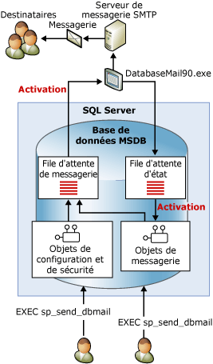

# Messagerie de base de données
[!INCLUDE[appliesto-ss-xxxx-xxxx-xxx-md](../../includes/appliesto-ss-xxxx-xxxx-xxx-md.md)]
  La messagerie de base de données est une solution d'entreprise qui permet l'envoi de messages électroniques à partir du [!INCLUDE[ssDEnoversion](../../includes/ssdenoversion-md.md)]. Grâce à la messagerie de base de données, vos applications de bases de données peuvent envoyer des messages électroniques aux utilisateurs. Ces messages peuvent contenir les résultats d'une requête, voire des fichiers de n'importe quelle ressource de votre réseau.  
  
  
##   Avantages liés à l’utilisation de la messagerie de base de données  
 La messagerie de base de données est fiable, évolutive, sûre et facilement prise en charge.  
  
### Fiabilité  
  
-   Elle utilise le protocole SMTP (Simple Mail Transfer Protocol) standard pour l'envoi de messages. Vous pouvez l'utiliser sans installer le client MAPI étendu sur l'ordinateur qui exécute [!INCLUDE[ssNoVersion](../../includes/ssnoversion-md.md)].  
  
-   Isolement du processus. Pour minimiser l'impact sur [!INCLUDE[ssNoVersion](../../includes/ssnoversion-md.md)], le composant qui envoie les messages s'exécute en dehors de [!INCLUDE[ssNoVersion](../../includes/ssnoversion-md.md)], dans un processus séparé. [!INCLUDE[ssNoVersion](../../includes/ssnoversion-md.md)] continuera à mettre ses messages électroniques en file d’attente même en cas d’arrêt ou d’échec de ce processus externe. Ces messages seront envoyés une fois que le processus extérieur est rétabli ou que le serveur SMTP est en ligne.  
  
-   Comptes de basculement. Un profil de messagerie de base de données vous permet de spécifier plusieurs serveurs SMTP. Si l'un deux est indisponible, le courrier est envoyé vers un autre serveur.  
  
-   Prise en charge de cluster. La messagerie de base de données peut être installée sur un cluster.  
  
### Extensibilité  
  
-   Remise à l'arrière-plan : la messagerie de base de données assure la remise à l'arrière-plan ou asynchrone du courrier électronique. Lorsque vous appelez **sp_send_dbmail** pour envoyer un message, la messagerie de base de données ajoute une demande dans une file d’attente [!INCLUDE[ssSB](../../includes/sssb-md.md)] . La procédure stockée est immédiatement retournée. Le composant de messagerie externe reçoit la demande et transmet le courrier électronique.  
  
-   Plusieurs profils : la messagerie de base de données vous permet de créer plusieurs profils dans une même instance de [!INCLUDE[ssNoVersion](../../includes/ssnoversion-md.md)] . Vous pouvez également choisir le profil que la messagerie de base de données utilise lorsque vous envoyez un message.  
  
-   Plusieurs comptes : chaque profil peut contenir plusieurs comptes de basculement. Vous pouvez configurer différents profils avec différents comptes afin de distribuer le courrier électronique vers plusieurs serveurs de messagerie.  
  
-   Compatibilité 64 bits : la messagerie de base de données est entièrement compatible avec les installations 64 bits de [!INCLUDE[ssNoVersion](../../includes/ssnoversion-md.md)].  
  
### Sécurité  
  
-   Désactivée par défaut : pour réduire la zone de surface de [!INCLUDE[ssNoVersion](../../includes/ssnoversion-md.md)], les procédures stockées de la messagerie de base de données sont désactivées par défaut.  
  
-   Sécurité de la messagerie : pour envoyer un message de messagerie de base de données, vous devez être membre du rôle de base de données **DatabaseMailUserRole** de la base de données **msdb** .  
  
-   Sécurité du profil : la messagerie de base de données garantit la sécurité des profils de messagerie. Vous choisissez les utilisateurs ou les groupes de la base de données **msdb** qui ont accès à un profil de messagerie de base de données. Vous pouvez autoriser cet accès à certains utilisateurs en particulier, ou à tous les utilisateurs de **msdb**. Un profil privé limite l'accès à une liste d'utilisateurs. Un profil public autorise l'accès à tous les utilisateurs d'une base de données.  
  
-   Administrateur de taille des pièces jointes : la messagerie de base de données limite la taille des fichiers joints (limite configurable). Vous pouvez modifier cette limite en utilisant la procédure stockée [sysmail_configure_sp](../../relational-databases/system-stored-procedures/sysmail-configure-sp-transact-sql.md) .  
  
-   Extensions de fichiers interdites : la messagerie de base de données maintient une liste d'extensions de fichiers interdites. Les utilisateurs ne peuvent pas joindre de fichiers dont l'extension figure dans la liste. Vous pouvez modifier cette liste en utilisant sysmail_configure_sp.  
  
-   La messagerie de base de données s'exécute sous le compte de service du moteur [!INCLUDE[ssNoVersion](../../includes/ssnoversion-md.md)] . Pour attacher un fichier provenant d'un dossier dans un message électronique, le compte du moteur [!INCLUDE[ssNoVersion](../../includes/ssnoversion-md.md)] doit être autorisé à accéder au dossier dans lequel se trouve le fichier.  
  
### Prise en charge  
  
-   Configuration intégrée : la messagerie de base de données maintient les informations des comptes de messagerie dans le moteur de base de données [!INCLUDE[ssDEnoversion](../../includes/ssdenoversion-md.md)]. Il n'est pas nécessaire de gérer un profil de messagerie dans une application cliente externe. L'Assistant Configuration de la messagerie de base de données offre une interface pratique pour la configuration de la messagerie de base de données. Vous pouvez également créer et maintenir vos configurations au moyen de [!INCLUDE[tsql](../../includes/tsql-md.md)].  
  
-   Journalisation. La messagerie de base de données journalise l’activité de messagerie dans [!INCLUDE[ssNoVersion](../../includes/ssnoversion-md.md)], dans le journal des événements des applications Microsoft Windows et dans les tables de la base de données **msdb** .  
  
-   Audit : la messagerie de base de données conserve des copies des messages et des pièces jointes envoyés dans la base de données **msdb** . Vous pouvez facilement contrôler l'utilisation de la messagerie et consulter les messages conservés.  
  
-   Prise en charge du HTML : la messagerie de base de données vous permet d'envoyer des messages au format HTML.  
  
  
##   Architecture de la messagerie de base de données  
 La messagerie de base de données est conçue selon une architecture de file d'attente qui fait appel aux technologies Service Broker. Lorsque les utilisateurs exécutent **sp_send_dbmail**, cette procédure stockée insère un élément dans la file d’attente de messagerie et crée un enregistrement contenant le message électronique. L'insertion de la nouvelle entrée dans la file d'attente de messagerie active le processus de messagerie de base de données externe (DatabaseMail.exe). Le processus externe lit les informations du message et envoie celui-ci aux serveurs de messagerie appropriés. Le processus externe insère un élément dans la file d'attente État pour obtenir le résultat de l'opération d'envoi. L'insertion de cette nouvelle entrée dans la file d'attente d'état active une procédure stockée interne qui met à jour l'état du message électronique. Outre qu'elle stocke le message électronique envoyé (ou non envoyé), la messagerie de base de données enregistre également toutes les pièces jointes dans des tables système. Les vues de la messagerie de base de données fournissent l'état des messages pour la résolution de problèmes, et les procédures stockées permettent d'administrer la file d'attente de la messagerie de base de données.  
  
   
  
  
##   Présentation des composants de la messagerie de base de données  
 La messagerie de base de données est composée des composants principaux suivants :  
  
-   Composants de configuration et de sécurité  
  
     La messagerie de base de données stocke les informations de configuration et de sécurité dans la base de données **msdb** . Les objets de configuration et de sécurité créent les profils et les comptes utilisés par la messagerie de base de données.  
  
-   Composants de messagerie  
  
     La base de données **msdb** fait office de base de données hôte de messagerie qui contient les objets de messagerie que la base de données de messagerie utilise pour envoyer des messages électroniques. Ces objets incluent la procédure stockée **sp_send_dbmail** et les structures de données qui contiennent les informations concernant les messages.  
  
-   Exécutable de la messagerie de base de données  
  
     L’exécutable de la messagerie de base de données est un programme externe qui lit à partir d’une file d’attente dans la base de données **msdb** et qui envoie des messages à des serveurs de messagerie.  
  
-   Composants de journalisation et d'audit  
  
     La messagerie de base de données enregistre les informations de journalisation dans la base de données **msdb** et dans le journal des événements des applications [!INCLUDE[msCoName](../../includes/msconame-md.md)] Windows.  
  
 **Configuration de l’Agent pour utiliser la messagerie de base de données :**  
  
 Vous pouvez configurer l'Agent SQL Server de manière à ce qu'il utilise la messagerie de base de données. Cette opération est requise pour les notifications d'alertes et la notification automatique à l'achèvement d'un travail.  
  
> [!WARNING]  
>  Les différentes étapes d'un travail peuvent également envoyer un message électronique sans qu'il soit nécessaire de configurer l'Agent [!INCLUDE[ssNoVersion](../../includes/ssnoversion-md.md)] pour utiliser la messagerie de base de données. Par exemple, une étape de travail [!INCLUDE[tsql](../../includes/tsql-md.md)] peut utiliser la messagerie de base de données pour envoyer les résultats d'une requête à une liste de destinataires.  
  
 Vous pouvez configurer l'Agent [!INCLUDE[ssNoVersion](../../includes/ssnoversion-md.md)] de manière à envoyer des messages électroniques à des opérateurs prédéfinis lorsque :  
  
-   Une alerte est déclenchée. Les alertes peuvent être configurées pour l'envoi de notifications par courrier électronique d'événements spécifiques qui se produisent. Par exemple, des alertes peuvent être configurées pour notifier à un opérateur une situation du système d'exploitation ou un événement de base de données particuliers, qui peuvent nécessiter une action immédiate. Pour plus d’informations sur la configuration des alertes, consultez [Alertes](http://msdn.microsoft.com/library/3f57d0f0-4781-46ec-82cd-b751dc5affef).  
  
-   Une tâche planifiée, telle qu'une sauvegarde de base de données ou un événement de réplication, réussit ou échoue. Par exemple, vous pouvez utiliser la messagerie de l'Agent [!INCLUDE[ssNoVersion](../../includes/ssnoversion-md.md)] pour notifier à des opérateurs qu'une erreur s'est produite lors d'un traitement de fin de mois.  
  
  
##   Rubriques relatives aux composants de la messagerie de base de données  
  
-   [Objets de configuration de la messagerie de base de données](../../relational-databases/database-mail/database-mail-configuration-objects.md)  
  
-   [Objets de messagerie de base de données](../../relational-databases/database-mail/database-mail-messaging-objects.md)  
  
-   [Programme externe de la messagerie de base de données](../../relational-databases/database-mail/database-mail-external-program.md)  
  
-   [Journal et audits de la messagerie de base de données](../../relational-databases/database-mail/database-mail-log-and-audits.md)  
  
-   [Configurer la messagerie de SQL Server Agent en vue de l’utilisation de la messagerie de base de données](../../relational-databases/database-mail/configure-sql-server-agent-mail-to-use-database-mail.md)  
  
  
  
