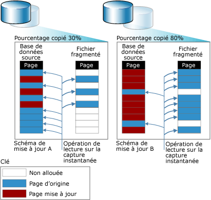

# Instantanés de base de données (SQL Server)
[!INCLUDE[appliesto-ss-xxxx-xxxx-xxx-md](../../includes/appliesto-ss-xxxx-xxxx-xxx-md.md)]
  Une capture instantanée de base de données est une vue statique en lecture seule d’une base de données [!INCLUDE[ssNoVersion](../../includes/ssnoversion-md.md)] (la *base de données source*). Au moment de sa création, l'instantané de base de données est cohérent au niveau transactionnel avec la base de données source. Un instantané de base de données réside toujours sur la même instance de serveur que sa base de données source. Lorsque la base de données source est mise à jour, l'instantané de base de données est mis à jour. Par conséquent, plus l'existence d'un instantané de base de données est longue, plus la probabilité qu'il épuise son espace disque disponible est élevée.  
  
 Plusieurs instantanés peuvent exister sur une base de données source donnée. Chaque instantané de base de données existe jusqu'à ce qu'il soit explicitement supprimé par le propriétaire de la base de données.  
  
> [!NOTE]  
>  Les instantanés de base de données n'ont aucun rapport avec les sauvegardes d'instantanés, les instantanés liés à l'isolation des transactions ou la réplication d'instantanés.  
  
 **Dans cette rubrique :**  
  
-   [Vue d'ensemble des fonctionnalités](#FeatureOverview)  
  
-   [Avantages des instantanés de base de données](#Benefits)  
  
-   [Termes et définitions](#TermsAndDefinitions)  
  
-   [Conditions préalables et limitations relatives aux instantanés de base de données](#LimitationsRequirements)  
  
-   [Tâches associées](#RelatedTasks)  
  
##   Vue d'ensemble des fonctionnalités  
 Les instantanés de base de données fonctionnent au niveau de la page de données. Toute page de la base de données source qui n'a pas encore été modifiée est copiée de la base de données source vers l'instantané. L'instantané stocke la page d'origine, conservant ainsi les enregistrements de données tels qu'ils étaient lorsque l'instantané a été créé. Le même processus se répète chaque fois qu'une page est modifiée pour la première fois. Pour l'utilisateur, un instantané de base de données semble ne jamais changer, car les opérations de lecture dans un instantané de base de données accèdent toujours aux pages de données d'origine, quel que soit leur emplacement.  
  
 Pour stocker les pages d'origine copiées, l'instantané utilise un ou plusieurs *fichiers partiellement alloués*. Initialement, un fichier partiellement alloué est un fichier essentiellement vide qui ne contient pas de données d'utilisateur et qui ne dispose pas encore d'espace disque alloué à cet effet. À mesure que le nombre de pages mises à jour augmente dans la base de données source, le fichier devient de plus en plus volumineux. La figure suivante illustre les effets de deux schémas de mise à jour distincts sur la taille d'un instantané. Le schéma de mise à jour A représente un environnement dans lequel seules 30% des pages d'origine sont mises à jour pendant la durée d'existence de l'instantané. Le schéma de mise à jour B correspond à un environnement dans lequel 80 % des pages d'origine sont mises à jour pendant la durée d'existence de l'instantané.  
  
   
  
##   Avantages des instantanés de base de données  
  
-   Les instantanés peuvent être utilisés à des fins de création de rapports.  
  
     Les clients peuvent interroger un instantané de base de données, ce qui le rend utile pour l'écriture de rapports basés sur la date et l'heure de sa création.  
  
-   Gestion des données d'historique pour la création de rapports.  
  
     Un instantané peut étendre l'accès utilisateur aux données à partir d'un moment donné dans le temps. Par exemple, vous pouvez créer un instantané au terme d'une période donnée (par ex. un trimestre financier) pour créer un rapport ultérieurement. Vous pouvez ensuite exécuter des rapports de fin de période sur l'instantané. Si l'espace disque le permet, vous pouvez également conserver des instantanés de fin de période indéfiniment afin d'interroger les résultats pour cette période, par exemple pour étudier les performances de l'organisation.  
  
-   Utilisation d'une base de données miroir maintenue à des fins de disponibilité pour décharger la création de rapports.  
  
     L'utilisation d'instantanés de bases de données avec mise en miroir vous permet de rendre les données du serveur miroir accessibles à des fins de création de rapports. De plus, l'exécution de requêtes sur la base de données miroir peut libérer des ressources sur la base de données primaire. Pour plus d’informations, consultez [Mise en miroir et instantanés de bases de données &#40;SQL Server&#41;](../../database-engine/database-mirroring/database-mirroring-and-database-snapshots-sql-server.md).  
  
-   Protection des données contre les erreurs d'administration.  
  
-   Si une erreur utilisateur se produit dans une base de données source, vous pouvez rétablir la base de données source dans l'état qui était le sien au moment où un instantané de base de données spécifié a été créé. La perte de données est limitée aux mises à jour de la base de données depuis la création de l'instantané.  
  
     Par exemple, avant d'effectuer des mises à jour importantes, comme une mise à jour en bloc ou une modification de schéma, créez un instantané de votre base de données afin d'en protéger les données. Si vous commettez une erreur, vous pourrez utiliser l'instantané pour restaurer la base de données telle qu'elle était au moment de l'instantané. Ce retour à un état précédent de la base de données est potentiellement plus rapide que la restauration à partir d'une sauvegarde. En revanche, la restauration par progression ne sera plus possible par la suite.  
  
    > [!IMPORTANT]  
    >  La restauration ne fonctionne pas sur une base de données hors connexion ou endommagée. Par conséquent, la réalisation de sauvegardes régulières et le test de votre plan de restauration sont essentiels pour la protection d'une base de données.  
  
    > [!NOTE]  
    >  Les instantanés de base de données dépendent de la base de données source. Par conséquent, l'utilisation d'instantanés pour rétablir l'état précédent d'une base de données ne remplace pas votre stratégie de sauvegarde et de restauration. L'exécution de toutes les sauvegardes planifiées reste primordiale. Si vous devez restaurer la base de données source au point dans le temps où vous avez créé un instantané de base de données, implémentez une stratégie de sauvegarde qui vous permette une telle opération.  
  
-   Protection des données contre les erreurs des utilisateurs.  
  
     En créant régulièrement des instantanés, vous pouvez réparer les dégâts liés à certaines erreurs commises par les utilisateurs, comme la suppression d'une table. Pour encore plus de protection, vous pouvez créer une série d'instantanés couvrant une période suffisamment importante pour identifier et réagir à la plupart des erreurs commises par les utilisateurs. Par exemple, vous pourriez maintenir un roulement de 6 à 12 instantanés couvrant une période de 24 heures en fonction de l'espace disponible sur vos disques. Chaque fois qu'un instantané est créé, l'instantané le plus ancien est supprimé.  
  
    -   Pour récupérer après une erreur, vous pouvez rétablir la base de données telle qu'elle était juste avant l'erreur. Ce retour à un état précédent de la base de données est potentiellement plus rapide que la restauration à partir d'une sauvegarde. En revanche, la restauration par progression ne sera plus possible par la suite.  
  
    -   Vous pourrez également reconstruire manuellement une table supprimée ou récupérer toute autre donnée perdue à partir des informations contenues dans un instantané. Par exemple, vous pouvez copier en bloc les données de l'instantané et les fusionner manuellement avec les données de la base de données.  
  
    > [!NOTE]  
    >  Le nombre d'instantanés maintenus à un moment donné, la fréquence de création des instantanés et la durée de conservation des instantanés dépendent de votre objectif final.  
  
-   Gestion d'une base de données test  
  
     Dans un environnement de test, il peut être utile en cas d'exécution répétée d'un protocole de test que la base de données contienne des données identiques au démarrage de chaque nouveau test. Avant l'exécution du premier test, un testeur ou un développeur d'applications peut créer un instantané de base de données sur la base de données test. À l'issue de chaque test, il est possible de revenir rapidement à l'état antérieur de la base de données en rétablissant l'instantané.  
  
##   Termes et définitions  
 database snapshot  
 Vue statique, en lecture seule et cohérente sur le plan transactionnel d'une base de données (la base de données source).  
  
 base de données source  
 Pour un instantané de base de données, la base de données sur laquelle l'instantané a été créé. Les instantanés de base de données dépendent de la base de données source. Les instantanés d'une base de données doivent résider sur la même instance de serveur que la base de données. De plus, si une base de données n'est plus disponible pour une raison quelconque, tous ses instantanés de base de données cessent d'être disponibles.  
  
 fichier partiellement alloué  
 Fichier fourni par le système de fichiers NTFS requérant beaucoup moins d'espace disque qu'il n'en serait requis autrement. Un fichier partiellement alloué est utilisé pour stocker les pages copiées dans un instantané de base de données. À sa création, un fichier partiellement alloué occupe très peu d'espace disque. Lorsque des données sont écrites dans un instantané de base de données, NTFS alloue de l'espace disque progressivement au fichier partiellement alloué correspondant.  
  
##   Conditions préalables et limitations relatives aux instantanés de base de données  
 **Dans cette section :**  
  
-   [Conditions préalables](#Prerequisites)  
  
-   [Limitations relatives à la base de données source](#LimitsOnSourceDb)  
  
-   [Limitations relatives aux instantanés de base de données](#LimitsOnDbSS)  
  
-   [Espace disque nécessaire](#DiskSpace)  
  
-   [Instantanés de base de données avec des groupes de fichiers hors ligne](#OfflineFGs)  
  
###   Conditions préalables  
 La base de données source, qui peut utiliser n'importe quel mode de récupération, doit respecter les conditions préalables suivantes :  
  
-   L'instance de serveur doit s'exécuter sur une édition de [!INCLUDE[ssNoVersion](../../includes/ssnoversion-md.md)] qui prend en charge les instantanés de base de données. Pour plus d’informations, consultez [Fonctionnalités prises en charge par les éditions de SQL Server 2016](~/sql-server/editions-and-supported-features-for-sql-server-2016.md).  
  
-   La base de données source doit être en ligne, à moins que la base de données soit une base de données miroir au sein d'une session de mise en miroir de bases de données.  
  
-   Vous pouvez créer un instantané de base de données sur toute base de données primaire ou secondaire dans un groupe de disponibilité. Le rôle de réplica doit être PRIMARY ou SECONDARY, et non dans l'état RESOLVING.  
  
     Nous vous recommandons que l'état de synchronisation de base de données soit SYNCHRONIZING ou SYNCHRONIZED lorsque vous créez un instantané de base de données. Toutefois, les instantanés de base de données peuvent être créés lorsque l'état de synchronisation de base de données est NOT SYNCHRONIZING.  
  
     Pour plus d’informations, consultez [Instantanés de base de données avec des groupes de disponibilité Always On (SQL Server)](../../database-engine/availability-groups/windows/database-snapshots-with-always-on-availability-groups-sql-server.md).  
  
-   Pour créer un instantané de base de données dans une base de données miroir, la base de données doit être dans un état de mise en miroir SYNCHRONIZED.  
  
-   La base de données source ne peut pas être configurée en tant que base de données partagée évolutive.  

-   La base de données source ne doit pas comporter de groupe de fichiers MEMORY_OPTIMIZED_DATA.  Pour plus d’informations, consultez la page [Fonctionnalités SQL Server non prises en charge pour l’OLTP en mémoire](../../relational-databases/in-memory-oltp/unsupported-sql-server-features-for-in-memory-oltp.md).
  
> [!NOTE]  
>  Tous les modes de récupération prennent en charge les instantanés de base de données.  
  
###   Limitations relatives à la base de données source  
 Dans la mesure où il existe un instantané de base de données, les limitations suivantes s'appliquent à la base de données source de l'instantané :  
  
-   La base de données ne peut pas être supprimée, détachée ou restaurée.  
  
    > [!NOTE]  
    >  La sauvegarde de la base de données source fonctionne normalement ; elle n'est pas affectée par les instantanés de base de données.  
  
-   Les performances sont réduites, en raison du nombre accru d'entrées/sorties sur la base de données source suite à une opération de copie lors d'une écriture sur l'instantané chaque fois qu'une page est mise à jour.  
  
-   Les fichiers ne peuvent pas être supprimés de la base de données source ni des instantanés.  
  
###   Limitations relatives aux instantanés de base de données  
 Les limitations suivantes s'appliquent aux instantanés de base de données :  
  
-   Un instantané de base de données doit être créé et demeurer sur la même instance de serveur que la base de données source.  
  
-   Les instantanés de base de données fonctionnent toujours sur une base de données complète.  
  
-   Les instantanés de base de données dépendent de la base de données source et ne correspondent pas à un stockage redondant. Ils ne vous protègent pas face à des erreurs disque ou d'autres types d'endommagement. Par conséquent, l'utilisation d'instantanés pour rétablir l'état précédent d'une base de données ne remplace pas votre stratégie de sauvegarde et de restauration. L'exécution de toutes les sauvegardes planifiées reste primordiale. Si vous devez restaurer la base de données source au point dans le temps où vous avez créé un instantané de base de données, implémentez une stratégie de sauvegarde qui vous permette une telle opération.  
  
-   Lorsqu'une page mise à jour sur la base de données source est envoyée vers un instantané, si l'instantané manque d'espace disque ou rencontre une autre erreur, il devient suspect et doit être supprimé.  
  
-   Les instantanés sont en lecture seule. Comme ils sont en lecture seule, ils ne peuvent pas être mis à niveau. C'est pourquoi, les instantanés de base de données ne sont pas viables après une mise à niveau.  
  
-   Les instantanés des bases de données **model**, **master**et **tempdb** sont interdits.  
  
-   Vous ne pouvez pas modifier les spécifications des fichiers d'instantané de base de données.  
  
-   Vous ne pouvez pas supprimer des fichiers d'un instantané de base de données.  
  
-   Vous ne pouvez pas sauvegarder ni restaurer des instantanés de base de données.  
  
-   Vous ne pouvez pas attacher ni détacher des instantanés de base de données.  
  
-   Vous ne pouvez pas créer d'instantanés de base de données sur le système de fichiers FAT32 ou sur des partitions RAW. Les fichiers partiellement alloués utilisés par les instantanés de base de données sont fournis par le système de fichiers NTFS.  
  
-   L'indexation de texte intégral n'est pas prise en charge sur les instantanés de base de données. Les catalogues de texte intégral ne sont pas propagés à partir de la base de données source.  
  
-   Un instantané hérite des contraintes de sécurité de sa base de données source au moment de la création de l'instantané. Compte tenu que les instantanés sont en lecture seule, les autorisations héritées ne peuvent pas être modifiées, et les modifications d'autorisations apportées à la source ne seront pas répercutées dans les instantanés existants.  
  
-   Un instantané reflète toujours l'état de groupes de fichiers au moment de la création de l'instantané : les groupes de fichiers en ligne demeurent en ligne et les groupes de fichiers hors connexion demeurent hors connexion. Pour plus d'informations, consultez « Instantanés de base de données avec des groupes de fichiers hors ligne », plus loin dans cette rubrique.  
  
-   Si une base de données source se voit affecter l'état RECOVERY_PENDING, ses instantanés peuvent devenir inaccessibles. Toutefois, lorsque le problème affectant la base de données source a été résolu, ses instantanés sont à nouveau accessibles.  
  
-   Le rétablissement n’est pas pris en charge pour les fichiers NTFS en lecture seule ou compressés dans la base de données.  Les tentatives de restauration d’une base de données contenant l’un de ces types de groupe de fichiers échouent.  
  
-   Dans une configuration de copie des journaux de transactions, des instantanés de base de données peuvent être créés seulement sur la base de données primaire et non sur une base de données secondaire. Si vous basculez les rôles entre l'instance du serveur primaire et une instance de serveur secondaire, vous devez supprimer tous les instantanés de base de données pour pouvoir configurer la base de données primaire en tant que base de données secondaire.  
  
-   Un instantané de base de données ne peut pas être configuré en tant que base de données partagée évolutive.  
  
-   Les groupes de fichiers FILESTREAM ne sont pas pris en charge par les instantanés de base de données. S'il existe des groupes de fichiers FILESTREAM dans une base de données source, ils sont marqués comme hors connexion dans ses instantanés de base de données et les instantanés de base de données ne peuvent pas être utilisés pour restaurer la base de données.  
  
    > [!NOTE]  
    >  Une instruction SELECT exécutée sur un instantané de base de données ne doit pas spécifier de colonne FILESTREAM ; autrement, le message d'erreur suivant est retourné : `Could not continue scan with NOLOCK due to data movement.`  
  
-   Quand les statistiques sur une capture instantanée en lecture seule sont absentes ou obsolètes, le [!INCLUDE[ssDE](../../includes/ssde-md.md)] crée et gère les statistiques temporaires dans tempdb. Pour plus d'informations, consultez [Statistics](../../relational-databases/statistics/statistics.md).  
  
###   Espace disque nécessaire  
 Les instantanés de base de données consomment une grande quantité d'espace disque. Si un instantané de base de données ne dispose plus de suffisamment d'espace disque, il est signalé comme suspect et doit être supprimé. (Toutefois, la base de données source n'est pas affectée ; les opérations sur cette base de données se poursuivent normalement.) Par rapport à une copie complète d'une base de données, les instantanés utilisent beaucoup moins d'espace disque. Un instantané nécessite uniquement un espace de stockage adapté aux pages qui changent au cours de sa durée de vie. En général, les instantanés sont conservés pour une courte durée ; par conséquent, leur taille n'est pas une préoccupation importante.  
  
 Plus la durée de conservation d'un instantané est longue, plus l'instantané épuisera la quantité d'espace disponible. La taille maximale que peut atteindre un fichier partiellement alloué correspond à la taille du fichier de base de données source correspondant, au moment de la création de l'instantané. Si un instantané de base de données ne dispose plus de suffisamment d'espace disque, il doit être supprimé.  
  
> [!NOTE]  
>  À l'exception de l'espace de fichier, un instantané de base de données consomme grossièrement autant de ressources qu'une base de données.  
  
###   Instantanés de base de données avec des groupes de fichiers hors ligne  
 Les groupes de fichiers hors ligne dans la base de données source ont une incidence sur les instantanés de base de données lorsque vous tentez d'effectuer les opérations suivantes :  
  
-   Créer un instantané  
  
     Lorsqu'une base de données source possède un ou plusieurs groupes de fichiers hors ligne, la création d'instantanés réussit avec les groupes de fichiers hors ligne. Aucun fichier partiellement alloué n'est créé pour les groupes de fichiers hors ligne.  
  
-   Mettre hors connexion un groupe de fichiers  
  
     Vous pouvez mettre un fichier hors ligne dans la base de données source. Cependant, le groupe de fichiers reste en ligne dans les instantanés de la base de données s'il était en ligne lorsque l'instantané a été créé. Si les données interrogées ont changé depuis la création de l'instantané, la page de données d'origine sera accessible dans l'instantané. Cependant, les requêtes qui utilisent l'instantané pour accéder aux données non modifiées dans le groupe de fichiers échoueront probablement en raison d'erreurs d'entrées/sorties (E/S).  
  
-   Mettre en ligne un groupe de fichiers  
  
     Vous ne pouvez pas mettre en ligne un groupe de fichiers dans une base de données qui possède des instantanés de base de données. Si un groupe de fichiers est hors connexion au moment de la création de l'instantané ou est mis hors connexion alors qu'un instantané de base de données existe, le groupe de fichiers reste hors connexion. Cela est dû au fait que la remise en ligne d'un fichier implique sa restauration, ce qui n'est pas possible si un instantané de base de données existe sur la base de données.  
  
-   Restaurer la base de données source de l'instantané  
  
     Pour qu'une base de données source puisse être restaurée en un instantané, tous les groupes de fichiers doivent être en ligne, à l'exception des groupes de fichiers qui étaient hors connexion lorsque l'instantané a été créé.  
  
##   Tâches associées  
  
-   [Créer un instantané de base de données &#40;Transact-SQL&#41;](../../relational-databases/databases/create-a-database-snapshot-transact-sql.md)  
  
-   [Afficher un instantané de base de données &#40;SQL Server&#41;](../../relational-databases/databases/view-a-database-snapshot-sql-server.md)  
  
-   [Afficher la taille du fichier partiellement alloué d’un instantané de base de données &#40;Transact-SQL&#41;](../../relational-databases/databases/view-the-size-of-the-sparse-file-of-a-database-snapshot-transact-sql.md)  
  
-   [Rétablir une base de données dans l'état d'un instantané de base de données](../../relational-databases/databases/revert-a-database-to-a-database-snapshot.md)  
  
-   [Supprimer un instantané de base de données &#40;Transact-SQL&#41;](../../relational-databases/databases/drop-a-database-snapshot-transact-sql.md)  
  
##  Voir aussi  
 [Mise en miroir et instantanés de bases de données &#40;SQL Server&#41;](../../database-engine/database-mirroring/database-mirroring-and-database-snapshots-sql-server.md)  
  
  

