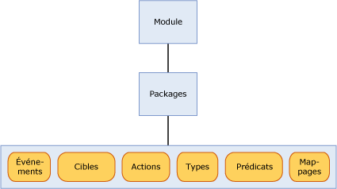

# <a name="sql-server-extended-events-packages"></a>Packages d’événements étendus SQL Server
[!INCLUDE[appliesto-ss-asdb-xxxx-xxx-md](../../includes/appliesto-ss-asdb-xxxx-xxx-md.md)]

  Un package est un conteneur d'objets d'événements étendus [!INCLUDE[ssNoVersion](../../includes/ssnoversion-md.md)] . Il existe trois sortes de packages Événements étendus :  
  
-   package0 - objets système d'événements étendus. Il s'agit du package par défaut.  
  
-   sqlserver - objets connexes [!INCLUDE[ssNoVersion](../../includes/ssnoversion-md.md)] .  
  
-   sqlos - objets du système d'exploitation [!INCLUDE[ssNoVersion](../../includes/ssnoversion-md.md)] (SQLOS).  
  
> [!NOTE]  
>  Le package SecAudit est utilisé par [!INCLUDE[ssNoVersion](../../includes/ssnoversion-md.md)] Audit. Aucun des objets du package n'est disponible via le langage de définition de données (DDL) Événements étendus.  
  
 Les packages sont identifiés par un nom, un GUID et le module binaire qui contient le package. Pour plus d’informations, consultez [sys.dm_xe_packages &#40;Transact-SQL&#41;](../../relational-databases/system-dynamic-management-views/sys-dm-xe-packages-transact-sql.md).  
  
 Un package peut contenir l'ensemble ou une partie des objets suivants, présentés plus en détails ultérieurement dans cette rubrique :  
  
-   Événements  
  
-   Cibles  
  
-   Actions  
  
-   Types  
  
-   Prédicats  
  
-   Cartes  
  
 Des objets de packages différents peuvent être mélangés dans une session d'événements. Pour plus d’informations, consultez [Sessions Événements étendus SQL Server](../../relational-databases/extended-events/sql-server-extended-events-sessions.md).  
  
## <a name="package-contents"></a>Contenu des packages  
 L'illustration suivante montre les objets qui peuvent exister dans des packages, inclus dans un module. Un module peut être un exécutable ou une bibliothèque de liens dynamiques.  
  
   
  
### <a name="events"></a>Événements  
 Les événements surveillent les détails intéressants dans le chemin d'exécution d'un programme, tel que [!INCLUDE[ssNoVersion](../../includes/ssnoversion-md.md)]. Le déclenchement d'un événement indique que le détail intéressant s'est manifesté et fournit les informations d'état correspondant au moment du déclenchement de l'événement.  
  
 Les événements peuvent être utilisés uniquement à des fins de suivi ou pour déclencher des actions. Ces actions peuvent être synchrones ou asynchrones.  
  
> [!NOTE]  
>  Un événement n'a aucune connaissance des actions susceptibles d'être déclenchées en réponse à son déclenchement.  
  
 Un jeu d'événements dans un package ne peut pas changer une fois que le package a été enregistré avec les événements étendus.  
  
 Tous les événements ont un schéma avec contrôle de version qui définit leur contenu. Ce schéma est composé de colonnes d'événements de types déterminés. Un événement d'un type spécifique doit toujours fournir ses données exactement dans le même ordre que celui spécifié dans le schéma. Toutefois, une cible d'événement n'a pas à consommer toutes les données fournies.  
  
#### <a name="event-categorization"></a>Catégorisation des événements  
 Les événements étendus utilisent un modèle de catégorisation d'événements semblable au suivi d'événements pour Windows. Deux propriétés d'événement sont utilisées pour la catégorisation, canal et mot clé. L'utilisation de ces propriétés prend en charge l'intégration des événements étendus avec le suivi ETW et ses outils.  
  
 **Channel**  
  
 Un canal identifie le public concerné par un événement. Ces canaux sont décrits dans le tableau ci-dessous.  
  
|Terme|Définition|  
|----------|----------------|  
|Administratifs|Les événements administratifs sont principalement destinés aux utilisateurs finaux, aux administrateurs et au support technique. Les événements détectés dans les canaux administratifs font référence à un problème avec une solution déterminée qu'un administrateur peut mettre en place. Par exemple, le fait qu'une application ne puisse pas se connecter à une imprimante correspond à un événement administratif. Ces événements font l'objet d'une documentation détaillée ou sont accompagnés d'un message qui indique la procédure à suivre pour résoudre le problème.|  
|Opérationnels|Les événements opérationnels permettent d'analyser et de diagnostiquer un problème ou une occurrence. Ils permettent de déclencher des outils ou des tâches en fonction du problème ou de l'occurrence. Par exemple, le fait qu'une imprimante soit ajoutée ou supprimée dans un système correspond à un événement opérationnel.|  
|Analytiques|Les événements analytiques sont publiés selon un volume élevé. Ils décrivent le fonctionnement des programmes et sont généralement utilisés dans les enquêtes sur les performances.|  
|Débogage|Les événements de débogage sont utilisés uniquement par les développeurs pour diagnostiquer un problème afin de le résoudre.<br /><br /> Les événements du canal de débogage renvoient des données d'état internes propres à l'implémentation. Les schémas et les données renvoyées par les événements sont susceptibles de changer ou de ne plus être compatibles avec les prochaines versions de SQL Server. Par conséquent, les événements du canal de débogage pourront être changés ou supprimés dans les versions à venir de SQL Server sans notification.|  
  
 **Mot clé**  
  
 Un mot clé est spécifique à une application et permet un regroupement plus fin d'événements associés, ce qui vous permet de spécifier et de récupérer plus aisément un événement que vous souhaitez utiliser dans une session. Vous pouvez utiliser la requête suivante pour obtenir des informations sur un mot clé.  
  
```  
select map_value Keyword from sys.dm_xe_map_values  
where name = 'keyword_map'  
```  
  
> [!NOTE]  
>  Les mots clés correspondent étroitement au regroupement actuel des événements SQL Trace.  
  
### <a name="targets"></a>Cibles  
 Les cibles sont des consommateurs d'événements. Les cibles traitent des événements, de façon synchrone sur le thread qui déclenche l'événement ou de façon asynchrone sur un thread fourni par le système. Les événements étendus fournissent plusieurs cibles que vous pouvez utiliser d'une manière appropriée pour diriger les données de sortie des événements. Pour plus d'informations, consultez [SQL Server Extended Events Targets](http://msdn.microsoft.com/library/e281684c-40d1-4cf9-a0d4-7ea1ecffa384).  
  
### <a name="actions"></a>Actions  
 Une action est une réponse de programmation ou une série de réponses à un événement. Les actions sont liées à un événement et chaque événement peut posséder un ensemble unique d'actions.  
  
> [!NOTE]  
>  Des actions prévues pour un ensemble spécifique d'événements ne peuvent pas être liées à des événements inconnus.  
  
 Une action liée à un événement est appelée de façon synchrone sur le thread qui a déclenché l'événement. Il existe de nombreux types d'actions et elles présentent une gamme étendue de capacités. Les actions peuvent correspondre aux opérations suivantes :  
  
-   capturer un vidage de pile et inspecter des données ;  
  
-   stocker des informations d'état dans un contexte local par le biais du stockage de variables ;  
  
-   agréger des données d'événement ;  
  
-   ajouter des données à des données d'événement.  
  
 Voici quelques exemples typiques et bien connus d'actions :  
  
-   Gestionnaire de vidage de pile  
  
-   Détection du plan d'exécution ([!INCLUDE[ssNoVersion](../../includes/ssnoversion-md.md)] uniquement)  
  
-   [!INCLUDE[tsql](../../includes/tsql-md.md)] collection de pile ([!INCLUDE[ssNoVersion](../../includes/ssnoversion-md.md)] uniquement)  
  
-   Exécuter des calculs statistiques à l'exécution  
  
-   Collecter les entrées utilisateur en cas d'exception  
  
### <a name="predicates"></a>Prédicats  
 Les prédicats sont un ensemble de règles logiques qui permettent d'évaluer des événements lorsqu'ils sont traités. Cela permet à l'utilisateur d'événements étendus de capturer de manière sélective des données d'événement en fonction de critères spécifiques.  
  
 Les prédicats peuvent stocker des données dans un contexte local qui peut être utilisé pour créer des prédicats qui retournent la valeur true une fois toutes les *n* minutes ou toutes les *n* fois qu’un événement est déclenché. Ce stockage de contexte local permet également de mettre à jour dynamiquement le prédicat, en supprimant le déclenchement futur des événements si les événements contiennent des données semblables.  
  
 Les prédicats ont la capacité de récupérer les informations de contexte, telles que l'ID de thread, ainsi que des données spécifiques à l'événement. Les prédicats sont évalués en tant qu'expressions booléennes complètes et prennent en charge le court-circuit au premier point où il apparaît que l'expression entière est fausse.  
  
> [!NOTE]  
>  Les prédicats avec effets secondaires ne peuvent pas être évalués en cas d'échec d'un contrôle de prédicat antérieur.  
  
### <a name="types"></a>Types  
 Comme les données sont une collection d'octets enchaînés, la longueur et les caractéristiques de la collection d'octets sont requises pour interpréter les données. Ces informations sont encapsulées dans l'objet Type. Les types suivants sont fournis pour les objets de package :  
  
-   événement  
  
-   action  
  
-   target  
  
-   pred_source  
  
-   pred_compare  
  
-   Type  
  
 Pour plus d’informations, consultez [sys.dm_xe_objects &#40;Transact-SQL&#41;](../../relational-databases/system-dynamic-management-views/sys-dm-xe-objects-transact-sql.md).  
  
### <a name="maps"></a>Cartes  
 Une table de mappage mappe une valeur interne à une chaîne, ce qui permet à un utilisateur de savoir ce que la valeur représente. Au lieu d'obtenir simplement une valeur numérique, un utilisateur peut obtenir une description explicite de la valeur interne. La requête ci-dessous indique comment obtenir les valeurs de mappage.  
  
```  
select map_key, map_value from sys.dm_xe_map_values  
where name = 'lock_mode'  
```  
  
 La requête précédente produit la sortie ci-dessous.  
  
 `map_key     map_value`  
  
 `---------------------`  
  
 `0           NL`  
  
 `1           SCH_S`  
  
 `2           SCH_M`  
  
 `3           S`  
  
 `4           U`  
  
 `5           X`  
  
 `6           IS`  
  
 `7           IU`  
  
 `8           IX`  
  
 `9           SIU`  
  
 `10          SIX`  
  
 `11          UIX`  
  
 `12          BU`  
  
 `13          RS_S`  
  
 `14          RS_U`  
  
 `15          RI_NL`  
  
 `16          RI_S`  
  
 `17          RI_U`  
  
 `18          RI_X`  
  
 `19          RX_S`  
  
 `20          RX_U`  
  
 `21          RX_X`  
  
 `21          RX_X`  
  
 En utilisant cette table comme exemple, supposez que vous possédez une colonne nommée mode et que sa valeur est 5. Le tableau indique que 5 correspond à X, ce qui signifie que le type de verrou est Exclusif.  
  
## <a name="see-also"></a> Voir aussi  
 [Sessions Événements étendus SQL Server](../../relational-databases/extended-events/sql-server-extended-events-sessions.md)   
 [Moteur des Événements étendus SQL Server](../../relational-databases/extended-events/sql-server-extended-events-engine.md)   
 [SQL Server Extended Events Targets](http://msdn.microsoft.com/library/e281684c-40d1-4cf9-a0d4-7ea1ecffa384)  
  
  
