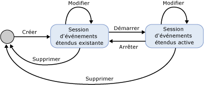
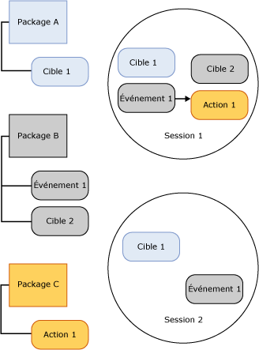

# Sessions Événements étendus SQL Server
[!INCLUDE[appliesto-ss-asdb-xxxx-xxx-md](../../includes/appliesto-ss-asdb-xxxx-xxx-md.md)]

  Une session Événements étendus [!INCLUDE[ssNoVersion](../../includes/ssnoversion-md.md)] est créée dans le processus [!INCLUDE[ssNoVersion](../../includes/ssnoversion-md.md)] qui héberge le moteur des Événements étendus. Les aspects suivants d'une session Événements étendus fournissent le contexte nécessaire pour comprendre l'infrastructure des Événements étendus et le processus global qui est en cours :  
  
-   États de la session. Les différents états dans lesquels peut se trouver une session Événements étendus lorsque des instructions CREATE EVENT SESSION et ALTER EVENT SESSION sont exécutées.  
  
-   Contenu et caractéristiques de la session. Le contenu d'une session Événements étendus, tel que les cibles et les événements, et comment ces objets sont liés dans une session ou entre des sessions.  
  
## États de la session  
 L'illustration ci-dessous indique les divers états d'une session Événements étendus.  
  
   
  
 En vous référant à l'illustration précédente, notez que l'état de la session change au fur et à mesure que les commandes DDL sont exécutées pour une session d'événements. Ces changements d'état sont décrits dans le tableau ci-dessous.  
  
|Nom de l'illustration|Instruction DDL|Description|  
|------------------------|-------------------|-----------------|  
|Créer|CREATE EVENT SESSION|Le processus hôte crée un objet de session contenant les métadonnées fournies par CREATE EVENT SESSION. Le processus hôte valide la définition de session, valide le niveau d'autorisation utilisateur et stocke les métadonnées dans la base de données MASTER. À ce stade, la session n'est pas active.|  
|Alter|ALTER EVENT SESSION, STATE=START|Le processus hôte démarre la session. Il lit les métadonnées stockées, valide la définition de session, vérifie le niveau d'autorisation utilisateur et crée la session. Les objets de session, tels que les événements et les cibles, sont chargés et la gestion des événements est active.|  
|Alter|ALTER EVENT SESSION, STATE=STOP|Le processus hôte arrête la session active mais conserve les métadonnées.|  
|Supprimer|DROP EVENT SESSION|Selon que la session est active ou non, l'instruction Drop (DROP SESSION) supprime les métadonnées et ferme la session active, ou supprime les métadonnées de la session.|  
  
> [!NOTE]  
>  Les deux instructions ALTER EVENT SESSION et DROP EVENT SESSION peuvent être appliquées aux métadonnées ou à une session active et aux métadonnées.  
  
## Contenu et caractéristiques de la session  
 Les sessions d'événements étendus sont soumises à des limites implicites dans la mesure où la configuration d'une session ne doit pas modifier la configuration d'une autre session. Toutefois, ces limites n'empêchent pas l'utilisation d'un événement ou d'une cible dans plusieurs sessions.  
  
 La figure ci-dessous montre le contenu de la session et la relation entre packages et sessions.  
  
   
  
 Faisant référence à l'illustration précédente, notez les points suivants :  
  
-   Le mappage entre des objets de packages et des sessions est de type plusieurs-à-plusieurs, ce qui signifie qu'un objet peut apparaître dans plusieurs sessions et qu'une session peut contenir plusieurs objets.  
  
-   Un même événement (Événement 1) ou une même cible (Cible 1) peuvent être activés dans plusieurs sessions.  
  
 Les sessions présentent les caractéristiques suivantes :  
  
-   Les actions et les prédicats sont liés aux événements session par session. Si l'événement Événement 1 dans la session Session A est lié à l'action Action 1 et au prédicat Prédicat Z, cela n'affecte en aucune façon la possibilité que l'événement Événement 1 dans la session Session B soit lié aux actions Action 2 et Action 3 sans prédicat.  
  
-   Les stratégies sont jointes aux sessions pour gérer la mise en mémoire tampon et la distribution, ainsi que le suivi de causalité.  
  
 **Mise en mémoire tampon et distribution**  
  
 La mise en mémoire tampon fait référence à la manière dont les données d'événement sont stockées au cours de l'exécution d'une session d'événements.  Les stratégies de mise en mémoire tampon spécifient la quantité de mémoire à utiliser pour les données d'événement et la stratégie de perte pour les événements. La distribution fait référence à la durée pendant laquelle des événements resteront dans les mémoires tampon avant d'être transmis aux cibles pour traitement.  
  
 **Suivi de causalité**  
  
 Le suivi de causalité permet d'effectuer le suivi d'un travail sur plusieurs tâches. Lorsque le suivi de causalité est activé, chaque événement déclenché possède un ID d'activité unique sur le système. L'ID d'activité est constitué d'une valeur GUID qui demeure constante sur tous les événements liés à une tâche et d'un numéro de séquence qui est incrémenté chaque fois qu'un événement est déclenché. Lorsqu'une tâche entraîne l'exécution d'une autre tâche pour un même travail, l'ID d'activité de la tâche parent est envoyé à la tâche enfant. La tâche enfant fournit en sortie l'ID d'activité de la tâche parent la première fois qu'elle déclenche un événement.  
  
 L'architecture des Événements étendus fournit un système flexible qui permet d'utiliser conjointement divers objets pour résoudre des problèmes spécifiques.  
  
##  Voir aussi  
 [Événements étendus](../../relational-databases/extended-events/extended-events.md)  
  
  
