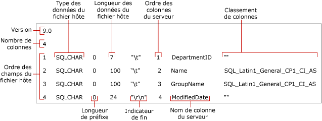

# <a name="non-xml-format-files-sql-server"></a>Fichiers de format non-XML (SQL Server)
[!INCLUDE[appliesto-ss-asdb-asdw-pdw-md](../../includes/appliesto-ss-asdb-asdw-pdw-md.md)]
  Dans [!INCLUDE[ssCurrent](../../includes/sscurrent-md.md)], deux types de fichiers de format sont pris en charge pour l’exportation et l’importation en bloc : les *fichiers de format non XML* et les *fichiers de format XML*.  
  
 **Dans cette rubrique :**  
  
-   [Avantages](#Benefits)  
  
-   [Structure des fichiers de format non XML](#Structure)  
  
-   [Exemple de fichier de format non XML](#Examples)  
  
-   [Tâches associées](#RelatedTasks)  
  
##  <a name="Benefits"></a> Avantages des fichiers de format non XML  
  
-   Vous pouvez créer automatiquement un fichier de format non XML en spécifiant l’option **format** dans une commande **bcp** .  
  
-   Lorsque vous spécifiez un fichier de format existant dans une commande **bcp** , cette dernière utilise les valeurs enregistrées dans un fichier de format et elle ne vous demande pas le type de stockage dans le fichier, la longueur du préfixe, la longueur des champs, ni l’indicateur de fin de champ.  
  
-   Vous pouvez créer un fichier de format pour un type de données particulier, tel que les données de type caractère ou les données au format natif.  
  
-   Vous pouvez créer un fichier de format non XML qui contient des attributs spécifiés de manière interactive pour chaque champ de données. Pour plus d’informations, consultez [Spécifier des formats de données pour la compatibilité lors de l’utilisation de bcp &#40;SQL Server&#41;](../../relational-databases/import-export/specify-data-formats-for-compatibility-when-using-bcp-sql-server.md).  
  
> [!NOTE]  
>  Les fichiers de format XML offrent différents avantages par rapport aux fichiers de format non XML. Pour plus d’informations, consultez [Fichiers de format XML &#40;SQL Server&#41;](../../relational-databases/import-export/xml-format-files-sql-server.md).  
  
##  <a name="Structure"></a> Structure des fichiers de format non XML  
 Un fichier de format non XML est un fichier texte contenant une structure particulière. Il contient des informations sur le type de stockage du fichier, la longueur du préfixe et celle des champs, ainsi que le caractère de fin de champ de chaque colonne constituant la table.  
  
 L'exemple suivant présente les champs de fichier de format d'un fichier de format non XML.  
  
 
  
 Les champs **Version** et **Nombre de colonnes** n'apparaissent qu'une seule fois. Leurs significations sont décrites dans le tableau suivant.  
  
|Champ du fichier de format|Description|  
|------------------------|-----------------|  
|Options de version|Numéro de version de l’utilitaire **bcp** :<br /><br /> 9.0 = [!INCLUDE[ssVersion2005](../../includes/ssversion2005-md.md)]<br /><br /> 10.0 = [!INCLUDE[ssKatmai](../../includes/sskatmai-md.md)]<br /><br /> 11.0 = [!INCLUDE[ssSQL11](../../includes/sssql11-md.md)]<br /><br /> 12.0 = [!INCLUDE[ssSQL14](../../includes/sssql14-md.md)]<br /><br /> Ce numéro de version n’est reconnu que par **bcp**, et non par [!INCLUDE[tsql](../../includes/tsql-md.md)].<br /><br /> <br /><br /> Remarque : La version de l’utilitaire **bcp** (Bcp.exe) servant à lire un fichier de format doit être identique ou ultérieure à la version utilisée pour créer le fichier de format. Par exemple, [!INCLUDE[ssSQL11](../../includes/sssql11-md.md)]**bcp** peut lire un fichier de format version 10.0, généré par [!INCLUDE[ssKatmai](../../includes/sskatmai-md.md)]**bcp**, mais [!INCLUDE[ssKatmai](../../includes/sskatmai-md.md)]**bcp** ne peut pas lire un fichier de format version 12.0, généré par [!INCLUDE[ssSQL14](../../includes/sssql14-md.md)]**bcp**.|  
|Nombre de colonnes|Nombre de champs dans le fichier de données. Il doit être identique pour toutes les lignes.|  
  
 Les autres champs de fichier de format décrivent les champs de données à importer ou exporter en bloc. Chaque champ de données nécessite une ligne séparée dans le fichier de format. Chaque ligne de fichier de format contient les valeurs des champs de fichier de format décrits dans le tableau suivant.  
  
|Champ du fichier de format|Description|  
|------------------------|-----------------|  
|**Ordre des champs du fichier hôte**|Nombre indiquant la position de chaque champ dans le fichier de données. Le premier champ de la ligne correspond à la valeur 1, etc.|  
|**Type de données du fichier hôte**|Indique que le type de données est stocké dans un champ précis du fichier de données. Dans le cas des fichiers de données ASCII, utilisez SQLCHAR ; pour les fichiers de données au format natif, utilisez les types de données par défaut. Pour plus d’informations, consultez [Spécifier le type de stockage de fichiers à l’aide de bcp &#40;SQL Server&#41;](../../relational-databases/import-export/specify-file-storage-type-by-using-bcp-sql-server.md).|  
|**Longueur de préfixe**|Nombre de caractères du préfixe de longueur pour le champ. Les longueurs de préfixe valides sont 0, 1, 2, 4 et 8. Pour éviter de spécifier le préfixe de longueur, définissez la valeur 0. Un préfixe de longueur doit être spécifié si le champ contient des valeurs de données NULL. Pour plus d’informations, consultez [Spécifier une longueur de préfixe dans des fichiers de données à l’aide de bcp &#40;SQL Server&#41;](../../relational-databases/import-export/specify-prefix-length-in-data-files-by-using-bcp-sql-server.md).|  
|**Longueur des données du fichier hôte**|Longueur maximale, en octets, du type des données stockées dans le champ particulier du fichier de données.<br /><br /> Si vous créez un fichier de format non XML pour un fichier texte délimité, vous pouvez spécifier 0 pour la longueur des données du fichier hôte de chaque champ de données. Lors de l'importation d'un fichier de texte délimité ayant un indicateur de fin et une longueur de préfixe de 0, la valeur de longueur de champ est ignorée, car l'espace de stockage utilisé par le champ est égal à la longueur des données plus le terminateur.<br /><br /> Pour plus d’informations, consultez [Spécifier la longueur des champs au moyen de bcp &#40;SQL Server&#41;](../../relational-databases/import-export/specify-field-length-by-using-bcp-sql-server.md).|  
|**Indicateur de fin**|Caractère de séparation utilisé pour délimiter les champs dans un fichier de données. Les indicateurs de fin communs sont la virgule (,), la tabulation (\t) et la fin de ligne (\r\n). Pour plus d’informations, consultez [Spécifier des indicateurs de fin de champ et de fin de ligne &#40;SQL Server&#41;](../../relational-databases/import-export/specify-field-and-row-terminators-sql-server.md).|  
|**Ordre des colonnes du serveur**|Ordre dans lequel les colonnes apparaissent dans la table [!INCLUDE[ssNoVersion](../../includes/ssnoversion-md.md)] . Par exemple, si le quatrième champ du fichier de données est mappé sur la sixième colonne d'une table [!INCLUDE[ssNoVersion](../../includes/ssnoversion-md.md)] , l'ordre de la colonne sur le serveur correspondant au quatrième champ est défini sur 6.<br /><br /> Pour éviter qu'une colonne d'une table reçoive des données d'un fichier de données, définissez l'ordre de colonne sur le serveur sur 0.|  
|**Nom de colonne du serveur**|Nom de la colonne pris de la table [!INCLUDE[ssNoVersion](../../includes/ssnoversion-md.md)] . Il n'est pas indispensable d'utiliser le nom réel du champ, mais le champ ne doit pas être vide dans le fichier de format.|  
|**Classement par colonnes**|Classement utilisé pour stocker des caractères et des données Unicode dans le fichier de données.|  
  
> [!NOTE]  
>  Vous pouvez modifier un fichier de format afin de pouvoir importer des données en bloc à partir d'un fichier de données dans lequel le nombre et/ou l'ordre des champs diffèrent du nombre ou de l'ordre des colonnes de la table. Pour plus d'informations, consultez la liste [Tâches associées](#RelatedTasks) , plus loin dans cette rubrique.  
  
##  <a name="Examples"></a> Exemple de fichier de format non XML  
 L'exemple suivant affiche un fichier de format non XML créé précédemment (`myDepartmentIdentical-f-c.fmt`). Ce fichier décrit un champ de données de type caractère pour chaque colonne de la table `HumanResources.Department` dans la base de données exemple `AdventureWorks2012` .  
  
 Le fichier de format généré, `myDepartmentIdentical-f-c.fmt`, contient les informations suivantes :  
  
```  
12.0  
4  
1       SQLCHAR       0       7       "\t"     1     DepartmentID     ""  
2       SQLCHAR       0       100     "\t"     2     Name             SQL_Latin1_General_CP1_CI_AS  
3       SQLCHAR       0       100     "\t"     3     GroupName        SQL_Latin1_General_CP1_CI_AS  
4       SQLCHAR       0       24      "\r\n"   4     ModifiedDate     ""  
```  
  
> [!NOTE]  
>  Pour une illustration des champs de fichier de format par rapport à cet exemple de fichier de format non XML, consultez [Structure des fichiers de format non XML](#Structure), plus haut dans cette rubrique.  
  
##  <a name="RelatedTasks"></a> Tâches associées  
  
-   [Créer un fichier de format &#40;SQL Server&#41;](../../relational-databases/import-export/create-a-format-file-sql-server.md)  
  
-   [Utiliser un fichier de format pour importer des données en bloc &#40;SQL Server&#41;](../../relational-databases/import-export/use-a-format-file-to-bulk-import-data-sql-server.md)  
  
-   [Utiliser un fichier de format pour ignorer une colonne de table &#40;SQL Server&#41;](../../relational-databases/import-export/use-a-format-file-to-skip-a-table-column-sql-server.md)  
  
-   [Utiliser un fichier de format pour ignorer un champ de données &#40;SQL Server&#41;](../../relational-databases/import-export/use-a-format-file-to-skip-a-data-field-sql-server.md)  
  
-   [Utiliser un fichier de format pour mapper les colonnes d’une table sur les champs d’un fichier de données &#40;SQL Server&#41;](../../relational-databases/import-export/use-a-format-file-to-map-table-columns-to-data-file-fields-sql-server.md)  
  
## <a name="see-also"></a> Voir aussi  
 [Utilitaire bcp](../../tools/bcp-utility.md)   
 [Créer un fichier de format &#40;SQL Server&#41;](../../relational-databases/import-export/create-a-format-file-sql-server.md)   
 [Fichiers de format XML &#40;SQL Server&#41;](../../relational-databases/import-export/xml-format-files-sql-server.md)   
 [Fichiers de format pour l’importation ou l’exportation de données &#40;SQL Server&#41;](../../relational-databases/import-export/format-files-for-importing-or-exporting-data-sql-server.md)  
  
  
