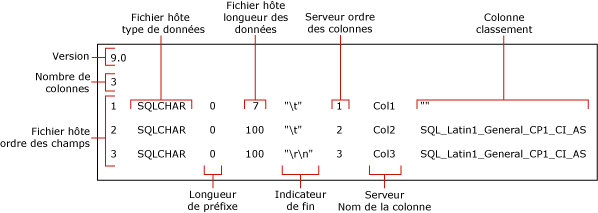

# <a name="use-a-format-file-to-skip-a-table-column-sql-server"></a>Utiliser un fichier de format pour ignorer une colonne de table (SQL Server)
[!INCLUDE[appliesto-ss-asdb-asdw-pdw-md](../../includes/appliesto-ss-asdb-asdw-pdw-md.md)]

Cet article explique comment utiliser un fichier de format pour ignorer l’importation d’une colonne de table lorsque les données de la colonne ignorée n’existent pas dans le fichier de données source. Un fichier de données peut contenir moins de champs que le nombre de colonnes dans la table de destination, autrement dit vous pouvez ignorer l’importation d’une colonne, uniquement si au moins une des deux conditions suivantes est vraie dans la table de destination :
-   La colonne ignorée accepte la valeur Null
-   La colonne ignorée présente une valeur par défaut  
  
## <a name="sample-table-and-data-file"></a>Exemples de table et de fichier de données  
 Les exemples de cet article supposent l’utilisation d’une table nommée `myTestSkipCol` sous le schéma **dbo**. Vous pouvez créer cette table dans un exemple de base de données, tel que *WideWorldImporters* ou *AdventureWorks* ou dans toute autre base de données. Créez cette table comme suit :  
  
```sql
USE WideWorldImporters;  
GO  
CREATE TABLE myTestSkipCol   
   (  
   Col1 smallint,  
   Col2 nvarchar(50) NULL,  
   Col3 nvarchar(50) not NULL  
   );  
GO  
```  
  
Les exemples de cet article utilisent également un exemple de fichier de données, `myTestSkipCol2.dat`. Ce fichier de données contient uniquement deux champs, bien que la table de destination contienne trois colonnes.

```  
1,DataForColumn3  
1,DataForColumn3  
1,DataForColumn3  
```  
  
## <a name="basic-steps"></a>Étapes de base

Vous pouvez utiliser un fichier de format non-XML ou un fichier de format XML pour ignorer une colonne de table. Dans les deux cas, il existe deux étapes :

1.   Utilisez l’utilitaire de ligne de commande **bcp** pour créer un fichier de format non XML par défaut.

2.   Modifiez le fichier de format par défaut dans un éditeur de texte

Le fichier de format modifié doit mapper chaque champ existant à une colonne correspondante dans la table de destination. Il doit également indiquer la ou les colonnes de table à ignorer. 

Pour importer des données en bloc depuis `myTestSkipCol2.dat` dans la table `myTestSkipCol`, le fichier de format doit mapper le premier champ de données vers `Col1`, ignorer `Col2` et mapper le second champ vers `Col3`.  
 
## <a name="option-1---use-a-non-xml-format-file"></a>Option no1 - Utiliser un fichier de format non-XML  
  
### <a name="step-1---create-a-default-non-xml-format-file"></a>Étape no1 - Créer un fichier de format non-XML par défaut  
Créez un fichier de format non-XML par défaut pour l’exemple de table `myTestSkipCol` au moyen de la commande suivante **bcp** à l’invite :  
  
```cmd
bcp WideWorldImporters..myTestSkipCol format nul -f myTestSkipCol_Default.fmt -c -T  
```  

> [!IMPORTANT]  
>  Il est possible que vous soyez amené à spécifier le nom de l’instance de serveur à laquelle vous vous connectez à l’aide de l’argument `-S`. De même, vous devrez peut-être préciser le nom d’utilisateur et le mot de passe avec les arguments `-U` et `-P`. Pour plus d’informations, consultez [bcp Utility](../../tools/bcp-utility.md).  

La commande précédente crée un fichier de format non XML, `myTestSkipCol_Default.fmt`. Ce fichier de format s’appelle un *fichier de format par défaut* car il est au format généré par **bcp**. Un fichier de format par défaut décrit une correspondance unique entre les champs d’un fichier de données et les colonnes d’une table.  
  
 La capture d’écran suivante montre les valeurs dans cet exemple de fichier de format par défaut. 
  
   
  
> [!NOTE]  
>  Pour plus d’informations sur les champs de fichier de format, consultez [Fichiers de format non-XML &#40;SQL Server&#41;](../../relational-databases/import-export/non-xml-format-files-sql-server.md).  
  
### <a name="step-2---modify-a-non-xml-format-file"></a>Étape no2 - Modifier un fichier de format non-XML  
Pour modifier un fichier de format non XML par défaut, il existe deux alternatives. Quoi qu’il en soit, elles indiquent toutes deux que le champ de données n’existe pas dans le fichier de données et qu’aucune donnée ne peut être insérée dans la colonne correspondante de la table.

Pour ignorer une colonne de table, modifiez le fichier de format non XML par défaut et modifiez-le à l'aide de l'une des méthodes alternatives suivantes :  

#### <a name="option-1---remove-the-row"></a>Option no1 - Supprimer la ligne
La méthode recommandée pour ignorer une colonne passe par les trois étapes suivantes :

1.   Commencez par supprimer les lignes du fichier de format qui correspondent à un champ manquant dans le fichier de données source.
2.   Puis, réduisez la valeur « Ordre des champs du fichier hôte » de chaque ligne de fichier-format qui suit une ligne supprimée. L'objectif est les valeurs « Ordre des champs du fichier hôte » séquentielles, 1 à *n*, qui reflète la position réelle de chaque champ de données dans le fichier de données.
3.   Enfin, réduisez la valeur du champ « Nombre de colonnes » pour refléter le nombre réel de champs figurant dans le fichier de données.  
  
L'exemple suivant est basé sur le fichier de format par défaut pour la table `myTestSkipCol` . Ce fichier de format modifié mappe le premier champ de données à `Col1`, ignore `Col2`, et mappe le deuxième champ de données à `Col3`. La ligne de `Col2` a été supprimée. Le délimiteur `\t` après le premier champ a également été remplacé par `,`.
  
```  
14.0  
2  
1       SQLCHAR       0       7       ","      1     Col1         ""  
2       SQLCHAR       0       100     "\r\n"   3     Col3         SQL_Latin1_General_CP1_CI_AS  
```  
  
#### <a name="option-2---modify-the-row-definition"></a>Option no2 - Modifier la définition de ligne

Pour ignorer une colonne de table, vous pouvez aussi modifier la définition de la ligne du fichier-format qui correspond à la colonne de table. Dans cette ligne de fichier-format, les valeurs « longueur de préfixe », « longueur des données du fichier hôte » et « ordre des colonnes du serveur » doivent être égales à 0. De plus, les champs « terminateur » et « classement des colonnes » doivent avoir la valeur "" (c’est-à-dire une valeur vide ou NULL). La valeur « nom de la colonne du serveur » nécessite une chaîne non vide même si le nom de la colonne à proprement dit n’est pas nécessaire. Les champs de format restants nécessitent leurs valeurs par défaut.  
  
L'exemple suivant provient aussi du fichier de format par défaut pour la table `myTestSkipCol` .  
  
```  
14.0  
3  
1       SQLCHAR       0       7       ","      1     Col1         ""  
2       SQLCHAR       0       0       ""       0     Col2         ""  
3       SQLCHAR       0       100     "\r\n"   3     Col3         SQL_Latin1_General_CP1_CI_AS  
```  
  
### <a name="examples-with-a-non-xml-format-file"></a>Exemples avec un fichier de format non-XML 
Les exemples suivants s’appuient aussi sur l’exemple de table `myTestSkipCol` et l’exemple de fichier de données `myTestSkipCol2.dat` qui sont décrits plus haut dans cet article.  
  
#### <a name="using-bulk-insert"></a>Utilisation de BULK INSERT  
Cet exemple fonctionne en utilisant au choix un des fichiers de format non-XML modifiés et créés comme décrit à la section précédente. Dans cet exemple, le fichier de format modifié est intitulé `myTestSkipCol2.fmt`. Pour utiliser `BULK INSERT` et importer en bloc le fichier de données `myTestSkipCol2.dat`, exécutez le code suivant dans SSMS. Mettez à jour les chemins de système de fichiers pour l’emplacement des exemples de fichiers sur votre ordinateur.
  
```sql  
USE WideWorldImporters;  
GO  
BULK INSERT myTestSkipCol   
   FROM 'C:\myTestSkipCol2.dat'   
   WITH (FORMATFILE = 'C:\myTestSkipCol2.fmt');  
GO  
SELECT * FROM myTestSkipCol;  
GO  
```  
  
## <a name="option-2---use-an-xml-format-file"></a>Option no2 - Utiliser un fichier de format XML  
  
### <a name="step-1---create-a-default-xml-format-file"></a>Étape no1 - Créer un fichier de format XML par défaut   

Créez un fichier de format XML par défaut pour l’exemple de table `myTestSkipCol` au moyen de la commande suivante **bcp** à l’invite :  
  
```cmd
bcp WideWorldImporters..myTestSkipCol format nul -f myTestSkipCol_Default.xml -c -x -T  
```  
  
> [!IMPORTANT]  
>  Il est possible que vous soyez amené à spécifier le nom de l’instance de serveur à laquelle vous vous connectez à l’aide de l’argument `-S`. De même, vous devrez peut-être préciser le nom d’utilisateur et le mot de passe avec les arguments `-U` et `-P`. Pour plus d’informations, consultez [bcp Utility](../../tools/bcp-utility.md).  
 
La commande précédente crée un fichier de format XML, `myTestSkipCol_Default.xml`. Ce fichier de format s’appelle un *fichier de format par défaut* car il est au format généré par **bcp**. Un fichier de format par défaut décrit une correspondance unique entre les champs d’un fichier de données et les colonnes d’une table.  
  
```xml
<?xml version="1.0"?>  
<BCPFORMAT xmlns="http://schemas.microsoft.com/sqlserver/2004/bulkload/format" xmlns:xsi="http://www.w3.org/2001/XMLSchema-instance">  
 <RECORD>  
  <FIELD ID="1" xsi:type="CharTerm" TERMINATOR="\t" MAX_LENGTH="7"/>  
  <FIELD ID="2" xsi:type="CharTerm" TERMINATOR="\t" MAX_LENGTH="100" COLLATION="SQL_Latin1_General_CP1_CI_AS"/>  
  <FIELD ID="3" xsi:type="CharTerm" TERMINATOR="\r\n" MAX_LENGTH="100" COLLATION="SQL_Latin1_General_CP1_CI_AS"/>  
 </RECORD>  
 <ROW>  
  <COLUMN SOURCE="1" NAME="Col1" xsi:type="SQLSMALLINT"/>  
  <COLUMN SOURCE="2" NAME="Col2" xsi:type="SQLNVARCHAR"/>  
  <COLUMN SOURCE="3" NAME="Col3" xsi:type="SQLNVARCHAR"/>  
 </ROW>  
</BCPFORMAT>  
```  
  
> [!NOTE]  
>  Pour plus d’informations sur la structure des fichiers de format XML, consultez [Fichiers de format XML &#40;SQL Server&#41;](../../relational-databases/import-export/xml-format-files-sql-server.md).  

### <a name="step-2---modify-an-xml-format-file"></a>Étape no2 - Modifier un fichier de format XML

Voici le fichier de format XML modifié, `myTestSkipCol2.xml`, qui ignore `Col2`. Les entrées `FIELD` et `ROW` pour `Col2` ont été supprimées, et les entrées ont été renumérotées. Le délimiteur `\t` après le premier champ a également été remplacé par `,`.

```xml
<?xml version="1.0"?>  
<BCPFORMAT xmlns="http://schemas.microsoft.com/sqlserver/2004/bulkload/format" xmlns:xsi="http://www.w3.org/2001/XMLSchema-instance">  
 <RECORD>  
  <FIELD ID="1" xsi:type="CharTerm" TERMINATOR="," MAX_LENGTH="7"/>  
  <FIELD ID="2" xsi:type="CharTerm" TERMINATOR="\r\n" MAX_LENGTH="100" COLLATION="SQL_Latin1_General_CP1_CI_AS"/>  
 </RECORD>  
 <ROW>  
  <COLUMN SOURCE="1" NAME="Col1" xsi:type="SQLSMALLINT"/>  
  <COLUMN SOURCE="2" NAME="Col3" xsi:type="SQLNVARCHAR"/>  
 </ROW>  
</BCPFORMAT>  
```  
 
### <a name="examples-with-an-xml-format-file"></a>Exemples avec un fichier de format XML   
Les exemples suivants s’appuient aussi sur l’exemple de table `myTestSkipCol` et l’exemple de fichier de données `myTestSkipCol2.dat` qui sont décrits plus haut dans cet article.

Pour importer les données de `myTestSkipCol2.dat` dans la table `myTestSkipCol` , les exemples font appel au fichier de format XML modifié, `myTestSkipCol2.xml`.   
  
#### <a name="using-bulk-insert-with-a-view"></a>Utilisation de BULK IMPORT avec une vue  

Avec un fichier de format XML, vous ne pouvez pas ignorer une colonne lorsque vous procédez à une importation directement dans une table à l’aide d’une commande **bcp** ou d’une instruction `BULK INSERT`. Néanmoins, vous pouvez importer toutes les colonnes d'une table hormis la dernière. Pour ignorer toutes les colonnes à l'exception de la dernière, vous devez créer une vue de la table cible contenant uniquement les colonnes figurant dans le fichier de données. Vous pouvez ensuite importer en bloc les données de ce fichier dans la vue.  
  
L’exemple suivant crée la vue `v_myTestSkipCol` dans la table `myTestSkipCol`. Cette vue ignore la deuxième colonne de la table, `Col2`. L'exemple utilise ensuite l'instruction `BULK INSERT` pour importer le fichier de données `myTestSkipCol2.dat` dans cette vue.  
  
Dans SSMS, exécutez le code suivant. Mettez à jour les chemins de système de fichiers pour l’emplacement des exemples de fichiers sur votre ordinateur. 
  
```sql  
USE WideWorldImporters;  
GO  

CREATE VIEW v_myTestSkipCol AS  
    SELECT Col1,Col3  
    FROM myTestSkipCol;  
GO  
  
BULK INSERT v_myTestSkipCol  
FROM 'C:\myTestSkipCol2.dat'  
WITH (FORMATFILE='C:\myTestSkipCol2.xml');  
GO  
```  

#### <a name="using-openrowsetbulk"></a>Utilisation de OPENROWSET(BULK...)  

Pour utiliser un fichier de format XML et ignorer une colonne de table à l’aide de `OPENROWSET(BULK...)`, vous devez fournir une liste explicite des colonnes dans la liste de sélection ainsi que dans la table cible, comme suit :  
  
    ```sql
    INSERT ...<column_list> SELECT <column_list> FROM OPENROWSET(BULK...) 
    ```

L'exemple suivant utilise le fournisseur d'ensembles de lignes en bloc `OPENROWSET` et le fichier de format `myTestSkipCol2.xml` . Dans cet exemple, le fichier de données `myTestSkipCol2.dat` est importé en bloc dans la table `myTestSkipCol` . L'instruction contient une liste explicite des colonnes dans la liste de sélection et aussi dans la table cible.  
  
Dans SSMS, exécutez le code suivant. Mettez à jour les chemins de système de fichiers pour l’emplacement des exemples de fichiers sur votre ordinateur.
  
```sql  
USE WideWorldImporters;  
GO  
INSERT INTO myTestSkipCol  
  (Col1,Col3)  
    SELECT Col1,Col3  
      FROM  OPENROWSET(BULK  'C:\myTestSkipCol2.Dat',  
      FORMATFILE='C:\myTestSkipCol2.Xml'    
       ) as t1 ;  
GO  
```

## <a name="see-also"></a> Voir aussi  
 [bcp Utility](../../tools/bcp-utility.md)   
 [BULK INSERT &#40;Transact-SQL&#41;](../../t-sql/statements/bulk-insert-transact-sql.md)   
 [OPENROWSET &#40;Transact-SQL&#41;](../../t-sql/functions/openrowset-transact-sql.md)   
 [Utiliser un fichier de format pour ignorer un champ de données &#40;SQL Server&#41;](../../relational-databases/import-export/use-a-format-file-to-skip-a-data-field-sql-server.md)   
 [Utiliser un fichier de format pour mapper les colonnes d’une table aux champs d’un fichier de données &#40;SQL Server&#41;](../../relational-databases/import-export/use-a-format-file-to-map-table-columns-to-data-file-fields-sql-server.md)   
 [Utiliser un fichier de format pour importer des données en bloc &#40;SQL Server&#41;](../../relational-databases/import-export/use-a-format-file-to-bulk-import-data-sql-server.md)  
  
  
