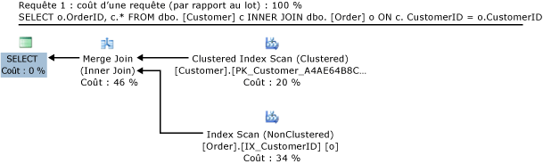
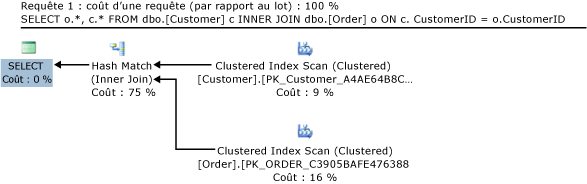
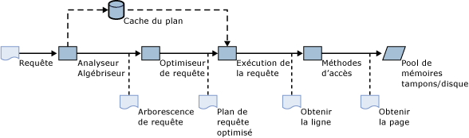
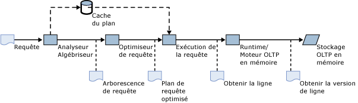
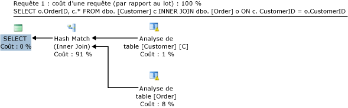
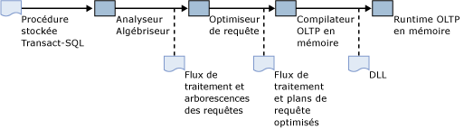
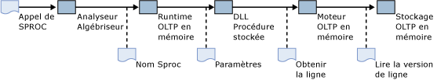
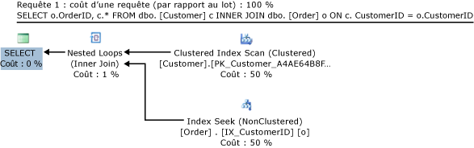

# <a name="a-guide-to-query-processing-for-memory-optimized-tables"></a>Guide du traitement des requêtes pour les tables optimisées en mémoire
[!INCLUDE[appliesto-ss-asdb-xxxx-xxx-md](../../includes/appliesto-ss-asdb-xxxx-xxx-md.md)]

  L'OLTP en mémoire introduit les tables mémoire optimisées et les procédures stockées compilées en mode natif dans [!INCLUDE[ssNoVersion](../../includes/ssnoversion-md.md)]. Cet article présente le traitement des requêtes pour les tables mémoire optimisées et les procédures stockées compilées en mode natif.  
  
 Le document explique comment les requêtes sur les tables mémoire optimisées sont compilées et exécutées, notamment :  
  
-   Le pipeline de traitement des requêtes dans [!INCLUDE[ssNoVersion](../../includes/ssnoversion-md.md)] pour les tables sur disque.  
  
-   Optimisation des requêtes : rôle des statistiques sur les tables mémoire optimisées et instructions de dépannage pour les plans de requête non optimaux.  
  
-   L'utilisation du [!INCLUDE[tsql](../../includes/tsql-md.md)] interprété pour accéder aux tables mémoire optimisées.  
  
-   Considérations relatives à l'optimisation des requêtes pour l'accès aux tables mémoire optimisées.  
  
-   Compilation et traitement d'une procédure stockée compilée en mode natif.  
  
-   Statistiques utilisées pour l'estimation de coût par l'optimiseur.  
  
-   Méthodes pour corriger des plans de requête non optimaux.  
  
## <a name="example-query"></a>Exemple de requête  
 L'exemple suivant est utilisé pour illustrer les concepts de traitement des requêtes décrits dans cet article.  
  
 Prenons deux tables, Customer et Order. Le script [!INCLUDE[tsql](../../includes/tsql-md.md)] suivant contient les définitions des deux tables et des index associés, sur disque (au format traditionnel) :  
  
```sql  
CREATE TABLE dbo.[Customer] (  
  CustomerID nchar (5) NOT NULL PRIMARY KEY,  
  ContactName nvarchar (30) NOT NULL   
)  
GO  
  
CREATE TABLE dbo.[Order] (  
  OrderID int NOT NULL PRIMARY KEY,  
  CustomerID nchar (5) NOT NULL,  
  OrderDate date NOT NULL  
)  
GO  
CREATE INDEX IX_CustomerID ON dbo.[Order](CustomerID)  
GO  
CREATE INDEX IX_OrderDate ON dbo.[Order](OrderDate)  
GO  
```  
  
 Pour créer les plans de requête illustrés dans cet article, les deux tables ont été remplies avec les exemples de données tirés de la base de données Northwind, que vous pouvez télécharger sur [Exemples de bases de données Northwind et pubs pour SQL Server 2000](http://www.microsoft.com/download/details.aspx?id=23654).  
  
 La requête suivante joint les tables Customer et Order, et retourne l'ID de la commande et les informations client associées :  
  
```sql  
SELECT o.OrderID, c.* FROM dbo.[Customer] c INNER JOIN dbo.[Order] o ON c.CustomerID = o.CustomerID  
```  
  
 Le plan d'exécution estimé tel qu'affiché par [!INCLUDE[ssManStudioFull](../../includes/ssmanstudiofull-md.md)] est le suivant :  
  
   
Plan de requête pour joindre des tables sur disque.  
  
 À propos de ce plan de requête :  
  
-   Les lignes de la table Customer sont récupérées à partir de l'index cluster, qui est la structure de données principale et contient toutes les données de la table.  
  
-   Les données de la table Order sont récupérées à l'aide de l'index non cluster sur la colonne CustomerID. Cet index contient la colonne CustomerID utilisée pour la jointure, et la colonne de clé primaire OrderID qui est retournée à l'utilisateur. Le retour de colonnes supplémentaires depuis la table Order nécessiterait des recherches dans l'index cluster de la table Order.  
  
-   L’opérateur logique **Jointure interne** est implémenté par l’opérateur physique **Jointure de fusion**. Les autres types de jointures physiques sont **Boucles imbriquées** et **Jointure hachée**. L’opérateur **Jointure de fusion** tire parti du fait que les deux index sont triés sur la colonne de jointure CustomerID.  
  
 Examinons une légère variante de cette requête, qui retourne toutes les lignes de la table Order, et plus seulement OrderID :  
  
```sql  
SELECT o.*, c.* FROM dbo.[Customer] c INNER JOIN dbo.[Order] o ON c.CustomerID = o.CustomerID  
```  
  
 Le plan estimé pour cette requête est le suivant :  
  
   
Plan de requête d'une jointure hachée des tables sur disque.  
  
 Dans cette requête, les lignes de la table Order sont récupérées à partir de l'index cluster. L’opérateur physique **Correspondances de hash** est désormais utilisé pour la **Jointure interne**. L’index cluster sur Order n’étant pas trié sur CustomerID, une **Jointure de fusion** nécessite un opérateur de tri, ce qui affecte les performances. Notez le coût relatif de l’opérateur **Correspondances de hash** (75 %) comparé au coût de l’opérateur **Jointure de fusion** dans l’exemple précédent (46 %). L’optimiseur aurait pu utiliser l’opérateur **Correspondances de hash** également dans l’exemple précédent, mais il a considéré que l’opérateur **Jointure de fusion** fournirait de meilleures performances.  
  
## <a name="includessnoversionincludesssnoversion-mdmd-query-processing-for-disk-based-tables"></a>[!INCLUDE[ssNoVersion](../../includes/ssnoversion-md.md)] Traitement des requêtes pour les tables sur disque  
 Le diagramme suivant représente le flux de traitement des requêtes dans [!INCLUDE[ssNoVersion](../../includes/ssnoversion-md.md)] pour les requêtes ad hoc :  
  
   
Pipeline de traitement des requêtes SQL Server  
  
 Dans ce scénario :  
  
1.  L'utilisateur émet une requête.  
  
2.  L'analyseur et l'algébriseur construisent une arborescence de requête avec des opérateurs logiques en fonction du texte [!INCLUDE[tsql](../../includes/tsql-md.md)] soumis par l'utilisateur.  
  
3.  L'optimiseur crée un plan de requête optimisé qui contient les opérateurs physiques (par exemple, une jointure de boucle imbriquée). Après l'optimisation, le plan peut être stocké dans le cache du plan. Cette étape est ignorée si le cache du plan contient déjà un plan pour cette requête.  
  
4.  Le moteur d'exécution de requête traite une interprétation du plan de requête.  
  
5.  Pour chaque recherche d'index, analyse d'index et opérateur d'analyse de table, le moteur d'exécution demande des lignes aux structures d'index et de table respectives à partir des méthodes d'accès.  
  
6.  Les méthodes d'accès récupèrent les lignes de l'index et les pages de données dans le pool de mémoires tampons, et chargent les pages à partir du disque dans le pool de mémoires tampons si nécessaire.  
  
 Pour le premier exemple de requête, le moteur d'exécution demande des lignes à l'index cluster sur la table Customer, et à l'index non cluster sur la table Order, à partir des méthodes d'accès. Les méthodes d'accès parcourent les structures d'index B-tree pour récupérer les lignes demandées. Dans ce cas, toutes les lignes sont récupérées lorsque le plan appelle des analyses d'index complètes.  
  
## <a name="interpreted-includetsqlincludestsql-mdmd-access-to-memory-optimized-tables"></a>Accès en [!INCLUDE[tsql](../../includes/tsql-md.md)] interprété aux tables mémoire optimisées  
 [!INCLUDE[tsql](../../includes/tsql-md.md)] Les lots ad hoc et procédures stockées sont également considérés comme du [!INCLUDE[tsql](../../includes/tsql-md.md)]interprété. « Interprété » fait référence au fait que le plan de requête est interprété par le moteur d'exécution de requête pour chaque opérateur inclus dans le plan de requête. Le moteur d'exécution lit l'opérateur et ses paramètres, et effectue l'opération.  
  
 Le [!INCLUDE[tsql](../../includes/tsql-md.md)] interprété peut être utilisé pour accéder aux tables mémoire optimisées et sur disque. L'illustration suivante montre le traitement des requêtes pour l'accès en [!INCLUDE[tsql](../../includes/tsql-md.md)] interprété aux tables mémoire optimisées :  
  
   
Pipeline de traitement des requêtes pour l'accès en Transact-SQL interprété aux tables mémoire optimisées.  
  
 Comme illustré dans la figure, le pipeline de traitement des requêtes reste principalement inchangé :  
  
-   L'analyseur et l'algébriseur construisent l'arborescence de requête.  
  
-   L'optimiseur crée le plan d'exécution.  
  
-   Le moteur d'exécution de requête interprète le plan d'exécution.  
  
 La principale différence avec le pipeline de traitement des requêtes traditionnel (illustration 2) est que les lignes des tables mémoire optimisées ne sont pas récupérées à partir du pool de mémoires tampons avec des méthodes d'accès. Ces lignes sont extraites des structures de données en mémoire par le moteur de l'OLTP en mémoire. Les différences dans les structures de données obligent l'optimiseur à choisir des plans différents dans certains cas, comme illustré par l'exemple suivant.  
  
 Le script [!INCLUDE[tsql](../../includes/tsql-md.md)] suivant contient les versions mémoire optimisées des tables Order et Customer, utilisant des index de hachage :  
  
```sql  
CREATE TABLE dbo.[Customer] (  
  CustomerID nchar (5) NOT NULL PRIMARY KEY NONCLUSTERED,  
  ContactName nvarchar (30) NOT NULL   
) WITH (MEMORY_OPTIMIZED=ON)  
GO  
  
CREATE TABLE dbo.[Order] (  
  OrderID int NOT NULL PRIMARY KEY NONCLUSTERED,  
  CustomerID nchar (5) NOT NULL INDEX IX_CustomerID HASH(CustomerID) WITH (BUCKET_COUNT=100000),  
  OrderDate date NOT NULL INDEX IX_OrderDate HASH(OrderDate) WITH (BUCKET_COUNT=100000)  
) WITH (MEMORY_OPTIMIZED=ON)  
GO  
```  
  
 Imaginons la même requête exécutée sur des tables mémoire optimisées :  
  
```sql  
SELECT o.OrderID, c.* FROM dbo.[Customer] c INNER JOIN dbo.[Order] o ON c.CustomerID = o.CustomerID  
```  
  
 Le plan estimé est le suivant :  
  
   
Plan de requête pour joindre des tables mémoire optimisées.  
  
 Observez les différences suivantes dans le plan pour la même requête sur des tables sur disque (figure 1) :  
  
-   Ce plan contient une analyse de table au lieu d'une analyse d'index cluster pour la table Customer :  
  
    -   La définition de la table ne contient pas d'index cluster.  
  
    -   Les index cluster ne sont pas pris en charge avec les tables mémoire optimisées. À la place, chaque table mémoire optimisée doit avoir au moins un index non cluster et tous les index des tables mémoire optimisées accéder efficacement à toutes les colonnes de la table sans devoir les stocker dans l'index ou les référencer dans un index cluster.  
  
-   Ce plan contient une **Correspondance de hash** plutôt qu’une **Jointure de fusion**. Les index des tables Order et Customer sont des index de hachage, et ne sont donc pas triés. Une **Jointure de fusion** nécessiterait des opérateurs de tri qui diminueraient les performances.  
  
## <a name="natively-compiled-stored-procedures"></a>procédures stockées compilées en mode natif  
 Les procédures stockées compilées en mode natif sont des procédures stockées en [!INCLUDE[tsql](../../includes/tsql-md.md)] qui sont compilées dans le code machine, au lieu d'être interprétées par le moteur d'exécution de requête. Le script suivant crée une procédure stockée compilée en mode natif qui exécute l'exemple de requête (dans la section Exemple de requête).  
  
```sql  
CREATE PROCEDURE usp_SampleJoin  
WITH NATIVE_COMPILATION, SCHEMABINDING, EXECUTE AS OWNER  
AS BEGIN ATOMIC WITH   
(  TRANSACTION ISOLATION LEVEL = SNAPSHOT,  
  LANGUAGE = 'english')  
  
  SELECT o.OrderID, c.CustomerID, c.ContactName   
FROM dbo.[Order] o INNER JOIN dbo.[Customer] c   
  ON c.CustomerID = o.CustomerID  
  
END  
```  
  
 Les procédures stockées compilées en mode natif sont compilées lors de la création, tandis que les procédures stockées interprétées sont compilées lors de la première exécution. (Une partie de la compilation, notamment l'analyse et l'algébrisation, a lieu au moment de la création. Toutefois, pour les procédures stockées interprétées, l'optimisation des plans de requête a lieu à la première exécution.) La logique de recompilation est similaire. Les procédures stockées compilées en mode natif sont recompilées lors de leur première exécution si le serveur est redémarré. Les procédures stockées interprétées sont recompilées si le plan n'est plus dans le cache du plan. Le tableau suivant résume les scénarios de compilation et de recompilation pour les procédures stockées compilées en mode natif et les procédures stockées interprétées :  
  
||Compilé en mode natif|Accès en|  
|-|-----------------------|-----------------|  
|Compilation initiale|À la création.|À la première exécution.|  
|Recompilation automatique|À la première exécution de la procédure après le redémarrage de la base de données ou du serveur.|Au redémarrage du serveur. Ou suppression du cache du plan, généralement en fonction des modifications du schéma ou des statistiques, ou de la sollicitation de la mémoire.|  
|Recompilation manuelle|Utilisez **sp_recompile**.|Utilisez **sp_recompile**. Vous pouvez supprimer manuellement le plan du cache, par exemple via l'instruction DBCC FREEPROCCACHE. Vous pouvez également créer la procédure stockée WITH RECOMPILE qui sera recompilée à chaque exécution.|  
  
### <a name="compilation-and-query-processing"></a>Compilation et traitement des requêtes  
 Le diagramme ci-dessous illustre le processus de compilation des procédures stockées compilées en mode natif :  
  
   
Procédures stockées compilées en mode natif.  
  
 Le processus se présente comme suit :  
  
1.  L’utilisateur émet une instruction **CREATE PROCEDURE** à [!INCLUDE[ssNoVersion](../../includes/ssnoversion-md.md)].  
  
2.  L'analyseur et l'algébriseur créent un flux de traitement pour la procédure, ainsi que les arborescences des requêtes [!INCLUDE[tsql](../../includes/tsql-md.md)] dans la procédure stockée.  
  
3.  L'optimiseur crée des plans d'exécution de requête optimisés pour toutes les requêtes incluses dans la procédure stockée.  
  
4.  Le compilateur de l'OLTP en mémoire prend le flux de traitement avec les plans de requête optimisés et génère une DLL qui contient le code machine pour exécuter la procédure stockée.  
  
5.  La DLL générée est chargée en mémoire.  
  
 L'appel d'une procédure stockée compilée en mode natif se traduit par l'appel à une fonction dans la DLL.  
  
   
Exécution de procédures stockées compilées en mode natif.  
  
 L'appel d'une procédure stockée compilée en mode natif se présente comme suit :  
  
1.  L’utilisateur émet une instruction **EXEC***usp_myproc*.  
  
2.  L'analyseur extrait le nom et les paramètres de la procédure stockée.  
  
     Si l’instruction a été préparée, par exemple à l’aide de **sp_prep_exec**, l’analyseur n’a pas besoin d’extraire le nom de la procédure et les paramètres au moment de l’exécution.  
  
3.  L'exécution de l'OLTP en mémoire recherche le point d'entrée de la DLL pour la procédure stockée.  
  
4.  Le code machine dans la DLL est exécuté et les résultats sont retournés au client.  
  
 **Détection des paramètres**  
  
 Les procédures stockées en [!INCLUDE[tsql](../../includes/tsql-md.md)] interprété sont compilées à la première exécution, contrairement aux procédures stockées compilées en mode natif, qui sont compilées lors de la création. Lorsque des procédures stockées interprétées sont compilées au moment de l'appel, les valeurs des paramètres fournis pour cet appel sont utilisées par l'optimiseur lors de la génération du plan d'exécution. Cette utilisation des paramètres lors de la compilation est appelée « détection des paramètres ».  
  
 La détection des paramètres n'est pas utilisée pour compiler des procédures stockées compilées en mode natif. Tous les paramètres de la procédure stockée sont considérés comme ayant des valeurs UNKNOWN. À l’instar des procédures stockées interprétées, les procédures stockées compilées en mode natif prennent également en charge l’indicateur **OPTIMIZE FOR**. Pour plus d’informations, consultez [Indicateurs de requête &#40;Transact-SQL&#41;](../../t-sql/queries/hints-transact-sql-query.md).  
  
### <a name="retrieving-a-query-execution-plan-for-natively-compiled-stored-procedures"></a>Récupération d'un plan d'exécution de requêtes pour les procédures stockées compilées en mode natif  
 Vous pouvez récupérer le plan d’exécution de requêtes pour une procédure stockée compilée en mode natif en utilisant le **plan d’exécution estimé** dans [!INCLUDE[ssManStudio](../../includes/ssmanstudio-md.md)], ou en utilisant l’option SHOWPLAN_XML dans [!INCLUDE[tsql](../../includes/tsql-md.md)]. Exemple :  
  
```sql  
SET SHOWPLAN_XML ON  
GO  
EXEC dbo.usp_myproc  
GO  
SET SHOWPLAN_XML OFF  
GO  
```  
  
 Le plan d'exécution généré par l'optimiseur de requête comprend une arborescence avec les opérateurs de requête sur les nœuds et les feuilles. La structure de l'arborescence détermine l'interaction (le flux des lignes d'un opérateur vers un autre) entre les opérateurs. Dans la vue graphique de [!INCLUDE[ssManStudioFull](../../includes/ssmanstudiofull-md.md)], le flux est de droite à gauche. Par exemple, le plan de requête sur la figure 1 contient deux opérateurs d'analyse d'index, qui fournissent des lignes à un opérateur de jointure de fusion. L'opérateur de jointure de fusion fournit des lignes à un opérateur de sélection. Enfin, l'opérateur de sélection retourne les lignes au client.  
  
### <a name="query-operators-in-natively-compiled-stored-procedures"></a>Opérateurs de requête dans des procédures stockées compilées en mode natif  
 Le tableau suivant récapitule les opérateurs de requête pris en charge dans les procédures stockées compilées en mode natif :  
  
|Opérateur|Exemple de requête|Remarques|  
|--------------|------------------|-----------|  
|SELECT|`SELECT OrderID FROM dbo.[Order]`||  
|INSERT|`INSERT dbo.Customer VALUES ('abc', 'def')`||  
|UPDATE|`UPDATE dbo.Customer SET ContactName='ghi' WHERE CustomerID='abc'`||  
|Suppression|`DELETE dbo.Customer WHERE CustomerID='abc'`||  
|Compute Scalar|`SELECT OrderID+1 FROM dbo.[Order]`|Cet opérateur est utilisé pour les fonctions intrinsèques et les conversions de type. Certaines fonctions et conversions de type ne sont pas prises en charge à l'intérieur des procédures stockées compilées en mode natif.|  
|Jointures de boucles imbriquées|`SELECT o.OrderID, c.CustomerID FROM dbo.[Order] o INNER JOIN dbo.[Customer] c`|Les boucles imbriquées sont le seul opérateur de jointure pris en charge dans les procédures stockées compilées en mode natif. Tous les plans qui contiennent des jointures utilisent l'opérateur Nested Loops, même si le plan pour la même requête exécutée en [!INCLUDE[tsql](../../includes/tsql-md.md)] interprété contient un hachage ou une jointure de fusion.|  
|Trier|`SELECT ContactName FROM dbo.Customer ORDER BY ContactName`||  
|TOP|`SELECT TOP 10 ContactName FROM dbo.Customer`||  
|Top-sort|`SELECT TOP 10 ContactName FROM dbo.Customer  ORDER BY ContactName`|L’expression **TOP** (nombre de lignes à retourner) ne peut pas dépasser 8 000 lignes. Moins s'il existe également des opérateurs de jointure et d'agrégation dans la requête. Les jointures et l'agrégation réduisent généralement le nombre de lignes à trier, par rapport au nombre de lignes des tables de base.|  
|Agrégation de flux|`SELECT count(CustomerID) FROM dbo.Customer`|Notez que l'opérateur Hash Match n'est pas pris en charge pour l'agrégation. Par conséquent, toutes les agrégations dans les procédures stockées compilées en mode natif utilisent l'opérateur Stream Aggregate, même si le plan pour la même requête en [!INCLUDE[tsql](../../includes/tsql-md.md)] interprété utilise l'opérateur Hash Match.|  
  
## <a name="column-statistics-and-joins"></a>Statistiques et jointures de colonne  
 [!INCLUDE[ssNoVersion](../../includes/ssnoversion-md.md)] conserve les statistiques des valeurs des colonnes clés d’index pour vous aider à estimer le coût de certaines opérations, comme les analyses d’index et les recherches d’index. ([!INCLUDE[ssNoVersion](../../includes/ssnoversion-md.md)] crée également des statistiques sur les colonnes clés qui ne sont pas des index si vous les créez explicitement ou si l'optimiseur de requête les crée en réponse à une requête avec un prédicat). La mesure principale de l'estimation de coût est le nombre de lignes traitées par un seul opérateur. Notez que pour les tables sur disque, le nombre de pages auxquelles un opérateur spécifique accède est important pour l'estimation du coût. Toutefois, comme le nombre de pages n'est pas important pour les tables mémoire optimisées (il est toujours de zéro), cette description se focalisera sur le nombre de lignes. L'estimation démarre avec les opérateurs de recherche d'index et d'analyse dans le plan, et est ensuite étendue pour inclure les autres opérateurs, comme l'opérateur de jointure. Le nombre estimé de lignes à traiter par un opérateur de jointure dépend de l'estimation des opérateurs d'index, de recherche et d'analyse sous-jacents. Pour l'accès [!INCLUDE[tsql](../../includes/tsql-md.md)] interprété aux tables mémoire optimisées, vous pouvez observer le plan d'exécution réel pour voir la différence entre le nombre de lignes estimé et le nombre de lignes réel pour les opérateurs du plan.  
  
 Exemple de la figure 1 :  
  
-   L'analyse d'index cluster sur la table Customer a estimé 91 lignes, pour 91 réelles.  
  
-   L'analyse d'index non cluster sur la table CustomerID a estimé 830 lignes, pour 830 réelles.  
  
-   L'opérateur Merge Join a estimé 815 lignes, pour 830 réelles.  
  
 Les estimations des analyses d'index sont exactes. [!INCLUDE[ssNoVersion](../../includes/ssnoversion-md.md)] conserve le nombre de lignes pour les tables sur disque. Les estimations des analyses complètes de la table et de l'index sont toujours exactes. L'estimation de la jointure est aussi relativement exacte.  
  
 Si ces estimations changent, le coût des différents choix de plan change aussi. Par exemple, si un des côtés de la jointure a un nombre estimé de lignes de 1, ou seulement quelques lignes, l'utilisation de jointures de boucles imbriquées est moins coûteuse.  
  
 Voici le plan de la requête :  
  
```  
SELECT o.OrderID, c.* FROM dbo.[Customer] c INNER JOIN dbo.[Order] o ON c.CustomerID = o.CustomerID  
```  
  
 Après la suppression de toutes les lignes, à part une dans la table Customer :  
  
   
  
 À propos de ce plan de requête :  
  
-   L'opérateur Hash Match a été remplacé par un opérateur de jointure physique Nested Loops.  
  
-   L'analyse complète d'un index sur IX_CustomerID a été remplacée par une recherche d'index. Cela a abouti à l'analyse de 5 lignes, au lieu des 830 lignes requises pour l'analyse complète de l'index.  
  
## <a name="see-also"></a> Voir aussi  
 [Tables optimisées en mémoire](../../relational-databases/in-memory-oltp/memory-optimized-tables.md)  
  
  
