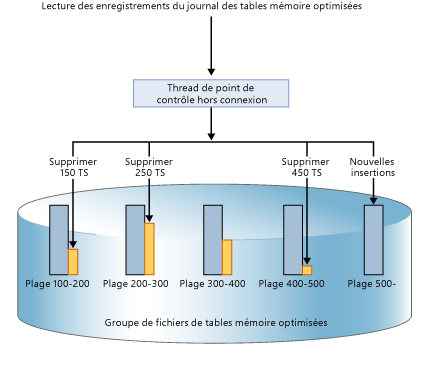
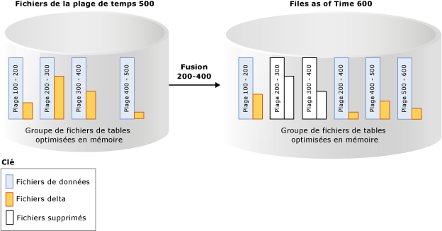

# Durabilité pour les tables optimisées en mémoire
[!INCLUDE[appliesto-ss-xxxx-xxxx-xxx-md](../../includes/appliesto-ss-xxxx-xxxx-xxx-md.md)]

  [!INCLUDE[hek_2](../../includes/hek-2-md.md)] fournit la durabilité complète pour les tables optimisées en mémoire. Lorsqu'une transaction qui a modifié une table optimisée en mémoire est validée, [!INCLUDE[ssNoVersion](../../includes/ssnoversion-md.md)] (comme pour les tables sur disque), garantit que les modifications sont permanentes (perdureront au redémarrage d'une base de données), à condition que le stockage sous-jacent soit disponible. Il existe deux composantes clés de durabilité : l'enregistrement des transactions et la conservation des modifications de données dans un stockage sur disque.  
  
 Pour plus d’informations sur les limitations en taille des tables durables, consultez [Estimer les besoins en mémoire des tables mémoire optimisées](../../relational-databases/in-memory-oltp/estimate-memory-requirements-for-memory-optimized-tables.md). 
  
## Journal des transactions  
 Toutes les modifications apportées aux tables sur disque ou aux tables optimisées en mémoire durables sont capturées dans un ou plusieurs enregistrements de journaux des transactions. Lorsqu'une transaction est validée, [!INCLUDE[ssNoVersion](../../includes/ssnoversion-md.md)] écrit les enregistrements de journal associés à la transaction sur le disque avant d'indiquer à l'application ou à la session utilisateur que la transaction a été validée. Cela garantit que les modifications apportées par la transaction sont durables. Le journal des transactions pour les tables optimisées en mémoire est entièrement intégré au même flux du journal utilisé par les tables sur disque. Cette intégration permet de continuer les opérations de sauvegarde, de récupération et de restauration des journaux des transactions existants sans aucune étape supplémentaire. Toutefois, étant donné que [!INCLUDE[hek_2](../../includes/hek-2-md.md)] peut augmenter le débit des transactions de votre charge de travail de manière significative, les E/S du journal peuvent devenir un goulot d’étranglement. Pour prendre en charge cette augmentation de débit, vérifiez que le sous-système d’E/S du journal peut gérer la charge accrue.  
  
## Fichiers de données et fichiers delta  
 Les données des tables optimisées en mémoire sont stockées en tant que lignes de données de forme libre dans une structure de données de segment de mémoire qui sont liées via un ou plusieurs index en mémoire. Il n'existe aucune structure de page pour les lignes de données, par exemple celles utilisées pour les tables sur disque. Pour la persistance à long terme et pour permettre la troncation du journal de transactions, les opérations sur les tables optimisées en mémoire sont conservées dans un jeu de fichiers de données et delta. Ces fichiers sont générés selon le journal des transactions, à l’aide d’un processus asynchrone en arrière-plan. Les fichiers de données et les fichiers delta se trouvent dans un ou plusieurs conteneurs (utilisant le même mécanisme que celui utilisé pour les données FILESTREAM). Ces conteneurs font partie d’un groupe de fichiers optimisé en mémoire.  
  
 Les données sont écrites dans ces fichiers et générées de façon séquentielle stricte, ce qui réduit la latence sur le disque pour les supports rotatifs. Utilisez plusieurs conteneurs sur différents disques pour distribuer l'activité d'E/S. L’utilisation de fichiers de données et de fichiers delta dans plusieurs conteneurs sur différents disques améliore les performances de restauration et de récupération de base de données, quand les données sont lues en mémoire à partir de ces fichiers.  
  
 Les transactions utilisateur n’accèdent pas directement aux fichiers de données et aux fichiers delta. Toutes les opérations de lecture et d’écriture de données utilisent des structures de données en mémoire.  
  
### Fichier de données  
 Un fichier de données contient des lignes provenant d'une ou de plusieurs tables mémoire optimisées qui ont été insérées par plusieurs transactions dans le cadre d'opérations INSERT ou UPDATE. Par exemple, une ligne peut provenir de la table mémoire optimisée t1 et la ligne suivante de la table mémoire optimisée t2. Les lignes sont ajoutées au fichier de données dans l'ordre des transactions du journal des transactions, ce qui permet un accès séquentiel aux données. Ceci permet un meilleur ordre de grandeur pour le débit des E/S, par rapport à des E/S aléatoires.  
  
 Une fois que le fichier de données est plein, les lignes insérées par les nouvelles transactions sont stockées dans un autre fichier de données. Au fil du temps, les lignes provenant de tables mémoire optimisées durables sont stockées dans un ou plusieurs fichiers de données et chaque fichier de données contient des lignes provenant d'une plage disjointe mais contigüe de transactions. Par exemple, un fichier de données dont l'horodateur de validation de transaction est dans une plage de (100, 200) contient toutes les lignes insérées par les transactions dont l'horodateur de validation est supérieur à 100 et inférieur ou égal à 200. L'horodateur de validation est un nombre à croissance monotone attribué à une transaction lorsqu'elle est prête pour la validation. Chaque transaction a un horodateur de validation unique.  
  
 Lorsqu'une ligne est supprimée ou mise à jour, elle n'est pas supprimée ou modifiée sur place dans le fichier de données, mais les lignes supprimées sont suivies dans un autre type de fichier : le fichier delta. Les opérations de mise à jour sont traitées comme un tuple d'opérations de suppression et d'insertion pour chaque ligne. Cela supprime les E/S aléatoires dans le fichier de données.  
 
   Taille : chaque fichier de données a une taille d’environ 128 Mo pour les ordinateurs avec une capacité de mémoire supérieure à 16 Go, et à 16 Mo pour les ordinateurs avec une capacité de mémoire inférieure ou égale à 16 Go. Dans [!INCLUDE[ssSQL15](../../includes/sssql15-md.md)] , SQL Server peut utiliser le mode de point de contrôle de grande taille s’il juge le sous-système de stockage assez rapide. En mode de point de contrôle de grande taille, les fichiers de données sont dimensionnés à 1 Go. Cela permet une plus grande efficacité du sous-système de stockage pour les charges de travail à débit élevé.  
   
### Fichier delta  
 Chaque fichier de données est couplé à un fichier delta ayant la même plage de transactions et effectue le suivi des lignes supprimées insérées par les transactions dans cette plage. Ces données et ce fichier delta sont appelés « paire de fichiers de point de contrôle » (CFP, Checkpoint File Pair). Il s'agit de l'unité d'allocation et de désallocation, ainsi que de l'unité pour les opérations de fusion. Par exemple, un fichier delta correspondant à la plage de transaction (100, 200) enregistre les lignes supprimées qui avaient été insérées par les transactions de la plage (100, 200). Comme pour les fichiers de données, le fichier delta est accessible de manière séquentielle.  
  
 Lorsqu'une ligne est supprimée, elle n'est pas supprimée du fichier de données mais une référence à la ligne est ajoutée au fichier delta associé à la plage de transaction où la ligne de données a été insérée. Étant donné que la ligne à supprimer existe déjà dans le fichier de données, le fichier delta stocke uniquement les informations de référence sur `{inserting_tx_id, row_id, deleting_tx_id }` et suit l'ordre des opérations de suppression ou de mise à jour d'origine du journal des transactions.  
  

 Taille : chaque fichier delta a une taille d’environ 16 Mo pour les ordinateurs avec une capacité de mémoire supérieure à 16 Go, et à 1 Mo pour les ordinateurs avec une capacité de mémoire inférieure ou égale à 16 Go. À compter de [!INCLUDE[ssSQL15](../../includes/sssql15-md.md)] , SQL Server peut utiliser le mode de point de contrôle volumineux s’il juge le sous-système de stockage est assez rapide. En mode de point de contrôle de grande taille, les fichiers delta sont dimensionnés à 128 Mo.  
 
## Remplissage des fichiers de données et des fichiers delta  
 Les fichiers de données et delta sont remplis en fonction des enregistrements du journal des transactions générés par les transactions validées sur les tables optimisées en mémoire ; des informations concernant les lignes insérées et supprimées sont ajoutées dans les fichiers de données et delta appropriés. Contrairement aux tables sur disque où les pages de données/index sont vidées avec des E/S aléatoires lorsque le point de contrôle est effectué, la persistance de la table optimisée en mémoire est une opération en arrière-plan continue. Plusieurs fichiers delta sont accédés car une transaction peut supprimer ou mettre à jour toute ligne ayant été insérée par une transaction précédente. Les informations de suppression sont toujours ajoutées à la fin du fichier delta. Par exemple, une transaction avec un horodateur de validation de 600 insère une nouvelle ligne et supprime les lignes insérées par les transactions ayant un horodateur de validation de 150, 250 et 450, comme le montre l'illustration ci-après. Les quatre opérations d'E/S de fichier (trois pour les lignes supprimées et une pour les nouvelles lignes insérées) sont des opérations Append-Only sur les fichiers de données et delta correspondants.  
  
   
  
## Accès aux fichiers de données et aux fichiers delta  
 Les paires de fichiers de données et delta sont accessibles dans les cas suivants.  
  
 Processus de point de contrôle hors connexion  
 Ce thread applique les modifications apportées aux lignes de données optimisées en mémoire (insertions et suppressions) dans les paires de fichiers de données et delta correspondantes. Dans [!INCLUDE[ssSQL14](../../includes/sssql14-md.md)] , il y a un seul processus de point de contrôle hors connexion ; à compter de [!INCLUDE[ssSQL15](../../includes/sssql15-md.md)] , il en existe plusieurs.  
  
 Opération de fusion  
 L'opération fusionne une ou plusieurs paires de fichiers de données et delta afin de créer une nouvelle paire de fichiers de données et delta.  
  
 Pendant une récupération sur incident  
 Lorsque [!INCLUDE[ssNoVersion](../../includes/ssnoversion-md.md)] redémarre ou que la base de données est remise en ligne, les données mémoire optimisées sont remplies en utilisant les paires de fichiers de données et delta. Le fichier delta filtre les lignes supprimées lors de la lecture des lignes à partir du fichier de données correspondant. Dans la mesure où chaque paire de fichier de données et de fichier delta est indépendante, ces fichiers sont chargés en parallèle pour réduire le temps de chargement en mémoire des données. Une fois que les données ont été chargées en mémoire, le moteur OLTP en mémoire applique les enregistrements du journal des transactions non encore couverts par les fichiers de point de contrôle afin que les données optimisées en mémoire soient complètes.  
  
 Pendant une opération de restauration  
 Les fichiers de point de contrôle de l'OLTP en mémoire sont créés à partir de la sauvegarde de base de données, puis une ou plusieurs sauvegardes de journal de transactions sont appliquées. Comme pour la récupération sur incident, le moteur OLTP en mémoire charge les données en mémoire en parallèle pour minimiser l'impact sur le temps de récupération.  
  
## Fusion de fichiers de données et de fichiers delta  
 Les données des tables mémoire optimisées sont stockées dans une ou plusieurs paires de fichiers de données et delta (également appelées une paire de fichiers de point de contrôle, ou CFP). Les fichiers de données stockent les lignes insérées et les fichiers delta référencent les lignes supprimées. Pendant l'exécution d'une charge de travail OLTP, lorsque les opérations DML mettent à jour, insèrent et suppriment des lignes, de nouvelles paires de fichiers de point de contrôle sont créées pour rendre les nouvelles lignes persistantes, et la référence aux lignes supprimées est ajoutée aux fichiers delta.  
  
 Au fil du temps, avec les opérations DML, le nombre de fichiers de données et delta augmente, ce qui accroît l’utilisation de l’espace disque et le temps de récupération.  
  
 Pour éviter ces inefficacités, les fichiers de données et delta fermés plus anciens sont fusionnés, en fonction d’une stratégie de fusion décrite ci-dessous, de sorte que le tableau de stockage est condensé pour représenter le même jeu de données, avec un nombre réduit de fichiers.  
  
 L’opération de fusion prend comme entrée une ou plusieurs paires de fichiers de point de contrôle fermées adjacentes qui sont des paires de fichiers de données et delta, appelées source de fusion, à partir d’une stratégie de fusion définie en interne, et produit une paire de fichiers de point de contrôle, appelée cible de fusion. Les entrées dans chaque fichier delta des paires de fichiers de point de contrôle sources sont utilisées pour filtrer les lignes à partir du fichier de données correspondant pour supprimer des lignes de données qui ne sont pas nécessaires. Les lignes restantes dans les paires de fichiers de point de contrôle sources sont consolidées dans une paire de fichiers de point de contrôle cible. Après la fusion, la paire de fichiers de point de contrôle résultante (cible de fusion) remplace les paires de fichiers de point de contrôle sources (sources de fusion). Les paires de fichiers de point de contrôle sources de fusion passent par une phase de transition avant d'être supprimées du stockage.  
  
 Dans l'exemple ci-dessous, le groupe de fichiers de la table mémoire optimisée contient quatre paires de fichiers de données et delta ayant l'horodateur 500 et contenant des données issues de transactions précédentes. Par exemple, les lignes du premier fichier de données correspondent aux transactions avec un horodateur supérieur à 100 et inférieur ou égal à 200 ; alternativement représenté comme (100, 200]. Le deuxième et le troisième fichiers de données affichent un taux de remplissage inférieur à 50 % après prise en compte des lignes marquées comme supprimées. L'opération de fusion associe ces deux paires de fichiers de point de contrôle et crée une paire de fichiers de point de contrôle contenant des transactions avec un horodateur supérieur à 200 et inférieur ou égal à 400, qui est la plage combinée de ces deux paires de fichiers de point de contrôle. Vous voyez une autre paire de fichiers de point de contrôle avec une plage (500, 600] et un fichier delta non vide pour la plage de transactions (200, 400] indique que l'opération de fusion peut être effectuée en même temps que l'activité transactionnelle comprenant la suppression de plus de lignes des paires de fichiers de point de contrôle source.  
  
   
  
 Un thread d'arrière-plan évalue toutes les paires de fichiers de point de contrôle fermées à l'aide d'une stratégie de fusion, puis initie une ou plusieurs demandes de fusion pour les paires de fichiers de point de contrôle qualifiées. Ces demandes de fusion sont traitées par le thread de point de contrôle hors connexion. L'évaluation de la stratégie de fusion est effectuée périodiquement et lorsqu'un point de contrôle est fermé.  
  
### [!INCLUDE[ssNoVersion](../../includes/ssnoversion-md.md)] Stratégie de fusion  
 [!INCLUDE[ssNoVersion](../../includes/ssnoversion-md.md)] implémente la stratégie de fusion suivante :  
  
-   Une fusion est planifiée si au moins 2 paires de fichiers de point de contrôle consécutives peuvent être consolidées, après avoir tenu compte des lignes supprimées, de sorte que les lignes résultantes peuvent tenir dans une paire de fichiers de point de contrôle de taille cible. La taille cible des fichiers de données et delta correspond à la taille d’origine, comme décrit ci-dessus.  
  
-   Une seule paire de fichiers de point de contrôle peut être fusionnée automatiquement si le fichier de données dépasse le double de la taille cible et que plus de la moitié des lignes sont supprimées. Un fichier de données peut dépasser la taille cible si, par exemple, une seule transaction ou plusieurs transactions simultanées insèrent ou mettent à jour un grand nombre de données, forçant le fichier de données à dépasser sa taille cible, car une transaction ne peut pas couvrir plusieurs paires de fichiers de point de contrôle.  
  
 Voici des exemples qui montrent les paires de fichiers de point de contrôle qui seront fusionnées dans le cadre de la stratégie de fusion :  
  
|Paires de fichiers sources de point de contrôle adjacentes (% de remplissage)|Sélection pour la fusion|  
|-------------------------------------------|---------------------|  
|CFP0 (30%), CFP1 (50%), CFP2 (50%), CFP3 (90%)|(CFP0, CFP1)   CFP2 n'est pas choisi car le fichier de données résultant sera supérieur à 100 % de la taille idéale.|  
|CFP0 (30%), CFP1 (20%), CFP2 (50%), CFP3 (10%)|(CFP0, CFP1, CFP2). Les fichiers sont sélectionnés à partir de la gauche.   CTP3 n'est pas choisi car le fichier de données résultant sera supérieur à 100 % de la taille idéale.|  
|CFP0 (80%), CFP1 (30%), CFP2 (10%), CFP3 (40%)|(CFP1, CFP2, CFP3). Les fichiers sont sélectionnés à partir de la gauche.   CFP0 est ignoré car si associé à CFP1, le fichier de données résultant sera supérieur à 100 % de la taille idéale.|  
  
 Toutes les paires de fichiers de point de contrôle avec de l'espace disponible ne sont pas qualifiées pour la fusion. Par exemple, si deux paires de fichiers de point de contrôle adjacentes sont complètes à 60 %, elles ne seront pas qualifiées pour la fusion et chacune des paires aura 40 % de stockage inutilisé. Dans le pire des cas, toutes les paires de fichiers de point de contrôle seront complètes à 50%, soit une utilisation du stockage de seulement 50 %. Alors que des lignes supprimées peuvent exister dans le stockage car les paires de fichiers de contrôle ne sont pas qualifiées pour la fusion, les lignes supprimées peuvent déjà avoir été supprimées de la mémoire par le garbage collection en mémoire. La gestion du stockage et de la mémoire est indépendante du garbage collection. Le stockage pris par des paires de fichiers de point de contrôle actives (certaines paires de fichiers de point de contrôle n'ont pas été mises à jour) peut être jusqu'à 2 fois supérieur à la taille des tables durables en mémoire.  
  
### Cycle de vie d'une paire de fichiers de point de contrôle  
 Les fichiers CFP traversent plusieurs états avant de pouvoir être libérés. Les points de contrôle de base de données et les sauvegardes du journal sont indispensables au passage des fichiers par les différentes phases et au nettoyage final des fichiers superflus. Pour obtenir une description de ces phases, consultez [sys.dm_db_xtp_checkpoint_files &#40;Transact-SQL&#41;](../../relational-databases/system-dynamic-management-views/sys-dm-db-xtp-checkpoint-files-transact-sql.md).  
  
 Vous pouvez forcer manuellement le point de contrôle suivi de la sauvegarde du journal pour accélérer le garbage collection. Dans les scénarios de production, les points de contrôle automatiques et les sauvegardes de fichier journal effectuées dans le cadre de la stratégie de sauvegarde basculent sans problème les paires de fichiers de point de contrôle vers ces phases sans aucune intervention manuelle. L'impact du processus de garbage collection est le suivant : les bases de données avec des tables mémoire optimisées peuvent avoir une plus grande taille de stockage comparée à leur taille en mémoire. Sans le point de contrôle et les sauvegardes de journaux, l’encombrement sur le disque des fichiers de point de contrôle continue de croître.  
  
##  Voir aussi  
 [Création et gestion du stockage des objets mémoire optimisés](../../relational-databases/in-memory-oltp/creating-and-managing-storage-for-memory-optimized-objects.md)  
  
  
