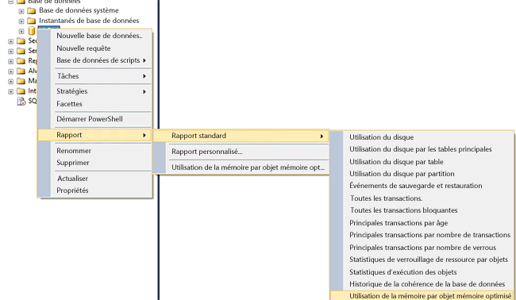
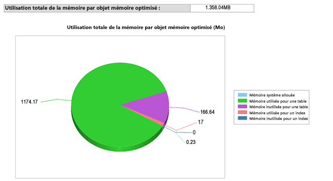

# <a name="monitor-and-troubleshoot-memory-usage"></a>Surveiller l'utilisation de la mémoire et résoudre les problèmes connexes
[!INCLUDE[appliesto-ss-asdb-xxxx-xxx-md](../../includes/appliesto-ss-asdb-xxxx-xxx-md.md)]
  [!INCLUDE[hek_1](../../includes/hek-1-md.md)] utilise la mémoire selon des modèles différents pour les tables sur disque. Analysez la quantité de mémoire allouée et utilisée par les tables et les index optimisés en mémoire dans votre base de données à l'aide des DMV ou des compteurs de performance fournis pour la mémoire et le sous-système de garbage collection.  Vous aurez ainsi la visibilité au niveau du système et de la base de données, et vous pourrez prévenir les problèmes liés à l'insuffisance de mémoire.  
  
 Cette rubrique traite de la surveillance de votre utilisation de la mémoire [!INCLUDE[hek_2](../../includes/hek-2-md.md)] .  
  
## <a name="sections-in-this-topic"></a>Sections de cette rubrique  
  
-   [Créez une base de données d'exemple avec des tables optimisées en mémoire.](../../relational-databases/in-memory-oltp/monitor-and-troubleshoot-memory-usage.md#bkmk_CreateDB)  
  
-   [Surveillance de l'utilisation de la mémoire](../../relational-databases/in-memory-oltp/monitor-and-troubleshoot-memory-usage.md#bkmk_Monitoring)  
  
    -   [Utilisation de SQL Server Management Studio](../../relational-databases/in-memory-oltp/monitor-and-troubleshoot-memory-usage.md#bkmk_UsingSSMS)  
  
    -   [Utilisation d'DMVs](../../relational-databases/in-memory-oltp/monitor-and-troubleshoot-memory-usage.md#bkmk_UsingDMVs)  
  
-   [Gérer la mémoire consommée par les objets optimisés en mémoire](../../relational-databases/in-memory-oltp/monitor-and-troubleshoot-memory-usage.md#bkmk_MemOptObjects)  
  
-   [Dépannage des problèmes de mémoire](../../relational-databases/in-memory-oltp/monitor-and-troubleshoot-memory-usage.md#bkmk_Troubleshooting)  
  
##  <a name="bkmk_CreateDB"></a> Créez une base de données d'exemple avec des tables optimisées en mémoire.  
 Ignorez cette section si vous avez déjà une base de données avec des tables optimisées en mémoire.  
  
 Dans les étapes suivantes, vous allez créer une base de données avec trois tables optimisées en mémoire que vous utiliserez pour la suite de la rubrique. Dans l'exemple, nous avons mappé la base de données à un pool de ressources de sorte à pouvoir contrôler la quantité de mémoire consommée par les tables optimisées en mémoire.  
  
1.  Lancez [!INCLUDE[ssManStudioFull](../../includes/ssmanstudiofull-md.md)].  
  
2.  Cliquez sur **Nouvelle requête**.  
  
3.  Collez ce code dans la nouvelle fenêtre de requête et exécutez chaque section.  
  
    ```  
    -- create a database to be used  
    CREATE DATABASE IMOLTP_DB  
    GO  
  
    ALTER DATABASE IMOLTP_DB ADD FILEGROUP IMOLTP_DB_xtp_fg CONTAINS MEMORY_OPTIMIZED_DATA  
    ALTER DATABASE IMOLTP_DB ADD FILE( NAME = 'IMOLTP_DB_xtp' , FILENAME = 'C:\Data\IMOLTP_DB_xtp') TO FILEGROUP IMOLTP_DB_xtp_fg;  
    GO  
  
    USE IMOLTP_DB  
    GO  
  
    -- create the resoure pool  
    CREATE RESOURCE POOL PoolIMOLTP WITH (MAX_MEMORY_PERCENT = 60);  
    ALTER RESOURCE GOVERNOR RECONFIGURE;  
    GO  
  
    -- bind the database to a resource pool  
    EXEC sp_xtp_bind_db_resource_pool 'IMOLTP_DB', 'PoolIMOLTP'  
  
    -- you can query the binding using the catalog view as described here  
    SELECT d.database_id  
         , d.name  
         , d.resource_pool_id  
    FROM sys.databases d  
    GO  
  
    -- take database offline/online to finalize the binding to the resource pool  
    USE master  
    GO  
  
    ALTER DATABASE IMOLTP_DB SET OFFLINE  
    GO  
    ALTER DATABASE IMOLTP_DB SET ONLINE  
    GO  
  
    -- create some tables  
    USE IMOLTP_DB  
    GO  
  
    -- create table t1  
    CREATE TABLE dbo.t1 (  
           c1 int NOT NULL CONSTRAINT [pk_t1_c1] PRIMARY KEY NONCLUSTERED  
         , c2 char(40) NOT NULL  
         , c3 char(8000) NOT NULL  
         ) WITH (MEMORY_OPTIMIZED = ON, DURABILITY = SCHEMA_AND_DATA)  
    GO  
  
    -- load t1 150K rows  
    DECLARE @i int = 0  
    BEGIN TRAN  
    WHILE (@i <= 150000)  
       BEGIN  
          INSERT t1 VALUES (@i, 'a', replicate ('b', 8000))  
          SET @i += 1;  
       END  
    Commit  
    GO  
  
    -- Create another table, t2  
    CREATE TABLE dbo.t2 (  
           c1 int NOT NULL CONSTRAINT [pk_t2_c1] PRIMARY KEY NONCLUSTERED  
         , c2 char(40) NOT NULL  
         , c3 char(8000) NOT NULL  
         ) WITH (MEMORY_OPTIMIZED = ON, DURABILITY = SCHEMA_AND_DATA)  
    GO  
  
    -- Create another table, t3   
    CREATE TABLE dbo.t3 (  
           c1 int NOT NULL CONSTRAINT [pk_t3_c1] PRIMARY KEY NONCLUSTERED HASH (c1) WITH (BUCKET_COUNT = 1000000)  
         , c2 char(40) NOT NULL  
         , c3 char(8000) NOT NULL  
         ) WITH (MEMORY_OPTIMIZED = ON, DURABILITY = SCHEMA_AND_DATA)  
    GO  
    ```  
  
##  <a name="bkmk_Monitoring"></a> Surveillance de l'utilisation de la mémoire  
  
###  <a name="bkmk_UsingSSMS"></a> Utilisant [!INCLUDE[ssManStudioFull](../../includes/ssmanstudiofull-md.md)]  
 [!INCLUDE[ssSQL14](../../includes/sssql14-md.md)] inclut des rapports standard intégrés pour surveiller la mémoire consommée par les tables en mémoire. Accédez à ces rapports à l'aide de l'Explorateur d'objets comme décrit [ici](http://blogs.msdn.com/b/managingsql/archive/2006/05/16/ssms-reports-1.aspx). Vous pouvez également utiliser l'Explorateur d'objets pour surveiller la mémoire consommée par les tables optimisées en mémoire individuelles.  
  
#### <a name="consumption-at-the-database-level"></a>Consommation au niveau de la base de données  
 Surveillez l'utilisation de la mémoire au niveau de la base de données comme suit.  
  
1.  Lancez [!INCLUDE[ssManStudioFull](../../includes/ssmanstudiofull-md.md)] et connectez-vous à un serveur.  
  
2.  Dans l'Explorateur d'objets, cliquez avec le bouton droit sur la base de données que vous souhaitez surveiller.  
  
3.  Dans le menu contextuel, sélectionnez **Rapports** -> **Standard Rapports** -> **Utilisation de la mémoire par les objets optimisés en mémoires**.  
  
   
  
 Ce rapport affiche la consommation de la mémoire par la base de données créée précédemment.  
  
   
  
###  <a name="bkmk_UsingDMVs"></a> Utilisation d'DMVs  
 Il existe un certain nombre de DMV disponibles pour surveiller la mémoire consommée par les tables, index, objets système optimisés en mémoire et par les structures d'exécution.  
  
#### <a name="memory-consumption-by-memory-optimized-tables-and-indexes"></a>Consommation de mémoire par les tables et les index optimisés en mémoire  
 Déterminez la quantité de mémoire pour toutes les tables utilisateur, index et objets système en interrogeant `sys.dm_db_xtp_table_memory_stats` comme indiqué ici.  
  
```sql  
SELECT object_name(object_id) AS Name  
     , *  
   FROM sys.dm_db_xtp_table_memory_stats  
```  
  
 **Résultat de l'exemple**  
  
```  
Name       object_id   memory_allocated_for_table_kb memory_used_by_table_kb memory_allocated_for_indexes_kb memory_used_by_indexes_kb  
---------- ----------- ----------------------------- ----------------------- ------------------------------- -------------------------  
t3         629577281   0                             0                       128                             0  
t1         565577053   1372928                       1200008                 7872                            1942  
t2         597577167   0                             0                       128                             0  
NULL       -6          0                             0                       2                               2  
NULL       -5          0                             0                       24                              24  
NULL       -4          0                             0                       2                               2  
NULL       -3          0                             0                       2                               2  
NULL       -2          192                           25                      16                              16  
```  
  
 Pour plus d’informations, consultez [sys.dm_db_xtp_table_memory_stats](../../relational-databases/system-dynamic-management-views/sys-dm-db-xtp-table-memory-stats-transact-sql.md).  
  
#### <a name="memory-consumption-by-internal-system-structures"></a>Consommation de mémoire par les structures internes du système  
 La mémoire est également consommée par les objets système, notamment, les structures transactionnelles, les tampons pour les fichiers de données et delta, les structures de garbage collection, etc. Déterminez la mémoire utilisée pour ces objets système en interrogeant `sys.dm_xtp_system_memory_consumers` comme indiqué ici.  
  
```sql  
SELECT memory_consumer_desc  
     , allocated_bytes/1024 AS allocated_bytes_kb  
     , used_bytes/1024 AS used_bytes_kb  
     , allocation_count  
   FROM sys.dm_xtp_system_memory_consumers  
```  
  
 **Résultat de l'exemple**  
  
```  
memory_consumer_ desc allocated_bytes_kb   used_bytes_kb        allocation_count  
------------------------- -------------------- -------------------- ----------------  
VARHEAP                   0                    0                    0  
VARHEAP                   384                  0                    0  
DBG_GC_OUTSTANDING_T      64                   64                   910  
ACTIVE_TX_MAP_LOOKAS      0                    0                    0  
RECOVERY_TABLE_CACHE      0                    0                    0  
RECENTLY_USED_ROWS_L      192                  192                  261  
RANGE_CURSOR_LOOKSID      0                    0                    0  
HASH_CURSOR_LOOKASID      128                  128                  455  
SAVEPOINT_LOOKASIDE       0                    0                    0  
PARTIAL_INSERT_SET_L      192                  192                  351  
CONSTRAINT_SET_LOOKA      192                  192                  646  
SAVEPOINT_SET_LOOKAS      0                    0                    0  
WRITE_SET_LOOKASIDE       192                  192                  183  
SCAN_SET_LOOKASIDE        64                   64                   31  
READ_SET_LOOKASIDE        0                    0                    0  
TRANSACTION_LOOKASID      448                  448                  156  
PGPOOL:256K               768                  768                  3  
PGPOOL: 64K               0                    0                    0  
PGPOOL:  4K               0                    0                    0  
```  
  
 Pour plus d’informations, consultez [sys.dm_xtp_system_memory_consumers &#40;Transact-SQL&#41;](../../relational-databases/system-dynamic-management-views/sys-dm-xtp-system-memory-consumers-transact-sql.md).  
  
#### <a name="memory-consumption-at-run-time-when-accessing-memory-optimized-tables"></a>Consommation de mémoire à l'exécution lors de l'accès aux tables optimisées en mémoire  
 Déterminez la mémoire consommée par les structures au moment de l'exécution, notamment le cache de procédures, avec la requête suivante. Exécutez cette requête pour obtenir la mémoire utilisée par les structures d'exécution comme le cache de procédures. Toutes les structures d'exécution ont des balises XTP.  
  
```sql  
SELECT memory_object_address  
     , pages_in_bytes  
     , bytes_used  
     , type  
   FROM sys.dm_os_memory_objects WHERE type LIKE '%xtp%'  
```  
  
 **Résultat de l'exemple**  
  
```  
memory_object_address pages_ in_bytes bytes_used type  
--------------------- ------------------- ---------- ----  
0x00000001F1EA8040    507904              NULL       MEMOBJ_XTPDB  
0x00000001F1EAA040    68337664            NULL       MEMOBJ_XTPDB  
0x00000001FD67A040    16384               NULL       MEMOBJ_XTPPROCCACHE  
0x00000001FD68C040    16384               NULL       MEMOBJ_XTPPROCPARTITIONEDHEAP  
0x00000001FD284040    16384               NULL       MEMOBJ_XTPPROCPARTITIONEDHEAP  
0x00000001FD302040    16384               NULL       MEMOBJ_XTPPROCPARTITIONEDHEAP  
0x00000001FD382040    16384               NULL       MEMOBJ_XTPPROCPARTITIONEDHEAP  
0x00000001FD402040    16384               NULL       MEMOBJ_XTPPROCPARTITIONEDHEAP  
0x00000001FD482040    16384               NULL       MEMOBJ_XTPPROCPARTITIONEDHEAP  
0x00000001FD502040    16384               NULL       MEMOBJ_XTPPROCPARTITIONEDHEAP  
0x00000001FD67E040    16384               NULL       MEMOBJ_XTPPROCPARTITIONEDHEAP  
0x00000001F813C040    8192                NULL       MEMOBJ_XTPBLOCKALLOC  
0x00000001F813E040    16842752            NULL       MEMOBJ_XTPBLOCKALLOC  
```  
  
 Pour plus d’informations, consultez [sys.dm_os_memory_objects (Transact-SQL)](../../relational-databases/system-dynamic-management-views/sys-dm-os-memory-objects-transact-sql.md).  
  
#### <a name="memory-consumed-by-includehek2includeshek-2-mdmd-engine-across-the-instance"></a>Mémoire consommée par le moteur [!INCLUDE[hek_2](../../includes/hek-2-md.md)] sur l'instance  
 La mémoire allouée au moteur [!INCLUDE[hek_2](../../includes/hek-2-md.md)] et aux objets optimisés en mémoire est gérée de la même façon que pour tout autre consommateur de mémoire dans l'instance [!INCLUDE[ssNoVersion](../../includes/ssnoversion-md.md)] . Les régisseurs de mémoire de type MEMORYCLERK_XTP tiennent compte de toute la mémoire allouée au moteur [!INCLUDE[hek_2](../../includes/hek-2-md.md)] . Utilisez la requête suivante pour rechercher toute la mémoire utilisée par le moteur [!INCLUDE[hek_2](../../includes/hek-2-md.md)] .  
  
```sql  
-- this DMV accounts for all memory used by the hek_2 engine  
SELECT type  
     , name  
     , memory_node_id  
     , pages_kb/1024 AS pages_MB   
   FROM sys.dm_os_memory_clerks WHERE type LIKE '%xtp%'  
```  
  
 L'exemple de résultat indique que la mémoire allouée totale pour la consommation de mémoire au niveau du système est de 18 Mo, et 1358 Mo sont alloués à l'ID de base de données 5. Puisque cette base de données est mappée à un pool de ressources dédié, cette mémoire est comptabilisée dans ce pool de ressources.  
  
 **Résultat de l'exemple**  
  
```  
type                 name       memory_node_id pages_MB  
-------------------- ---------- -------------- --------------------  
MEMORYCLERK_XTP      Default    0              18  
MEMORYCLERK_XTP      DB_ID_5    0              1358  
MEMORYCLERK_XTP      Default    64             0  
```  
  
 Pour plus d’informations, consultez [sys.dm_os_memory_clerks (Transact-SQL)](../../relational-databases/system-dynamic-management-views/sys-dm-os-memory-clerks-transact-sql.md).  
  
##  <a name="bkmk_MemOptObjects"></a> Gérer la mémoire consommée par les objets optimisés en mémoire  
 Vous pouvez contrôler la mémoire totale consommée par les tables optimisées en mémoire en la liant à un pool de ressources nommé comme décrit dans la rubrique [Lier une base de données avec des tables optimisées en mémoire à un pool de ressources](../../relational-databases/in-memory-oltp/bind-a-database-with-memory-optimized-tables-to-a-resource-pool.md).  
  
##  <a name="bkmk_Troubleshooting"></a> Dépannage des problèmes de mémoire  
 La résolution des problèmes de mémoire comporte trois étapes :  
  
1.  Identifiez la quantité de mémoire consommée par les objets dans votre base de données ou dans votre instance. Utilisez les nombreux outils d'analyse disponibles pour les tables optimisées en mémoire décrits précédemment.  Par exemple, les DVM `sys.dm_db_xtp_table_memory_stats` ou `sys.dm_os_memory_clerks`.  
  
2.  Déterminez la façon dont la consommation de mémoire augmente et de quelle marge vous disposez. En surveillant régulièrement la consommation de mémoire, vous saurez de quelle façon l'utilisation de la mémoire augmente. Par exemple, si vous avez mappé la base de données à un pool de ressources nommé, surveillez le compteur de performance Used Memory (KB) pour voir comme l'utilisation de la mémoire augmente.  
  
3.  Agissez pour atténuer les éventuels problèmes de mémoire. Pour plus d’informations, consultez [Résoudre les problèmes de mémoire insuffisante](../../relational-databases/in-memory-oltp/resolve-out-of-memory-issues.md).  
  
## <a name="see-also"></a> Voir aussi  
 [Lier une base de données avec des tables optimisées en mémoire à un pool de ressources](../../relational-databases/in-memory-oltp/bind-a-database-with-memory-optimized-tables-to-a-resource-pool.md)   
 [Modifier MIN_MEMORY_PERCENT et MAX_MEMORY_PERCENT sur un pool existant](../../relational-databases/in-memory-oltp/bind-a-database-with-memory-optimized-tables-to-a-resource-pool.md#bkmk_ChangeAllocation)  
  
  
