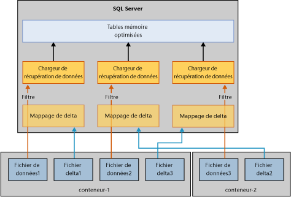

# Restauration et récupération de tables à mémoire optimisée
[!INCLUDE[appliesto-ss-xxxx-xxxx-xxx-md](../../includes/appliesto-ss-xxxx-xxxx-xxx-md.md)]

Le mécanisme de base pour récupérer ou restaurer une base de données qui utilise des tables à mémoire optimisée est similaire au mécanisme pour une base de données qui utilise uniquement des tables sur disque. Mais à la différence des tables sur disque, les tables à mémoire optimisée doivent être chargées dans la mémoire avant que la base de données ne soit disponible pour l’accès utilisateur. Cette condition ajoute une nouvelle étape à la récupération de la base de données.  
  
Si le serveur n’a pas suffisamment de mémoire disponible, la récupération de la base de données échoue et la base de données est marquée comme suspecte. Pour résoudre ce problème, consultez [Résoudre les problèmes de mémoire insuffisante](resolve-out-of-memory-issues.md). 
  
## Facteurs qui affectent le temps de chargement
Lors des opérations de récupération et de restauration, le moteur de l'OLTP en mémoire lit les fichiers delta et de données pour charger les données dans la mémoire physique. Le temps de chargement est déterminé par les facteurs suivants :  
  
-   Quantité de données à charger.  
  
-   Bande passante d'E/S séquentielle.  
  
-   Degré de parallélisme, déterminé par le nombre de conteneurs de fichiers et de cœurs de processeur.  
  
-   Nombre d’enregistrements de journal dans la partie active du journal devant être restaurés par progression.  

## Phases de restauration
Lorsque [!INCLUDE[ssNoVersion](../../includes/ssnoversion-md.md)] redémarre, chaque base de données passe par un processus de récupération qui comprend trois phases :  
  
1.  **Analyse**. Dans cette phase, un test est effectué sur les journaux des transactions actifs pour détecter les transactions validées et enregistrées. Le moteur OLTP en mémoire identifie le point de contrôle à charger et précharge ses entrées de journal de table système. Il traite également certains enregistrements du journal d’allocation de fichier.  
  
2.  **Restauration par progression**. Cette étape est exécutée simultanément sur les tables sur disque et sur les tables mémoire optimisées.  
  
    - Pour les tables sur disque, la base de données est déplacée à la date et heure actuelles et obtient les verrous pris par les transactions non validées.  
  
    - Pour les tables à mémoire optimisée, les données de paires de fichiers de données et delta sont chargées en mémoire. Les données sont ensuite mises à jour avec le journal des transactions actif en fonction du dernier point de contrôle durable.  
  
    Lorsque les précédentes opérations sur les tables sur disque et sur les tables à mémoire optimisée sont terminées, la base de données est accessible.  
  
3.  **Annulation**. Au cours de cette phase, les transactions non validées sont restaurées.  
  
## Processus pour améliorer les temps de chargement
Le chargement des tables mémoire optimisées dans la mémoire peut affecter les performances de l'objectif de temps de récupération (RTO). Pour améliorer le temps de chargement des données mémoire optimisées à partir des fichiers de données et des fichiers delta, le moteur de l'OLTP en mémoire charge les fichiers de données/delta en parallèle, comme suit :  
  
-   **Création d’un filtre de mappage de delta**. Le magasin de fichiers delta référence les lignes supprimées. Un thread par conteneur lit les fichiers delta et crée un filtre de mappage de delta. (Un groupe de fichiers de données à mémoire optimisée peut avoir un ou plusieurs conteneurs.)  
  
-   **Flux des fichiers de données**. Une fois le filtre de mappage de delta créé, les fichiers de données sont lus en utilisant autant de thread qu’il existe d’UC logiques. Chaque thread lit les lignes de données, vérifie le mappage de delta associé et insère une ligne dans la table seulement si cette ligne n’a pas été marquée comme supprimée. Cette partie de la récupération peut être liée à l’UC dans certains cas, comme indiqué dans ce schéma :  
  
      
  
## Cas spécifiques de temps de chargement lent
Les tables à mémoire optimisée peuvent généralement être chargées dans la mémoire à la vitesse des E/S, mais le chargement des lignes de données dans la mémoire est parfois plus lent. Les cas spécifiques sont les suivants :  
  
-   Un nombre de compartiments faible dans un index de hachage peut entraîner une collision excessive qui ralentit les insertions des lignes de données. Le processeur est généralement très sollicité tout le long, en particulier à la fin de la récupération. Si vous avez configuré l’index de hachage correctement, il ne devrait pas affecter le temps de récupération.  
  
-   Les grandes tables à mémoire optimisée avec un ou plusieurs index non-cluster peuvent entraîner une utilisation élevée du processeur. Contrairement à un index de hachage dont le nombre de compartiments est défini lors de la création, les index non-cluster grossissent de manière dynamique.  
  
## Voir aussi  
 [Sauvegarder, restaurer et récupérer des tables optimisées en mémoire](http://msdn.microsoft.com/library/3f083347-0fbb-4b19-a6fb-1818d545e281)  
  
  
