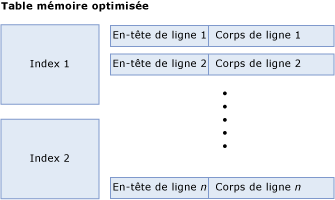
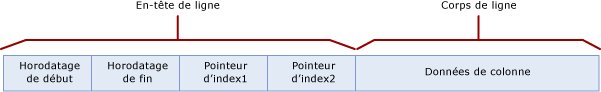
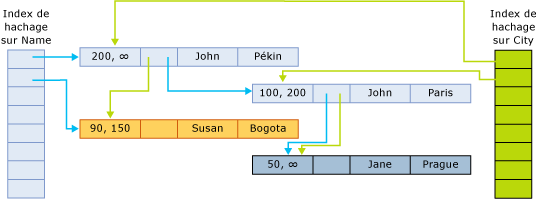

# <a name="table-and-row-size-in-memory-optimized-tables"></a>Taille de la table et des lignes dans les tables optimisées en mémoire
[!INCLUDE[appliesto-ss-asdb-xxxx-xxx-md](../../includes/appliesto-ss-asdb-xxxx-xxx-md.md)]

  Avant [!INCLUDE[ssSQL15](../../includes/sssql15-md.md)], la taille des données dans la ligne d’une table à mémoire optimisée ne pouvait pas être supérieure à [8 060 octets](https://msdn.microsoft.com/library/dn205318(v=sql.120).aspx). Toutefois, à compter de [!INCLUDE[ssSQL15](../../includes/sssql15-md.md)] et dans Azure SQL Database, il est désormais possible de créer une table à mémoire optimisée avec plusieurs colonnes volumineuses (par exemple, plusieurs colonnes varbinary(8000)) et colonnes LOB (c'est-à-dire, varbinary(max), varchar(max) et nvarchar(max)) et d’effectuer des opérations dessus à l’aide de modules T-SQL compilés en mode natif et des types de table. 
  
  Les colonnes qui ne cadrent pas avec la limite de taille de ligne de 8 060 octets sont déplacées des lignes vers une table interne. À chaque colonne hors ligne correspond une table interne correspondante, qui à son tour possède un index unique non cluster. Pour plus d’informations sur ces tables internes utilisées pour des colonnes hors ligne, consultez [sys.memory_optimized_tables_internal_attributes &#40;Transact-SQL&#41;](../../relational-databases/system-catalog-views/sys-memory-optimized-tables-internal-attributes-transact-sql.md). 
 
  Dans certains scénarios, il est utile de calculer la taille de la ligne et de la table :
  
-   Connaître la quantité de mémoire utilisée par une table  
  
    -   La quantité de mémoire utilisée par la table ne peut pas être calculée exactement. De nombreux facteurs affectent la quantité de mémoire utilisée. Notamment, l'allocation de mémoire, la localité, la mise en cache, et le remplissage basés sur la page. Ainsi que, plusieurs versions de ligne associées à des transactions actives ou qui attendent le garbage collection.  
  
    -   La taille minimale nécessaire pour les données et les index de la table est fournie par le calcul [taille de la table], présenté ci-dessous.  
  
    -   Le calcul de l'utilisation de la mémoire est une approximation et nous vous recommandons d'inclure la planification des capacités dans vos plans de déploiement.  
  
-   Connaître la taille des données d'une ligne, et si elle dépasse la limite de taille de ligne de 8 060 octets. Pour répondre à ces questions, utilisez le calcul de [taille du corps de ligne], présenté ci-dessous.  

  Une table mémoire optimisée se compose d'une collection de lignes et d'index qui contiennent des pointeurs vers les lignes. La figure ci-dessous illustre une table avec des index et des lignes, qui ont à leur tour des en-têtes de ligne et des corps :  
  
   
Table mémoire optimisée, comportant des index et des lignes.  

##  <a name="bkmk_TableSize"></a> Calcul de la taille de la table
 La taille en mémoire d'une table, en octets, est calculée comme suit :  
  
```  
[table size] = [size of index 1] + … + [size of index n] + ([row size] * [row count])  
```  
  
 La taille d'un index de hachage est définie au moment de la création de la table et dépend du nombre réel de compartiments. Le bucket_count indiqué avec la spécification de l'index est arrondi à la puissance de 2 la plus proche pour obtenir le [nombre de compartiments réel]. Par exemple, si le bucket_count spécifié est 100 000, le [nombre de compartiments réel] pour l'index est 131 072.  
  
```  
[hash index size] = 8 * [actual bucket count]  
```  

 La taille d’un index non cluster est de l’ordre de `[row count] * [index key size]`.
  
 La taille de ligne est calculée en ajoutant l'en-tête et le corps :  
  
```  
[row size] = [row header size] + [actual row body size]  
[row header size] = 24 + 8 * [number of indices]  
```  
##  <a name="bkmk_RowBodySize"></a> Calcul de la taille du corps de la ligne

**Structure de ligne**
    
 Les lignes de la table mémoire optimisée ont les composants suivants :  
  
-   L'en-tête de ligne contient l'horodateur nécessaire pour implémenter une gestion des versions de ligne. L'en-tête de la ligne contient également le pointeur d'index pour implémenter le chaînage de ligne dans les compartiments de hachage (comme ci-dessus).  
  
-   Le corps de la ligne contient les données de la colonne active, comprenant des informations auxiliaires comme le tableau « null » pour les colonnes autorisant des valeurs NULL, et le tableau « offset » pour les types de données de longueur variable.  
  
 La figure suivante illustre la structure des lignes pour une table qui comporte deux index :  
  
   
  
 Les horodateurs de début et de fin indiquent la période pendant laquelle une version de ligne spécifique est valide. Les transactions commençant dans cet intervalle peuvent consulter cette version de ligne. Pour plus d’informations, consultez [Transactions avec des tables à mémoire optimisée](../../relational-databases/in-memory-oltp/transactions-with-memory-optimized-tables.md).  
  
 Les pointeurs d'index pointent sur la ligne suivante dans la chaîne appartenant au compartiment de hachage. L'illustration suivante montre la structure d'une table à deux colonnes (Nom, Ville), et deux index, l'un sur la colonne Nom, et l'autre sur la colonne Ville.  
  
   
  
 Dans cette illustration, les noms John et Jane sont hachés vers le premier compartiment. Susan est hachée vers le deuxième compartiment. Pékin et Bogota sont hachés vers le premier compartiment. Paris et Prague sont hachés vers le deuxième compartiment.  
  
 Par conséquent, les chaînes de l'index de hachage sur le nom sont les suivantes :  
  
-   Première compartiment : (John, Pékin) ; (Jane, Prague)  
  
-   Deuxième compartiment : (Susan, Bogota)  
  
 Les chaînes de l'index de la ville sont les suivantes :  
  
-   Première compartiment : (John, Pékin), (Susan, Bogota)  
  
-   Deuxième compartiment : (John, Paris), (Jane, Prague)  
  
 Un horodateur de fin ∞ (infini) indique qu'il s'agit de la version actuellement valide de la ligne. La ligne n'a pas été mise à jour ou n'a pas été supprimée depuis que cette version de ligne a été écrite.  
  
 Pour un temps supérieur à 200, la table contient les lignes suivantes :  
  
|Nom   |Ville|  
|----------|----------|  
|John|Pékin|  
|Jane|Prague|  
  
 Toutefois, toutes les transactions actives avec une heure de début 100 verront la version de la table suivante :  
  
|Nom   |Ville|  
|----------|----------|  
|John|Paris|  
|Jane|Prague|  
|Susan|Bogota|  
  
 
  
 Le calcul de la [taille du corps de ligne] est expliqué dans le tableau suivant.  
  
 Il existe deux calculs différents pour la taille du corps de ligne : la taille calculée et la taille réelle :  
  
-   La taille calculée, indiquée par [taille calculée du corps de ligne], est utilisée pour déterminer si la limite de taille de ligne de 8 060 octets est dépassée.  
  
-   La taille réelle, indiquée par [taille réelle du corps de ligne], est la taille de stockage réelle du corps de ligne en mémoire et dans les fichiers de point de contrôle.  
  
 Les deux tailles [taille calculée du corps de ligne] et [taille réelle du corps de ligne] sont calculées de façon similaire. La seule différence est le calcul de la taille des colonnes (n)varchar(i) et varbinary(i), comme indiqué en bas du tableau suivant. La taille calculée du corps de ligne utilise la taille déclarée *i* comme taille de la colonne, tandis que la taille réelle du corps de ligne utilise la taille réelle des données.  
  
 Le tableau suivant décrit le calcul de la taille du corps de ligne, fourni en tant que [taille réelle du corps de ligne] = SUM([taille des types superficiels]) + 2 + 2 * [nombre de colonnes de type profond].  
  
|Section|Taille|Commentaires|  
|-------------|----------|--------------|  
|Colonnes de type superficiel|SUM ([taille des types superficiels]). Les tailles en octets des différents types sont les suivantes :<br /><br /> **Bit**: 1<br /><br /> **Tinyint**: 1<br /><br /> **Smallint**: 2<br /><br /> **Int**: 4<br /><br /> **Real**: 4<br /><br /> **Smalldatetime**: 4<br /><br /> **Smallmoney**: 4<br /><br /> **Bigint**: 8<br /><br /> **Datetime**: 8<br /><br /> **Datetime2**: 8<br /><br /> **Float**: 8<br /><br /> **Money** : 8<br /><br /> **Numeric** (précision <=18) : 8<br /><br /> **Time** : 8<br /><br /> **Numeric**(précision >18) : 16<br /><br /> **Uniqueidentifier** : 16||  
|Remplissage de colonne superficielle|Les valeurs possibles sont :<br /><br /> 1 s'il y a des colonnes de type profond et la taille de données totale des colonnes superficielles est un nombre impair.<br /><br /> 0 dans les autres cas|Les types profonds sont les types (var)binary et (n)(var)char.|  
|Tableau « offset » pour les colonnes de type profond|Les valeurs possibles sont :<br /><br /> 0 s'il n'y a aucune colonne de type profond<br /><br /> 2 + 2 * [nombre de colonnes de type profond] dans les autres cas|Les types profonds sont les types (var)binary et (n)(var)char.|  
|Tableau NULL|[nombre de colonnes qui acceptent les valeurs NULL] / 8, arrondi à des octets entiers.|La table comporte un bit pour chaque colonne pouvant avoir la valeur NULL. Cela est arrondi à des octets entiers.|  
|Remplissage du tableau NULL|Les valeurs possibles sont :<br /><br /> 1 s'il y a des colonnes de type profond et la taille du tableau NULL a un nombre impair d'octets.<br /><br /> 0 dans les autres cas|Les types profonds sont les types (var)binary et (n)(var)char.|  
|Remplissage|S'il n'y a aucune colonne de type profond : 0<br /><br /> En présence de colonnes de type profond, 0-7 octets de remplissage sont ajoutés, selon le plus grand alignement requis par une colonne superficielle. Chaque colonne superficielle requiert un alignement égal à sa taille, comme indiqué précédemment, mais les colonnes GUID nécessitent un alignement d'1 octet (et non de 16) et les colonnes numériques requièrent toujours un alignement de 8 octets (jamais de 16). La plus grande spécification d'alignement entre toutes les colonnes superficielles est utilisée, et un remplissage de 0-7 octets est ajouté de sorte que la taille totale (sans les colonnes de type profond) soit un multiple de l'alignement requis.|Les types profonds sont les types (var)binary et (n)(var)char.|  
|Colonnes de type profond à longueur fixe|SUM([taille des colonnes de type profond à longueur fixe])<br /><br /> La taille de chaque colonne est la suivante :<br /><br /> i pour char(i) et binary(i).<br /><br /> 2 * i pour nchar(i)|Les colonnes de type profond à longueur fixe sont des colonnes de type char(i), nchar(i) ou binary(i).|  
|Colonnes de type profond à longueur variable [taille calculée]|SUM ([taille calculée des colonnes de type profond à longueur variable])<br /><br /> La taille calculée de chaque colonne est la suivante :<br /><br /> i pour varchar(i) et varbinary(i)<br /><br /> 2 * i pour nvarchar(i)|Cette ligne est uniquement appliquée à la [taille calculée du corps de ligne].<br /><br /> Les colonnes de type profond à longueur variable sont des colonnes de type varchar(i), nvarchar(i), ou varbinary(i). La taille calculée est déterminée par la longueur maximale (i) de la colonne.|  
|Colonnes de type profond à longueur variable [taille réelle]|SUM ([taille réelle des colonnes de type profond à longueur variable])<br /><br /> La taille réelle de chaque colonne est la suivante :<br /><br /> n, où n est le nombre de caractères stocké dans la colonne, pour varchar(i).<br /><br /> 2 * n, où n est le nombre de caractères stocké dans la colonne, pour nvarchar (i).<br /><br /> n, où n est le nombre d'octets stocké dans la colonne, pour varbinary(i).|Cette ligne est uniquement appliquée à la [taille réelle du corps de ligne].<br /><br /> La taille réelle est déterminée par les données stockées dans les colonnes dans la ligne.|   
  
##  <a name="bkmk_ExampleComputation"></a> Exemple : Calcul de la taille des lignes et de la table  
 Pour les index de hachage, le nombre de compartiments réel est arrondi à la puissance de 2 la plus proche. Par exemple, si le bucket_count spécifié est 100 000, le nombre de compartiments réel pour l'index est 131 072.  
  
 Prenons l'exemple d'une table Orders avec la définition suivante :  
  
```sql  
CREATE TABLE dbo.Orders (  
     OrderID int NOT NULL   
           PRIMARY KEY NONCLUSTERED,  
     CustomerID int NOT NULL   
           INDEX IX_CustomerID HASH WITH (BUCKET_COUNT=10000),  
     OrderDate datetime NOT NULL,  
     OrderDescription nvarchar(1000)  
) WITH (MEMORY_OPTIMIZED=ON)  
GO  
```  
  
 Notez que cette table a un index de hachage et un index non cluster (clé primaire). Elle a également trois colonnes de longueur fixe et une colonne de longueur variable, avec l'une des colonnes acceptant les valeurs NULL (OrderDescription). Supposons que la table Orders contienne 8 379 lignes, et que la longueur moyenne des valeurs dans la colonne OrderDescription soit de 78 caractères.  
  
 Pour déterminer la taille de la table, déterminez d'abord la taille des index. Le bucket_count des deux index indique 10 000. Il est arrondi à la puissance de 2 la plus proche : 16 384. Par conséquent, la taille totale des index de la table Orders est :  
  
```  
8 * 16384 = 131072 bytes  
```  
  
 Ce qui reste est la taille des données de la table, qui est,  
  
```  
[row size] * [row count] = [row size] * 8379  
```  
  
 (La table de l'exemple comporte 8 379 lignes.) Maintenant, nous avons :  
  
```  
[row size] = [row header size] + [actual row body size]  
[row header size] = 24 + 8 * [number of indices] = 24 + 8 * 1 = 32 bytes  
```  
  
 Ensuite, calculons la [taille réelle du corps de ligne] :  
  
-   Colonnes de type superficiel :  
  
    ```  
    SUM([size of shallow types]) = 4 [int] + 4 [int] + 8 [datetime] = 16  
    ```  
  
-   Le remplissage de la colonne superficielle est 0, car la taille de la colonne superficielle totale est un nombre pair.  
  
-   Tableau « offset » pour les colonnes de type profond :  
  
    ```  
    2 + 2 * [number of deep type columns] = 2 + 2 * 1 = 4  
    ```  
  
-   Tableau NULL = 1  
  
-   Remplissage du tableau NULL = 1, car la taille du tableau NULL est impaire et il existe une colonne de type profond.  
  
-   Remplissage  
  
    -   8 est la spécification d'alignement maximale.  
  
    -   La taille est actuellement 16 + 0 + 4 + 1 + 1 = 22.  
  
    -   Le multiple le plus proche de 8 est 24.  
  
    -   Le remplissage total est 24 – 22 = 2 octets.  
  
-   Aucune colonne de type profond à longueur fixe (Colonnes de type profond à longueur fixe : 0.).  
  
-   La taille réelle de la colonne de type profond est 2 * 78 = 156. La colonne de type profond OrderDescription est de type nvarchar.  
  
```  
[actual row body size] = 24 + 156 = 180 bytes  
```  
  
 Pour effectuer le calcul :  
  
```  
[row size] = 32 + 180 = 212 bytes  
[table size] = 8 * 16384 + 212 * 8379 = 131072 + 1776348 = 1907420  
```  
  
 La taille totale de la table en mémoire est donc de 2 mégaoctets environ. Cela ne prend pas en compte le traitement potentiel de l'allocation de mémoire, ni les contrôles de version de ligne requis pour les transactions qui accèdent à cette table.  
  
 La mémoire réelle allouée et utilisée par cette table et ses index peut être obtenue via la requête suivante :  
  
```sql  
select * from sys.dm_db_xtp_table_memory_stats  
where object_id = object_id('dbo.Orders')  
```  

##  <a name="bkmk_OffRowLimitations"></a> Limitations des colonnes hors ligne
  Voici quelques limitations et avertissements liés à l’utilisation de colonnes hors ligne dans une table à mémoire optimisée :
  
-   Si un index columnstore se trouve dans une table à mémoire optimisée, toutes les colonnes doivent tenir dans la ligne. 
-   Toutes les colonnes clés d’index doivent être stockées dans une ligne. Si une colonne clé d’index ne tient pas dans la ligne, l’ajout de l’index échoue. 
-   Avertissements liés à la [modification d’une table à mémoire optimisée avec des colonnes hors ligne](../../relational-databases/in-memory-oltp/altering-memory-optimized-tables.md).
-   Pour les objets LOB, la limite de taille est identique à celle des tables basées sur des disques (limite de 2 Go sur les valeurs LOB). 
-   Pour des performances optimales, il est recommandé que la plupart des colonnes tiennent dans 8 060 octets. 

Le billet de blog [Nouveautés d’OLTP en mémoire dans SQL Server 2016 depuis CTP3](https://blogs.msdn.microsoft.com/sqlserverstorageengine/2016/03/25/whats-new-for-in-memory-oltp-in-sql-server-2016-since-ctp3) détaille certaines de ces complexités.   
 
## <a name="see-also"></a> Voir aussi  
 [Tables optimisées en mémoire](../../relational-databases/in-memory-oltp/memory-optimized-tables.md)  
  
  
