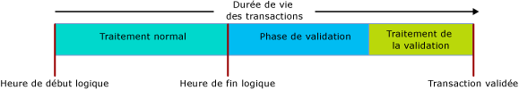

# Transactions with Memory-Optimized Tables
[!INCLUDE[tsql-appliesto-ss2016-asdb-xxxx-xxx_md](../../includes/tsql-appliesto-ss2016-asdb-xxxx-xxx-md.md)]

  
Cet article décrit tous les aspects des transactions propres aux tables optimisées en mémoire et aux procédures stockées compilées en mode natif.  
  
Les niveaux d’isolation de la transaction dans SQL Server s’appliquent différemment aux tables optimisées en mémoire et aux tables sur disque. En outre, les mécanismes sous-jacents sont différents. La compréhension de ces différences permet au programmeur de concevoir un système à débit élevé. L’objectif de l’intégrité de la transaction est partagé dans tous les cas.  

Pour connaître les conditions d’erreur spécifiques aux transactions dans les tables optimisées en mémoire, passez à la section [Détection des conflits et logique des nouvelles tentatives](#confdetretry34ni).
  
Pour des informations générales, consultez [SET TRANSACTION ISOLATION LEVEL (Transact-SQL)](../../t-sql/statements/set-transaction-isolation-level-transact-sql.md).  
  
  
<a name="pessvoptim22ni"/>  
  
## Approches pessimiste et optimiste  
  
Les différences fonctionnelles sont dues à la différence entre les approches pessimiste et optimiste pour l’intégrité de la transaction. Les tables optimisées en mémoire utilisent l’approche optimiste :  
  
- L’approche pessimiste utilise des verrous pour bloquer les conflits potentiels avant qu’ils surviennent. Les verrous sont appliqués lorsque l’instruction est exécutée et ouverts lorsque la transaction est validée.  
  
- L’approche optimiste détecte les conflits à mesure qu’ils se produisent et effectue les vérifications au moment de la validation.  
  - Erreur 1205, un interblocage ne peut pas se produire pour une table optimisée en mémoire.  
  
L’approche optimiste est moins lourde et souvent plus efficace, en partie parce que les conflits de transaction sont rares dans la plupart des applications. La principale différence d’ordre fonctionnel entre ces deux approches se situe au niveau des conflits. Avec l’approche pessimiste, vous attendez, alors qu’avec l’approche optimiste, l’une des transactions échoue et doit être retentée par le client. Les différences fonctionnelles sont plus grandes lorsque le niveau d’isolation REPEATABLE READ est appliqué et sont encore plus importantes pour le niveau SERIALIZABLE.  
  
<a name="txninitmodes24ni"/>  
  
## Modes d’initiation de la transaction  
  
SQL Server dispose des modes suivants pour l’initiation de la transaction :  
  
- **Validation automatique** : le début d’une requête simple ou d’une instruction DML ouvre implicitement une transaction, et la fin d’une instruction valide implicitement la transaction. Il s'agit du paramètre par défaut.  
  - En mode Validation automatique, vous n’êtes généralement pas obligé de coder un indicateur de table à propos du niveau d’isolation de la transaction sur la table optimisée en mémoire dans la clause FROM.  
  
- **Explicite** : votre instruction Transact-SQL contient le code BEGIN TRANSACTION, et éventuellement COMMIT TRANSACTION. Plusieurs instructions peuvent être rassemblées dans une même transaction.  
  - En mode Explicite, vous devez utiliser l’option de base de données MEMORY_OPTIMIZED_ELEVATE_TO_SNAPSHOT ou coder un indicateur de table à propos du niveau d’isolation de la transaction sur la table optimisée en mémoire dans la clause FROM.  
  
- **Implicite** : lorsque SET IMPLICIT_TRANSACTION ON est appliqué. Le nom IMPLICIT_BEGIN_TRANSACTION aurait sans doute été plus approprié, car cette option ne fait qu’appliquer implicitement l’équivalent d’une instruction BEGIN TRANSACTION explicite avant chaque instruction UPDATE si 0 = @@trancount. Par conséquent, c’est à votre code T-SQL d’émettre finalement une instruction COMMIT TRANSACTION explicite.   
  
- **Bloc atomique** : toutes les instructions des blocs atomiques, qui sont nécessaires avec des procédures stockées compilées en mode natif, s’exécutent toujours dans le cadre d’une transaction unique. Soit les actions de l’ensemble du bloc atomique sont validées, soit elles sont toutes annulées en cas d’échec.  
  
<a name="codeexamexpmode25ni"/>  
  
### Exemple de code avec le mode Explicite  
  
Le script Transact-SQL interprété suivant utilise :  
  
- une transaction explicite ;  
  
- une table optimisée en mémoire, nommée dbo.Order_mo ;  
  
- le contexte de niveau d’isolation de la transaction READ COMMITTED.  
  
Par conséquent, il est nécessaire d’avoir un indicateur de table sur la table optimisée en mémoire. L’indicateur doit être pour SNAPSHOT ou un niveau d’isolation supérieur. Dans le cas de l’exemple de code, l’indicateur est WITH (SNAPSHOT). Si cet indicateur est supprimé, le script rencontre une erreur 41368, pour laquelle une nouvelle tentative automatique n’est pas adaptée :  
  
- 41368 : L’accès aux tables optimisées en mémoire selon le niveau d’isolation READ COMMITTED est pris en charge uniquement pour les transactions validées automatiquement. Cela n'est pas pris en charge pour les transactions explicites ou implicites. Spécifiez un niveau d’isolation pris en charge pour la table optimisée en mémoire à l’aide d’un indicateur de table, comme WITH (SNAPSHOT).  
  
  
  
    SET TRANSACTION ISOLATION LEVEL READ COMMITTED;  
    GO  
  
    BEGIN TRANSACTION;  -- Explicit transaction.  
  
      -- Order_mo  is a memory-optimized table.  
    SELECT *  
       FROM  
                dbo.Order_mo  as o  WITH (SNAPSHOT)  -- Table hint.  
           JOIN dbo.Customer  as c  on c.CustomerId = o.CustomerId;  
      
    COMMIT TRANSACTION;  
  
Notez que l’utilisation d’un indicateur `WITH (SNAPSHOT)` peut être évitée grâce à l’utilisation de l’option de base de données `MEMORY_OPTIMIZED_ELEVATE_TO_SNAPSHOT`. Lorsque cette option a la valeur `ON`, si une table optimisée en mémoire dispose d’un niveau d’isolation bas, celui-ci est élevé automatiquement au niveau d’isolation SNAPSHOT.  
  
    ALTER DATABASE CURRENT SET MEMORY_OPTIMIZED_ELEVATE_TO_SNAPSHOT=ON  
  
<a name="rowver28ni"/>  
  
## Contrôle de version de ligne  
  
Les tables optimisées en mémoire utilisent un système de contrôle de version de ligne très sophistiqué qui rend l’approche optimiste efficace, même au niveau d’isolation le plus strict de SERIALIZABLE. Pour en savoir plus, consultez [Introduction aux tables optimisées en mémoire](../../relational-databases/in-memory-oltp/introduction-to-memory-optimized-tables.md).  
  
Les tables sur disque disposent indirectement d’un système de contrôle de version de ligne lorsque le niveau d’isolation READ_COMMITTED_SNAPSHOT ou SNAPSHOT est appliqué. Ce système est basé sur tempdb, alors que les structures de données optimisées en mémoire comprennent un contrôle de version de ligne intégré, pour une efficacité maximale.  
  
<a name="confdegreeiso30ni"/>  
  
## Niveaux d’isolation 
  
La table suivante répertorie les niveaux d’isolation des transactions possibles, du plus faible au plus élevé. Pour plus d’informations sur les conflits qui peuvent se produire et la logique de nouvelles tentatives permettant de résoudre ces conflits, consultez [Détection des conflits et logique des nouvelles tentatives](#confdetretry34ni). 
  
| Niveau d'isolement | Description |   
| :-- | :-- |   
| READ UNCOMMITTED | Non disponible : les tables optimisées en mémoire ne sont pas accessibles si le niveau d’isolation est Read Uncommitted. Il est toujours possible d’accéder aux tables optimisées en mémoire ayant un niveau d’isolation SNAPSHOT si le niveau d’isolation de la transaction au niveau de la session a la valeur READ UNCOMMITTED. Pour cela, vous devez utiliser l’indicateur de table WITH (SNAPSHOT) ou définir le paramètre de base de données MEMORY_OPTIMIZED_ELEVATE_TO_SNAPSHOT sur ON. | 
| READ COMMITTED | Pris en charge pour les tables optimisées en mémoire uniquement lorsque le mode de validation automatique est appliqué. Il est toujours possible d’accéder aux tables optimisées en mémoire ayant un niveau d’isolation SNAPSHOT si le niveau d’isolation de la transaction au niveau de la session a la valeur READ COMMITTED. Pour cela, vous devez utiliser l’indicateur de table WITH (SNAPSHOT) ou définir le paramètre de base de données MEMORY_OPTIMIZED_ELEVATE_TO_SNAPSHOT sur ON.    Notez que si l’option de base de données READ_COMMITTED_SNAPSHOT a la valeur On, il n’est pas possible d’accéder à la fois à une table optimisée en mémoire et à une table sur disque situées dans une même instruction si le niveau d’isolation est READ COMMITTED. |  
| SNAPSHOT | Pris en charge pour les tables optimisées en mémoire.    En interne, le niveau d’isolation SNAPSHOT est le moins exigeant pour les tables optimisées en mémoire.    SNAPSHOT utilise moins de ressources système que REPEATABLE READ ou SERIALIZABLE. |  
| REPEATABLE READ | Pris en charge pour les tables optimisées en mémoire. Le niveau d’isolation REPEATABLE READ garantit qu’au moment de la validation, aucune transaction simultanée ne met à jour les lignes lues par cette transaction.    Le modèle optimiste n’a pas empêché les transactions simultanées de mettre à jour les lignes lues par cette transaction. En revanche, au moment de la validation, cette transaction a validé que le niveau d’isolation REPEATABLE READ a été respecté. Si le niveau d’isolation n’est pas respecté, cette transaction est annulée et doit être retentée. | 
| SERIALIZABLE | Pris en charge pour les tables optimisées en mémoire.    Ce niveau est appelé *Serializable* car l’isolation est tellement stricte que les transactions peuvent presque sembler exécutées en série plutôt que simultanément. | 

<a name="txnphaslife32ni"/>  
  
## Durée de vie et phases de la transaction  
  
Lorsqu’une table optimisée en mémoire est impliquée, la durée de vie d’une transaction passe par les phases décrites dans l’image suivante.  
  
  
  
Voici une description des phases.  
  
#### Traitement normal : phase 1 (sur 3)  
  
- Cette phase se compose de l’exécution de toutes les requêtes et des instructions DML de la requête.  
- Pendant cette phase, les instructions voient la version des tables optimisées en mémoire comme l’heure de début logique de la transaction.  
  
#### Validation : phase 2 (sur 3)  
  
- La phase de validation commence par l’assignation d’une heure de fin et donc le marquage d’une transaction comme logiquement terminée. Toutes les modifications de la transaction deviennent visibles pour les autres transactions, qui deviennent alors dépendantes de cette transaction et ne peuvent pas être validées tant que cette transaction n’a pas été validée. En outre, les transactions qui contiennent ces dépendances ne sont pas autorisées à retourner des jeux de résultats au client. De cette manière, le client voit uniquement les données qui ont été correctement validées dans la base de données.  
- Cette phase comprend les validations REPEATABLE READ et SERIALIZABLE. La validation REPEATABLE READ vérifie si des lignes lues par la transaction ont été mises à jour. La validation SERIALIZABLE vérifie si une ligne a été insérée dans une plage de données analysée par cette transaction. Notez que, selon le tableau de la section [Niveaux d’isolation](#confdegreeiso30ni), les validations REPEATABLE READ et SERIALIZABLE peuvent avoir lieu lorsque vous utilisez l’isolation SNAPSHOT pour valider la cohérence des contraintes de clés étrangères et uniques.  
  
#### Traitement de validation : phase 3 (sur 3)  
  
- Durant la phase de validation, les modifications apportées aux tables durables sont écrites dans le journal, et le journal est écrit sur le disque. Le contrôle est ensuite rendu au client.  
- Une fois le traitement de validation terminé, toutes les transactions dépendantes sont informées qu’elles peuvent être validées.  
  
Comme toujours, nous vous recommandons d’utiliser des unités transactionnelles de travail aussi courtes et minimales que le permettent vos besoins en données.  
  
<a name="confdetretry34ni"/>  
  
## Détection des conflits et logique des nouvelles tentatives 

Il existe deux types de conditions d’erreur qui peuvent causer l’échec et l’annulation d’une transaction. Dans la plupart des cas, lorsqu’un tel échec se produit, la transaction doit être retentée, comme dans le cas d’un blocage.
- Conflits entre plusieurs transactions simultanées. Il s’agit là de conflits de mise à jour et d’échecs de validation qui peuvent être dus à une violation du niveau d’isolation des transactions ou à une violation des contraintes.
- Échecs de dépendance. Ceux-ci sont causés par l’échec de la validation d’une transaction ayant des dépendances ou par un nombre excessif de dépendances.

Voici les conditions d’erreur qui peuvent entraîner l’échec des transactions qui accèdent aux tables optimisées en mémoire.

| Code d'erreur | Description | Cause |
| :-- | :-- | :-- |
| **41302** | Tentative de mise à jour d’une ligne qui a été mise à jour dans une autre transaction depuis le début de la transaction actuelle. | Cette erreur se produit si deux transactions simultanées tentent de mettre à jour ou de supprimer la même ligne au même moment. L’une des deux transactions reçoit ce message d’erreur et doit être retentée.     | 
| **41305**| Échec de la validation de lecture renouvelable Une ligne lue dans une table optimisée en mémoire a été mise à jour par une autre transaction qui a été validée avant cette transaction. | Cette erreur peut se produire lors de l’utilisation du niveau d’isolation REPEATABLE READ ou SERIALIZABLE, et également si les actions d’une transaction simultanée provoquent la violation d’une contrainte FOREIGN KEY.   La violation simultanée de contraintes de clé étrangère est plutôt rare et indique généralement un problème avec la logique de l’application ou une entrée de données. Toutefois, l’erreur peut également se produire s’il n’existe aucun index sur les colonnes impliquées dans la contrainte FOREIGN KEY. Il est donc recommandé de toujours créer un index sur les colonnes de clé étrangère d’une table optimisée en mémoire.    Pour plus d’informations sur les échecs de validation causés par des violations de clé étrangère, consultez [ce billet de blog](https://blogs.msdn.microsoft.com/sqlcat/2016/03/24/considerations-around-validation-errors-41305-and-41325-on-memory-optimized-tables-with-foreign-keys/) de l’équipe de consultants clients de SQL Server. |  
| **41325** | Échec de la validation sérialisable Une nouvelle ligne a été insérée dans une plage analysée précédemment par la transaction actuelle. Nous appelons cela une ligne fantôme. | Cette erreur peut se produire lors de l’utilisation du niveau d’isolation SERIALIZABLE, et également si les actions d’une transaction simultanée provoquent la violation d’une contrainte PRIMARY KEY, UNIQUE ou FOREIGN KEY.    La violation simultanée de contraintes est plutôt rare et indique généralement un problème avec la logique de l’application ou une entrée de données. Toutefois, comme pour les échecs de validation REPEATABLE READ, cette erreur peut également se produire s’il existe une contrainte FOREIGN KEY sans index sur les colonnes impliquées. |  
| **41301** | Échec de la dépendance : une dépendance a été prise sur une autre transaction dont la validation a échoué. | Cette transaction (Tx1) a pris une dépendance sur une autre transaction (Tx2) lorsque celle-ci (Tx2) était en phase de validation, en lisant des données écrites par Tx2. La validation de Tx2 a donc échoué. Le plus souvent, l’échec de la validation de Tx2 est causé par l’échec de la validation de REPEATABLE READ (41305) et de SERIALIZABLE (41325). La validation peut également échouer en cas d’échec d’E/S du journal, même si cela est moins fréquent. |
| **41839** | Le nombre maximal de dépendances de validation d’une transaction a été dépassé. | Le nombre de transactions sur lesquelles dépend une transaction donnée (Tx1) est limité : ce sont les dépendances sortantes. De plus, le nombre de transactions pouvant dépendre d’une transaction donnée (Tx1) est limité : il s’agit des dépendances sortantes. La limite pour les deux est de 8 transactions.    Le plus souvent, cet échec est dû au fait qu’un nombre très important de transactions de lecture accède aux données écrites par une seule transaction d’écriture. La probabilité de cette erreur augmente si les opérations de lecture effectuent toutes une analyse importante des mêmes données et si la validation ou le traitement de validation de la transaction d’écriture sont longs, par exemple, si la transaction d’écriture effectue des analyses importantes avec un niveau d’isolation SERIALIZABLE (augmentation de la durée de la phase de validation) ou si le journal des transactions est placé sur un périphérique d’E/S de journal lent (augmentation de la durée de traitement de la validation). Si les transactions de lecture effectuent des analyses importantes et si elles sont censées n’accéder qu’à quelques lignes, cela peut indiquer qu’un index est manquant. De même, si la transaction d’écriture effectue des analyses importantes avec le niveau d’isolation SERIALIZABLE, mais qu’elle n’est censée accéder qu’à quelques lignes, cela peut également indiquer qu’un index est manquant.    Le nombre maximal de dépendances de validation peut être augmenté à l’aide de l’indicateur de trace **9926**. Utilisez cet indicateur de trace uniquement si vous obtenez cette erreur après avoir vérifié qu’aucun index n’est manquant, car cela pourrait masquer ces problèmes dans les cas mentionnés ci-dessus. Gardez également à l’esprit que la complexité des graphiques de dépendances, où chaque transaction comprend un grand nombre de dépendances entrantes et sortantes, ainsi que de nombreuses couches de dépendances, peut rendre le système inefficace.  |
 
  
### Logique des nouvelles tentatives 

Lorsqu’une transaction échoue en raison de l’une des conditions mentionnées ci-dessus, la transaction doit être retentée.
  
La logique des nouvelles tentatives peut être implémentée côté client ou côté serveur. La recommandation générale consiste à implémenter la logique des nouvelles tentatives côté client, car cela est plus efficace et vous permet d’accéder aux jeux de résultats retournés par la transaction avant que la défaillance ne se produise.  
  
<a name="retrytsqlcodeexam35ni"/>  
  
#### Exemple de code T-SQL de nouvelle tentative  
  
La logique des nouvelles tentatives côté serveur avec T-SQL doit être utilisée uniquement pour les transactions qui ne retournent pas de jeux de résultats au client, puisque les nouvelles tentatives peuvent retourner des jeux de résultats supplémentaires au client sans que cela ne puisse être anticipé.  
  
Le script T-SQL interprété suivant illustre l’apparence de la logique de nouvelle tentative pour les erreurs associées à des conflits de transactions impliquant des tables optimisées en mémoire.  
  
      -- Retry logic, in Transact-SQL.  
    DROP PROCEDURE If Exists usp_update_salesorder_dates;  
    GO  
  
    CREATE PROCEDURE usp_update_salesorder_dates  
    AS  
    BEGIN  
        DECLARE @retry INT = 10;  
  
        WHILE (@retry > 0)  
        BEGIN  
            BEGIN TRY  
                BEGIN TRANSACTION;  
  
                UPDATE dbo.SalesOrder_mo WITH (SNAPSHOT)  
                    set OrderDate = GetUtcDate()  
                    where CustomerId = 42;  
  
                UPDATE dbo.SalesOrder_mo WITH (SNAPSHOT)  
                    set OrderDate = GetUtcDate()  
                    where CustomerId = 43;  
  
                COMMIT TRANSACTION;  
                SET @retry = 0;  -- //Stops the loop.  
            END TRY  
  
            BEGIN CATCH  
                SET @retry -= 1;  
  
                IF (@retry > 0 AND  
                    ERROR_NUMBER() in (41302, 41305, 41325, 41301, 41839, 1205)  
                    )  
                BEGIN  
                    IF XACT_STATE() = -1  
                        ROLLBACK TRANSACTION;  
  
                    WAITFOR DELAY '00:00:00.001';  
                END  
                ELSE  
                BEGIN  
                    PRINT 'Suffered an error for which Retry is inappropriate.';  
                    THROW;  
                END  
            END CATCH  
  
        END -- //While loop  
    END;  
    GO  
  
      --  EXECUTE usp_update_salesorder_dates;  
  
  
  
<a name="crossconttxn38ni"/>  
  
## Transaction entre conteneurs  
  
  
Une transaction est appelée transaction entre conteneurs si :  
  
- elle accède à une table optimisée en mémoire à partir du code Transact-SQL interprété ; ou  
- Exécute une procédure native alors qu’une transaction est déjà ouverte (XACT_STATE() = 1).  
  
Le qualificatif « entre conteneurs » signifie que la transaction s’exécute sur les deux conteneurs de gestion de transactions, celui pour les tables sur disque et celui pour les tables optimisées en mémoire.  
  
Dans une transaction entre conteneurs, différents niveaux d’isolation permettent d’accéder aux tables sur disque et optimisées en mémoire. Cette différence est exprimée par le biais des indicateurs de table explicites comme WITH (SERIALIZABLE) ou l’option de base de données MEMORY_OPTIMIZED_ELEVATE_TO_SNAPSHOT, qui élève implicitement le niveau d’isolation de la table optimisée en mémoire vers le niveau SNAPSHOT si TRANSACTION ISOLATION LEVEL est configuré en tant que READ COMMITTED ou READ UNCOMMITTED.  
  
Dans l’exemple de code Transact-SQL suivant :  
  
- L’accès à la table sur disque (Table_D1) se fait à l’aide du niveau d’isolation READ COMMITTED.  
- L’accès à la table optimisée en mémoire (Table_MO7) se fait à l’aide du niveau d’isolation SERIALIZABLE. La Table_MO6 n’a pas de niveau d’isolation spécifique, dans la mesure où les insertions sont toujours cohérentes et sont exécutées essentiellement avec un niveau d’isolation SERIALIZABLE.  
  
  
  
      -- Different isolation levels for  
      -- disk-based tables versus memory-optimized tables,  
      -- within one explicit transaction.  
  
    SET TRANSACTION ISOLATION LEVEL READ COMMITTED;  
    GO  
  
    BEGIN TRANSACTION;  
  
        -- Table_D1 is a traditional disk-based table, accessed using READ COMMITTED isolation.  
        --  
        SELECT * FROM Table_D1;  
  
  
  
        -- Table_MO6 and Table_MO7 are memory-optimized tables. Table_MO7 is accessed using SERIALIZABLE isolation,  
    --   while Table_MO6 does not have a specific   
        --  
        INSERT Table_MO6  
            SELECT * FROM Table_MO7 WITH (SERIALIZABLE);  
  
  
    COMMIT TRANSACTION;  
    GO  
  
  
  
<a name="limitations40ni"/>  
  
## Limitations  
  
  
- Les transactions entre bases de données ne sont pas prises en charge avec les tables optimisées en mémoire. Si une transaction accède à une table optimisée en mémoire, elle ne peut pas accéder à une autre base de données, à l’exception de :  
  - base de données tempdb  
  - lecture seule à partir de la base de données MASTER.  
  
- Transactions distribuées non prises en charge : Lorsque BEGIN DISTRIBUTED TRANSACTION est utilisé, la transaction ne peut pas accéder à une table optimisée en mémoire.  
  
  
<a name="natcompstorprocs42ni"/>  
  
## Procédures stockées compilées en mode natif  
  
- Dans une procédure native, le bloc ATOMIQUE doit déclarer le niveau d’isolation de la transaction pour l’ensemble du bloc, par exemple :  
  - `... BEGIN ATOMIC WITH (TRANSACTION ISOLATION LEVEL = SNAPSHOT, ...) ...`  
  
- Les instructions de contrôle de transaction explicite ne sont pas autorisées dans le corps d’une procédure native. Les instructions BEGIN TRANSACTION, ROLLBACK TRANSACTION, etc. sont toutes interdites.  
  
- Pour plus d’informations sur le contrôle des transactions à l’aide de blocs atomiques, consultez [Blocs atomiques](https://msdn.microsoft.com/library/dn452281.aspx)  
  
<a name="othertxnlinks44ni"/>  
  
## Autres liens de transaction  
  
- [SET IMPLICIT_TRANSACTIONS](../../t-sql/statements/set-implicit-transactions-transact-sql.md)  
  
- [sp_getapplock (Transact-SQL)](../../relational-databases/system-stored-procedures/sp-getapplock-transact-sql.md)  
  
- [Niveaux d'isolation basés sur le contrôle de version de ligne dans le moteur de base de données](http://msdn.microsoft.com/library/ms177404.aspx)  
  
- [Contrôler la durabilité d'une transaction](../../relational-databases/logs/control-transaction-durability.md)   

