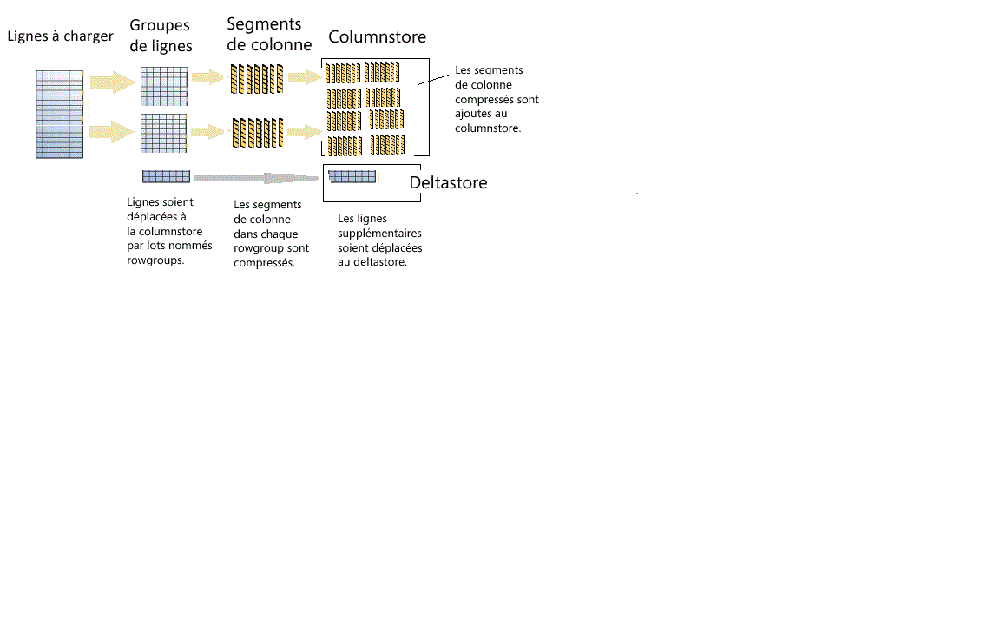

# <a name="columnstore-indexes---data-loading-guidance"></a>Index columnstore - Conseils en matière de chargement de données
[!INCLUDE[appliesto-ss-asdb-asdw-pdw-md](../../includes/appliesto-ss-asdb-asdw-pdw-md.md)]

Options et recommandations pour le chargement de données dans un index columnstore en utilisant le chargement en masse SQL standard et des méthodes d’insertion segmentée. Le chargement de données dans un index columnstore est une partie essentielle de tout processus d’entreposage de données, car il transfère des données dans l’index en préparation de l’analyse.
  
 Vous ne connaissez pas les index columnstore ? Consultez [Index columnstore - Présentation](../../relational-databases/indexes/columnstore-indexes-overview.md) et [Index columnstore - Architecture](../../relational-databases/sql-server-index-design-guide.md#columnstore_index).
  
## <a name="what-is-bulk-loading"></a>Qu’est-ce que le chargement en masse ?
Le *chargement en masse* fait référence à la façon dont un grand nombre de lignes sont ajoutées à un magasin de données. Il s’agit de la façon la plus performante de déplacer des données vers un index columnstore, car il opère sur des lots de lignes. Le chargement en masse remplit des rowgroups à leur capacité maximale et les compresse directement dans le columnstore. Seules les lignes situées à la fin d’un chargement qui ne respectent pas la valeur minimale de 102 400 lignes par rowgroup sont placées dans le deltastore.  

Pour effectuer un chargement en masse, utilisez [l’utilitaire bcp](../../tools/bcp-utility.md) ou les [services d’intégration](../../integration-services/sql-server-integration-services.md), ou bien sélectionnez des lignes dans une table de mise en lots.

  
  
 Comme l’indique le diagramme :  
  
* Un chargement en masse ne trie pas les données. Les données sont insérées dans des groupes de lignes (rowgroup), dans l’ordre de leur réception.
* Si la taille du lot est supérieure ou égale à 102 400, les lignes sont directement insérées dans des rowgroup compressés. Pour une importation en bloc efficace, il est recommandé de choisir une taille de lot supérieure ou égale à 102 400 lignes, car cela permet d’éviter de déplacer les lignes de données vers des rowgroup delta avant leur déplacement final vers des rowgroup compressés par un thread d’arrière-plan, le moteur de tuple.
* Si la taille du lot est inférieure à 102 400 lignes ou si le nombre de lignes restantes est inférieur à 102 400, les lignes sont chargées dans des rowgroup delta.

> [!NOTE]
> Sur une table rowstore comportant des données d’index columnstore non-cluster, [!INCLUDE[ssNoVersion](../../includes/ssnoversion-md.md)] insère toujours les données dans la table de base. Les données ne sont jamais insérées directement dans l’index columnstore.  

Le chargement en masse dispose des fonctions d’optimisation des performances intégrées suivantes :
-   **Chargements parallèles** : vous pouvez avoir plusieurs chargements en masse simultanés (BCP ou insertion en bloc) qui chargent chacun un fichier de données distinct. À la différence des chargements en masse de rowstores dans [!INCLUDE[ssNoVersion](../../includes/ssnoversion-md.md)], vous n’avez pas besoin de spécifier l’option `TABLOCK`, car chaque thread d’importation en bloc charge des données exclusivement dans un rowgroup distinct (compressé ou delta) en lui appliquant un verrou exclusif. L’option `TABLOCK` force l’application d’un verrou exclusif à la table, qui vous empêche d’importer des données en parallèle.  
-   **Journalisation minimale** : un chargement en masse utilise une journalisation minimale des données qui sont placées directement dans des rowgroups compressés. Toutes les données qui sont placées dans un rowgroup delta sont entièrement journalisées. Cela inclut toutes les tailles de lot inférieures à 102 400 lignes. Toutefois, avec le chargement en masse, l’objectif est que la plupart des données évitent les rowgroups delta.  
-   **Optimisation du verrouillage** : lors du chargement dans un rowgroup compressé, le verrou X sur le rowgroup est acquis. Toutefois, lors d’un chargement en masse dans un rowgroup delta, un verrou X est acquis au niveau du rowgroup, mais [!INCLUDE[ssNoVersion](../../includes/ssnoversion-md.md)] continue de verrouiller les verrous PAGE/EXTENT, car le verrou X du rowgroup ne fait pas partie de la hiérarchie de verrouillage.  
  
Si vous avez un index B-tree non-cluster sur un index columnstore, aucune optimisation du verrouillage ou de la journalisation n’est effectuée pour l’index proprement dit, mais les optimisations de l’index columnstore cluster décrites ci-dessus ont toujours lieu.  
  
## <a name="plan-bulk-load-sizes-to-minimize-delta-rowgroups"></a>Planifier les tailles de chargement en masse pour réduire les rowgroups delta
Les index columnstore fonctionnent de manière optimale quand la plupart des lignes sont compressées dans le columnstore et qu’elles ne se trouvent pas dans des rowgroups delta. Il est préférable de dimensionner vos chargements afin que les lignes soient directement placées dans le columnstore et d’ignorer autant que possible le deltastore.

Les scénarios suivants décrivent à quel moment les lignes chargées sont directement insérées dans le columnstore ou quand elles sont placées dans le deltastore. Dans l'exemple, chaque rowgroup peut avoir 102 400-1 048 576 lignes par rowgroup. Dans la pratique, la taille maximale d’un rowgroup peut être inférieure à 1 048 576 lignes si la mémoire est très sollicitée.  
  
|Lignes à charger en masse|Lignes ajoutées au rowgroup compressé|Lignes ajoutées au rowgroup delta|  
|-----------------------|-------------------------------------------|--------------------------------------|  
|102 000|0|102 000|  
|145 000|145 000<br /><br /> Taille de rowgroup : 145 000|0|  
|1 048 577|1,048,576<br /><br /> Taille de rowgroup : 1 048 576| 1|  
|2 252 152|2 252 152<br /><br /> Tailles de rowgroup : 1 048 576, 1 048 576, 155 000.|0|  
  
 L’exemple suivant montre les résultats du chargement de 1 048 577 lignes dans une table. Les résultats indiquent un rowgroup COMPRESSÉ dans le columnstore (comme segments de colonne compressés), et 1 ligne dans le deltastore.  
  
```sql  
SELECT object_id, index_id, partition_number, row_group_id, delta_store_hobt_id, 
  state state_desc, total_rows, deleted_rows, size_in_bytes   
FROM sys.dm_db_column_store_row_group_physical_stats  
```  
  
   
  
## <a name="use-a-staging-table-to-improve-performance"></a>Utiliser une table en préproduction pour améliorer les performances
Si vous chargez des données uniquement pour les mettre en préproduction avant d’exécuter d’autres transformations, il sera beaucoup plus rapide de charger la table dans une table de segments de mémoire que de charger des données dans une table columnstore cluster. De plus, le chargement de données dans une table temporaire [Temporary] s’effectue également beaucoup plus rapidement que le chargement d’une table dans un stockage permanent.  

 Un modèle commun pour le chargement de données consiste à charger celles-ci dans une table de mise en lots, à effectuer une transformation, puis à charger celle-ci dans la table cible à l’aide de la commande suivante :  
  
```sql  
INSERT INTO <columnstore index>  
SELECT <list of columns> FROM <Staging Table>  
```  
  
 Cette commande charge les données dans l’index columnstore de manière similaire à BCP ou à une insertion en bloc, mais dans un lot unique. Si le nombre de lignes de la table de mise en lots est inférieur à 102 400, les lignes sont chargées dans un rowgroup delta. Dans le cas contraire, elles sont chargées directement dans un rowgroup compressé. Limitation importante : cette opération `INSERT` était à thread unique. Pour charger des données en parallèle, vous pouviez créer plusieurs tables de mise en lots ou envoyer des instructions `INSERT`/`SELECT` sans chevauchement des plages de lignes de la table de mise en lots. Cette limitation disparaît avec [!INCLUDE[ssSQL15](../../includes/sssql15-md.md)]. La commande suivante charge les données de la table de mise en lots en parallèle, mais vous devez spécifier l’option `TABLOCK`.  
  
```sql  
INSERT INTO <columnstore index> WITH (TABLOCK) 
SELECT <list of columns> FROM <Staging Table>  
```  
  
 Vous pouvez effectuer les optimisations suivantes pour le chargement dans un index columnstore cluster à partir d’une table de mise en lots :
-   **Optimisation du journal** : une journalisation minimale est effectuée lors du chargement des données dans le rowgroup compressé. Aucune journalisation minimale lorsque des données sont chargées dans le rowgroup delta.  
-   **Optimisation du verrouillage** : lors du chargement dans un rowgroup compressé, le verrou X sur le rowgroup est acquis. Toutefois, avec un rowgroup delta, un verrou X est acquis au niveau du rowgroup, mais [!INCLUDE[ssNoVersion](../../includes/ssnoversion-md.md)] continue de verrouiller les verrous PAGE/EXTENT, car le verrou X du rowgroup ne fait pas partie de la hiérarchie de verrouillage.  
  
 Si vous disposez d’un ou plusieurs index non cluster, aucune optimisation du verrouillage ou du journal n’est effectuée pour l’index proprement dit, mais les optimisations de l’index columnstore cluster décrites ci-dessus ont toujours lieu.  
  
## <a name="what-is-trickle-insert"></a>Qu’est-ce que l’insertion segmentée ?

L’*insertion segmentée* fait référence à la façon dont des lignes individuelles sont déplacées vers l’index columnstore. Les insertions segmentées utilisent l’instruction [INSERT INTO](../../t-sql/statements/insert-transact-sql.md). Avec l’insertion segmentée, toutes les lignes sont placées dans le deltastore. Cette fonction est utile pour les lignes en petit nombre, mais peu pratique pour les chargements volumineux.
  
```sql  
INSERT INTO <table-name> VALUES (<set of values>)  
```  
  
 > [!NOTE]
 > Les threads simultanés qui utilisent l’instruction INSERT INTO pour insérer des valeurs dans un index columnstore cluster peuvent insérer des lignes dans le même rowgroup deltastore.  
  
 Quand le rowgroup contient 1 048 576 lignes, le rowgroup delta est marqué comme fermé, mais il reste disponible pour les requêtes et les opérations de mise à jour/suppression. En revanche, les nouvelles lignes insérées sont envoyées dans un rowgroup deltastore existant ou nouvellement créé. Un thread d’arrière-plan, *moteur de tuple* , compresse les rowgroups delta fermés environ toutes les 5 minutes. Pour compresser le rowgroup delta fermé, vous pouvez appeler explicitement la commande suivante :  
  
```sql  
ALTER INDEX <index-name> on <table-name> REORGANIZE  
```  
  
 Si vous souhaitez forcer un rowgroup delta fermé et compressé, vous pouvez exécuter la commande suivante. Vous pouvez exécuter cette commande si vous avez fini de charger les lignes et n’en attendez pas de nouvelles. En fermant et compressant explicitement le rowgroup delta, vous pouvez augmenter la capacité de stockage et améliorer les performances de requête d’analyse. Il est recommandé d’appeler cette commande si vous ne prévoyez pas l’insertion de nouvelles lignes.  
  
```sql  
ALTER INDEX <index-name> on <table-name> REORGANIZE with (COMPRESS_ALL_ROW_GROUPS = ON)  
```  
  
## <a name="how-loading-into-a-partitioned-table-works"></a>Fonctionnement du chargement dans une table partitionnée  
 Pour les données partitionnées, [!INCLUDE[ssNoVersion](../../includes/ssnoversion-md.md)] affecte d'abord chaque ligne à une partition, puis effectue les opérations de columnstore sur les données dans la partition. Chaque partition a ses propres rowgroups et au moins un rowgroup delta.  
  
 ## <a name="next-steps"></a>Étapes suivantes
 Pour plus d’informations sur le chargement, consultez ce [billet de blog](http://blogs.msdn.com/b/sqlcat/archive/2015/03/11/data-loading-performance-considerations-on-tables-with-clustered-columnstore-index.aspx).  
