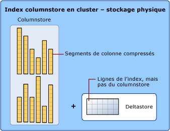

# Index columnstore - Présentation
[!INCLUDE[appliesto-ss-asdb-asdw-pdw-md](../../includes/appliesto-ss-asdb-asdw-pdw-md.md)]

Les *index columnstore* sont la norme pour le stockage et l’interrogation des tables de faits d’entreposage de données de grande taille. Il utilise un stockage de données basé sur des colonnes et un traitement des requêtes pour atteindre des gains de **performances des requêtes pouvant être multipliés par 10** dans votre entrepôt de données par rapport au stockage orienté lignes traditionnel et une **compression de données multipliée par 10** par rapport à la taille des données non compressées. À partir de [!INCLUDE[ssSQL15](../../includes/sssql15-md.md)], les index columnstore autorisent l’analytique opérationnelle, qui permet d’exécuter des analyses en temps réel performantes sur une charge de travail transactionnelle.  
  
 Passez aux scénarios suivants :  
  
-   [Index columnstore pour l’entreposage des données](../../relational-databases/indexes/columnstore-indexes-data-warehouse.md)  
-   [Prise en main de columnstore pour l’analytique opérationnelle en temps réel](../../relational-databases/indexes/get-started-with-columnstore-for-real-time-operational-analytics.md)  
  
## Qu’est-ce qu’un index columnstore ?  
 Un *columnstore index* est une technologie permettant de stocker, extraire et gérer les données à l'aide d'un format de données en colonnes, appelé columnstore.  
  
### Termes et concepts clés  
 Les termes et concepts clés suivants sont associés aux index columnstore.  
  
 columnstore  
 Un *columnstore* représente des données qui sont organisées logiquement sous la forme d’une table avec des lignes et des colonnes, et stockées physiquement dans un format de données selon les colonnes.  
  
 rowstore  
 Un *rowstore* représente des données qui sont organisées logiquement sous la forme d’une table avec des lignes et des colonnes, puis stockées physiquement dans un format de données selon les lignes. Il s'agit de la méthode traditionnelle de stockage des données de table relationnelles. Dans [!INCLUDE[ssNoVersion](../../includes/ssnoversion-md.md)], un rowstore fait référence à une table dans laquelle le format de stockage de données sous-jacent est un segment de mémoire, un index cluster ou une table à mémoire optimisée.  
  
> [!NOTE]  
> Dans les discussions au sujet des index columnstore, nous utilisons les termes *rowstore* et *columnstore* pour mettre en évidence le format du stockage de données.  
  
 rowgroup  
 Un *rowgroup* est un groupe de lignes qui sont compressées au format columnstore en même temps. Un rowgroup contient généralement le nombre maximal de lignes par rowgroup qui est de 1 048 576 lignes.  
  
 Pour une haute performance et des taux de compression élevés, l’index columnstore découpe la table en groupes de lignes, appelés rowgroups, puis comprime chaque groupe de lignes selon les colonnes. Le nombre de lignes dans le groupe de lignes doit être assez grand pour améliorer le taux de compression et assez petit pour tirer parti des opérations en mémoire.  
 segment de colonne  
 Un *segment de colonne* est une colonne de données au sein d’un rowgroup.  
  
-   Chaque rowgroup contient un segment de colonne pour chaque colonne dans la table.  
-   Chaque segment de colonne est compressé et stocké sur un support physique.  
  
   
  
 index columnstore cluster  
 Un *index columnstore cluster* est le stockage physique de la totalité de la table.  
  
   
  
 Pour réduire la fragmentation des segments de colonne et améliorer les performances, l’index columnstore peut stocker des données temporaires dans un index cluster, appelé deltastore, plus une liste btree d’ID pour les lignes supprimées. Les opérations deltastore sont effectuées en coulisse. Pour retourner des résultats de requête corrects, l'index columnstore cluster associe les résultats de columnstore et de deltastore.  
  
 Rowgroup delta  
 Utilisé uniquement avec des index de stockage de colonnes, un *rowgroup delta* est un index cluster qui améliore la compression columnstore et les performances en stockant les lignes jusqu’à ce que le nombre de lignes atteigne un seuil et que celles-ci soient déplacées dans le columnstore.  

 Lorsqu’un rowgroup delta atteint le nombre maximal de lignes, il est fermé. Un processus de déplacement de tuple vérifie les groupes de lignes fermés. Lorsqu'il trouve un rowgroup fermé, il le compresse et le stocke dans le columnstore.  
  
deltastore Un index columnstore peut avoir plusieurs rowgroups delta.  Tous les rowgroups delta sont appelés collectivement le *deltastore*.   

Lors d'un chargement en masse important, la plupart des lignes sont directement placées dans le columnstore sans passer par le deltastore. Certaines lignes à la fin du chargement en masse peuvent être en trop petit nombre pour atteindre la taille minimale d'un rowgroup, qui est de 102 400 lignes. Dans ce cas, les lignes finales sont placées dans le deltastore plutôt que dans le columnstore. Pour les petits chargements en masse de taille inférieure à 102 400 lignes, toutes les lignes vont directement au deltastore.  
  

  
 index columnstore non cluster  
 Un *index columnstore non cluster* et un index columnstore cluster fonctionnent de la même manière. La différence réside dans le fait qu’un index non cluster est un index secondaire créé sur une table rowstore tandis qu’un index cluster columnstore est le stockage principal pour la table entière.  
  
 L’index non cluster contient une copie de tout ou partie des lignes et des colonnes de la table sous-jacente. L’index est défini comme une ou plusieurs colonnes de la table et a une condition facultative qui filtre les lignes.  
  
 Un index non cluster columnstore active l’analytique opérationnelle en temps réel dans laquelle la charge de travail OLTP utilise l’index cluster sous-jacent tandis que l’analyse s’exécute simultanément sur l’index columnstore. Pour plus d’informations, consultez [Prise en main de columnstore pour l’analytique opérationnelle en temps réel](../../relational-databases/indexes/get-started-with-columnstore-for-real-time-operational-analytics.md).  
  
 Exécution par lot  
 L’*exécution par lot* est une méthode de traitement des requêtes dans laquelle les requêtes traitent plusieurs lignes ensemble. Les requêtes sur les index columnstore utilisent l’exécution en mode batch qui permet généralement de multiplier les performances des requêtes par 2 ou 4. L’exécution par lot est étroitement intégrée avec (et optimisée pour) le format de stockage columnstore. L'exécution en mode batch est parfois appelée « exécution vectorielle ou vectorisée ».  
  
##   Pourquoi utiliser un index columnstore ?  
 Les index columnstore peuvent fournir un niveau très élevé de compression de données (généralement multiplié par 10) afin de réduire de manière significative le coût de stockage de l’entrepôt de données. De plus, pour les analyses, ils offrent des performances réellement meilleures par rapport à un index btree. Il s’agit du format de stockage de données préféré pour les charges de travail d’entreposage des données et d’analyse. Depuis [!INCLUDE[ssSQL15](../../includes/sssql15-md.md)], vous pouvez utiliser des index columnstore pour l’analyse en temps réel sur votre charge de travail opérationnelle.  
  
 Voici les raisons pour lesquelles les index columnstore sont si rapides :  
  
-   Les valeurs columnstore d’un même domaine ont généralement des valeurs similaires, ce qui se traduit par des taux de compression élevés. Cela réduit ou élimine le goulot d’étranglement d’E/S dans votre système tout en diminuant l’encombrement mémoire de manière significative.  
  
-   Les taux de compression élevés améliorent les performances des requêtes en utilisant un plus faible encombrement en mémoire. En conséquence, les performances des requêtes sont améliorées, car [!INCLUDE[ssNoVersion](../../includes/ssnoversion-md.md)] peut exécuter davantage d'opérations de requêtes et sur les données en mémoire.  
  
-   L’exécution par lot multiplie généralement les performances de requête par 2 ou 4 grâce au traitement simultané de plusieurs lignes.  
  
-   Les requêtes sélectionnent souvent seulement quelques colonnes d'une table, ce qui réduit les E/S totales à partir du support physique.  
  
## Quand utiliser un index columnstore ?  
 Voici les cas d’utilisation recommandés :  
  
-   Utilisez un index cluster columnstore pour stocker les tables de faits et de grandes tables de dimension pour les charges de travail d’entreposage de données. Cela améliore les performances des requêtes et la compression des données jusqu’à 10 fois. Consultez [Columnstore Indexes for Data Warehousing](~/relational-databases/indexes/columnstore-indexes-data-warehouse.md).  
  
-   Utilisez un index non cluster columnstore pour effectuer une analyse en temps réel sur une charge de travail OLTP. Consultez [Prise en main de columnstore pour l’analytique opérationnelle en temps réel](../../relational-databases/indexes/get-started-with-columnstore-for-real-time-operational-analytics.md).  
  
### Comment choisir entre un index rowstore et un index columnstore ?  
 Les index rowstore fonctionnent de manière optimale sur les requêtes qui recherchent une valeur spécifique au sein des données ou sur les requêtes qui interrogent une petite plage de valeurs. Utilisez les index rowstore avec des charges de travail transactionnelles, car ils ont tendance à nécessiter principalement des recherches de table plutôt que des analyses de table.  
  
 Les index columnstore offrent des gains de performances élevés pour les requêtes analytiques qui analysent de grandes quantités de données, en particulier sur des tables volumineuses.  Utilisez les index columnstore sur les charges de travail d’analyse et d’entreposage des données, en particulier sur les tables de faits, car ils ont tendance à nécessiter des analyses de tables complètes plutôt que des recherches de table.  
  
### Puis-je combiner les formats rowstore et columnstore dans la même table ?  
 Oui. Depuis [!INCLUDE[ssSQL15](../../includes/sssql15-md.md)], vous pouvez créer un index non cluster columnstore pouvant être mis à jour sur une table rowstore. L’index columnstore stocke une copie des colonnes choisies. Vous avez donc besoin d’un espace supplémentaire pour cela, même si les colonnes sont compressées en moyenne par 10. Ce faisant, vous pouvez exécuter l’analytique sur l’index columnstore et les transactions sur l’index rowstore en même temps. La banque des colonnes (columnstore) est mise à jour lors de la modification des données de la table rowstore. Les deux index utilisent donc les mêmes données.  
  
 Depuis [!INCLUDE[ssSQL15](../../includes/sssql15-md.md)], vous pouvez avoir un ou plusieurs index non cluster rowstore sur un index columnstore. Ce faisant, vous pouvez effectuer des recherches de tables efficaces sur le columnstore sous-jacent. D’autres options sont également disponibles. Par exemple, vous pouvez appliquer une contrainte de clé primaire à l’aide d’une contrainte UNIQUE sur la table rowstore. Dans la mesure où une valeur non unique ne peut pas être insérée dans la table rowstore, [!INCLUDE[ssNoVersion](../../includes/ssnoversion-md.md)] ne peut pas insérer la valeur dans le columnstore.  
  
## Métadonnées  
 Toutes les colonnes dans un index columnstore sont stockées dans les métadonnées en tant que colonnes incluses. L'index columnstore n'a pas de colonnes clés.  

|||
|-|-|  
|[sys.indexes &#40;Transact-SQL&#41;](../../relational-databases/system-catalog-views/sys-indexes-transact-sql.md)|[sys.index_columns &#40;Transact-SQL&#41;](../../relational-databases/system-catalog-views/sys-index-columns-transact-sql.md)|  
|[sys.partitions &#40;Transact-SQL&#41;](../../relational-databases/system-catalog-views/sys-partitions-transact-sql.md)|[sys.internal_partitions &#40;Transact-SQL&#41;](../../relational-databases/system-catalog-views/sys-internal-partitions-transact-sql.md)|  
|[sys.column_store_segments &#40;Transact-SQL&#41;](../../relational-databases/system-catalog-views/sys-column-store-segments-transact-sql.md)|[sys.column_store_dictionaries &#40;Transact-SQL&#41;](../../relational-databases/system-catalog-views/sys-column-store-dictionaries-transact-sql.md)|  
|[sys.column_store_row_groups &#40;Transact-SQL&#41;](../../relational-databases/system-catalog-views/sys-column-store-row-groups-transact-sql.md)|[sys.dm_db_column_store_row_group_operational_stats &#40;Transact-SQL&#41;](../../relational-databases/system-dynamic-management-views/sys-dm-db-column-store-row-group-operational-stats-transact-sql.md)|  
|[sys.dm_db_column_store_row_group_physical_stats &#40;Transact-SQL&#41;](../../relational-databases/system-dynamic-management-views/sys-dm-db-column-store-row-group-physical-stats-transact-sql.md)|[sys.dm_column_store_object_pool &#40;Transact-SQL&#41;](../../relational-databases/system-dynamic-management-views/sys-dm-column-store-object-pool-transact-sql.md)|  
|[sys.dm_db_column_store_row_group_operational_stats &#40;Transact-SQL&#41;](../../relational-databases/system-dynamic-management-views/sys-dm-db-column-store-row-group-operational-stats-transact-sql.md)|[sys.dm_db_index_operational_stats &#40;Transact-SQL&#41;](../../relational-databases/system-dynamic-management-views/sys-dm-db-index-operational-stats-transact-sql.md)|  
|[sys.dm_db_index_physical_stats &#40;Transact-SQL&#41;](../../relational-databases/system-dynamic-management-views/sys-dm-db-index-physical-stats-transact-sql.md)||  
  
## Related Tasks  
 Toutes les tables relationnelles, sauf si vous les spécifiez en tant qu’index cluster columnstore, utilisent rowstore comme format de données sous-jacent. `CREATE TABLE` crée une table rowstore, sauf si vous spécifiez l’option `WITH CLUSTERED COLUMNSTORE INDEX`.  
  
 Quand vous créez une table avec l’instruction `CREATE TABLE`, vous pouvez la créer en tant que table columnstore en spécifiant l’option `WITH CLUSTERED COLUMNSTORE INDEX`. Si vous avez déjà une table rowstore et que vous souhaitez la convertir au format columnstore, utilisez l’instruction `CREATE COLUMNSTORE INDEX`.  
  
|Tâche|Rubriques de référence|Remarques|  
|----------|----------------------|-----------|  
|Créer une table sous forme de columnstore|[CREATE TABLE &#40;Transact-SQL&#41;](../../t-sql/statements/create-table-transact-sql.md)|Depuis [!INCLUDE[ssSQL15](../../includes/sssql15-md.md)], vous pouvez créer la table en tant qu’index cluster columnstore. Il est inutile de créer au préalable une table rowstore, puis de la convertir en columnstore.|  
|Créer une table mémoire avec un index columnstore.|[CREATE TABLE &#40;Transact-SQL&#41;](../../t-sql/statements/create-table-transact-sql.md)|Depuis [!INCLUDE[ssSQL15](../../includes/sssql15-md.md)], vous pouvez créer une table optimisée en mémoire avec un index columnstore. L’index columnstore peut également être ajouté après la création de la table, à l’aide de la syntaxe ALTER TABLE ADD INDEX.|  
|Convertir une table rowstore en table columnstore|[CREATE COLUMNSTORE INDEX &#40;Transact-SQL&#41;](../../t-sql/statements/create-columnstore-index-transact-sql.md)|Convertissez un segment de mémoire ou un arbre binaire existant en columnstore. Les exemples montrent comment gérer les index existants, ainsi que le nom de l’index lors de cette conversion.|  
|Convertir une table columnstore en rowstore|[CREATE COLUMNSTORE INDEX &#40;Transact-SQL&#41;](../../t-sql/statements/create-columnstore-index-transact-sql.md)|Cela n’est généralement pas nécessaire, mais dans certains cas, vous devrez peut-être effectuer cette conversion. Les exemples montrent comment convertir un columnstore en segment de mémoire ou index cluster.|  
|Créer un index columnstore sur une table rowstore|[CREATE COLUMNSTORE INDEX &#40;Transact-SQL&#41;](../../t-sql/statements/create-columnstore-index-transact-sql.md)|Une table rowstore ne peut avoir qu’un seul index columnstore.  Depuis [!INCLUDE[ssSQL15](../../includes/sssql15-md.md)], l’index columnstore peut avoir une condition de filtrage. Les exemples affichent la syntaxe de base.|  
|Créer des index performants pour l’analytique opérationnelle|[Prise en main de columnstore pour l’analytique opérationnelle en temps réel](../../relational-databases/indexes/get-started-with-columnstore-for-real-time-operational-analytics.md)|Décrit comment créer des index columnstore et btree complémentaires afin que les requêtes OLTP utilisent les index btree et que les requêtes analytiques utilisent les index columnstore.|  
|Créer des index columnstore performants pour l’entreposage des données|[Index columnstore pour l’entreposage des données](~/relational-databases/indexes/columnstore-indexes-data-warehouse.md)|Décrit l’utilisation des index btree sur les tables columnstore pour créer des requêtes performantes en matière d’entreposage des données.|  
|Utiliser un index btree pour appliquer une contrainte de clé primaire sur un index columnstore|[Index columnstore pour l’entreposage des données](~/relational-databases/indexes/columnstore-indexes-data-warehouse.md)|Montre comment combiner des index btree et columnstore pour appliquer des contraintes de clé primaire sur l’index columnstore.|  
|Abandonner un index columnstore|[DROP INDEX &#40;Transact-SQL&#41;](../../t-sql/statements/drop-index-transact-sql.md)|L’abandon d’un index columnstore utilise la syntaxe DROP INDEX standard utilisée par les index btree. L’abandon d’un index cluster columnstore convertit la table columnstore en segment de mémoire.|  
|Supprimer une ligne d’un index columnstore|[DELETE &#40;Transact-SQL&#41;](../../t-sql/statements/delete-transact-sql.md)|Utilisez [DELETE &#40;Transact-SQL&#41;](../../t-sql/statements/delete-transact-sql.md) pour supprimer une ligne.   Ligne**columnstore** : [!INCLUDE[ssNoVersion](../../includes/ssnoversion-md.md)] marque la ligne comme étant supprimée logiquement, mais ne récupère pas le stockage physique pour la ligne tant que l’index n’est pas reconstruit.   Ligne**deltastore** : [!INCLUDE[ssNoVersion](../../includes/ssnoversion-md.md)] supprime la ligne logiquement et physiquement.|  
|Mettre à jour une ligne dans l’index columnstore|[UPDATE &#40;Transact-SQL&#41;](../../t-sql/queries/update-transact-sql.md)|Utilisez [UPDATE &#40;Transact-SQL&#41;](../../t-sql/queries/update-transact-sql.md) pour mettre à jour une ligne.   Ligne**columnstore** :  [!INCLUDE[ssNoVersion](../../includes/ssnoversion-md.md)] marque la ligne comme étant supprimée logiquement, puis insère la ligne mise à jour dans le deltastore.   Ligne**deltastore** : [!INCLUDE[ssNoVersion](../../includes/ssnoversion-md.md)] met à jour la ligne dans le deltastore.|  
|Charger des données dans un index columnstore|[Chargement de données d’index columnstore](~/relational-databases/indexes/columnstore-indexes-data-loading-guidance.md)||  
|Obliger toutes les lignes du deltastore à aller dans le columnstore.|[ALTER INDEX &#40;Transact-SQL&#41;](../../t-sql/statements/alter-index-transact-sql.md) ... REBUILD   [Défragmentation des index columnstore](~/relational-databases/indexes/columnstore-indexes-defragmentation.md)|ALTER INDEX avec l’option REBUILD oblige toutes les lignes à aller dans le columnstore.|  
|Défragmenter un index columnstore|[ALTER INDEX &#40;Transact-SQL&#41;](../../t-sql/statements/alter-index-transact-sql.md)|ALTER INDEX … REORGANIZE défragmente les index columnstore en ligne.|  
|Fusionner des tables avec les index columnstore|[MERGE &#40;Transact-SQL&#41;](../../t-sql/statements/merge-transact-sql.md)||  
  
##  Voir aussi  
 [Chargement de données d’index columnstore](~/relational-databases/indexes/columnstore-indexes-data-loading-guidance.md)   
 [Synthèse des fonctionnalités des index columnstore en fonction des versions](~/relational-databases/indexes/columnstore-indexes-what-s-new.md)   
 [Performances des requêtes d’index columnstore](~/relational-databases/indexes/columnstore-indexes-query-performance.md)   
 [Prise en main de columnstore pour l’analytique opérationnelle en temps réel](../../relational-databases/indexes/get-started-with-columnstore-for-real-time-operational-analytics.md)   
 [Index columnstore pour l’entreposage des données](~/relational-databases/indexes/columnstore-indexes-data-warehouse.md)   
 [Index columnstore - Défragmentation](~/relational-databases/indexes/columnstore-indexes-defragmentation.md)   
 [Guide de conception d’index SQL Server](../../relational-databases/sql-server-index-design-guide.md)   
 [Index columnstore - Architecture](../../relational-databases/sql-server-index-design-guide.md#columnstore_index)   
  
  

