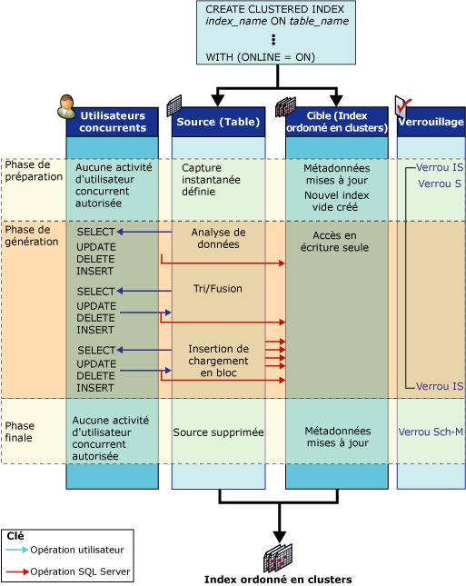

# Fonctionnement des opérations d'index en ligne
[!INCLUDE[appliesto-ss-asdb-xxxx-xxx-md](../../includes/appliesto-ss-asdb-xxxx-xxx-md.md)]

  Cette rubrique définit les structures qui existent pendant une opération d'index en ligne et illustre les activités qui y sont associées.  
  
## Structures d'index en ligne  
 Pour permettre des activités d’utilisateurs simultanées durant une opération du langage de définition de données (DDL) d’index, les structures suivantes sont utilisées pendant l’opération d’index en ligne : index source et préexistants, cibles et, pour reconstruire un segment de mémoire ou supprimer un index cluster en ligne, un index de mappage temporaire.  
  
-   **Index sources et préexistants**  
  
     La source est la table d'origine ou les données de l'index cluster. Les index préexistants sont tout index non-cluster associé à la structure source. Par exemple, si l’opération d’index en ligne régénère un index cluster possédant quatre index non-cluster associés, la source est l’index cluster existant et les index préexistants sont les index non-cluster.  
  
     Les index préexistants sont mis à la disposition des utilisateurs simultanés pour les opérations de sélection, d’insertion, de mise à jour et de suppression. Cela comprend des insertions en bloc (prises en charge mais déconseillées), des mises à jour implicites par des déclencheurs ainsi que des contraintes d'intégrité référentielle. Tous les index préexistants sont disponibles pour les requêtes et les recherches. Cela signifie qu'ils peuvent être sélectionnés par l'optimiseur de requête et spécifiés le cas échéant dans des indicateurs d'index.  
  
-   **Cible**  
  
     La ou les cibles est le nouvel index (ou segment de mémoire), ou bien un jeu des nouveaux index en cours de création ou de régénération. Les opérations d'insertion, de mise à jour et de suppression que l'utilisateur effectue sur la source sont appliquées par le [!INCLUDE[ssDEnoversion](../../includes/ssdenoversion-md.md)] à la cible pendant l'opération d'index. Par exemple, si l'opération d'index en ligne régénère un index cluster, la cible est l'index cluster régénéré ; le [!INCLUDE[ssDE](../../includes/ssde-md.md)] ne régénère pas d'index non-cluster lorsqu'un index cluster est régénéré.  
  
     L'index cible n'est pas examiné lors du traitement d'instructions SELECT aussi longtemps que l'opération d'index n'est pas validée. En interne, l'index est marqué en écriture seule.  
  
-   **Index de mappage temporaire**  
  
     Les opérations d'index en ligne qui créent, suppriment ou régénèrent un index cluster exigent également un index de mappage temporaire. Cet index temporaire est utilisé par les transactions simultanées pour déterminer les enregistrements à supprimer dans les nouveaux index en cours de génération lorsque des lignes de la table sous-jacente sont mises à jour ou supprimées. Cet index non-cluster est créé au cours de la même étape que le nouvel index (ou segment de mémoire) cluster et n'exige aucune opération de tri distincte. Les transactions simultanées gèrent également l'index de mappage temporaire dans toutes leurs opérations d'insertion, de mise à jour et de suppression.  
  
## Activités d'index en ligne  
 Pendant une opération d'index en ligne simple, telle que la création d'un index cluster sur une table (ou un segment de mémoire) non indexée, la source et la cible passent par trois phases : la phase de préparation, la phase de génération et la phase finale.  
  
 L'illustration suivante représente le processus de création d'un index cluster initial en ligne. L'objet source (le segment) ne possède aucun autre index. Les activités des structures sources et cibles sont représentées pour chaque phase ; les opérations de sélection, d'insertion, de mise à jour et de suppression des utilisateurs simultanés sont également indiquées. Les phases de préparation, de génération et finale sont affichées avec les modes de verrouillage utilisés dans chacune d'elles.  
  
   
  
## Activités des structures sources  
 Le tableau suivant répertorie les activités impliquant les structures sources lors de chaque phase de l'opération d'index ainsi que la stratégie de verrouillage correspondante.  
  
|Phase|Activité de la source|Verrous de la source|  
|-----------|---------------------|------------------|  
|Préparation   Phase courte|Préparation des métadonnées système afin de créer la nouvelle structure d'index vide.   Un instantané de la table est défini. Cela signifie que le contrôle de version de ligne est utilisé pour fournir une cohérence de lecture au niveau de la transaction.   Les opérations d’écriture d’utilisateurs simultanés sur la source sont bloquées pendant une période courte.   Aucune opération DDL simultanée n'est autorisée, à l'exception de la création de plusieurs index non-cluster.|S (Partagé) sur la table*   IS (Partage intentionnel)   INDEX_BUILD_INTERNAL_RESOURCE\*\*|  
|Build   Phase principale|Les données sont analysées, triées, fusionnées et insérées dans la cible au cours d'opérations de chargement en masse.   Les opérations de sélection, d’insertion, de mise à jour et de suppression effectuées par des utilisateurs simultanés sont appliquées à la fois aux index préexistants et à tout nouvel index en cours de régénération.|IS   INDEX_BUILD_INTERNAL_RESOURCE**|  
|Finale   Phase courte|Pour que cette phase commence, toutes les transactions de mise à jour non validées doivent être terminées. Selon le verrou acquis, toutes les transactions de lecture ou d’écriture de nouveaux utilisateurs sont bloquées pendant une période courte jusqu’à l’achèvement de cette phase.   Les métadonnées système sont mises à jour pour remplacer la source par la cible.   La source est supprimée le cas échéant. Par exemple, après la régénération ou la suppression d'un index cluster.|INDEX_BUILD_INTERNAL_RESOURCE**   S sur la table en cas de création d’un index non cluster.\*   SCH-M (Modification du schéma) en cas de suppression de toute structure source (index ou table).\*|  
  
 \* L’opération d’index attend l’achèvement de toute transaction de mise à jour non validée avant d’acquérir le verrou S ou SCH-M sur la table.  
  
 ** Le verrou de ressource INDEX_BUILD_INTERNAL_RESOURCE empêche l’exécution d’opérations de langage de définition de données (DDL) simultanées sur les structures sources et préexistantes alors que l’opération d’index est en cours. Par exemple, ce verrou empêche la régénération simultanée de deux index sur la même table. Même si ce verrou de ressource est associé au verrou Sch-M, il n'empêche pas les instructions de manipulation de données.  
  
 La table précédente représente un verrou partagé (S) unique acquis lors de la phase de génération d'une opération d'index en ligne impliquant un index unique. Lorsque des index cluster et non cluster sont générés ou régénérés au cours d'une opération d'index en ligne unique (par exemple, pendant la création d'un index cluster initial sur une table contenant un ou plusieurs index non cluster), deux verrous S à court terme sont acquis au cours de la phase de génération, suivis par des verrous de partage intentionnel (IS) à long terme. Un verrou S est d'abord acquis pour la création de l'index cluster et lorsque la création de l'index cluster est terminée, un deuxième verrou S à court terme est acquis pour la création des index non-cluster. Une fois les index non-cluster créés, le verrou S redevient un verrou IS jusqu'à la phase finale de l'opération d'index en ligne.  
  
### Activités des structures cibles  
 Le tableau suivant répertorie les activités impliquant la structure cible lors de chaque phase de l'opération d'index ainsi que la stratégie de verrouillage correspondante.  
  
|Phase|Activité de la cible|Verrous de la cible|  
|-----------|---------------------|------------------|  
|Préparation|Un nouvel index est créé et défini en écriture seule.|IS|  
|Build|Les données sont insérées à partir de la source.   Les modifications des utilisateurs (insertions, mises à jour, suppressions) apportées à la source sont appliquées.   Cette activité est transparente pour l'utilisateur.|IS|  
|Finale|Les métadonnées de l'index sont mises à jour.   L'index est défini en lecture/écriture.|S   ou Gestionnaire de configuration   SCH-M|  
  
 Les instructions SELECT émises par l'utilisateur n'accèdent pas à la cible aussi longtemps que l'opération d'index n'est pas terminée.  
  
 Une fois les phases de préparation et finale terminées, les plans de requête et de mise à jour stockés dans le cache de procédure sont invalidés. Les requêtes suivantes utilisent le nouvel index.  
  
 La durée de vie d'un curseur déclaré sur une table impliquée dans une opération d'index en ligne est limitée par les phases de l'index en ligne. Les curseurs de mise à jour sont invalidés à chaque phase. Les curseurs en lecture seule ne sont invalidés qu'après la phase finale.  
  
## Contenu associé  
 [Exécuter des opérations en ligne sur les index](../../relational-databases/indexes/perform-index-operations-online.md)  
  
 [Instructions pour les opérations d'index en ligne](../../relational-databases/indexes/guidelines-for-online-index-operations.md)  
  
  
