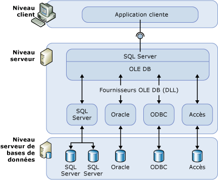

# Serveurs liés (Moteur de base de données)
[!INCLUDE[appliesto-ss-xxxx-xxxx-xxx-md](../../includes/appliesto-ss-xxxx-xxxx-xxx-md.md)]
  Configurez un serveur lié pour permettre à [!INCLUDE[ssDEnoversion](../../includes/ssdenoversion-md.md)] d'exécuter des commandes sur des sources de données OLE DB situées en dehors de l'instance de [!INCLUDE[ssNoVersion](../../includes/ssnoversion-md.md)]. En général, les serveurs liés sont configurés pour permettre au [!INCLUDE[ssDE](../../includes/ssde-md.md)] d'exécuter une instruction [!INCLUDE[tsql](../../includes/tsql-md.md)] qui inclut des tables situées dans une autre instance de [!INCLUDE[ssNoVersion](../../includes/ssnoversion-md.md)]ou un autre produit de base de données comme Oracle. De nombreux types de sources de données OLE DB peuvent être configurés comme serveurs liés, y compris [!INCLUDE[msCoName](../../includes/msconame-md.md)] Access et Excel. Les serveurs liés offrent les avantages suivants :  
  
-   la possibilité d'accéder à des données extérieures à [!INCLUDE[ssNoVersion](../../includes/ssnoversion-md.md)];  
  
-   la possibilité d'émettre des requêtes, des mises à jour, des commandes et des transactions partagées sur des sources de données hétérogènes situées dans les différents services de l'entreprise ;  
  
-   la possibilité de traiter diverses sources de données de manière identique.  
  
 Vous pouvez configurer un serveur lié en utilisant [!INCLUDE[ssManStudioFull](../../includes/ssmanstudiofull-md.md)] ou à l’aide de l’instruction [sp_addlinkedserver &#40;Transact-SQL&#41;](../../relational-databases/system-stored-procedures/sp-addlinkedserver-transact-sql.md) . Le type et le nombre de paramètres requis sont très différents en fonction des fournisseurs OLE DB. Par exemple, certains fournisseurs exigent que vous fournissiez un contexte de sécurité pour la connexion à l’aide de [sp_addlinkedsrvlogin &#40;Transact-SQL&#41;](../../relational-databases/system-stored-procedures/sp-addlinkedsrvlogin-transact-sql.md). Certains fournisseurs OLE DB autorisent [!INCLUDE[ssNoVersion](../../includes/ssnoversion-md.md)] à mettre à jour les données sur la source OLE DB. D'autres fournissent uniquement un accès en lecture seule aux données. Pour plus d'informations sur chaque fournisseur OLE DB, consultez sa documentation.  
  
## Composants des serveurs liés  
 Une définition de serveur lié spécifie les objets suivants :  
  
-   Un fournisseur OLE°DB  
  
-   Une source de données OLE°DB  
  
 Un *fournisseur OLE°DB* représente une DLL qui gère une source de données spécifique et interagit avec elle. Une *source de données OLE DB* identifie la base de données spécifique accessible via OLE DB. Bien que les sources de données interrogées au moyen des définitions de serveurs liés soient d'ordinaire des bases de données, des fournisseurs OLE°DB existent pour différents fichiers et formats de fichiers, dont les fichiers texte, les données incluses dans des feuilles de calcul et les résultats de recherches de contenu.  
  
 Le fournisseur OLE DB de [!INCLUDE[msCoName](../../includes/msconame-md.md)] [!INCLUDE[ssNoVersion](../../includes/ssnoversion-md.md)] Native Client (PROGID: SQLNCLI11) est le fournisseur OLE DB officiel pour [!INCLUDE[ssNoVersion](../../includes/ssnoversion-md.md)].  
  
> [!NOTE]  
>  [!INCLUDE[ssNoVersion](../../includes/ssnoversion-md.md)] ont été conçues pour être utilisées avec tout fournisseur OLE DB qui implémente les interfaces OLE DB requises. Toutefois, [!INCLUDE[ssNoVersion](../../includes/ssnoversion-md.md)] n'a été testé qu’avec le fournisseur OLE DB de [!INCLUDE[ssNoVersion](../../includes/ssnoversion-md.md)] Native Client et certains autres fournisseurs.  
  
## Détails des serveurs liés  
 L'illustration suivante montre les aspects fondamentaux d'une configuration de serveurs liés.  
  
   
  
 Généralement, les serveurs liés sont utilisés pour le traitement des requêtes distribuées. Lorsqu'une application cliente exécute une requête distribuée via un serveur lié, [!INCLUDE[ssNoVersion](../../includes/ssnoversion-md.md)] analyse la commande et envoie des demandes à OLE°DB. La requête d'ensemble de lignes peut se présenter sous la forme d'une exécution de requête vers le fournisseur, ou par l'ouverture d'une table de base à partir du fournisseur.  
  
 Pour qu'une source de données renvoie les données via un serveur lié, le fournisseur OLE DB (DLL) associé à cette source de données doit se trouver sur le même serveur que l'instance de [!INCLUDE[ssNoVersion](../../includes/ssnoversion-md.md)].  
  
 Lorsqu'un fournisseur OLE°DB tiers est utilisé, le compte sous lequel le service [!INCLUDE[ssNoVersion](../../includes/ssnoversion-md.md)] s'exécute doit disposer d'autorisations de lecture et d'exécution sur le répertoire, et sur tous les sous-répertoires correspondants, dans lequel le fournisseur est installé.  
  
## Gestion des fournisseurs  
 Un ensemble d'options permettent de contrôler la façon dont [!INCLUDE[ssNoVersion](../../includes/ssnoversion-md.md)] charge et utilise des fournisseurs OLE DB spécifiés dans le Registre.  
  
## Gestion des définitions de serveurs liés  
 Pendant que vous configurez un serveur lié, inscrivez les informations de connexion et les informations relatives aux sources de données dans [!INCLUDE[ssNoVersion](../../includes/ssnoversion-md.md)]. Une fois cette source de données enregistrée, vous pouvez y faire référence avec un nom logique unique.  
  
 Vous pouvez utiliser des procédures stockées et des affichages catalogue pour gérer les définitions de serveurs liés :  
  
-   Créez une définition de serveur lié en exécutant **sp_addlinkedserver**.  
  
-   Visualisez les informations relatives aux serveurs liés définis dans une instance spécifique de [!INCLUDE[ssNoVersion](../../includes/ssnoversion-md.md)] en exécutant une requête sur les affichages catalogue système **sys.servers** .  
  
-   Supprimez une définition de serveur lié en exécutant **sp_dropserver**. Vous pouvez également utiliser cette procédure stockée pour supprimer un serveur distant.  
  
 Vous pouvez également définir des serveurs liés à l'aide de [!INCLUDE[ssManStudioFull](../../includes/ssmanstudiofull-md.md)]. Dans l’Explorateur d’objets, cliquez avec le bouton droit sur **Objets serveur**et sélectionnez **Nouveau**, puis **Serveur lié**. Pour supprimer une définition de serveur lié, vous pouvez cliquer avec le bouton droit sur le nom du serveur lié, puis sélectionner **Supprimer**.  
  
 Lorsque vous exécutez une requête distribuée sur un serveur lié, veillez à inclure pour chaque source de données à interroger un nom de table en quatre parties complet. Ce nom en quatre parties doit être au format *nom_serveur_lié.catalog ***.*** schéma ***.*** nom_objet*.  
  
> [!NOTE]  
>  Les serveurs liés peuvent être définis de façon à repointer (en bouclage) vers le serveur sur lequel ils sont définis. Les serveurs en boucle sont particulièrement utiles pour tester une application utilisant des requêtes distribuées sur un réseau comportant un seul serveur. Les serveurs liés en boucle sont conçus à des fins de test et ne sont pas pris en charge pour de nombreuses opérations, telles que les transactions distribuées.  
  
## Related Tasks  
 [Créer des serveurs liés &#40;moteur de base de données SQL Server&#41;](../../relational-databases/linked-servers/create-linked-servers-sql-server-database-engine.md)  
  
 [sp_addlinkedserver &#40;Transact-SQL&#41;](../../relational-databases/system-stored-procedures/sp-addlinkedserver-transact-sql.md)  
  
 [sp_addlinkedsrvlogin &#40;Transact-SQL&#41;](../../relational-databases/system-stored-procedures/sp-addlinkedsrvlogin-transact-sql.md)  
  
 [sp_dropserver &#40;Transact-SQL&#41;](../../relational-databases/system-stored-procedures/sp-dropserver-transact-sql.md)  
  
## Contenu associé  
 [sys.servers &#40;Transact-SQL&#41;](../../relational-databases/system-catalog-views/sys-servers-transact-sql.md)  
  
 [sp_linkedservers &#40;Transact-SQL&#41;](../../relational-databases/system-stored-procedures/sp-linkedservers-transact-sql.md)  
  
  
