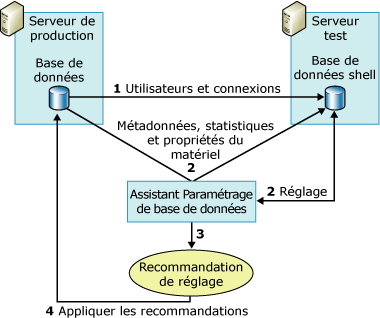

# <a name="reduce-the-production-server-tuning-load"></a>Réduire la charge de paramétrage du serveur de production
[!INCLUDE[appliesto-ss-asdb-xxxx-xxx-md](../../includes/appliesto-ss-asdb-xxxx-xxx-md.md)]
  [!INCLUDE[ssDE](../../includes/ssde-md.md)] L’Assistant Paramétrage compte sur l’optimiseur de requête pour analyser une charge de travail et faire des recommandations de paramétrage. Le fait d'effectuer cette analyse sur le serveur de production augmente la charge du serveur et peut dégrader les performances du serveur pendant la session de paramétrage. Vous pouvez réduire l'impact sur la charge du serveur pendant une session de paramétrage en utilisant un serveur de test en plus du serveur de production.  
  
## <a name="how-database-engine-tuning-advisor-uses-a-test-server"></a>Utilisation d'un serveur de test par l'Assistant Paramétrage du moteur de base de données  
 En règle générale, pour utiliser un serveur de test, vous copiez toutes les données du serveur de production vers le serveur de test, paramétrez le serveur de test et implémentez la recommandation sur le serveur de production. Cette méthode élimine le problème d'impact sur les performances du serveur de production, mais elle ne constitue pas la solution la plus efficace. La copie d'une importante quantité de données du serveur de production vers le serveur de test, par exemple, s'avère longue et consomme un nombre substantiel de ressources. En outre, le matériel du serveur de test est rarement aussi puissant que le matériel déployé pour les serveurs de production. Le processus de paramétrage repose sur l'optimiseur de requêtes. En outre, les recommandations qu'il génère sont partiellement basées sur le matériel sous-jacent. Si les matériels des serveurs de test et de production ne sont pas identiques, la qualité de la recommandation de l’Assistant Paramétrage du [!INCLUDE[ssDE](../../includes/ssde-md.md)] est moindre.  
  
 Pour éviter ces problèmes, l'Assistant Paramétrage du [!INCLUDE[ssDE](../../includes/ssde-md.md)] paramètre une base de production sur un serveur de production en déchargeant la majorité de la charge de paramétrage vers un serveur de test. Il procède ainsi en utilisant les informations de configuration matérielle du serveur de production et sans copier réellement les données du serveur de production vers le serveur de test. [!INCLUDE[ssDE](../../includes/ssde-md.md)] L’Assistant Paramétrage ne copie pas de données réelles du serveur de production sur le serveur de test. Il copie uniquement les métadonnées et les statistiques nécessaires.  
  
 Les étapes suivantes expliquent le processus de paramétrage d'une base de données de production sur un serveur de test :  
  
1.  Vérifiez que l'utilisateur qui veut utiliser le serveur de test existe sur les deux serveurs.  
  
     Avant de commencer, vérifiez que l'utilisateur qui veut utiliser le serveur de test pour paramétrer une base de données sur le serveur de production existe sur les deux serveurs. Ceci implique de créer l'utilisateur et sa connexion sur le serveur de test. Si vous êtes membre du rôle de serveur fixe **sysadmin** sur les deux ordinateurs, cette étape n’est pas nécessaire.  
  
2.  Paramétrez la charge de travail sur le serveur de test.  
  
     Pour paramétrer une charge de travail sur un serveur de test, vous devez utiliser un fichier d’entrée XML avec l’utilitaire de ligne de commande **dta** . Dans le fichier d’entrée XML, définissez le nom du serveur de test avec le sous-élément **TestServer** et définissez les valeurs des autres sous-éléments sous l’élément parent **TuningOptions** .  
  
     Au cours du paramétrage, l'Assistant Paramétrage du moteur de base de données crée une base de données shell sur le serveur de test. Pour créer cette base de données shell et la paramétrer, l'Assistant Paramétrage du moteur de base de données envoie des appels au serveur de production :  
  
    1.  [!INCLUDE[ssDE](../../includes/ssde-md.md)] L’Assistant Paramétrage importe des métadonnées de la base de données de production pour tester la base de données shell du serveur de test. Les métadonnées incluent des tables, des index, des vues des procédures stockées, des déclencheurs vides, etc. Ceci permet aux requêtes de charge de travail de s'exécuter par rapport à la base de données shell du serveur de test.  
  
    2.  [!INCLUDE[ssDE](../../includes/ssde-md.md)] L’Assistant Paramétrage importe des statistiques du serveur de production pour que l’optimiseur de requêtes puisse optimiser précisément les requêtes sur le serveur de test.  
  
    3.  [!INCLUDE[ssDE](../../includes/ssde-md.md)] L’Assistant Paramétrage importe des paramètres matériels définissant le nombre de processeurs et la mémoire disponible sur le serveur de production, afin de fournir à l’optimiseur de requêtes les informations dont il a besoin pour générer un plan de requête.  
  
3.  Une fois que l’Assistant Paramétrage du [!INCLUDE[ssDE](../../includes/ssde-md.md)] a paramétré la base de données shell du serveur de test, il génère une recommandation de paramétrage.  
  
4.  Appliquez la recommandation résultant du paramétrage du serveur de test au serveur de production.  
  
 L'illustration suivante montre le scénario du serveur de test et du serveur de production :  
  
   
  
> [!NOTE]  
>  La fonction de paramétrage du serveur de test n'est pas prise en charge par l'interface utilisateur graphique de l'Assistant Paramétrage du [!INCLUDE[ssDE](../../includes/ssde-md.md)] .  
  
## <a name="example"></a> Exemple  
 Tout d'abord, vérifiez que l'utilisateur qui veut effectuer le paramétrage existe sur le serveur de test et sur le serveur de production.  
  
 Une fois les informations de l'utilisateur copiées sur le serveur de test, vous pouvez définir la session de paramétrage du serveur de test dans le fichier d'entrée XML de l'Assistant Paramétrage du [!INCLUDE[ssDE](../../includes/ssde-md.md)] . L'exemple suivant de fichier d'entrée XML montre comment définir un serveur de test pour paramétrer une base de données avec l'Assistant Paramétrage du [!INCLUDE[ssDE](../../includes/ssde-md.md)] .  
  
 Dans cet exemple, la base de données `MyDatabaseName` est paramétrée sur `MyServerName`. Le script [!INCLUDE[tsql](../../includes/tsql-md.md)] , `MyWorkloadScript.sql`, est utilisé comme charge de travail. Cette charge de travail contient les événements exécutés par rapport à `MyDatabaseName`. La plupart des appels de l'optimiseur de requêtes vers cette base de données, qui sont effectués au cours du paramétrage, sont gérés par la base de données shell qui réside sur `MyTestServerName`. La base de données shell est constituée de métadonnées et de statistiques. Ce processus permet de décharger la surcharge de paramétrage vers le serveur de test. Lorsque l'Assistant Paramétrage du [!INCLUDE[ssDE](../../includes/ssde-md.md)] génère sa recommandation de paramétrage en utilisant ce fichier d'entrée XML, il ne doit tenir compte que des index (`<FeatureSet>IDX</FeatureSet>`). Il ne doit pas tenir compte du partitionnement et il n'a pas besoin de conserver les structures de conception physiques existantes dans `MyDatabaseName`.  
  
```  
<?xml version="1.0" encoding="utf-16" ?>  
<DTAXML xmlns:xsi="http://www.w3.org/2001/XMLSchema-instance" xmlns="http://schemas.microsoft.com/sqlserver/2004/07/dta">  
  <DTAInput>  
    <Server>  
      <Name>MyServerName</Name>  
      <Database>  
        <Name>MyDatabaseName</Name>  
      </Database>  
    </Server>  
    <Workload>  
      <File>MyWorkloadScript.sql</File>  
    </Workload>  
    <TuningOptions>  
      <TestServer>MyTestServerName</TestServer>  
      <FeatureSet>IDX</FeatureSet>  
      <Partitioning>NONE</Partitioning>  
      <KeepExisting>NONE</KeepExisting>  
    </TuningOptions>  
  </DTAInput>  
</DTAXML>  
```  
  
## <a name="see-also"></a> Voir aussi  
 [Observations relatives à l'utilisation de serveurs de test](../../relational-databases/performance/considerations-for-using-test-servers.md)   
 [Référence des fichiers d’entrée XML &#40;Assistant Paramétrage du moteur de base de données&#41;](../../tools/dta/xml-input-file-reference-database-engine-tuning-advisor.md)  
  
  
