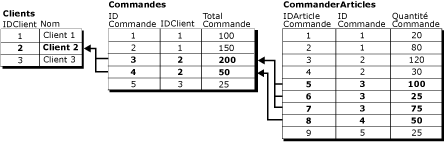
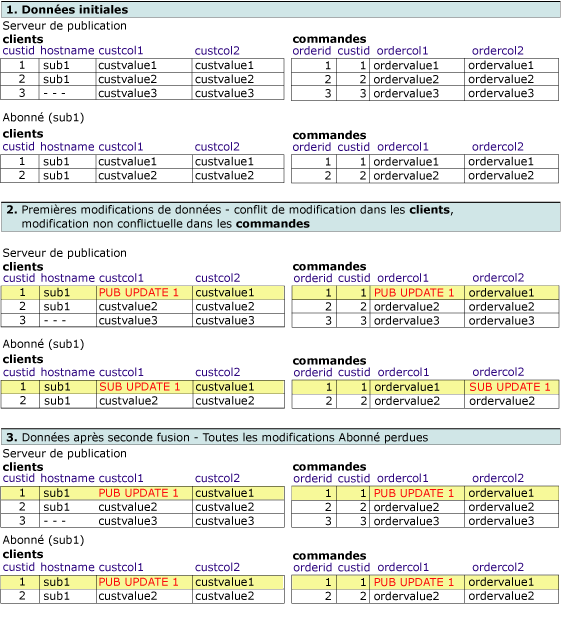
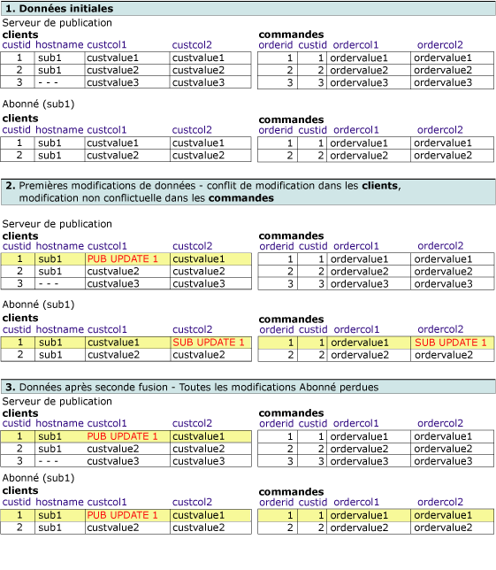
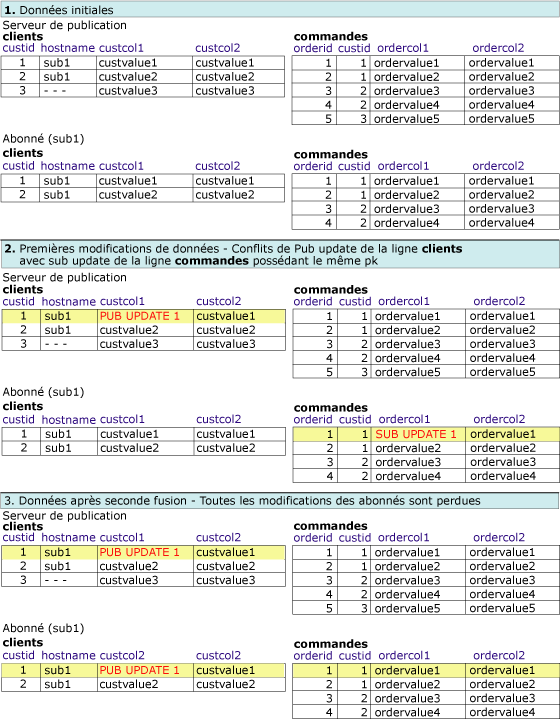

# Conflit de réplication de fusion avancée - Résolution dans les enregistrements logiques
[!INCLUDE[appliesto-ss-xxxx-xxxx-xxx-md](../../../includes/appliesto-ss-xxxx-xxxx-xxx-md.md)]
  Cette rubrique couvre les différentes combinaisons des approches possibles de détection et de résolution des conflits lors de l'utilisation d'enregistrements logiques. Un conflit se produit dans une réplication de fusion quand un ou plusieurs nœuds modifient les mêmes données, ou quand la réplication de fusion rencontre certains types d'erreurs lors de la réplication de modifications, par exemple une violation de contrainte. Pour plus d'informations sur la détection et la résolution des conflits, consultez [Advanced Merge Replication Conflict Detection and Resolution](../../../relational-databases/replication/merge/advanced-merge-replication-conflict-detection-and-resolution.md).  
  
 Pour spécifier le niveau de suivi et de résolution des conflits pour un article, consultez [Specify the Conflict Tracking and Resolution Level for Merge Articles](../../../relational-databases/replication/publish/specify-the-conflict-tracking-and-resolution-level-for-merge-articles.md).  
  
## Détection des conflits  
 La façon dont les conflits sont détectés pour les enregistrements logiques est déterminée par deux propriétés d'article : **column_tracking** et **logical_record_level_conflict_detection**. [!INCLUDE[ssVersion2005](../../../includes/ssversion2005-md.md)] et les versions ultérieures prennent également en charge la détection au niveau des enregistrements logiques.  
  
 La propriété d'article **logical_record_level_conflict_detection** peut être définie à TRUE ou à FALSE. La valeur doit être définie seulement pour l'article parent du plus haut niveau et sera ignorée par les articles enfants. Si cette valeur est FALSE, la réplication de fusion détecte les conflits comme dans les versions antérieures de [!INCLUDE[ssNoVersion](../../../includes/ssnoversion-md.md)], en se basant uniquement sur la valeur de la propriété **column_tracking** de l'article. Si cette valeur est TRUE, la réplication de fusion ignore la propriété **column_tracking** de l'article et détecte un conflit si des modifications sont effectuées à un endroit quelconque de l'enregistrement logique. Considérons par exemple ce scénario :  
  
   
  
 Un conflit est détecté si deux utilisateurs modifient des valeurs pour l'enregistrement logique Customer2 dans les tables **Customers**, **Orders**ou **OrderItems** . Cet exemple concerne des modifications effectuées via une instruction UPDATE, mais le conflit peut aussi être détecté pour des modifications effectuées avec des instructions INSERT ou DELETE.  
  
## Résolution de conflits  
 Par défaut, la réplication de fusion utilise une logique basée sur les priorités pour résoudre les conflits. Si une modification conflictuelle est effectuée dans deux bases de données d'Abonné, la modification pour l'Abonné ayant la priorité d'abonnement la plus élevée l'emporte, ou bien, si les priorités sont identiques, la première modification à atteindre le serveur de publication l'emporte. Avec une détection au niveau des lignes ou au niveau des colonnes, la ligne gagnante tout entière remplace toujours la ligne perdante.  
  
 La propriété d'article **logical_record_level_conflict_resolution** peut être définie à TRUE ou à FALSE. La valeur doit être définie seulement pour l'article parent du plus haut niveau et sera ignorée par les articles enfants. Si la valeur est TRUE, l'enregistrement logique gagnant tout entier remplace l'enregistrement logique perdant. Si la valeur est FALSE, les lignes gagnantes individuelles peuvent provenir de différents Abonnés ou serveurs de publication. Par exemple, l'Abonné A peut remporter un conflit sur une ligne de la table **Orders** , et l'Abonné B peut remporter un conflit sur une ligne associée de la table **OrderItems** . Le résultat est un enregistrement logique avec la ligne **Orders** provenant de l'Abonné A et la ligne **OrderItems** provenant de l'Abonné B.  
  
## Interaction des paramètres de résolution et de détection des conflits  
 L'apparition de conflits dépend de l'interaction des paramètres de détection et de résolution des conflits. Pour les exemples ci-dessous, il est supposé que la résolution des conflits basée sur les priorités est utilisée. Lors de l'utilisation d'enregistrements logiques, les possibilités sont les suivantes :  
  
-   Détection au niveau des lignes ou des colonnes, résolution au niveau des lignes  
  
-   Détection au niveau des colonnes, résolution au niveau des enregistrements logiques  
  
-   Détection au niveau des colonnes, résolution au niveau des enregistrements logiques  
  
-   Détection au niveau des enregistrements logiques, résolution au niveau des enregistrements logiques  
  
### Détection au niveau des lignes ou des colonnes, résolution au niveau des lignes  
 Dans cet exemple, la publication est configurée avec :  
  
-   **column_tracking** a la valeur TRUE ou FALSE  
  
-   **logical_record_level_conflict_detection** a la valeur FALSE  
  
-   **logical_record_level_conflict_resolution** a la valeur FALSE  
  
 Dans ce cas, la détection est au niveau des lignes ou des colonnes, et la résolution est au niveau des lignes. Ces paramètres sont utilisés pour bénéficier de la possibilité que toutes les modifications à un enregistrement logique soient répliquées comme une unité, mais sans détection ni résolution des conflits au niveau des enregistrements logiques.  
  
### Détection au niveau des colonnes, résolution au niveau des enregistrements logiques  
 Dans cet exemple, la publication est configurée avec :  
  
-   **column_tracking** a la valeur TRUE  
  
-   **logical_record_level_conflict_detection** a la valeur FALSE  
  
-   **logical_record_level_conflict_resolution** est TRUE  
  
 Un serveur de publication et un Abonné démarrent avec le même jeu de données, et un enregistrement logique est défini entre les tables **orders** et **customers** . Le serveur de publication modifie la colonne **custcol1** de la table **customers** et la colonne **ordercol1** de la table **orders** . L'Abonné modifie la colonne **custcol1** dans la même ligne de la table **customers** et la colonne **ordercol2** dans la même ligne de la table **orders** . Les modifications apportées à la même colonne **customer** aboutissent à un conflit, mais les modifications à la table **orders** ne sont pas en conflit.  
  
 Les conflits étant résolus au niveau de l'enregistrement logique, les modifications gagnantes effectuées sur le serveur de publication remplacent les modifications effectuées dans les tables de l'Abonné lors du processus de réplication.  
  
   
  
### Détection au niveau des colonnes, résolution au niveau des enregistrements logiques  
 Dans cet exemple, la publication est configurée avec :  
  
-   **column_tracking** a la valeur FALSE  
  
-   **logical_record_level_conflict_detection** a la valeur FALSE  
  
-   **logical_record_level_conflict_resolution** est TRUE  
  
 Un serveur de publication et un Abonné démarrent avec le même jeu de données. Le serveur de publication modifie la colonne **custcol1** dans la table **customers** . L'Abonné modifie la colonne **custcol2** de la table **customers** et la colonne **ordercol2** de la table **orders** . Les modifications apportées à la même ligne de la table **customers** aboutissent à un conflit, mais les modifications de l'Abonné à la table **orders** ne sont pas en conflit.  
  
 Les conflits étant résolus au niveau de l'enregistrement logique, lors de la synchronisation, les modifications gagnantes effectuées sur le serveur de publication remplacent les modifications effectuées dans les tables de l'Abonné.  
  
   
  
### Détection au niveau des enregistrements logiques, résolution au niveau des enregistrements logiques  
 Dans cet exemple, la publication est configurée avec :  
  
-   **logical_record_level_conflict_detection** a la valeur TRUE  
  
-   **logical_record_level_conflict_resolution** est TRUE  
  
 Un serveur de publication et un Abonné démarrent avec le même jeu de données. Le serveur de publication modifie la colonne **custcol1** dans la table **customers** . L'Abonné modifie la colonne **ordercol1** dans la table **orders** . Il n'y a pas de modifications pour la même ligne ou les mêmes colonnes, mais parce que des modifications sont effectuées dans le même enregistrement logique pour **custid**=1, les modifications sont détectées en tant que conflit au niveau de l'enregistrement logique.  
  
 Les conflits étant résolus au niveau de l'enregistrement logique, lors de la synchronisation, les modifications gagnantes effectuées sur le serveur de publication remplacent les modifications effectuées dans les tables de l'Abonné.  
  
   
  
##  Voir aussi  
 [Regrouper les modifications apportées à des lignes connexes à l’aide d’enregistrements logiques](../../../relational-databases/replication/merge/group-changes-to-related-rows-with-logical-records.md)  
  
  
