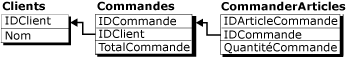
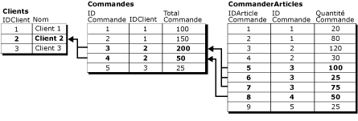
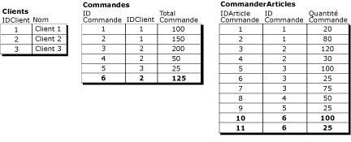
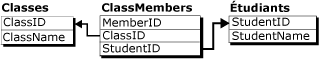

# Regrouper les modifications apportées à des lignes connexes à l'aide d'enregistrements logiques
[!INCLUDE[appliesto-ss-xxxx-xxxx-xxx-md](../../../includes/appliesto-ss-xxxx-xxxx-xxx-md.md)]
    
> [!NOTE]  
>  [!INCLUDE[ssNoteDepFutureAvoid](../../../includes/ssnotedepfutureavoid-md.md)]  
  
 Par défaut, la réplication de fusion traite les modifications de données ligne par ligne. Dans de nombreux cas, c'est parfaitement justifié mais pour certaines applications, il est primordial de traiter les lignes connexes en tant qu'unité. La fonctionnalité d'enregistrements logiques de la réplication de fusion permet de définir une relation entre des lignes connexes de différentes tables afin que les lignes soient traitées en tant qu'unité.  
  
> [!NOTE]  
>  Cette fonctionnalité peut être utilisée seule ou avec des filtres de jointure. Pour plus d'informations sur les filtres de jointure, consultez [Join Filters](../../../relational-databases/replication/merge/join-filters.md). Pour utiliser les enregistrements logiques, le niveau de compatibilité de la publication doit être au minimum égal à 90RTM.  
  
 Prenons l'exemple des trois tables liées suivantes :  
  
   
  
 La table **Customers** est la table parent dans cette relation et possède une colonne clé primaire **CustID**. La table **Orders** possède une colonne clé primaire **OrderID**, avec une contrainte de clé étrangère sur la colonne **CustID** qui fait référence à la colonne **CustID** de la table **Customers** . De la même façon, la table **OrderItems** possède une colonne clé primaire **OrderItemID**, avec une contrainte de clé étrangère sur la colonne **OrderID** qui fait référence à la colonne **OrderID** de la table **Orders** .  
  
 Dans cet exemple, un enregistrement logique est constitué de toutes les lignes de la table **Orders** associées à une valeur **CustID** unique et de toutes les lignes de la table **OrderItems** associées aux lignes de la table **Orders** . Ce diagramme illustre toutes les lignes des trois tables figurant dans l'enregistrement logique de Customer2 :  
  
   
  
 Pour définir une relation d'enregistrement logique entre articles, consultez [Define a Logical Record Relationship Between Merge Table Articles](../../../relational-databases/replication/publish/define-a-logical-record-relationship-between-merge-table-articles.md).  
  
## Avantages des enregistrements logiques  
 La fonctionnalité des enregistrements logiques possède essentiellement deux avantages :  
  
-   Application des modifications de données en tant qu'unité.  
  
-   Détection et résolution de conflits simultanément sur plusieurs lignes de plusieurs tables.  
  
### Application des modifications en tant qu'unité  
 Si le traitement de fusion est interrompu, par exemple en cas d'abandon de la connexion, le jeu partiellement exécuté de modifications répliquées liées est restauré lorsque vous utilisez les enregistrements logiques. Prenons l'exemple d'un Abonné qui ajoute une nouvelle commande ( **OrderID** = 6) et deux nouvelles lignes dans la table **OrderItems** ( **OrderItemID** = 10 et **OrderItemID** = 11) pour **OrderID** = 6.  
  
   
  
 Si le processus de réplication est interrompu après l'exécution de la ligne **Orders** de **OrderID** = 6 mais avant la fin de l'exécution de **OrderItems** 10 et 11 et que vous n'utilisez pas les enregistrements logiques, la valeur **OrderTotal** pour **OrderID** = 6 ne correspondra pas à la somme des valeurs **OrderAmount** des lignes **OrderItems** . Si vous utilisez les enregistrements logiques, la ligne **Orders** de **OrderID** = 6 n'est pas validée tant que les modifications de **OrderItems** liées ne sont pas répliquées.  
  
 Dans un autre scénario, si les enregistrements logiques sont utilisés et qu'un utilisateur interroge les tables pendant l'application de modifications par le processus de fusion, il ne voit les modifications partiellement répliquées qu'à partir du moment où elles sont toutes terminées. Imaginons que le processus de réplication a téléchargé la ligne Orders de **OrderID** = 6 mais qu'un utilisateur interroge les tables avant que le processus de réplication ait répliqué les lignes **OrderItems** : la valeur de **OrderTotal** ne correspondra pas à la somme des valeurs de **OrderAmount** . Si vous utilisez des enregistrements logiques, la ligne **Orders** ne sera pas visible tant que les lignes **OrderItems** ne sont pas terminées et que la transaction n'a pas été validée en tant qu'unité.  
  
### Application de la gestion des conflits à plusieurs tables  
 Envisageons le cas où deux Abonnés disposent du dataset ci-dessus :  
  
-   Un utilisateur du premier Abonné remplace la valeur 100 figurant dans **OrderAmount** de **OrderItemID** 5 par 150 et la valeur 200 figurant dans **OrderTotal** de **OrderID** 3 par 250.  
  
-   Un utilisateur du deuxième Abonné remplace la valeur 25 figurant dans **OrderAmount** de **OrderItemID** 6 par 125 et la valeur 200 figurant dans **OrderTotal** de **OrderID** 3 par 300.  
  
 Si ces modifications sont répliquées sans utiliser d'enregistrement logique, les différentes valeurs de **OrderTotal** se traduisent par un conflit et seule l'une d'elles est répliquée. Mais les modifications non conflictuelles apportées à la table **OrderItems** seront répliquées sans conflit, avec pour conséquence une incohérence des valeurs finales de **OrderTotal** par rapport aux lignes **OrderItems** . Si vous utilisez des enregistrements logiques dans ce scénario, la modification de **OrderItems** associée à la modification perdante de la table **Orders** sera également restaurée et la valeur finale de **OrderTotal** représentera la synthèse exacte des lignes **OrderItems** .  
  
 Pour plus d’informations sur la détection et la résolution des conflits avec des enregistrements logiques, consultez [Détection et résolution des conflits dans les enregistrements logiques](../../../relational-databases/replication/merge/advanced-merge-replication-conflict-resolving-in-logical-record.md).  
  
## Considérations sur l'utilisation des enregistrements logiques  
 Les éléments suivants doivent être pris en compte lors de l'utilisation d'enregistrements logiques.  
  
### Considérations générales  
  
-   Il est recommandé de limiter au maximum le nombre de tables dans un enregistrement logique : cinq tables ou moins.  
  
-   Les enregistrements logiques ne peuvent pas référencer des colonnes contenant l'un des types de données suivants :  
  
    -   **varchar(max)** et **nvarchar(max)**  
  
    -   **varbinary(max)**  
  
    -   **text** et **ntext**  
  
    -   **image**  
  
    -   **XML**  
  
    -   **UDT**  
  
-   Les relations de clé étrangère dans les tables publiées ne peuvent pas être définies avec l'option CASCADE. Pour plus d’informations, consultez [CREATE TABLE &#40;Transact-SQL&#41;](../../../t-sql/statements/create-table-transact-sql.md) et [ALTER TABLE &#40;Transact-SQL&#41;](../../../t-sql/statements/alter-table-transact-sql.md).  
  
-   Vous ne pouvez pas mettre à jour des colonnes utilisées dans la clause de relation logique.  
  
-   La résolution de conflits personnalisée avec des gestionnaires de logique métier ou des outils de résolution personnalisés n'est pas prise en charge pour les articles inclus dans un enregistrement logique.  
  
-   Si des enregistrements logiques sont utilisés dans une publication qui comprend des filtres paramétrés, vous devez initialiser chaque Abonné avec un instantané de sa partition. Si vous initialisez un Abonné avec une autre méthode, l'Agent de fusion échoue. Pour plus d’informations, voir [Snapshots for Merge Publications with Parameterized Filters](../../../relational-databases/replication/snapshots-for-merge-publications-with-parameterized-filters.md).  
  
-   Les conflits qui concernent des enregistrements logiques ne sont pas affichés dans l'Outil de résolution des conflits. Pour afficher des informations sur ces conflits, utilisez des procédures stockées de réplication. Pour plus d’informations, consultez [Afficher les informations relatives aux conflits pour les publications de fusion &#40;programmation Transact-SQL de la réplication&#41;](../../../relational-databases/replication/view-conflict-information-for-merge-publications.md).  
  
### Paramètres de la publication  
  
-   La publication doit présenter un niveau de compatibilité supérieur ou égal à 90RTM. Pour plus d’informations, consultez la section « Niveau de compatibilité de la publication » dans [Compatibilité descendante de la réplication](../../../relational-databases/replication/replication-backward-compatibility.md).  
  
-   La publication doit utiliser le mode d'instantané natif. Ceci est le mode par défaut sauf lorsque vous effectuez une réplication vers [!INCLUDE[ssEW](../../../includes/ssew-md.md)], qui ne prend pas en charge les enregistrements logiques.  
  
-   La publication n'autorise pas la synchronisation Web. Pour plus d'informations sur la synchronisation Web, consultez [Web Synchronization for Merge Replication](../../../relational-databases/replication/web-synchronization-for-merge-replication.md).  
  
-   Pour utiliser des enregistrements logiques sur une publication filtrée :  
  
    -   Des partitions précalculées doivent également être utilisées. Les conditions requises associées aux partitions précalculées s'appliquent également aux enregistrements logiques. Pour plus d’informations, consultez [Optimiser les performances des filtres paramétrés avec des partitions précalculées](../../../relational-databases/replication/merge/parameterized-filters-optimize-for-precomputed-partitions.md).  
  
    -   Vous ne pouvez pas utiliser de filtres paramétrés qui ne se chevauchent pas. Pour plus d'informations, consultez la section « Définition des options de partition » de [Parameterized Row Filters](../../../relational-databases/replication/merge/parameterized-filters-parameterized-row-filters.md).  
  
-   Si la publication utilise des filtres de jointure, la propriété **join unique key** doit avoir la valeur **true** pour tous les filtres de jointure intervenant dans des relations d'enregistrement logique. Pour plus d’informations, voir [Join Filters](../../../relational-databases/replication/merge/join-filters.md).  
  
### Relations entre tables  
  
-   Les tables liées par l'intermédiaire d'enregistrements logiques doivent avoir une relation clé primaire-clé étrangère.  
  
-   L'option NOT FOR REPLICATION ne peut pas être définie pour des contraintes de clé étrangère.  
  
-   Les tables enfants ne peuvent avoir qu'une table parent.  
  
     Par exemple, une base de données effectuant un suivi des classes et des étudiants peut présenter une conception similaire à :  
  
       
  
     Vous ne pouvez pas utiliser un enregistrement logique pour représenter les trois tables de cette relation car les lignes de **ClassMembers** ne sont pas associées à une ligne de clé primaire unique. Les tables **Classes** et **ClassMembers** peuvent néanmoins constituer un enregistrement logique, de même que les tables **ClassMembers** et **Students**mais pas les trois ensemble.  
  
-   La publication ne peut pas contenir des relations de filtre de jointure circulaires.  
  
     Dans l'exemple des tables **Customers**, **Orders**et **OrderItems**, vous ne pourriez pas utiliser des enregistrements logiques si la table **Orders** possèdait également une contrainte de clé étrangère qui faisait référence à la table **OrderItems** .  
  
## Impact des enregistrements logiques sur les performances  
 La fonctionnalité d'enregistrement logique a une incidence sur les performances. Si vous n'utilisez pas les enregistrements logiques, l'Agent de réplication peut traiter toutes les modifications d'un article donné en même temps et, comme les modifications sont appliquées ligne par ligne, le verrouillage et les activités du journal des transactions requis pour l'application des modifications sont minimes.  
  
 Si vous utilisez des enregistrements logiques, l'Agent de fusion doit traiter les modifications de tout l'enregistrement logique ensemble. Le temps nécessaire à l'Agent de fusion pour répliquer les lignes est alors plus long. En outre, comme l'Agent ouvre une transaction distincte pour chaque enregistrement logique, le verrouillage requis est plus important.  
  
##  Voir aussi  
 [Options d’articles pour la réplication de fusion](../../../relational-databases/replication/merge/article-options-for-merge-replication.md)  
  
  
