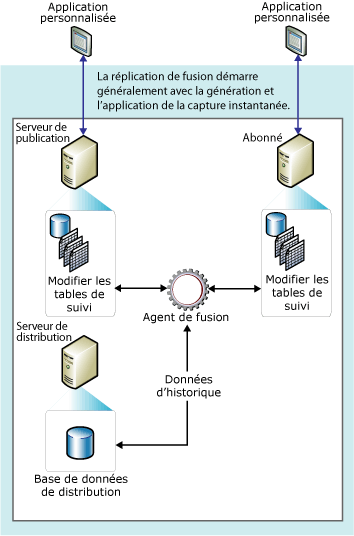

# Réplication de fusion
[!INCLUDE[appliesto-ss-xxxx-xxxx-xxx-md](../../../includes/appliesto-ss-xxxx-xxxx-xxx-md.md)]
  La réplication de fusion, comme la réplication transactionnelle, démarre généralement avec un instantané des objets et des données de la base de données de publication. Les modifications de données et de schéma ultérieures qui sont effectuées sur le serveur de publication et sur les Abonnés sont suivies avec des déclencheurs. L'abonné est synchronisé avec l'éditeur lorsqu'il est connecté au réseau et il échange toutes les lignes qui ont changé entre l'éditeur et l'abonné depuis la dernière synchronisation.  
  
 La réplication de fusion est généralement utilisée dans des environnements de serveur à client. La réplication de fusion est appropriée dans les situations suivantes :  
  
-   Plusieurs abonnés peuvent mettre à jour les mêmes données à différents moments et propager ces modifications au serveur de publication et à d'autres Abonnés.  
  
-   des abonnés doivent recevoir des données, apporter des modifications hors connexion et synchroniser ultérieurement ces modifications avec l'éditeur et d'autres abonnés ;  
  
-   Chaque Abonné requiert une partition de données différente.  
  
-   Des conflits peuvent se produire et, le cas échéant, vous devez pouvoir les détecter et les résoudre.  
  
-   L'application requiert le résultat des modifications des données au lieu de devoir accéder aux états intermédiaires des données. Par exemple, si une ligne change cinq fois sur un Abonné avant qu'il se synchronise avec un serveur de publication, la ligne ne change qu'une seule fois sur le serveur de publication pour refléter le résultat final des modifications (c'est-à-dire la cinquième valeur).  
  
 La réplication de fusion permet à plusieurs sites de fonctionner de manière autonome, pour fusionner ensuite leurs mises à jour en un résultat unique et uniforme. Étant donné que les mises à jour sont effectuées sur plusieurs nœuds, les mêmes données ont pu être mises à jour par le serveur de publication et par plusieurs Abonnés. Par conséquent, des conflits peuvent se produire quand des mises à jour sont fusionnées ; la réplication de fusion fournit plusieurs moyens de gérer ces conflits.  
  
 La réplication de fusion est implémentée par l'Agent d'instantané et l'Agent de fusion [!INCLUDE[ssNoVersion](../../../includes/ssnoversion-md.md)] . Si la publication est non filtrée ou si elle utilise des filtres statiques, l'Agent d'instantané crée un  instantané unique. Si la publication utilise des filtres paramétrés, l'Agent d'instantané crée un instantané pour chaque partition de données. L'Agent de fusion applique les instantanés initiaux aux Abonnés. Il fusionne également les modifications de données incrémentielles effectuées sur le serveur de publication ou les Abonnés après la création de l'instantané initial, puis détecte et résout les éventuels conflits en fonction des règles que vous avez définies.  
  
 Pour permettre le suivi des modifications, la réplication de fusion (ainsi que la réplication transactionnelle avec mise à jour d'abonnements en attente) doit pouvoir identifier de manière unique chaque ligne dans chaque table publiée. Pour ce faire, la réplication de fusion ajoute la colonne **rowguid** à chaque table, à moins que la table ne dispose déjà d'une colonne de type de données **uniqueidentifier** avec la propriété **ROWGUIDCOL** définie (auquel cas cette colonne est utilisée). Si la table est supprimée de la publication, la colonne **rowguid** est supprimée ; si une colonne existante était utilisée pour le suivi, la colonne n'est pas supprimée. Aucun filtre ne doit inclure le **rowguidcol** utilisé par la réplication pour identifier les lignes. La fonction **newid()** est fournie en tant que fonction par défaut pour la colonne **rowguid** . Toutefois, les clients peuvent fournir un GUID pour chaque ligne, si nécessaire. Toutefois, ne fournissez pas la valeur 00000000-0000-0000-0000-000000000000.  
  
 Le diagramme suivant montre les composants utilisés dans la réplication de fusion.  
  
   
  
  
