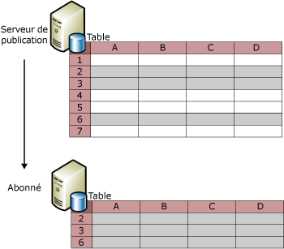
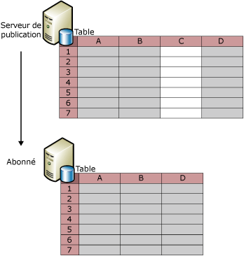
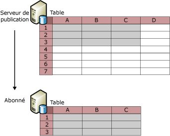

# Filtrer des données publiées
[!INCLUDE[appliesto-ss-xxxx-xxxx-xxx-md](../../../includes/appliesto-ss-xxxx-xxxx-xxx-md.md)]
  Le filtrage des articles d'une table vous permet de créer des partitions de données à publier. En filtrant les données publiées, vous pouvez :  
  
-   Réduire la quantité de données envoyées via le réseau.  
  
-   Réduire la quantité d’espace de stockage requis sur l’abonné.  
  
-   Personnaliser les publications et les applications en fonction des exigences des abonnés individuels.  
  
-   Éviter ou réduire les conflits lorsque les abonnés mettent à jour les données car différentes partitions de données peuvent être envoyées vers différents abonnés (deux abonnés ne mettent pas à jour les mêmes valeurs de données).  
  
-   Éviter de transmettre des données sensibles. Vous pouvez utiliser les filtres de lignes et de colonne pour limiter l'accès d'un abonné aux données. Pour les réplications de fusion, vous devez tenir compte de certains points de sécurité si vous utilisez un filtre paramétré qui inclut HOST_NAME(). Pour plus d'informations, consultez la section « Filtrage avec HOST_NAME() » dans [Parameterized Row Filters](../../../relational-databases/replication/merge/parameterized-filters-parameterized-row-filters.md).  
  
 La réplication offre quatre types de filtres :  
  
-   Les filtres de lignes statiques, disponibles avec tous les types de réplication.  
  
     À l'aide des filtres de lignes statiques, vous pouvez choisir un sous-ensemble de lignes à publier. Tous les abonnés à une publication filtrée reçoivent le même sous-ensemble de lignes pour la table filtrée. Pour plus d'informations, consultez la section « Filtres de lignes statiques » dans cette rubrique.  
  
-   Les filtres de colonnes, disponibles avec tous les types de réplication.  
  
     À l'aide des filtres de colonnes, vous pouvez choisir un sous-ensemble de colonnes à publier. Pour plus d'informations, consultez la section « Filtres de colonnes » dans cette rubrique.  
  
-   Les filtres de lignes paramétrables, disponibles uniquement avec la réplication de fusion.  
  
     À l'aide des filtres de lignes paramétrables, vous pouvez choisir un sous-ensemble de lignes à publier. Contrairement aux filtres statiques qui envoient le même sous-ensemble de lignes à chaque abonné, les filtres des lignes paramétrables se servent d'une valeur de données fournie par l'Abonné pour envoyer différents sous-ensembles de lignes aux abonnés. Pour plus d’informations, consultez [Parameterized Row Filters](../../../relational-databases/replication/merge/parameterized-filters-parameterized-row-filters.md).  
  
-   Les filtres de jointure, disponibles uniquement avec la réplication de fusion.  
  
     À l'aide des filtres de jointure, vous pouvez étendre un filtre de lignes d'une table publiée à l'autre. Pour plus d’informations, consultez [Join Filters](../../../relational-databases/replication/merge/join-filters.md).  
  
## filtres de lignes statiques  
 L'illustration suivante montre une table publiée filtrée pour que seules les lignes 2, 3 et 6 soient intégrées à la publication.  
  
   
  
 Un filtre de lignes statiques utilise une clause WHERE pour sélectionner les données appropriées à publier, c'est à vous de spécifier la dernière partie de la clause WHERE. Considérez la table **Product** dans l'exemple de base de données Adventure Works, qui contient la colonne **ProductLine**. Pour publier uniquement les lignes comportant des données relatives aux vélos tout terrain, spécifiez `ProductLine = 'M'`.  
  
 Un filtre de lignes statiques a pour résultat un ensemble unique de données pour chaque publication. Dans l'exemple précédent, tous les abonnés doivent recevoir uniquement les lignes avec des données sur les produits relatifs aux vélos tout terrain. Si vous avez un autre abonné qui a également uniquement besoin des lignes avec des données relatives aux vélos tout terrain :  
  
-   Avec la réplication d'instantané ou transactionnelle, vous pouvez créer une autre publication et inclure la table dans les deux publications (spécifiez `ProductLine = 'R')`dans la clause de filtre pour l'article de cette publication).  
  
    > [!NOTE]  
    >  Dans les publications transactionnelles, les filtres de lignes peuvent ajouter un surcroît de traitement considérable car la clause de filtrage d'articles est évaluée pour chaque ligne de journal écrite pour une table publiée afin de déterminer si la ligne doit être répliquée. Les filtres de lignes doivent être évités dans les publications transactionnelles si chaque nœud de réplication peut prendre en charge la charge complète des données, et si l'ensemble global des données est relativement peu volumineux.  
  
-   Avec la réplication de fusion, utilisez le filtrage des lignes paramétrables plutôt que la création de plusieurs publications à l'aide des filtres de lignes statiques. Pour plus d’informations, consultez [Parameterized Row Filters](../../../relational-databases/replication/merge/parameterized-filters-parameterized-row-filters.md).  
  
 Pour définir et modifier un filtre de lignes statiques, consultez [Define and Modify a Static Row Filter](../../../relational-databases/replication/publish/define-and-modify-a-static-row-filter.md).  
  
## Filtres de colonnes  
 L'illustration suivante montre une publication qui filtre la colonne C :  
  
   
  
 Vous pouvez également combiner le filtrage de lignes et de colonnes, comme le montre l'illustration suivante.  
  
   
  
 Après qu'une publication soit créée, vous pouvez utiliser le filtrage de colonnes pour supprimer une colonne d'une publication existante, mais la conserver dans la table sur le serveur de publication, et vous pouvez également inclure une colonne existante dans la publication. Pour les autres modifications, comme l'ajout d'une nouvelle colonne à une table puis à l'article publié, utilisez la réplication de modification de schéma. Pour plus d’informations, consultez les sections « Ajout de colonnes » et « Suppression de colonnes » dans la rubrique [Apporter des modifications au schéma sur des bases de données de publication](../../../relational-databases/replication/publish/make-schema-changes-on-publication-databases.md).  
  
 Les types de colonnes listés dans la table suivante ne peuvent pas être filtrés de certains types de publications.  
  
|Type de colonne|Type de publication et options|  
|-----------------|-------------------------------------|  
|colonne clé primaire|Les colonnes clés primaire sont requises pour toutes les tables des publications transactionnelles. Elles ne sont pas requises pour les tables des publications de fusion, mais si une colonne clé primaire est présente, elle ne peut pas être filtrée.|  
|colonne clé étrangère|Toutes les publications créées à l'aide de l'Assistant Nouvelle publication. Vous pouvez filtrer les colonnes clés étrangère à l'aide des procédures stockées Transact-SQL. Pour plus d'informations, consultez [Define and Modify a Column Filter](../../../relational-databases/replication/publish/define-and-modify-a-column-filter.md).|  
|La colonne **rowguid**|Publications de fusion*|  
|La colonne **msrepl_tran_version**|Publications d'instantané ou publications transactionnelles qui autorisent les abonnements pouvant être mis à jour|  
|Colonnes n'autorisant pas la valeur NULL et n'ayant pas de valeur par défaut ou n'ayant pas la propriété IDENTITY définie.|Publications d'instantané ou publications transactionnelles qui autorisent les abonnements pouvant être mis à jour|  
|Colonnes avec contraintes ou index uniques|Publications d'instantané ou publications transactionnelles qui autorisent les abonnements pouvant être mis à jour|  
|Toutes les colonnes d'une publication de fusion SQL Server 7.0|Il est impossible de filtrer les colonnes dans les publications de fusion SQL Server 7.0.|  
|Horodateur|Publications d'instantané ou publications transactionnelles SQL Server 7.0 qui autorisent les abonnements pouvant être mis à jour|  
  
 \*Si vous publiez une table dans une publication de fusion et que cette table contient déjà une colonne de type de données **uniqueidentifier** avec la propriété **ROWGUIDCOL** définie, la réplication peut utiliser cette colonne au lieu de créer une colonne supplémentaire nommée **rowguid**. Dans ce cas, la colonne existante doit être publiée.  
  
 Pour définir ou modifier un filtre de colonne, consultez [Define and Modify a Column Filter](../../../relational-databases/replication/publish/define-and-modify-a-column-filter.md).  
  
## Règles de filtrage  
 Retenez les règles suivantes lors du filtrage de données :  
  
-   Toutes les colonnes référencées dans les filtres de lignes doivent être intégrées à la publication. En d'autres termes, vous ne pouvez pas utiliser un filtre de colonne pour exclure une colonne utilisée dans un filtre de lignes.  
  
-   Si un filtre est ajouté ou modifié après l'initialisation des abonnements, ces derniers doivent être réinitialisés.  
  
-   La taille maximale d'une colonne utilisée dans un filtre est de 1 024 octets pour un article d'une publication de fusion, et de 8 000 octets pour un article d'une publication transactionnelle.  
  
-   Les colonnes avec les types de données suivants ne peuvent pas être référencées dans des filtres de lignes ou de jointure :  
  
    -   **varchar(max) et nvarchar(max)**  
  
    -   **varbinary(max)**  
  
    -   **text et ntext**  
  
    -   **image**  
  
    -   **XML**  
  
    -   **UDT**  
  
-   La réplication transactionnelle vous permet de répliquer une vue indexée comme une vue ou une table. Si vous répliquez la vue comme une table, vous ne pouvez pas filtrer les colonnes de la table.  
  
 Les filtres de lignes ne sont pas conçus pour fonctionner sur les bases de données. [!INCLUDE[ssNoVersion](../../../includes/ssnoversion-md.md)] limite volontairement l'exécution de **sp_replcmds** (les filtres qui s'exécutent sous) au propriétaire de la base de données (**dbo**). **dbo** n'a pas de privilèges de base de données croisés. Avec l'ajout de la capture de données modifiées (CDC) dans [!INCLUDE[ssKatmai](../../../includes/sskatmai-md.md)] the **sp_replcmds** remplit les tables de suivi des modifications avec les informations que l'utilisateur peut retourner et interroger. Pour des raisons de sécurité, [!INCLUDE[ssNoVersion](../../../includes/ssnoversion-md.md)] limite l'exécution de cette logique de façon à ce qu'un **dbo** malveillant ne puisse pas détourner ce chemin d'exécution. Par exemple, un **dbo** malveillant pourrait ajouter des déclencheurs sur les tables de capture de données modifiées qui seraient alors exécutés dans le contexte de l'utilisateur qui appelle **sp_replcmds**, dans ce cas l'agent lecteur du journal.  Si le compte sous lequel l'agent s'exécute dispose de privilèges plus élevés, le **dbo** malveillant pourrait transmettre ses privilèges.  
  
##  Voir aussi  
 [Publier des données et des objets de base de données](../../../relational-databases/replication/publish/publish-data-and-database-objects.md)  
  
  
