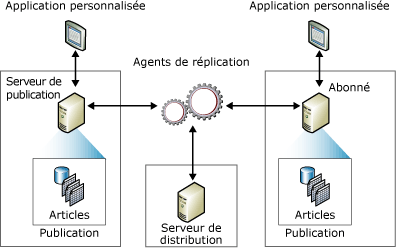

# Vue d’ensemble du modèle de publication de réplication
[!INCLUDE[appliesto-ss-xxxx-xxxx-xxx-md](../../../includes/appliesto-ss-xxxx-xxxx-xxx-md.md)]
  La réplication utilise une métaphore de l'industrie de l'édition pour représenter les composants d'une topologie de réplication ; elle comprend un serveur de publication, un serveur de distribution, des abonnés, des publications, des articles et des abonnements. Il peut être utile de penser à la réplication [!INCLUDE[msCoName](../../../includes/msconame-md.md)] [!INCLUDE[ssNoVersion](../../../includes/ssnoversion-md.md)] dans les mêmes termes qu'un magazine :  
  
-   L'éditeur d'un magazine produit une ou plusieurs publications  
  
-   Une publication contient des articles  
  
-   L'éditeur distribue le magazine directement ou bien utilise un distributeur  
  
-   Les abonnés reçoivent les publications auxquelles ils se sont abonnés  
  
 Même si la métaphore du magazine est utile à la compréhension de la réplication, il est important de noter que la réplication [!INCLUDE[ssNoVersion](../../../includes/ssnoversion-md.md)] inclut des fonctionnalités qui ne sont pas représentées dans cette métaphore, en particulier la possibilité pour un Abonné d'effectuer des mises à jour et pour un serveur de publication d'envoyer des modifications incrémentielles aux articles d'une publication.  
  
 Une *topologie de réplication* définit la relation entre les serveurs et les copies des données, et clarifie la logique qui détermine les flux des données entre les serveurs. La copie et le déplacement de données entre le serveur de publication et les Abonnés sont pris en charge par plusieurs processus de réplication (appelés *agents*) : L'illustration suivante donne une vue d'ensemble des composants et des processus impliqués dans la réplication.  
  
   
  
## Serveur de publication  
 Le serveur de publication est une instance de base de données qui rend les données disponibles à d'autres emplacements via la réplication. Le serveur de publication peut avoir une ou plusieurs publications définissant chacune un ensemble d'objets et de données logiquement liés et qui doit être répliqué.  
  
## Serveur de distribution  
 Le serveur de distribution est une instance de base de données qui fonctionne comme un magasin pour les données spécifiques de la réplication associées à un ou plusieurs serveurs de publication. Chaque serveur de publication est associé à une seule base de données (appelée base de données de distribution) au niveau du serveur de distribution. La base de données de distribution stocke les données d'état de la réplication, les métadonnées de la publication et, dans certains cas, fonctionne comme une file d'attente pour le déplacement des données du serveur de publication vers les Abonnés. Dans de nombreux cas, un même serveur de base de données fonctionne à la fois comme serveur de publication et comme serveur de distribution. On parle de *serveur de distribution local*. Quand le serveur de publication et le serveur de distribution sont configurés sur des instances de serveur de base de données distinctes, le serveur de distribution est appelé *serveur de distribution distant*.  
  
## Abonnés  
 Un Abonné est une instance de base de données qui reçoit des données répliquées. Un Abonné peut recevoir des données de plusieurs serveurs de publication et de plusieurs publications. En fonction du type de réplication choisi, l'Abonné peut aussi répercuter des modifications auprès du serveur de publication ou rééditer les données vers d'autres Abonnés.  
  
## Article  
 Un article identifie un objet de base de données qui fait partie d'une publication. Une publication peut contenir différents types d'articles : des tables, des vues, des procédures stockées et d'autres objets. Quand des tables sont publiées en tant qu'articles, des filtres peuvent être utilisés pour limiter les colonnes et les lignes de données envoyées aux Abonnés.  
  
## Publication  
 Une publication est une collection d'un ou plusieurs articles provenant d'une base de données. Le regroupement de plusieurs articles en une publication facilite la spécification d'un ensemble logique d'objets de base de données et de données qui sont répliqués comme une seule unité.  
  
## Abonnement  
 Un abonnement est une requête portant sur la remise d'une copie d'une publication à un Abonné. L'abonnement définit la publication qui sera reçue, et où et quand elle sera reçue. Il existe deux types d'abonnements : les abonnements par émission de données et les abonnements par extraction. Pour plus d’informations sur les abonnements par envoi et par extraction de données, consultez [S’abonner à des publications](../../../relational-databases/replication/subscribe-to-publications.md).  
  
##  Voir aussi  
 [Vue d’ensemble des Agents de réplication](../../../relational-databases/replication/agents/replication-agents-overview.md)   
 [Types de réplication](../../../relational-databases/replication/types-of-replication.md)   
 [Configurer la réplication pour les groupes de disponibilité Always On (SQL Server)](../../../database-engine/availability-groups/windows/configure-replication-for-always-on-availability-groups-sql-server.md)   
 [Gestion d’une base de données de publication Always On (SQL Server)](../../../database-engine/availability-groups/windows/maintaining-an-always-on-publication-database-sql-server.md)  
  
  
