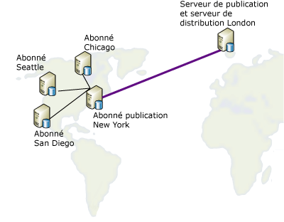

# Republier des donn&#233;es
  Dans un modèle de republication, le serveur de publication envoie les données à un Abonné qui les retransmet ensuite à un nombre quelconque d'Abonnés. Cette méthode est utile lorsqu'un serveur de publication doit envoyer les données à des Abonnés via une liaison de communication lente ou coûteuse. S'il existe beaucoup d'Abonnés à l'extrémité distante de cette liaison, l'utilisation d'un serveur de republication permet de déplacer la totalité de la charge de distribution de ce côté de la liaison.  
  
 Pour republier les données, procédez comme suit :  
  
1.  Créez une publication sur le serveur de publication.  
  
2.  Créez un abonnement à une publication pour l'Abonné chargé de la republication.  
  
3.  Initialisez l'abonnement. L'abonnement doit être initialisé avant de créer la publication sur l'Abonné chargé de la republication sans quoi la réplication échoue.  
  
4.  Créez une publication dans la base de données d'abonnement sur l'Abonné chargé de la republication.  
  
5.  Créez des abonnements à la publication sur l'Abonné chargé de la republication pour les autres Abonnés.  
  
6.  Initialisez les abonnements.  
  
> [!NOTE]  
>  Si vous utilisez la réplication de fusion dans une topologie de republication, tous les Abonnés chargés de la republication doivent utiliser des abonnements serveur. Pour plus d’informations sur les types d’abonnement, consultez la page [s’abonner aux Publications](../../relational-databases/replication/subscribe-to-publications.md).  
  
 Dans l'illustration suivante, le serveur de publication et celui de republication sont aussi leurs propres distributeurs locaux. Si chacun d'eux a été configuré pour utiliser un serveur de distribution distant, chaque serveur de distribution doit se trouver du même côté de la liaison de communication lente ou coûteuse que son serveur de publication. Les serveurs de publication doivent être connectés à des serveurs de distribution distants par l'intermédiaire de liaisons de communications fiables à haut débit.  
  
   
  
 Tous les serveurs peuvent être à la fois serveur de publication et Abonné. Le diagramme suivant illustre l'exemple d'une publication d'une table située à Londres et qui doit être distribuée dans quatre villes aux États-Unis : Chicago, New York, San Diego et Seattle. Le serveur situé à New York a été sélectionné pour s'abonner à la table publiée sur le serveur londonien, car le site new-yorkais réunit les conditions suivantes :  
  
-   La liaison réseau de retour vers Londres est relativement fiable.  
  
-   Les coûts de communication de Londres à New York sont acceptables.  
  
-   Les lignes de communication réseau à partir de New York vers tous les autres sites d'Abonnés aux États-Unis sont de bonne qualité.  
  
       
  
 La réplication prend en charge les scénarios de republication répertoriés dans le tableau ci-dessous.  
  
|Serveur de publication|Abonné de publication|Abonné|  
|---------------|---------------------------|----------------|  
|Publication transactionnelle|Abonnement transactionnel/publication transactionnelle|Abonnement transactionnel|  
|Publication transactionnelle|Abonnement transactionnel/publication de fusion*|Abonnement de fusion|  
|Publication de fusion|Abonnement de fusion/publication de fusion|Abonnement de fusion|  
|Publication de fusion|Abonnement de fusion/publication transactionnelle|Abonnement transactionnel|  
  
 \*Vous devez définir le **@published_in_tran_pub** propriété sur la publication de fusion. Par défaut, la réplication transactionnelle suppose que les tables sur l'Abonné soient traitées en tant qu'éléments accessibles en lecture seule. Si la réplication de fusion apporte des modifications aux données d'une table dans un abonnement transactionnel, une non-convergence de données peut se produire. Pour éviter ce risque, il est recommandé de spécifier toute table de ce type en tant qu'objet en téléchargement seul dans la publication de fusion. Cela empêche un Abonné de fusion de télécharger les modifications apportées aux données de la table. Pour plus d’informations, consultez [optimiser les performances de réplication de fusion avec des Articles avec](../../relational-databases/replication/merge/optimize-merge-replication-performance-with-download-only-articles.md).  
  
## Voir aussi  
 [Configurer la distribution](../../relational-databases/replication/configure-distribution.md)   
 [Publier des données et des objets de base de données](../../relational-databases/replication/publish/publish-data-and-database-objects.md)   
 [S'abonner à des publications](../../relational-databases/replication/subscribe-to-publications.md)   
 [Initialiser un abonnement](../../relational-databases/replication/initialize-a-subscription.md)   
 [Synchronisez les données](../../relational-databases/replication/synchronize-data.md)  
  
  