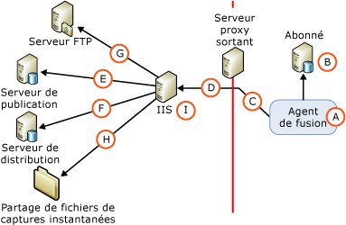

# Architecture de la sécurité pour la synchronisation web
[!INCLUDE[appliesto-ss-xxxx-xxxx-xxx-md](../../../includes/appliesto-ss-xxxx-xxxx-xxx-md.md)]
  [!INCLUDE[msCoName](../../../includes/msconame-md.md)] [!INCLUDE[ssNoVersion](../../../includes/ssnoversion-md.md)] permet un contrôle fin de la configuration de la sécurité de la synchronisation Web. Cette rubrique donne une liste complète de tous les composants qui peuvent être inclus dans une configuration de synchronisation Web, ainsi que des informations sur les connexions qui sont établies entre ces composants. [!INCLUDE[ssNoteWinAuthentication](../../../includes/ssnotewinauthentication-md.md)]  
  
 L'illustration suivante présente toutes les connexions envisageables, mais il est possible que certaines d'entre elles ne soient pas nécessaires dans une topologie donnée. Par exemple, une connexion à un serveur FTP est nécessaire uniquement si l'instantané est remis à l'aide de FTP.  
  
   
  
 Les tableaux suivants décrivent les composants et les connexions présentés dans l'illustration.  
  
## A. Utilisateur Windows sous lequel l'Agent de fusion est exécuté  
 Au cours de la synchronisation, l'Agent de fusion (A) est démarré chez l'Abonné. L'Agent de fusion peut être démarré à partir d'une étape de travail de l'Agent [!INCLUDE[ssNoVersion](../../../includes/ssnoversion-md.md)] ou d'une application personnalisée indépendante. Si l'Agent de fusion est démarré à partir d'une étape de travail de l'Agent [!INCLUDE[ssNoVersion](../../../includes/ssnoversion-md.md)] , l'Agent de fusion est exécuté dans le contexte d'un utilisateur Windows que vous spécifiez. Si vous ne spécifiez pas d'utilisateur Windows, l'Agent de fusion est exécuté dans le contexte du compte de service Windows pour l'Agent [!INCLUDE[ssNoVersion](../../../includes/ssnoversion-md.md)] .  
  
|Type de compte|Emplacement de spécification du compte|  
|---------------------|------------------------------------|  
|Utilisateur Windows|[!INCLUDE[tsql](../../../includes/tsql-md.md)]: paramètres **@job_login** et **@job_password** de [sp_addmergepullsubscription_agent](../../../relational-databases/system-stored-procedures/sp-addmergepullsubscription-agent-transact-sql.md).   RMO (Replication Management Objects) : propriétés <xref:Microsoft.SqlServer.Replication.IProcessSecurityContext.Login%2A> et <xref:Microsoft.SqlServer.Replication.IProcessSecurityContext.Password%2A> de <xref:Microsoft.SqlServer.Replication.PullSubscription.SynchronizationAgentProcessSecurity%2A>.|  
|Compte de service Windows pour l'Agent [!INCLUDE[ssNoVersion](../../../includes/ssnoversion-md.md)]|Gestionnaire de configuration[!INCLUDE[ssNoVersion](../../../includes/ssnoversion-md.md)] |  
|Application indépendante|L'Agent de fusion est exécuté dans le contexte de l'utilisateur Windows qui exécute l'application.|  
  
## B. Connexion à l'Abonné  
 L'Agent de fusion se connecte à l'Abonné à l'aide de l'authentification Windows ou de l'authentification [!INCLUDE[ssNoVersion](../../../includes/ssnoversion-md.md)] . L'utilisateur Windows ou la connexion [!INCLUDE[ssNoVersion](../../../includes/ssnoversion-md.md)] spécifié doit être associé à un utilisateur de base de données membre du rôle de base de données fixe **dbowner** dans la base de données d'abonnement.  
  
> [!NOTE]  
>  L'authentification Windows est toujours employée lorsque vous démarrez l'Agent de fusion à partir d'un travail de l'Agent [!INCLUDE[ssNoVersion](../../../includes/ssnoversion-md.md)] . L'authentification Windows est également utilisée lorsque vous démarrez automatiquement l'Agent de fusion, sauf si l'authentification [!INCLUDE[ssNoVersion](../../../includes/ssnoversion-md.md)] est précisée de manière explicite.  
  
|Type d'authentification|Emplacement de spécification de l'authentification|  
|----------------------------|-------------------------------------------|  
|-   Authentification Windows.|L'Agent de fusion établit les connexions dans le contexte de l'utilisateur Windows spécifié pour l'Agent de fusion (A).|  
|L'authentification[!INCLUDE[ssNoVersion](../../../includes/ssnoversion-md.md)] est utilisée uniquement si les conditions suivantes sont spécifiées :   -   Objets RMO : valeur <xref:Microsoft.SqlServer.Replication.SecurityMode.Standard> pour <xref:Microsoft.SqlServer.Replication.MergeSynchronizationAgent.SubscriberSecurityMode%2A>. -   Ligne de commande de l’Agent de fusion : valeur **0** pour **SubscriberSecurityMode**.|Objets RMO : <xref:Microsoft.SqlServer.Replication.MergeSynchronizationAgent.SubscriberLogin%2A> et <xref:Microsoft.SqlServer.Replication.MergeSynchronizationAgent.SubscriberPassword%2A>.   Ligne de commande de l'Agent de fusion : **-SubscriberLogin** et **-SubscriberLogin**.|  
  
## C. Connexion à un serveur proxy sortant  
 Spécifiez un utilisateur Windows pour cette connexion uniquement si un serveur proxy sortant limite l'accès au réseau interne de l'Abonné.  
  
|Type d'authentification|Emplacement de spécification de l'authentification|  
|----------------------------|-------------------------------------------|  
|Authentification Windows|Objets RMO : <xref:Microsoft.SqlServer.Replication.MergeSynchronizationAgent.InternetProxyLogin%2A> et <xref:Microsoft.SqlServer.Replication.MergeSynchronizationAgent.InternetProxyPassword%2A> avec <xref:Microsoft.SqlServer.Replication.MergeSynchronizationAgent.InternetProxyServer%2A>.   Ligne de commande de l'Agent de fusion : **-InternetProxyLogin** et **-InternetProxyPassword** avec **-InternetProxyServer**.|  
  
## D. Connexion à IIS  
 Après s'être connecté à l'Abonné et après avoir extrait les éventuelles modifications de la base de données d'abonnement, l'Agent de fusion envoie une demande HTTPS à [!INCLUDE[msCoName](../../../includes/msconame-md.md)] Internet Information Services (IIS) et télécharge les modifications apportées aux données sous forme de message XML. L'Agent de fusion doit disposer d'autorisations d'ouverture de session sur IIS.  
  
|Type d'authentification|Emplacement de spécification de l'authentification|  
|----------------------------|-------------------------------------------|  
|L'authentification de base est utilisée si l'une des conditions suivantes est spécifiée :   -   [!INCLUDE[tsql](../../../includes/tsql-md.md)]: valeur **0** pour le paramètre **@internet_security_mode** de [sp_addmergepullsubscription_agent](../../../relational-databases/system-stored-procedures/sp-addmergepullsubscription-agent-transact-sql.md). -   Objets RMO : valeur <xref:Microsoft.SqlServer.Replication.SecurityMode.Standard> pour <xref:Microsoft.SqlServer.Replication.MergeSynchronizationAgent.InternetSecurityMode%2A>. -   Ligne de commande de l’Agent de fusion : valeur **0** pour **-InternetSecurityMode**.|[!INCLUDE[tsql](../../../includes/tsql-md.md)]: paramètres **@internet_login** et **@internet_password** de [sp_addmergepullsubscription_agent](../../../relational-databases/system-stored-procedures/sp-addmergepullsubscription-agent-transact-sql.md).   Objets RMO : <xref:Microsoft.SqlServer.Replication.MergeSynchronizationAgent.InternetLogin%2A> et <xref:Microsoft.SqlServer.Replication.MergeSynchronizationAgent.InternetPassword%2A>.   Ligne de commande de l'Agent de fusion : **-InternetLogin** et **-InternetPassword**.|  
|L'authentification intégrée1 est utilisée si l'une des conditions suivantes est spécifiée :   -   [!INCLUDE[tsql](../../../includes/tsql-md.md)]: valeur **1** pour le paramètre **@internet_security_mode** de [sp_addmergepullsubscription_agent](../../../relational-databases/system-stored-procedures/sp-addmergepullsubscription-agent-transact-sql.md). -   Objets RMO : valeur <xref:Microsoft.SqlServer.Replication.SecurityMode.Integrated> pour <xref:Microsoft.SqlServer.Replication.MergeSynchronizationAgent.InternetSecurityMode%2A>. -   Ligne de commande de l’Agent de fusion : valeur **1** pour **-InternetSecurityMode**.|L'Agent de fusion établit les connexions dans le contexte de l'utilisateur Windows spécifié pour l'Agent de fusion (A).|  
  
 1 L'authentification intégrée peut être utilisée uniquement si tous les ordinateurs appartiennent au même domaine ou à des domaines différents liés l'un à l'autre par des relations d'approbation.  
  
> [!NOTE]  
>  La délégation est nécessaire en cas d'utilisation de l'authentification intégrée. Nous vous recommandons d'utiliser l'authentification de base et SSL pour les connexions de l'Abonné vers IIS.  
  
## E. Connexion au serveur de publication  
 L'écouteur de réplication [!INCLUDE[ssNoVersion](../../../includes/ssnoversion-md.md)] et le réconciliateur de réplication de fusion sont hébergés sur l'ordinateur exécutant IIS. Ces composants réalisent les actions suivantes :  
  
-   Ils récupèrent la demande HTTPS décrite dans la section « D. Connexion à IIS ».  
  
-   Ils établissent une connexion SQL à la base de données de publication et lui appliquent les modifications téléchargées.  
  
-   Ils extraient les modifications téléchargées et renvoient une réponse HTTPS à l'Agent de fusion.  
  
 Le réconciliateur de réplication de fusion se connecte au serveur de publication à l'aide de l'authentification Windows ou de l'authentification [!INCLUDE[ssNoVersion](../../../includes/ssnoversion-md.md)] . L'utilisateur Windows ou la connexion [!INCLUDE[ssNoVersion](../../../includes/ssnoversion-md.md)] spécifié doit respecter les conditions suivantes :  
  
-   Faire partie de la liste d'accès à la publication (PAL, Publication Access List). Pour plus d’informations, consultez [Sécuriser le serveur de publication](../../../relational-databases/replication/security/secure-the-publisher.md).  
  
-   Être associé à un utilisateur de la base de données de publication.  
  
|Type d'authentification|Emplacement de spécification de l'authentification|  
|----------------------------|-------------------------------------------|  
|L'authentification Windows est utilisée si l'une des conditions suivantes est spécifiée :   -   [!INCLUDE[tsql](../../../includes/tsql-md.md)]: valeur **1** pour le paramètre **@publisher_security_mode** de [sp_addmergepullsubscription_agent](../../../relational-databases/system-stored-procedures/sp-addmergepullsubscription-agent-transact-sql.md). -   Objets RMO : valeur <xref:Microsoft.SqlServer.Replication.SecurityMode.Integrated> pour <xref:Microsoft.SqlServer.Replication.MergeSynchronizationAgent.PublisherSecurityMode%2A>. -   Ligne de commande de l’Agent de fusion : valeur **1** pour **-PublisherSecurityMode**.|L'Agent de fusion établit les connexions au serveur de publication dans le contexte de l'utilisateur Windows spécifié pour la connexion à IIS (D). Si le serveur de publication et IIS se trouvent sur des ordinateurs différents et si l'authentification intégrée est utilisée pour la connexion (D), vous devez activer la délégation Kerberos sur l'ordinateur exécutant IIS. Pour plus d'informations, consultez la documentation Windows.|  
|L'authentification[!INCLUDE[ssNoVersion](../../../includes/ssnoversion-md.md)] est utilisée si l'une des conditions suivantes est spécifiée :   -   [!INCLUDE[tsql](../../../includes/tsql-md.md)]: valeur **0** pour le paramètre **@publisher_security_mode** de [sp_addmergepullsubscription_agent](../../../relational-databases/system-stored-procedures/sp-addmergepullsubscription-agent-transact-sql.md). -   Objets RMO : valeur <xref:Microsoft.SqlServer.Replication.SecurityMode.Standard> pour <xref:Microsoft.SqlServer.Replication.MergeSynchronizationAgent.PublisherSecurityMode%2A>. -   Ligne de commande de l’Agent de fusion : valeur **0** pour **-PublisherSecurityMode**.|[!INCLUDE[tsql](../../../includes/tsql-md.md)]: paramètres **@publisher_login** et **@publisher_password** de [sp_addmergepullsubscription_agent](../../../relational-databases/system-stored-procedures/sp-addmergepullsubscription-agent-transact-sql.md).   Objets RMO : <xref:Microsoft.SqlServer.Replication.MergeSynchronizationAgent.PublisherLogin%2A> et <xref:Microsoft.SqlServer.Replication.MergeSynchronizationAgent.PublisherPassword%2A>.   Ligne de commande de l'Agent de fusion : **-PublisherLogin** et **-PublisherPassword**.|  
  
## F. Connexion au serveur de distribution  
 Le réconciliateur de réplication de fusion hébergé sur l'ordinateur exécutant IIS établit également des connexions au serveur de distribution. Le réconciliateur de réplication de fusion se connecte au serveur de distribution à l'aide de l'authentification Windows ou de l'authentification [!INCLUDE[ssNoVersion](../../../includes/ssnoversion-md.md)] . L'utilisateur Windows ou la connexion [!INCLUDE[ssNoVersion](../../../includes/ssnoversion-md.md)] spécifié doit respecter les conditions suivantes :  
  
-   faire partie de la liste d'accès à la publication (PAL, Publication Access List). Pour plus d’informations, consultez [Sécuriser le serveur de publication](../../../relational-databases/replication/security/secure-the-publisher.md).  
  
-   être associé à un utilisateur de la base de données de distribution. l'utilisateur peut être un **Guest** ;  
  
 Le partage de fichiers d'instantanés se trouve en général sur le serveur de distribution. Pour plus d'informations sur les partages d'instantanés, consultez la section « H. Accès au partage de fichiers d'instantanés » plus loin dans cette rubrique.  
  
|-   Type d’authentification|Emplacement de spécification de l'authentification|  
|-------------------------------|-------------------------------------------|  
|L'authentification Windows est utilisée si l'une des conditions suivantes est spécifiée :   -   [!INCLUDE[tsql](../../../includes/tsql-md.md)]: valeur **1** pour le paramètre **@distributor_security_mode** de [sp_addmergepullsubscription_agent](../../../relational-databases/system-stored-procedures/sp-addmergepullsubscription-agent-transact-sql.md). -   Objets RMO : valeur <xref:Microsoft.SqlServer.Replication.SecurityMode.Integrated> pour <xref:Microsoft.SqlServer.Replication.MergeSynchronizationAgent.DistributorSecurityMode%2A>. -   Ligne de commande de l’Agent de fusion : valeur **1** pour **-DistributorSecurityMode**.|L'Agent de fusion établit les connexions au serveur de distribution dans le contexte de l'utilisateur Windows spécifié pour la connexion à IIS (D). Si le serveur de distribution et IIS se trouvent sur des ordinateurs différents et si l'authentification intégrée est utilisée pour la connexion (D), vous devez activer la délégation Kerberos sur l'ordinateur exécutant IIS. Pour plus d'informations, consultez la documentation Windows.|  
|L'authentification[!INCLUDE[ssNoVersion](../../../includes/ssnoversion-md.md)] est utilisée si l'une des conditions suivantes est spécifiée :   -   [!INCLUDE[tsql](../../../includes/tsql-md.md)]: valeur **0** pour le paramètre **@distributor_security_mode** de [sp_addmergepullsubscription_agent](../../../relational-databases/system-stored-procedures/sp-addmergepullsubscription-agent-transact-sql.md). -   Objets RMO : valeur <xref:Microsoft.SqlServer.Replication.SecurityMode.Standard> pour <xref:Microsoft.SqlServer.Replication.MergeSynchronizationAgent.DistributorSecurityMode%2A>. -   Ligne de commande de l’Agent de fusion : valeur **0** pour **-DistributorSecurityMode**.|[!INCLUDE[tsql](../../../includes/tsql-md.md)]: paramètres **@distributor_login** et **@distributor_password** de [sp_addmergepullsubscription_agent](../../../relational-databases/system-stored-procedures/sp-addmergepullsubscription-agent-transact-sql.md).   Objets RMO : <xref:Microsoft.SqlServer.Replication.MergeSynchronizationAgent.DistributorLogin%2A> et <xref:Microsoft.SqlServer.Replication.MergeSynchronizationAgent.DistributorPassword%2A>   Ligne de commande de l'Agent de fusion : **-DistributorLogin** et **-DistributorPassword**.|  
  
## G. Connexion à un serveur FTP  
 Spécifiez un utilisateur Windows pour cette connexion uniquement si vous allez télécharger des fichiers d'instantanés à partir d'un serveur FTP au lieu d'un emplacement UNC vers l'ordinateur exécutant IIS avant d'appliquer l'instantané à l'Abonné. Pour plus d’informations, consultez [Transférer des instantanés via FTP](../../../relational-databases/replication/transfer-snapshots-through-ftp.md).  
  
|Type d'authentification|Emplacement de spécification de l'authentification|  
|----------------------------|-------------------------------------------|  
|Authentification Windows|[!INCLUDE[tsql](../../../includes/tsql-md.md)]: paramètres **@ftp_login** et **@ftp_password** de [sp_addmergepublication](../../../relational-databases/system-stored-procedures/sp-addmergepublication-transact-sql.md).   Objets RMO : <xref:Microsoft.SqlServer.Replication.Publication.FtpLogin%2A> et <xref:Microsoft.SqlServer.Replication.Publication.FtpPassword%2A>.|  
  
## H. Accès au partage de fichiers d'instantanés  
 L'accès au partage de fichiers d'instantanés est assuré par le réconciliateur de réplication de fusion hébergé sur l'ordinateur exécutant IIS.  
  
|Type d'authentification|Emplacement de spécification de l'authentification|  
|----------------------------|-------------------------------------------|  
|Authentification Windows|L'Agent de fusion accède au partage de fichiers d'instantanés dans le contexte de l'utilisateur Windows spécifié pour la connexion à IIS (D). Si le partage de fichiers d'instantanés et IIS se trouvent sur des ordinateurs différents et si l'authentification intégrée est utilisée pour la connexion (D), vous devez activer la délégation Kerberos sur l'ordinateur exécutant IIS. Pour plus d'informations, consultez la documentation Windows.|  
  
## I. Compte du pool d'applications pour IIS  
 Ce compte sert à démarrer le processus W3wp.exe sur l'ordinateur exécutant IIS pour [!INCLUDE[winxpsvr](../../../includes/winxpsvr-md.md)] ou le processus Dllhost.exe sur [!INCLUDE[win2kfamily](../../../includes/win2kfamily-md.md)]. Ces processus hébergent des applications sur l'ordinateur exécutant IIS, telles que le réconciliateur de réplication de fusion et l'écouteur de réplication [!INCLUDE[ssNoVersion](../../../includes/ssnoversion-md.md)] . Ce compte doit disposer sur l'ordinateur exécutant IIS d'autorisations en lecture et en exécution sur les DLL de réplication suivantes :  
  
-   Replisapi  
  
-   Replrec  
  
-   Replprov  
  
-   Msgprox  
  
-   Xmlsub  
  
 Le compte doit également faire partie du groupe IIS_WPG. Pour plus d’informations, consultez la section « Définition des autorisations pour l’écouteur de réplication [!INCLUDE[ssNoVersion](../../../includes/ssnoversion-md.md)] » dans [Configurer IIS pour la synchronisation web](../../../relational-databases/replication/configure-iis-for-web-synchronization.md).  
  
|Type de compte|Emplacement de spécification du compte|  
|---------------------|------------------------------------|  
|Tout utilisateur Windows disposant des autorisations nécessaires.|Gestionnaire IIS (Internet Information Services). |  
  
##  Voir aussi  
 [Configurer la synchronisation web](../../../relational-databases/replication/configure-web-synchronization.md)   
 [Agent de fusion de réplication](../../../relational-databases/replication/agents/replication-merge-agent.md)  
  
  
