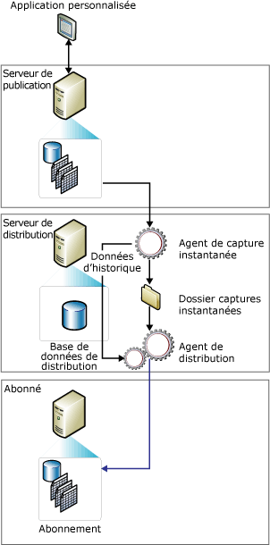

# Réplication d'instantané
[!INCLUDE[appliesto-ss-asdb-xxxx-xxx-md](../../includes/appliesto-ss-asdb-xxxx-xxx-md.md)]
  La réplication d'instantané transmet les données telles qu'elles apparaissent à un moment précis, sans contrôler les mises à jour des données. Lors de la synchronisation, l'intégralité de l'instantané est générée et envoyée aux abonnés.  
  
> [!NOTE]  
>  La réplication d'instantané peut être utilisée seule, mais le processus d'instantané (qui crée une copie de tous les objets et données spécifiés par une publication) est également couramment utilisé pour fournir le jeu initial de données et d'objets de base de données pour les publications transactionnelles et de fusion.  
  
 L'utilisation de la réplication d'instantané seule est la plus appropriée quand une ou plusieurs des conditions suivantes sont remplies :  
  
-   Les données changent peu fréquemment.  
  
-   Il est acceptable que des copies des données ne soient pas à jour relativement au serveur de publication pendant un certain temps.  
  
-   de faibles volumes de données sont répliqués ;  
  
-   Un gros volume de modifications survient au cours d'une brève période de temps.  
  
 La réplication d'instantané est plus appropriée quand les modifications de données sont substantielles mais peu fréquentes. Par exemple, si une entreprise commerciale gère des tarifs de produits, et que ces tarifs sont tous mis à jour en même temps, une à deux fois par an, il est recommandé de procéder à une réplication de l'intégralité de l'instantané des données modifiées. Suivant certains types de données, des instantanés plus fréquents peuvent également être appropriés. Par exemple, si une table relativement petite est mise à jour sur le serveur de publication dans la journée mais qu'une certaine latence est tolérée, les modifications peuvent être remises pendant la nuit en tant qu'instantané.  
  
 La charge continue sur le serveur de publication est plus faible sur une réplication d'instantané que sur une réplication transactionnelle, car les modifications incrémentielles ne sont pas suivies. Toutefois, si l'ensemble du dataset à répliquer est très grand, d'importantes ressources seront nécessaires pour générer et appliquer l'instantané. Prenez en considération la taille du jeu de données complet et la fréquence des modifications sur les données lorsque vous envisagez d'utiliser la réplication d'instantané.  
  
 **Dans cette rubrique**  
  
 [Fonctionnement de la réplication d'instantané](#HowWorks)  
  
 [Agent d'instantané](#SnapshotAgent)  
  
 [Agent de distribution et Agent de fusion](#DistAgent)  
  
##   Fonctionnement de la réplication d'instantané  
 Par défaut, les trois types de réplication utilisent un instantané pour initialiser les abonnés. L'Agent d'instantané [!INCLUDE[ssNoVersion](../../includes/ssnoversion-md.md)] génère toujours les fichiers d'instantanés, mais l'Agent qui remet les fichiers diffère selon le type de réplication utilisé. La réplication d'instantané et la réplication transactionnelle utilisent l'Agent de distribution pour remettre les fichiers, alors que la réplication de fusion utilise l'Agent de fusion [!INCLUDE[ssNoVersion](../../includes/ssnoversion-md.md)] . L'Agent d'instantané s'exécute sur le serveur de distribution. L'Agent de distribution et l'Agent de fusion s'exécutent sur le serveur de distribution pour les abonnements par envoi de données (push), ou sur les abonnés pour les abonnements par extraction de données (pull).  
  
 Les instantanés peuvent être générés et appliqués soit immédiatement après la création de l'abonnement, ou selon une planification définie lors de la création de la publication. L'Agent d'instantané prépare les fichiers d'instantanés contenant les schémas ainsi que les données des tables et des objets de base de données publiés, stocke les fichiers dans le dossier d'instantanés du serveur de publication, et enregistre les informations de suivi dans la base de données de distribution sur le serveur de distribution. Le dossier d'instantanés par défaut est spécifié lorsque vous configurez un serveur de distribution, vous pouvez également spécifier un emplacement de remplacement pour une publication pour remplacer ou suppléer le dossier par défaut.  
  
 En plus du processus d'instantané standard décrit dans cette rubrique, un processus d'instantané en deux parties est utilisé pour les publications de fusion avec filtres paramétrés.  
  
 L'illustration suivante montre les principaux composants de la réplication d'instantané.  
  
   
  
##   Agent d'instantané  
 Pour la réplication de fusion, un instantané est généré à chaque exécution de l'Agent d'instantané. Pour la réplication transactionnelle, la génération d'instantané dépend du paramétrage de la propriété de publication **immediate_sync**. Si la propriété est définie avec la valeur TRUE (valeur par défaut lors de l'utilisation de l'Assistant Nouvelle publication), un instantané est généré à chaque exécution de l'Agent d'instantané, et peut être appliqué à un abonné à tout moment. Si la propriété est définie avec la valeur FALSE (valeur par défaut lors de l'utilisation de **sp_addpublication**), l'instantané est généré uniquement si un nouvel abonnement a été ajouté depuis la dernière exécution de l'Agent d'instantané ; les abonnés doivent attendre que l'Agent d'instantané se termine avant de pouvoir se synchroniser.  
  
 L'Agent d'instantané exécute les étapes suivantes :  
  
1.  Il établit une connexion du serveur de distribution au serveur de publication, puis applique des verrous sur les tables publiées si nécessaire :  
  
    -   Pour les publications de fusion, l'Agent d'instantané n'utilise aucun verrou.  
  
    -   Pour les publications transactionnelles, par défaut l'Agent d'instantané utilise des verrous uniquement lors de la phase initiale de génération d'instantané.  
  
    -   Pour les publications d'instantanés, les verrous sont utilisés pendant tout le processus de génération d'instantané.  
  
2.  Il enregistre une copie du schéma de la table pour chaque article sur un fichier .sch. Si d'autres objets de base de données sont publiés, comme les index, les contraintes, les procédures stockées, les vues, les fonctions définies par l'utilisateur, etc., des fichiers script supplémentaires sont générés.  
  
3.  Il copie les données à partir de la table publiée sur le serveur de publication et enregistre les données dans le dossier d'instantanés. L'instantané est généré comme un ensemble de fichiers programme de copie en bloc (BCP).  
  
4.  Pour les publications d'instantané et transactionnelle, l'Agent d'instantané ajoute des lignes aux tables **MSrepl_commands** et **MSrepl_transactions** dans la base de données de distribution. Les entrées de la table **MSrepl_commands** sont des commandes indiquant l'emplacement des fichiers .sch et .bcp, des autres fichiers d'instantanés, et des références à tout script d'avant ou après l'instantané. Les entrées de la table **MSrepl_transactions** sont des commandes concernant la synchronisation de l'Abonné.  
  
     Pour les publications de fusion, l'Agent d'instantané effectue des étapes supplémentaires.  
  
5.  Il libère tous les verrous sur les tables publiées.  
  
 Vous ne pouvez pas effectuer de modifications de schéma sur les tables publiées pendant la génération d'instantané. Une fois les fichiers d'instantanés générés, vous pouvez les visualiser dans le dossier d'instantanés à l'aide de l'Explorateur Windows.  
  
##   Agent de distribution et Agent de fusion  
 Pour les publications d'instantanés, chaque fois que l'Agent de distribution s'exécute pour la publication, il déplace le nouvel instantané sur chaque abonné n'ayant pas encore été synchronisé, ayant été marqué pour une réinitialisation, ou incluant de nouveaux articles.  
  
 Pour la réplication d'instantané ou transactionnelle, l'Agent de distribution effectue les étapes suivantes :  
  
1.  Il établit une connexion au serveur de distribution.  
  
2.  Il examine les tables **MSrepl_commands** et **MSrepl_transactions** de la base de données de distribution sur le serveur de distribution. L'Agent lit l'emplacement des fichiers d'instantanés dans la première table et les commandes de synchronisation de l'Abonné dans les deux tables.  
  
3.  Il applique le schéma et les commandes à la base de données d'abonnement.  
  
 Pour une publication de réplication de fusion non filtrée, l'Agent de fusion effectue les étapes suivantes :  
  
1.  Il établit une connexion au serveur de publication.  
  
2.  Il examine la table **sysmergeschemachange** sur le serveur de publication et détermine si un nouvel instantané doit être appliqué sur l'Abonné.  
  
3.  Si un nouvel instantané est disponible, l'Agent de fusion applique les fichiers d'instantanés à la base de données d'abonnement à partir de l'emplacement spécifié dans **sysmergeschemachange**.  
  
  
