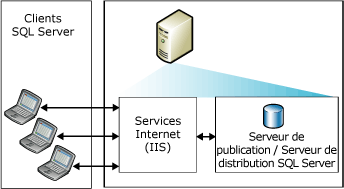
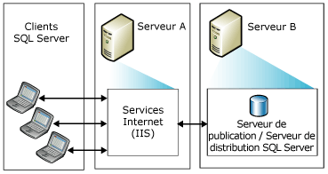
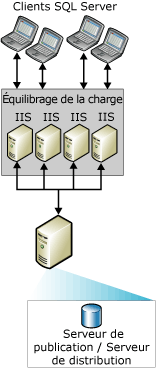
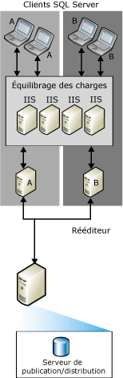

# Topologies pour la synchronisation web
  Vous pouvez choisir parmi différentes topologies de réplication de synchronisation Web [!INCLUDE[msCoName](../../includes/msconame-md.md)] [!INCLUDE[ssNoVersion](../../includes/ssnoversion-md.md)] . Les façons courantes de configurer une synchronisation Web sont les suivantes :  
  
-   Serveur unique  
  
-   Deux serveurs  
  
-   Plusieurs systèmes [!INCLUDE[msCoName](../../includes/msconame-md.md)] Internet Information Services (IIS) et la republication [!INCLUDE[ssNoVersion](../../includes/ssnoversion-md.md)]  
  
 Pour plus d’informations sur la configuration de la synchronisation web, consultez [Configurer la synchronisation web](../../relational-databases/replication/configure-web-synchronization.md).  
  
## Serveur unique  
 Dans la topologie la plus simple, IIS, le serveur de publication [!INCLUDE[ssNoVersion](../../includes/ssnoversion-md.md)] et le serveur de distribution [!INCLUDE[ssNoVersion](../../includes/ssnoversion-md.md)] résident tous trois sur le même serveur. Les Abonnés se synchronisent en se connectant à IIS sur le serveur de publication. Le serveur de publication peut être situé derrière un pare-feu.  
  
> [!NOTE]  
>  Cette configuration est recommandée uniquement pour les scénarios intranet. Pour les autres scénarios, il est recommandé que le serveur IIS et les serveurs de publication et de distribution [!INCLUDE[ssNoVersion](../../includes/ssnoversion-md.md)] soient placés sur des ordinateurs distincts.  
  
   
  
## Deux serveurs  
 Vous pouvez placer IIS sur un serveur et configurer les serveurs de publication et de distribution [!INCLUDE[ssNoVersion](../../includes/ssnoversion-md.md)] sur un autre serveur. Le serveur exécutant IIS peut être isolé d'Internet par un pare-feu. Les Abonnés se synchronisent en se connectant à IIS.  
  
   
  
## Plusieurs systèmes IIS et la republication SQL Server  
 Si vous devez prendre en charge un très grand nombre d'Abonnés qui se synchronisent au même moment, vous pouvez partitionner le travail entre plusieurs ordinateurs exécutant IIS.  
  
   
  
 Si un équilibrage de charge est encore nécessaire sur l'ordinateur exécutant [!INCLUDE[ssNoVersion](../../includes/ssnoversion-md.md)], vous pouvez créer une hiérarchie de republication sur plusieurs ordinateurs. Le serveur de publication de niveau supérieur publie les données vers les Abonnés, qui à leur tour republient ces données, équilibrant la charge des requêtes en provenance des Abonnés.  
  
> [!NOTE]  
>  Les Abonnés ne peuvent effectuer des synchronisations qu'avec un serveur de publication donné. Par exemple, un Abonné au serveur de republication A ne peut effectuer aucune synchronisation avec le serveur de republication B si le serveur A n'est pas disponible.  
  
   
  
## Voir aussi  
 [Configurer la synchronisation web](../../relational-databases/replication/configure-web-synchronization.md)   
 [Web Synchronization for Merge Replication](../../relational-databases/replication/web-synchronization-for-merge-replication.md)  
  
  
