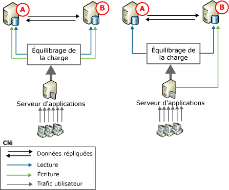
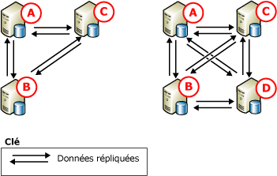

# Réplication transactionnelle d’égal à égal
[!INCLUDE[appliesto-ss-xxxx-xxxx-xxx-md](../../../includes/appliesto-ss-xxxx-xxxx-xxx-md.md)]

  La réplication d'égal à égal offre une solution avec montée en puissance parallèle et haute disponibilité en conservant des copies de données sur plusieurs instances de serveur, également appelées *nœuds*. Conçue sur la base de la réplication transactionnelle, la réplication d'égal à égal propage les modifications quasiment en temps réel de manière transactionnelle. Les applications qui requièrent la montée en puissance parallèle des opérations de lecture peuvent ainsi distribuer les lectures effectuées par les clients sur plusieurs nœuds. Dans la mesure où les données sont conservées sur les nœuds quasiment en temps réel, la réplication d'égal à égal génère une redondance des données, ce qui améliore leur disponibilité.  
  
 Prenons l'exemple d'une application Web. Celle-ci peut tirer parti de la réplication d'égal à égal de différentes manières :  
  
-   Les requêtes de catalogue et autres lectures sont réparties sur plusieurs nœuds. Les performances ne sont pas affectées par l'augmentation des lectures.  
  
-   Si l'un des nœuds du système échoue, une couche d'application peut rediriger les écritures pour ce nœud vers un autre nœud. La disponibilité est ainsi assurée.  
  
-   Si un nœud doit subir une maintenance ou si le système entier doit être mis à niveau, chaque nœud peut être mis hors connexion, puis de nouveau ajouté au système sans affecter la disponibilité de l'application.  
  
 Bien que la réplication d'égal à égal permette la montée en puissance parallèle des opérations de lecture, les performances en écriture de cette topologie sont identiques à celles d'un nœud unique. En effet, toutes les insertions, mises à jour et suppressions sont propagées à l'ensemble des nœuds. La réplication reconnaît si une modification a été appliquée à un nœud donné et empêche les modifications de boucler plusieurs fois dans les nœuds. Nous vous recommandons vivement de limiter les opérations d'écriture pour chaque ligne à un seul nœud pour les raisons suivantes :  
  
-   Si une ligne est modifiée au niveau de plusieurs nœuds, elle peut provoquer un conflit, voire la perte de la mise à jour, lorsque la ligne est propagée à d'autres nœuds.  
  
-   Une certaine latence rentre toujours en jeu lors la réplication des modifications. Dans le cas d'applications exigeant que les toutes dernières modifications soient immédiatement visibles, l'équilibrage de charge dynamique de l'application sur plusieurs nœuds peut poser un problème.  
  
 La réplication d'égal à égal comprend une option permettant d'activer la détection des conflits dans une topologie d'égal à égal. Cette option permet d'éviter les problèmes issus de conflits non détectés, notamment le comportement incohérent des applications et les mises à jour perdues. Lorsqu'elle est activée, une modification en conflit est considérée par défaut comme une erreur critique qui provoque l'échec de l'Agent de distribution. En cas de conflit, la topologie reste dans un état incohérent jusqu'à la résolution manuelle du conflit et au rétablissement de la cohérence des données dans la topologie. Pour plus d’informations, voir [Conflict Detection in Peer-to-Peer Replication](../../../relational-databases/replication/transactional/peer-to-peer-conflict-detection-in-peer-to-peer-replication.md).  
  
> [!NOTE]  
>  Pour éviter l'incohérence potentielle des données, faites-en sorte d'éviter les conflits dans une topologie d'égal à égal, même si la détection des conflits est activée. Afin de garantir que les opérations d'écriture pour une ligne particulière soient réalisées au niveau d'un seul nœud, les applications qui accèdent aux données et les modifient doivent partitionner les opérations d'insertion, de mise à jour et de suppression. Ce partitionnement garantit que les modifications apportées à une ligne donnée provenant d'un nœud sont synchronisées avec tous les autres nœuds de la topologie avant que cette ligne ne soit modifiée par un autre nœud. Si une application requiert des fonctionnalités avancées de détection et de résolution des conflits, utilisez la réplication de fusion. Pour plus d’informations, consultez [Réplication de fusion](../../../relational-databases/replication/merge/merge-replication.md) et [Détecter et résoudre des conflits de réplication de fusion](../../../relational-databases/replication/merge/advanced-merge-replication-resolve-merge-replication-conflicts.md).  
  
## Topologies d'égal à égal  
 Les scénarios suivants illustrent des utilisations standard de la réplication d'égal à égal.  
  
### Topologie comprenant deux bases de données participantes  
   
  
 Les deux illustrations ci-dessus montrent deux bases de données participantes dont le trafic utilisateur est dirigé vers les bases de données par le biais d'un serveur d'applications. Cette configuration peut être utilisée avec de nombreuses applications (des sites Web aux applications de groupe de travail) et présente les avantages suivants :  
  
-   amélioration des performances de lecture due à la répartition des lectures sur les deux serveurs ;  
  
-   disponibilité plus élevée si la maintenance est requise ou en cas de panne sur un nœud.  
  
 Dans les deux illustrations, l'activité de lecture est équilibrée entre les bases de données participantes, mais les mises à jour sont gérées autrement :  
  
-   À gauche, les mises à jour sont partitionnées entre les deux serveurs. Si la base de données contenait un catalogue de produits, une application personnalisée pourrait par exemple diriger vers le nœud **A** les mises à jour des produits dont le nom commence par les lettres A à M et vers le nœud **B** les mises à jour des produits dont le nom commence par les lettres N à Z. Les mises à jour sont ensuite répliquées sur l'autre nœud.  
  
-   À droite, toutes les mises à jour sont dirigées vers le nœud **B**. De là, les mises à jour sont répliquées sur le nœud **A**. Si le nœud **B** est hors connexion (pour cause de maintenance, par exemple), le serveur d’applications peut diriger toutes les activités vers le nœud **A**. Lorsque le nœud **B** revient en ligne, il peut de nouveau recevoir les mises à jour ; le serveur d’applications peut alors retransférer toutes les mises à jour vers **B** ou continuer à les diriger vers **A**.  
  
 Si la réplication d'égal à égal prend en charge les deux méthodes, l'exemple de mise à jour centralisée à droite est également souvent utilisé avec la réplication transactionnelle standard.  
  
### Topologie comprenant au moins trois bases de données participantes  
   
  
 L'illustration ci-dessus montre trois bases de données participantes qui fournissent des données à une entreprise internationale d'assistance technique de logiciels dont les bureaux se trouvent à Los Angeles, Londres et Taipei. Les ingénieurs de support enregistrent les appels clients dans chaque bureau et ils entrent et mettent à jour les informations sur chaque appel client. Les fuseaux horaires des trois bureaux ayant huit heures d'écart, il n'y a pas de chevauchement pendant une journée de travail : lorsque le bureau de Taipei ferme, le bureau de Londres ouvre. Si un appel n'est pas terminé à la fermeture d'un bureau, il est transféré à un conseiller client dans un autre bureau qui ouvre.  
  
 Chaque bureau possède un serveur de base de données et un serveur d'applications dont se servent les ingénieurs de support lorsqu'ils entrent et mettent à jour les informations sur les appels clients. La topologie est partitionnée selon l'horaire. Les mises à jour n'ont donc lieu que sur le nœud actuellement ouvert, puis elles sont acheminées aux autres bases de données participantes. Cette topologie présente les avantages suivants :  
  
-   indépendance sans isolement : chaque bureau peut insérer, mettre à jour ou supprimer des données indépendamment, mais aussi les partager du fait de leur réplication sur toutes les bases de données participantes ;  
  
-   disponibilité élevée en cas de panne ou de maintenance sur une ou plusieurs bases de données participante.  
  
       
  
 L'illustration ci-dessus montre l'ajout d'un nœud dans la topologie qui en compte déjà trois. Un nœud pourrait être ajouté dans ce scénario pour les raisons suivantes :  
  
-   parce qu'un autre bureau est ouvert ;  
  
-   pour fournir une disponibilité élevée afin de prendre en charge la maintenance ou augmenter la tolérance de panne en cas de défaillance de disque ou d'un autre grave problème.  
  
 Remarquez que dans les topologies à trois nœuds et à quatre nœuds, toutes les bases de données publient et s'abonnent à toutes les autres bases de données. Cela permet d'assurer une disponibilité maximale en cas de maintenance ou d'échec d'un ou plusieurs nœuds. Lors de l'ajout de nœuds, veillez à équilibrer les besoins en disponibilité et en évolutivité par rapport aux performances et à la complexité du déploiement et de l'administration.  
  
## Configuration d'une réplication d'égal à égal  
 La configuration d'une topologie de réplication d'égal à égal est très semblable à celle d'une série de publications et d'abonnements transactionnels standard. Les procédures décrites dans les rubriques qui suivent montrent comment configurer un système à trois nœuds, similaire à la configuration illustrée à gauche dans l'illustration précédente qui montrait une topologie d'égal à égal.  
  
## Considérations sur l'utilisation de la réplication d'égal à égal  
 Cette section fournit des informations et des consignes à considérer lors de l'utilisation de la réplication d'égal à égal.  
  
### Considérations générales  
  
-   La réplication d'égal à égal est disponible uniquement dans les versions Enterprise de [!INCLUDE[ssNoVersion](../../../includes/ssnoversion-md.md)].  
  
-   Toutes les bases de données qui participent à la réplication d'égal à égal doivent contenir un schéma et des données identiques :  
  
    -   Les noms d'objets, le schéma d'objet et les noms de publication doivent être identiques.  
  
    -   Les publications doivent autoriser la réplication des modifications de schéma. (Pour cela la propriété de publication **replicate_ddl** doit avoir la valeur **1**, ce qui est le paramètre par défaut.) Pour plus d’informations, consultez [Modifier le schéma dans les bases de données de publication](../../../relational-databases/replication/publish/make-schema-changes-on-publication-databases.md).  
  
    -   Le filtrage des lignes et des colonnes n'est pas pris en charge.  
  
-   Il est recommandé que chaque nœud utilise sa propre base de données de distribution afin d'éviter le risque d'avoir un point d'échec unique.  
  
-   Les tables et autres objets ne peuvent pas être inclus dans plusieurs publications d'égal à égal au sein d'une base de données de publication unique.  
  
-   Une publication doit être activée pour la réplication d'égal à égal avant la création des abonnements.  
  
-   Les abonnements doivent être initialisés à l'aide d'une sauvegarde ou de l'option **Prise en charge de la réplication uniquement** . Pour plus d’informations, consultez [Initialize a Transactional Subscription Without a Snapshot](../../../relational-databases/replication/initialize-a-transactional-subscription-without-a-snapshot.md).  
  
-   L'utilisation de colonnes d'identité est déconseillée. Avec les identités, vous devez gérer manuellement les plages affectées aux tables sur chaque base de données participante. Pour plus d’informations, consultez la section « Affectation de plages pour la gestion manuelle de plages d’identité » dans [Répliquer des colonnes d’identité](../../../relational-databases/replication/publish/replicate-identity-columns.md).  
  
### Restrictions liées aux fonctionnalités  
 La réplication d'égal à égal prend en charge les principales fonctionnalités de la réplication transactionnelle, mais ne prend pas en charge les options suivantes :  
  
-   initialisation et réinitialisation avec instantané ;  
  
-   filtres de lignes et de colonnes ;  
  
-   colonnes d'horodatage ;  
  
-   serveurs de publication et Abonnés non-[!INCLUDE[ssNoVersion](../../../includes/ssnoversion-md.md)] ;  
  
-   abonnements mis à jour immédiatement ou en attente ;  
  
-   abonnements anonymes ;  
  
-   abonnements partiels ;  
  
-   abonnements pouvant être attachés et abonnements transformables. (Ces deux options sont déconseillées dans [!INCLUDE[ssVersion2005](../../../includes/ssversion2005-md.md)]) ;  
  
-   Agents de distribution partagés ;  
  
-   paramètre de l'Agent de Distribution **-SubscriptionStreams** et paramètre de l'Agent de lecture du journal **-MaxCmdsInTran**;  
  
-   propriétés d'article **@destination_owner** et **@destination_table**.

-   La réplication transactionnelle d’égal à égal ne prend pas en charge la création d’un abonnement transactionnel à sens unique à une publication d’égal à égal.   
  
 Les propriétés suivantes présentent des considérations spéciales :  
  
-   La propriété de publication **@allow_initialize_from_backup** requiert la valeur **true**.  
  
-   La propriété d’article **@replicate_ddl** requiert la valeur **true**; **@identityrangemanagementoption** requiert la valeur **manual**, et **@status** nécessite la définition de l’option **24** .  
  
-   Les propriétés d’article **@ins_cmd**, **@del_cmd**et **@upd_cmd** ne peuvent pas être définies sur **SQL**.  
  
-   La propriété d’abonnement **@sync_type** requiert la valeur **none** ou **automatic**.  
  
### Considérations sur la maintenance  
 Certaines actions nécessitent la suspension du système. Ce qui signifie que toute activité sur les tables publiées doit être interrompue au niveau de tous les nœuds et que la réception par chacun des nœuds de toutes les modifications provenant des autres nœuds doit être vérifiée.  
  
||Homologues SQL Server 2005 uniquement ou combinaison d’homologues SQL Server 2005 et d’homologues SQL Server 2008 ou version ultérieure|Homologues SQL Server 2005 uniquement ou combinaison d’homologues SQL Server 2005 et d’homologues SQL Server 2008 ou version ultérieure|Homologues SQL 2008 ou version ultérieure|Homologues SQL 2008 ou version ultérieure|  
|-|------------------------------------------------------------------------------------------------------|------------------------------------------------------------------------------------------------------|------------------------------|------------------------------|  
|Ajout d’un nœud à la topologie|2 nœuds dans la topologie complète : aucune suspension requise. Utilisez plutôt `sync_type = 'initialize with backup'`|Plus de 2 nœuds : suspension requise.|`sync_type = 'replication support only'`: suspension requise.|`sync_type = 'initialize with backup'` et `'initialize from lsn'`: aucune suspension requise.|  
  
 Les modifications de schéma de topologie (ajout ou suppression d’un article) nécessitent une suspension. Pour plus d’informations, consultez [Administrer une topologie d’égal à égal &#40;programmation Transact-SQL de la réplication&#41;](../../../relational-databases/replication/administration/administer-a-peer-to-peer-topology-replication-transact-sql-programming.md).  
  
 La suppression d’un nœud de la topologie ne nécessite jamais de suspension.  
  
 La modification des propriétés d’article à l’aide de  [sp_changearticle](../../../relational-databases/system-stored-procedures/sp-changearticle-transact-sql.md) ne nécessite jamais de suspension. Les modifications autorisées (pour une topologie d’égal à égal) concernent les propriétés `description`, `ins_cmd`, `upd_cmd`et `del_cmd` .  
  
 Les modifications de schéma d’article (ajout/suppression de colonnes) ne nécessitent jamais de suspension.  
  
-   Ajout d’article : pour l’ajout d’un article à une configuration existante, nous devons suspendre le système, exécuter l’instruction CREATE TABLE, charger les données initiales dans chaque nœud de la topologie, puis ajouter le nouvel article à chacun de ces nœuds.  
  
-   Suppression d’article : si nous voulons que tous les nœuds présentent un état cohérent, nous devons suspendre la topologie.  
  
 Pour plus d’informations, consultez[Suspendre une topologie de réplication &#40;programmation Transact-SQL de la réplication&#41;](../../../relational-databases/replication/administration/quiesce-a-replication-topology-replication-transact-sql-programming.md) et [Administrer une topologie d’égal à égal &#40;programmation Transact-SQL de la réplication&#41;](../../../relational-databases/replication/administration/administer-a-peer-to-peer-topology-replication-transact-sql-programming.md).  
  
-   Si vous ajoutez un nouveau nœud à une topologie d'égal à égal, n'utilisez pour la restauration que des sauvegardes créées après l'ajout de ce nœud.  
  
-   Vous ne pouvez pas réinitialiser les abonnements dans une topologie d'égal à égal. Si vous devez faire en sorte qu'un nœud dispose d'une nouvelle copie des données, restaurez une sauvegarde sur le nœud.  
  
##  Voir aussi  
 [Administrer une topologie d’égal à égal &#40;programmation Transact-SQL de la réplication&#41;](../../../relational-databases/replication/administration/administer-a-peer-to-peer-topology-replication-transact-sql-programming.md)   
 [Stratégies de sauvegarde et de restauration de la réplication transactionnelle et d’instantané](../../../relational-databases/replication/administration/strategies-for-backing-up-and-restoring-snapshot-and-transactional-replication.md)   
 [Types de publication pour la réplication transactionnelle](../../../relational-databases/replication/transactional/publication-types-for-transactional-replication.md)  
  
  
