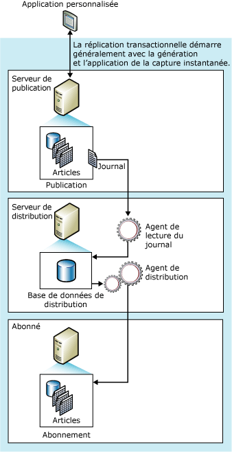

# Réplication transactionnelle
[!INCLUDE[appliesto-ss-xxxx-xxxx-xxx-md](../../../includes/appliesto-ss-xxxx-xxxx-xxx-md.md)]
  La réplication transactionnelle commence en général avec l'instantané des objets et des données de la base de données de publication. Dès que l'instantané initial est effectué, les changements de données et les modifications de schémas effectués ensuite au niveau du serveur de publication sont en général transmis à l'Abonné à mesure qu'ils se produisent (presque en temps réel). Les changements de données sont appliqués à l'Abonné dans le même ordre et dans les mêmes limites de transaction que sur le serveur de publication ; c'est pourquoi, dans une publication, la cohérence des transactions est garantie.  
  
 La réplication transactionnelle est en général utilisée dans les environnements serveur à serveur, et convient pour chacun des cas suivants :  
  
-   Vous souhaitez propager les modifications incrémentielles vers les abonnés, au fur et à mesure qu'elles s'exécutent.  
  
-   L'application requiert une latence faible entre le moment où des modifications sont effectuées sur le serveur de publication et celui où les modifications arrivent sur l'Abonné.  
  
-   L'application requiert l'accès aux états intermédiaires des données. Par exemple, si une ligne change cinq fois, la réplication transactionnelle permet à une application de répondre à chaque modification (par exemple activer un déclencheur), et pas simplement au résultat final des modifications de la ligne.  
  
-   Le serveur de publication a un volume très élevé d'activités d'insertion, de mise à jour et de suppression.  
  
-   Le serveur de publication ou l'Abonné est une base de données non-[!INCLUDE[ssNoVersion](../../../includes/ssnoversion-md.md)] , Oracle par exemple.  
  
 Par défaut, les Abonnés à des publications transactionnelles doivent être traités en lecture seule, parce que les changements ne sont pas propagés vers le serveur de publication. Cependant, la réplication transactionnelle n'offre pas d'options qui permettent des mises à jour sur l'Abonné.  
  
##   Fonctionnement de la réplication transactionnelle  
 La réplication transactionnelle est effectuée par l'Agent d'instantané, l'Agent de lecture du journal et l'Agent de distribution [!INCLUDE[ssNoVersion](../../../includes/ssnoversion-md.md)] . L'Agent d'instantané prépare les fichiers d'instantanés contenant les schémas ainsi que les données des tables et des objets de base de données publiés, stocke les fichiers dans le dossier d'instantanés, et enregistre les travaux de synchronisation dans la base de données de distribution sur le serveur de distribution.  
  
 L'Agent de lecture du journal surveille le journal des transactions de chaque base de données configurée pour la réplication transactionnelle et copie les transactions devant être répliquées à partir du journal des transactions dans la base de données de distribution, laquelle joue le rôle de file d'attente de stockage et transfert. L'Agent de distribution copie les fichiers d'instantanés initiaux du dossier d'instantanés et les transactions conservées dans les tables de la base de données de distribution vers les Abonnés.  
  
 Les modifications incrémentielles apportées au niveau du serveur de publication sont transmises aux Abonnés en fonction de la planification de l'Agent de distribution, qui peut s'exécuter soit continu pour bénéficier d'une latence minimale, soit à intervalles planifiés. Dans la mesure où les modifications apportées aux données doivent être effectuées sur le serveur de publication (lorsque la réplication transactionnelle est utilisée sans les options de mise à jour immédiate ou de mise à jour en attente), les conflits de mise à jour sont évités. Tous les Abonnés auront finalement les mêmes valeurs que le serveur de publication. Si les options de mise à jour immédiate ou de mise à jour en attente sont utilisées avec la réplication transactionnelle, les mises à jour peuvent être effectuées au niveau de l'Abonné, mais des conflits sont possibles en raison de l'option de mise à jour en attente.  
  
 L'illustration suivante montre les principaux composants de la réplication transactionnelle.  
  
   
  
##   Jeu de données initial  
 Avant qu'un nouvel Abonné de réplication transactionnelle puisse recevoir des modifications incrémentielles du serveur de publication, cet Abonné doit posséder des tables ayant le même schéma et les mêmes données que celles du serveur de publication. Le jeu de données initial est généralement un instantané créé par l'Agent d'instantané puis distribué et appliqué par l'Agent de distribution. Le jeu de données initial peut être fourni par une sauvegarde ou un autre moyen, par exemple [!INCLUDE[ssNoVersion](../../../includes/ssnoversion-md.md)] Integration Services.  
  
 La distribution et l'application des instantanés ne concernent que les Abonnés qui attendent un instantané initial. Les autres Abonnés de cette publication (déjà initialisés) ne sont pas concernés.  
  
## Traitement simultané d'instantanés  
 La réplication d'instantanés place des verrous partagés sur toutes les tables publiées dans le cadre de la réplication pour toute la durée du processus de génération d'instantanés. Cela peut empêcher la mise à jour des tables de publication. Le traitement simultané d'instantanés, qui constitue l'option par défaut de la réplication transactionnelle, ne maintient pas les verrous en place tout au long de la phase de génération d'instantané, de sorte que les utilisateurs peuvent continuer à travailler sans interruption pendant que la réplication crée les fichiers d'instantanés initiaux.  
  
##   Agent d'instantané  
 Les procédures utilisées par l'Agent d'instantané pour implémenter l'instantané initial dans la réplication transactionnelle sont les mêmes que celles utilisées dans la réplication d'instantané (sauf en ce qui concerne le traitement simultané d'instantanés décrit précédemment).  
  
 Une fois les fichiers d'instantanés générés, vous pouvez les visualiser dans le dossier d'instantanés à l'aide de l'Explorateur Windows [!INCLUDE[msCoName](../../../includes/msconame-md.md)] .  
  
##   Modification des données et de l'Agent de lecture du journal  
 L'Agent de lecture du journal s'exécute sur le serveur de distribution, très souvent en continu mais parfois aussi en fonction d'une planification établie. Lorsqu'il s'exécute, l'Agent de lecture du journal lit d'abord le journal des transactions de publication (le même journal de base de données utilisé pour le suivi et la récupération des transactions lors des opérations normales du moteur de base de données [!INCLUDE[ssNoVersion](../../../includes/ssnoversion-md.md)] ) et identifie les instructions INSERT, UPDATE et DELETE, ainsi que toute autre modification apportée aux données dans les transactions marquées pour réplication. Ensuite, l'Agent copie ces transactions dans des traitements dans la base de données de distribution du serveur de distribution. L'Agent de lecture du journal utilise la procédure stockée interne **sp_replcmds** pour obtenir le jeu de commandes suivant marqué pour réplication à partir du journal. La base de données de distribution devient ensuite une file d'attente où les modifications sont stockées puis transférées aux Abonnés. Seules les transactions validées sont envoyées à la base de données de distribution.  
  
 Une fois que la totalité du traitement des transactions a été écrit correctement dans la base de données de distribution, il est validé. Après la validation de chaque traitement de commandes sur le serveur de distribution, l'Agent de lecture du journal appelle **sp_repldone** pour marquer l'endroit où s'est terminée la réplication. Enfin, l'Agent marque les lignes du journal de transactions qui sont prêtes à être définitivement supprimées. Les lignes en attente de réplication ne le sont pas.  
  
 Les commandes de transaction sont stockées dans la base de données de distribution jusqu'à ce qu'elles aient été propagées à tous les Abonnés ou jusqu'à l'expiration de la période de rétention de distribution maximale. Les Abonnés reçoivent les transactions dans le même ordre que celui de leur application sur le serveur de publication.  
  
##   Agent de distribution  
 Cet agent s'exécute généralement sur le serveur de distribution pour les abonnements par envoi de données et sur l'Abonné pour les abonnements par extraction. L'Agent déplace les transactions de la base de données de distribution vers l'Abonné. Si un abonnement est marqué pour validation, l'Agent de distribution vérifie également si les données correspondent entre le serveur de publication et l'Abonné.  
  
  
