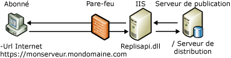

# Synchronisation Web pour la réplication de fusion
[!INCLUDE[appliesto-ss-xxxx-xxxx-xxx-md](../../includes/appliesto-ss-xxxx-xxxx-xxx-md.md)]
  La synchronisation Web pour la réplication de fusion permet de répliquer des données à l'aide du protocole HTTPS ; elle est utile dans les scénarios suivants :  
  
-   Synchronisation de données d'utilisateurs mobiles via Internet.  
  
-   Synchronisation de données entre bases de données [!INCLUDE[msCoName](../../includes/msconame-md.md)] [!INCLUDE[ssNoVersion](../../includes/ssnoversion-md.md)] via un pare-feu d'entreprise.  
  
 Par exemple, un représentant commercial en déplacement peut se servir de la synchronisation Web. L'entreprise, [!INCLUDE[ssSampleDBCoFull](../../includes/sssampledbcofull-md.md)], dispose de représentants commerciaux qui se déplacent dans différents magasins et chez différents fournisseurs dans toutes les régions. Lors de déplacements prolongés, les représentants restent à l'hôtel et ont besoin d'un moyen pratique pour charger les chiffres des ventes et télécharger les mises à jour des produits tous les jours en fin de journée.  
  
 Le service informatique de [!INCLUDE[ssSampleDBCoShort](../../includes/sssampledbcoshort-md.md)] a configuré chaque ordinateur portable avec [!INCLUDE[ssNoVersion](../../includes/ssnoversion-md.md)] et activé la réplication de fusion pour utiliser la synchronisation Web. L'Agent de fusion de chaque ordinateur portable contient une adresse URL qui pointe vers les composants de réplication installés sur un ordinateur exécutant [!INCLUDE[msCoName](../../includes/msconame-md.md)] Internet Information Services (IIS). Ces composants synchronisent l'Abonné avec le serveur de publication. Chaque représentant peut désormais se connecter par le biais d'une connexion Internet disponible sans avoir recours à une connexion d'accès à distance, et peut charger et télécharger les données appropriées. La connexion Internet utilise SSL (Secure Sockets Layer) ; un réseau privé virtuel (VPN) n'est donc pas nécessaire.  
  
 Pour obtenir des informations sur la façon de configurer les composants requis pour la synchronisation Web, consultez [configurer la synchronisation Web](../../relational-databases/replication/configure-web-synchronization.md), [Configurer IIS pour la synchronisation Web](../../relational-databases/replication/configure-iis-for-web-synchronization.md) et [Configurer IIS 7 pour la synchronisation Web](../../relational-databases/replication/configure-iis-7-for-web-synchronization.md).  
  
> [!NOTE]  
>  La synchronisation Web est conçue pour synchroniser des données avec des ordinateurs portables, des périphériques de poche et d'autres clients. Elle n'est pas conçue pour des applications de serveur à serveur pour des volumes élevés.  
  
## Aperçu du fonctionnement de la synchronisation Web  
 Lorsque la synchronisation Web est utilisée, les mises à jour sur l'Abonné sont empaquetées et envoyées sous forme de message XML sur l'ordinateur exécutant IIS via le protocole HTTPS. L'ordinateur exécutant IIS envoie ensuite les commandes au serveur de publication sous un format binaire, généralement à l'aide de TCP/IP. Les mises à jour sur l'Abonné sont envoyées à l'ordinateur exécutant IIS, puis empaquetées sous forme de message XML pour la remise à l'Abonné.  
  
 L'illustration suivante montre certains des composants concernés par la synchronisation Web pour la réplication de fusion.  
  
   
  
 La synchronisation Web est une option disponible uniquement pour les abonnements par extraction de données (pull) ; un Agent de fusion sera donc toujours exécuté sur l'Abonné. Il peut s'agir de l'Agent de fusion standard, du contrôle ActiveX de l'Agent de fusion, ou d'une application assurant la synchronisation par le biais de Replication Management Objects. Pour spécifier l’emplacement de l’ordinateur exécutant IIS, utilisez le paramètre **–InternetUrl** pour l’Agent de fusion.  
  
 L'écouteur de réplication [!INCLUDE[ssNoVersion](../../includes/ssnoversion-md.md)] (Replisapi.dll) est configuré sur l'ordinateur exécutant IIS ; il est également responsable de la gestion des messages qui sont envoyés au serveur à partir du serveur de publication et des Abonnés. Chaque nœud de la topologie gère le flux de données XML par le biais du réconciliateur de réplication de fusion (Replrec.dll).  
  
 [!INCLUDE[ssVersion2005](../../includes/ssversion2005-md.md)] ou une version ultérieure est nécessaire pour tous les ordinateurs impliqués dans des opérations de synchronisation Web.  
  
### Processus de synchronisation  
 Les étapes inhérentes au processus de synchronisation sont les suivantes :  
  
1.  L'Agent de fusion est démarré sur l'Abonné. L'agent réalise les actions suivantes :  
  
    1.  Il établit une connexion SQL avec la base de données d'abonnement.  
  
    2.  Il extrait toutes les modifications de la base de données.  
  
    3.  Il envoie une demande HTTPS à l'ordinateur exécutant IIS.  
  
    4.  Il télécharge les modifications apportées aux données sous forme de message XML.  
  
2.  L'écouteur de réplication [!INCLUDE[ssNoVersion](../../includes/ssnoversion-md.md)] et le réconciliateur de réplication de fusion hébergés sur l'ordinateur exécutant IIS effectuent les opérations suivantes :  
  
    1.  Ils répondent à la demande HTTPS.  
  
    2.  Ils établissent une connexion SQL avec la base de données de publication.  
  
    3.  Ils appliquent les modifications téléchargées à la base de données de publication.  
  
    4.  Ils extraient les modifications téléchargées pour l'Abonné.  
  
    5.  Ils renvoient une réponse HTTPS à l'Agent de fusion.  
  
3.  L'Agent de fusion sur l'Abonné accepte ensuite la réponse HTTPS et applique les modifications téléchargées à la base de données d'abonnement.  
  
##  Voir aussi  
 [Configurer la synchronisation Web](../../relational-databases/replication/configure-web-synchronization.md)   
 [Topologies for Web Synchronization](../../relational-databases/replication/topologies-for-web-synchronization.md)  
  
  
