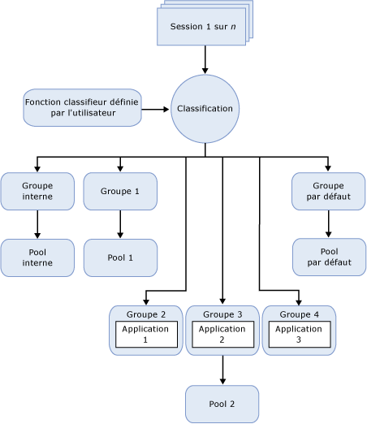

# gouverneur de ressources
[!INCLUDE[appliesto-ss-xxxx-xxxx-xxx-md](../../includes/appliesto-ss-xxxx-xxxx-xxx-md.md)]
  [!INCLUDE[ssNoVersion](../../includes/ssnoversion-md.md)] Resource Governor est une fonctionnalité que vous pouvez utiliser pour gérer la charge de travail et la consommation des ressources système de [!INCLUDE[ssNoVersion](../../includes/ssnoversion-md.md)]. Resource Governor vous permet de spécifier des limites sur l'utilisation de la quantité d'UC, d'E/S physiques et de mémoire par les demandes d'application entrantes.  
  
## Avantages de Resource Governor  
 Resource Governor vous permet de gérer les ressources et les charge de travail [!INCLUDE[ssNoVersion](../../includes/ssnoversion-md.md)] en spécifiant des limites concernant la consommation de ressources par les demandes entrantes. Du point de vue de Resource Governor, la charge de travail est un ensemble de requêtes de taille similaire qui peuvent ou devraient être traitées comme une entité unique. Bien que cela ne soit pas indispensable, plus le modèle d'utilisation des ressources d'une charge de travail est uniforme, plus il est avantageux d'utiliser Resource Governor. Les limites de ressources peuvent être reconfigurées en temps réel avec un impact négligeable sur les charges de travail en cours d'exécution.  
  
 Dans un environnement où il existe plusieurs charges de travail distinctes sur le même serveur, Resource Governor permet de différencier ces charges de travail et d'allouer des ressources partagées en fonction de la demande, selon les limites que vous spécifiez. Ces ressources sont l'UC, les E/S physiques et la mémoire.  
  
 À l'aide de Resource Governor, vous pouvez :  
  
-   Fournir l'isolement des ressources et une architecture mutualisée sur les instances uniques de SQL Server qui servent plusieurs charges de travail clientes. Autrement dit, vous pouvez répartir les ressources disponibles sur un serveur entre les charges de travail et réduire les problèmes qui peuvent se produire lorsque les charges de travail sont en concurrence pour les ressources.  
  
-   Fournir des performances fiables et prendre en charge les contrats de niveau de service (SLA) pour les locataires de charge de travail dans un environnement à plusieurs utilisateurs et à plusieurs charges de travail.  
  
-   Isoler et limiter les pertes de contrôle de requêtes ou les ressources de limitation d'E/S pour les opérations telles que DBCC CHECKDB qui peuvent saturer le sous-système d'E/S et avoir un effet négatif sur d'autres charges de travail.  
  
-   Ajouter un suivi affiné des ressources pour les rétrofacturations d'utilisation des ressources et fournir une facturation prédictible aux consommateurs des ressources du serveur.  
  
## Contraintes de Resource Governor  
 Cette version de Resource Governor est soumise aux contraintes suivantes :  
  
-   La gestion des ressources est limitée au [!INCLUDE[ssDEnoversion](../../includes/ssdenoversion-md.md)]. Resource Governor ne peut pas être utilisé pour [!INCLUDE[ssASnoversion](../../includes/ssasnoversion-md.md)], [!INCLUDE[ssISnoversion](../../includes/ssisnoversion-md.md)]et [!INCLUDE[ssRSnoversion](../../includes/ssrsnoversion-md.md)].  
  
-   Il n'y a aucune surveillance ni gestion des charges de travail entre instances SQL Server.  
  
-   Resource Governor peut gérer les charges de travail OLTP mais ces types de requêtes, qui sont en général très courtes, ne restent pas toujours assez longtemps sur l'UC pour que des contrôles de bande passante soient appliqués. Cela peut biaiser les statistiques retournées pour le pourcentage d'utilisation de l'UC.  
  
-   La capacité à régir les E/S physiques s'applique uniquement aux opérations des utilisateurs, et non aux tâches système. Les tâches système comprennent les opérations d'écriture dans le journal des transactions et les opérations d'E/S d'écriture différée. Resource Governor s'applique principalement aux opérations de lecture de l'utilisateur car la plupart des opérations d'écriture sont généralement effectuées par les tâches système.  
  
-   Vous ne pouvez pas définir de seuils d'E/S dans le pool de ressources interne.  
  
## Concepts des ressources  
 Les trois concepts suivants sont fondamentaux pour connaître le fonctionnement et l'utilisation de Resource Governor :  
  
-   **Pools de ressources.** Un pool de ressources représente les ressources physiques du serveur. Vous pouvez envisager un pool comme une instance [!INCLUDE[ssNoVersion](../../includes/ssnoversion-md.md)] virtuelle dans une instance [!INCLUDE[ssNoVersion](../../includes/ssnoversion-md.md)] . Deux pools de ressources (interne et par défaut) sont créés lorsque [!INCLUDE[ssNoVersion](../../includes/ssnoversion-md.md)] est installé. Resource Governor prend aussi en charge des pools de ressources définis par l'utilisateur. Pour plus d’informations, consultez [Pool de ressources de Resource Governor](../../relational-databases/resource-governor/resource-governor-resource-pool.md).  
  
-   **Groupes de charges de travail.** Un groupe de charges de travail sert de conteneur aux demandes de session qui ont des critères de classification similaires. Une charge de travail autorise l'analyse globale des sessions et définit les stratégies pour les sessions. Chaque groupe de charges de travail se trouve dans un pool de ressources. Deux groupes de charges de travail (interne et par défaut) sont créés et mappés à leurs pools de ressources correspondants lorsque [!INCLUDE[ssNoVersion](../../includes/ssnoversion-md.md)] est installé. Resource Governor prend aussi en charge des groupes de charges de travail définis par l'utilisateur. Pour plus d’informations, consultez [Groupe de charge de travail de Resource Governor](../../relational-databases/resource-governor/resource-governor-workload-group.md).  
  
-   **Classification.** Le processus de classification affecte les sessions entrantes à un groupe de charges de travail en fonction des caractéristiques de la session. Vous pouvez adapter la logique de classification en entrant une fonction définie par l'utilisateur, appelée fonction classifieur. Resource Governor prend en charge également une fonction classifieur définie par l'utilisateur pour implémenter des règles de classification. Pour plus d’informations, consultez [Fonction classifieur de Resource Governor](../../relational-databases/resource-governor/resource-governor-classifier-function.md).  
  
> [!NOTE]  
>  Resource Governor n'impose pas de contrôles sur une connexion DAC (connexion administrateur dédiée). Il n'est pas nécessaire de classer les requêtes DAC qui s'exécutent dans le groupe de charges de travail et le pool de ressources internes.  
  
 Dans le contexte de Resource Governor, vous pouvez traiter les concepts précédents comme composants. L'illustration suivante montre ces composants et leur relation mutuelle dans l'environnement du moteur de base de données. Dans une perspective de traitement, le flux simplifié est le suivant :  
  
-   Il existe une connexion entrante pour une session (Session 1 de *n*).  
  
-   La session est classifiée (Classification).  
  
-   La charge de travail de session est acheminée vers un groupe de charges de travail, par exemple, Groupe 4.  
  
-   Le groupe de charges de travail utilise le pool de ressources auquel il est associé, par exemple, Groupe 2.  
  
-   Le pool de ressources fournit et limite les ressources requises par l'application, par exemple, Application 3.  
  
   
  
## Tâches de Resource Governor  
  
|Description de la tâche|Rubrique|  
|----------------------|-----------|  
|Décrit comment activer Resource Governor.|[Activer Resource Governor](../../relational-databases/resource-governor/enable-resource-governor.md)|  
|Décrit comment désactiver Resource Governor.|[Désactiver Resource Governor](../../relational-databases/resource-governor/disable-resource-governor.md)|  
|Décrit comment créer, modifier et supprimer un pool de ressources.|[Pool de ressources de Resource Governor](../../relational-databases/resource-governor/resource-governor-resource-pool.md)|  
|Décrit comment créer, modifier, déplacer et supprimer un groupe de charge de travail.|[Groupe de charge de travail de Resource Governor](../../relational-databases/resource-governor/resource-governor-workload-group.md)|  
|Décrit comment créer et tester une fonction définie par l'utilisateur classifieur.|[Fonction classifieur de Resource Governor](../../relational-databases/resource-governor/resource-governor-classifier-function.md)|  
|Décrit comment configurer Resource Governor à l'aide d'un modèle.|[Configurer Resource Governor à l’aide d’un modèle](../../relational-databases/resource-governor/configure-resource-governor-using-a-template.md)|  
|Décrit comment afficher les propriétés de Resource Governor.|[Afficher les propriétés de Resource Governor](../../relational-databases/resource-governor/view-resource-governor-properties.md)|  
  
##  Voir aussi  
 [Instances du moteur de base de données &#40;SQL Server&#41;](../../database-engine/configure-windows/database-engine-instances-sql-server.md)  
  
  
