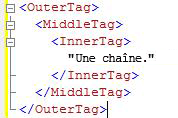
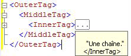

# <a name="code-outlining"></a>Mise en relief du code
[!INCLUDE[appliesto-ss-asdb-asdw-pdw-md](../../includes/appliesto-ss-asdb-asdw-pdw-md.md)]
  Vous pouvez utiliser la fonctionnalité mode Plan dans les éditeurs de requête [!INCLUDE[ssManStudioFull](../../includes/ssmanstudiofull-md.md)] pour masquer le code de manière sélective lorsque vous modifiez des requêtes. Cela permet d'afficher plus facilement le code sur lequel vous travaillez, surtout dans les fichiers de requête volumineux.  
  
## <a name="outlining-overview"></a>Vue d'ensemble du mode Plan  
 Par défaut, tout le code est visible lorsque vous ouvrez une fenêtre de l'éditeur de requête. Les régions du code peuvent être réduites pour être masquées. Une ligne verticale sur le contour gauche de la fenêtre d'éditeur utilise un carré avec un signe moins (-) pour identifier le début de chaque région de code pouvant être réduite. Lorsque vous cliquez sur un signe moins, le texte de la région de code est remplacé par une zone qui contient trois points (…), et le signe moins se transforme en signe plus (+). Lorsque vous cliquez sur un signe plus, le code réduit apparaît et le signe plus se transforme en signe moins. Lorsque vous déplacez le pointeur sur une zone comportant trois points, une info-bulle apparaît qui affiche le code dans la section réduite.  
  
## <a name="system-outline-regions"></a>Régions du mode Plan système  
 Chaque éditeur [!INCLUDE[ssManStudioFull](../../includes/ssmanstudiofull-md.md)] génère un ensemble de régions en mode Plan par défaut, définies par le système.  
  
 Les éditeurs de code MDX et DMX créent des régions en mode Plan pour chaque instruction multiligne. C'est le seul niveau de mode Plan que ces éditeurs prennent en charge.  
  
### <a name="analysis-services-xmla-query-editor-regions"></a>Régions de l'éditeur de requête XMLA Analysis Services  
 L'éditeur de requête XMLA [!INCLUDE[ssASnoversion](../../includes/ssasnoversion-md.md)] génère une région en mode Plan pour chaque attribut XML multiligne. L'éditeur imbrique les régions en mode Plan pour les balises imbriquées. Par exemple, l'éditeur XMLA crée trois régions en mode Plan pour le document suivant.  
  
   
  
 Quand vous cliquez sur le signe moins sur la ligne \<InnerTag>, seule cette ligne est réduite, comme affiché dans l’illustration suivante.  
  
   
  
 Lorsque vous déplacez le pointeur sur la zone qui possède les trois points (…), le code de la région réduite apparaît dans une info-bulle, comme affiché dans l'illustration suivante.  
  
   
  
 Quand vous cliquez sur le signe moins sur la ligne \<MiddleTag>, les lignes MiddleTag et InnerTag sont réduites, comme affiché dans l’illustration suivante.  
  
   
  
 Quand vous cliquez sur le signe moins sur la ligne \<OuterTag>, les trois lignes sont réduites, comme affiché dans l’illustration suivante.  
  
   
  
### <a name="database-engine-query-editor-regions"></a>Régions de l'éditeur de requête du moteur de base de données  
 L’éditeur de requête du [!INCLUDE[ssDE](../../includes/ssde-md.md)] génère des régions en mode Plan pour chaque élément de la hiérarchie suivante :  
  
1.  Lots. Le premier lot est le code compris entre le début du fichier et la première commande GO ou la fin du fichier lorsqu'il n'existe pas de commandes GO. Après la première commande GO, il existe un lot entre chaque commande GO et la commande GO suivante ou la fin du fichier.  
  
2.  Blocs délimités par les mots clés suivants :  
  
    -   BEGIN - END  
  
    -   BEGIN TRY - END TRY  
  
    -   BEGIN CATCH - END CATCH  
  
3.  Instructions multilignes.  
  
 Par exemple, l’éditeur de requête du [!INCLUDE[ssDE](../../includes/ssde-md.md)] crée trois régions en mode Plan pour la requête suivante :  
  
```  
CREATE PROCEDURE Sales.SampleProc --Outline region 1  
AS  
BEGIN --Outline region 2   
  SELECT GETDATE() AS TimeOfQuery;  
  SELECT * --Outline region 3  
  FROM sys.transmission_queue;  
  SELECT @@VERSION;  
END;  
GO  
```  
  
 Vous pouvez cliquer sur le signe moins de la ligne `SELECT *` pour réduire juste cette instruction `SELECT` . Pour réduire tout le bloc `BEGIN - END` , cliquez sur le signe moins de la ligne `BEGIN` . Pour réduire tout le lot à la commande `GO` , cliquez sur le signe moins de la ligne `CREATE PROCEDURE` . Vous ne pouvez pas réduire les lignes `SELECT GETDATE()` ou `SELECT @@VERSION` individuellement parce qu'il s'agit d'instructions à une seule ligne et qu'elles n'obtiennent pas de régions en mode Plan.  
  
  
