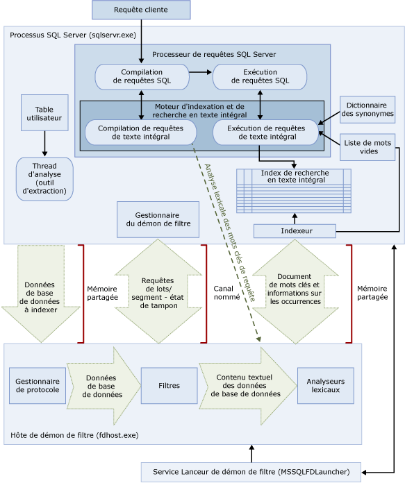

# <a name="full-text-search"></a>Recherche en texte intégral
[!INCLUDE[appliesto-ss-asdb-xxxx-xxx-md](../../includes/appliesto-ss-asdb-xxxx-xxx-md.md)]

La recherche en texte intégral dans [!INCLUDE[ssNoVersion](../../includes/ssnoversion-md.md)] et [!INCLUDE[ssSDSFull](../../includes/sssdsfull-md.md)] permet aux utilisateurs et aux applications d’exécuter des requêtes de texte intégral sur des données caractères dans des tables [!INCLUDE[ssNoVersion](../../includes/ssnoversion-md.md)] .
  
## <a name="basic-tasks"></a>Tâches de base
Cette rubrique présente une vue d’ensemble de la recherche en texte intégral et décrit son architecture ainsi que ses composants. Si vous préférez commencer tout de suite, voici les tâches de base qui vous intéresse.
-   [Commencer à utiliser la recherche en texte intégral](../../relational-databases/search/get-started-with-full-text-search.md)
-   [Créer et gérer des catalogues de texte intégral](../../relational-databases/search/create-and-manage-full-text-catalogs.md)
-   [Créer et gérer des index de recherche en texte intégral](../../relational-databases/search/create-and-manage-full-text-indexes.md)
-   [Alimenter des index de recherche en texte intégral](../../relational-databases/search/populate-full-text-indexes.md)
-   [Exécuter une requête avec une recherche en texte intégral](../../relational-databases/search/query-with-full-text-search.md)

> [!NOTE]
> Full-Text Search is an optional component of the [!INCLUDE[ssNoVersion](../../includes/ssnoversion-md.md)] . Si vous n’avez pas sélectionné la recherche en texte intégral lorsque vous avez installé SQL Server, exécutez de nouveau le programme d’installation de SQL Server pour l’ajouter.

## <a name="overview"></a>Vue d'ensemble
Un index de recherche en texte intégral comporte une ou plusieurs colonnes de caractères dans une table. Les types de données de ces colonnes peuvent être **char**, **varchar**, **nchar**, **nvarchar**, **text**, **ntext**, **image**, **xml** ou **varbinary(max)** et **FILESTREAM**. Chaque index de recherche en texte intégral indexe une ou plusieurs colonnes de la table, et chaque colonne peut utiliser une langue spécifique.  
  
 Les requêtes de texte intégral effectuent des recherches linguistiques sur des données texte dans des index de recherche en texte intégral ; pour cela, elles traitent les mots et les expressions à partir des règles d’une langue spécifique, telle que l’anglais ou le japonais. Les requêtes de texte intégral peuvent inclure des mots et des expressions simples ou plusieurs formes d'un mot ou d'une expression. Une requête de texte intégral retourne tous les documents qui contiennent au moins une correspondance (ce que l’on appelle aussi *résultat*). Une correspondance se produit lorsqu'un document cible contient tous les termes spécifiés dans la requête de texte intégral et satisfait toutes les autres conditions de recherche, telles que la distance entre les correspondances.    
  
##  <a name="queries"></a> Requêtes de recherche en texte intégral  
 Une fois que des colonnes ont été ajoutées à un index de recherche en texte intégral, les utilisateurs et les applications peuvent exécuter des requêtes de texte intégral sur le texte contenu dans ces colonnes. Ces requêtes peuvent être utilisées pour rechercher les éléments suivants :  
  
-   Un ou plusieurs mots ou expressions spécifiques (*terme simple*)  
  
-   Un mot ou une expression commençant par un texte spécifié (*préfixe*)  
  
-   Les formes flexionnelles d’un mot spécifique (*forme canonique*)  
  
-   Un mot ou une expression proches d’un autre mot ou d’une autre expression (*terme de proximité*)  
  
-   Les formes synonymes d’un mot spécifique (*dictionnaire des synonymes*)  
  
-   Mots ou expressions utilisant des valeurs pondérées (*termes pondérés*)  
  
 Les requêtes de texte intégral ne respectent pas la casse. Par exemple, la recherche du terme « Aluminium » ou « aluminium » retourne les mêmes résultats.  
  
 Les requêtes de texte intégral utilisent un ensemble réduit de prédicats [!INCLUDE[tsql](../../includes/tsql-md.md)] (CONTAINS et FREETEXT) et de fonctions (CONTAINSTABLE et FREETEXTTABLE). Toutefois, les objectifs de la recherche pour un scénario d'entreprise donné influencent la structure des requêtes de texte intégral. Exemple :  
  
-   Entreprise e-business : rechercher un produit sur un site Web :  
  
    ```  
    SELECT product_id   
    FROM products   
    WHERE CONTAINS(product_description, ”Snap Happy 100EZ” OR FORMSOF(THESAURUS,’Snap Happy’) OR ‘100EZ’)   
    AND product_cost < 200 ;  
    ```  
  
-   Scénario de recrutement : rechercher des postulants à un emploi qui connaissent bien [!INCLUDE[ssNoVersion](../../includes/ssnoversion-md.md)]:  
  
    ```  
    SELECT candidate_name,SSN   
    FROM candidates   
    WHERE CONTAINS(candidate_resume,”SQL Server”) AND candidate_division =DBA;  
    ```  
  
 Pour plus d’informations, consultez [Exécuter une requête avec une recherche en texte intégral](../../relational-databases/search/query-with-full-text-search.md).  
  
##  <a name="like"></a> Comparaison des requêtes de recherche en texte intégral avec le prédicat LIKE
 Contrairement à la recherche en texte intégral, le prédicat [LIKE](../../t-sql/language-elements/like-transact-sql.md) [!INCLUDE[tsql](../../includes/tsql-md.md)] fonctionne uniquement sur les modèles de caractères. En outre, vous ne pouvez pas utiliser le prédicat LIKE pour interroger des données binaires mises en forme. De plus, une requête LIKE portant sur un important volume de données de texte non structurées est beaucoup plus lente qu'une requête de texte intégral équivalente exécutée sur les mêmes données. Une requête LIKE portant sur des millions de lignes de données de texte peut prendre plusieurs minutes pour retourner un résultat alors qu'une requête de texte intégral retourne en quelques secondes à peine le même résultat, en fonction du nombre de lignes retournées.  
  
##  <a name="architecture"></a> Architecture de la recherche en texte intégral
 L'architecture de la recherche en texte intégral est constituée des processus suivants :  
  
-   Processus [!INCLUDE[ssNoVersion](../../includes/ssnoversion-md.md)] (sqlservr.exe).  
  
-   Processus hôte de démon de filtre (fdhost.exe).  
  
     Pour des raisons de sécurité, les filtres sont chargés par des processus distincts appelés hôtes de démon de filtre. Les processus fdhost.exe sont créés par un service du lanceur FDHOST (MSSQLFDLauncher) et s'exécutent avec les informations d'identification de sécurité du compte du service du lanceur FDHOST. Par conséquent, le service du lanceur FDHOST doit être en cours d'exécution pour que l'indexation de texte intégral et l'exécution de requêtes de texte intégral puissent fonctionner. Pour plus d’informations sur le compte de service pour ce service, consultez [Définir le compte du service du Lanceur de démon de filtre de texte intégral](../../relational-databases/search/set-the-service-account-for-the-full-text-filter-daemon-launcher.md).  
  
 Ces deux processus contiennent les composants de l'architecture de recherche en texte intégral. Ces composants et leurs relations sont résumés dans l'illustration ci-dessous. Les composants sont décrits après l'illustration.  
  
   

###  <a name="sqlprocess"></a> Processus SQL Server  
 Le processus [!INCLUDE[ssNoVersion](../../includes/ssnoversion-md.md)] utilisent les composants suivants pour la recherche en texte intégral :  
  
-   **Tables utilisateur.** Ces tables contiennent les données à indexer en texte intégral.  
  
-   **Outil d'extraction de texte intégral.** L'outil d'extraction de texte intégral fonctionne avec les threads d'analyse de texte intégral. Il est responsable de la planification et du pilotage du remplissage des index de texte intégral, ainsi que de la surveillance des catalogues de texte intégral.  
  
-   **Fichiers du dictionnaire des synonymes.** Ces fichiers contiennent des synonymes de termes de recherche. Pour plus d’informations, consultez [Configurer et gérer les fichiers de dictionnaire des synonymes pour la recherche en texte intégral](../../relational-databases/search/configure-and-manage-thesaurus-files-for-full-text-search.md).  
  
-   **Objets de la liste de mots vides.** Les objets de la liste de mots vides contiennent une liste de mots courants qui ne sont pas utiles pour la recherche. Pour plus d’informations, consultez [Configurer et gérer les mots vides et listes de mots vides pour la recherche en texte intégral](../../relational-databases/search/configure-and-manage-stopwords-and-stoplists-for-full-text-search.md).  
  
-   **[!INCLUDE[ssNoVersion](../../includes/ssnoversion-md.md)] Processeur de requêtes.** Le processeur de requêtes compile et exécute des requêtes SQL. Si une requête SQL inclut une requête de recherche en texte intégral, la requête est envoyée au Moteur d'indexation et de recherche en texte intégral, à la fois pendant la compilation et pendant l'exécution. Le résultat de la requête est opposé à l'index de texte intégral.  
  
-   **Moteur d'indexation et de recherche en texte intégral.** Le Moteur d’indexation et de recherche en texte intégral de [!INCLUDE[ssNoVersion](../../includes/ssnoversion-md.md)] est entièrement intégré au processeur de requêtes. Le Moteur d'indexation et de recherche en texte intégral compile et exécute les requêtes de texte intégral. Dans le cadre de l'exécution de la requête, le Moteur d'indexation et de recherche en texte intégral peut recevoir des entrées provenant du dictionnaire des synonymes et de la liste de mots vides.  

    >[!NOTE]  
    >  Dans [!INCLUDE[ssKatmai](../../includes/sskatmai-md.md)] et les versions ultérieures, le moteur d'indexation et de recherche en texte intégral réside dans le processus [!INCLUDE[ssNoVersion](../../includes/ssnoversion-md.md)] , plutôt que dans un service séparé. L’intégration du moteur d’indexation et de recherche en texte intégral au moteur de base de données a permis l’amélioration de la gestion du texte intégral ainsi que l’optimisation des requêtes mixtes et des performances globales.  
 
-   **Générateur d'index (indexeur).** Le générateur d'index crée la structure utilisée pour stocker les jetons indexés.  
  
-   **Gestionnaire du démon de filtre.** Le gestionnaire du démon de filtre est responsable de la surveillance de l'état du processus du démon du filtre du Moteur d'indexation et de recherche en texte intégral.  
  
###  <a name="fdhostprocess"></a> Filter Daemon Host process  
 L'hôte de démon de filtre est un processus démarré par le Moteur d'indexation et de recherche en texte intégral. Il exécute les composants de recherche en texte intégral ci-dessous, chargés d'accéder aux données des tables, de les filtrer et d'en effectuer l'analyse lexicale, ainsi que d'effectuer l'analyse lexicale et d'identifier la racine des mots de l'entrée de requête.  
  
 Les composants de l'hôte de démon de filtre sont les suivants :  
  
-   **Gestionnaire de protocole.** Ce composant extrait les données de la mémoire en vue de leur traitement ultérieur et accède aux données d'une table utilisateur de la base de données spécifiée. Il est chargé, entre autres, de collecter les données des colonnes indexées en texte intégral et de transmettre ces données à l'hôte de démon de filtre, qui applique le filtrage et l'analyse lexicale, si besoin est.  
  
-   **Filtres.** Un filtrage peut être nécessaire sur certains types de données avant que les données d’un document puissent être indexées en texte intégral, notamment les données des colonnes **varbinary**, **varbinary(max)**, **image**ou **xml** . Le filtre utilisé pour un document donné dépend du type de celui-ci. Ainsi, différents filtres sont utilisés pour les documents Microsoft Word (.doc), les documents Microsoft Excel (.xls) et les documents XML (.xml). Ensuite, le filtre extrait des segments de texte du document, en supprimant la mise en forme incorporée et en conservant le texte et, éventuellement, les informations sur l'emplacement du texte. Un flux d'informations textuelles est ainsi généré. Pour plus d’informations, consultez [Configurer et gérer les extensions analytiques avancées](../../relational-databases/search/configure-and-manage-filters-for-search.md).  
  
-   **Analyseurs lexicaux et générateurs de formes dérivées.** Un analyseur lexical est un composant spécifique d’une langue qui recherche des limites de mots en utilisant les règles lexicales de cette langue (*analyse lexicale*). Chaque analyseur lexical est associé à un composant de générateur de formes dérivées spécifique d'une langue qui conjugue des verbes et effectue des expansions fléchies. Au moment de l'indexation, l'hôte de démon de filtre utilise un analyseur lexical et un générateur de formes dérivées pour effectuer l'analyse linguistique sur les données textuelles d'une colonne de table donnée. La langue associée à une colonne de table dans l'index de recherche en texte intégral détermine l'analyseur lexical et le générateur de formes dérivées à utiliser pour indexer la colonne. Pour plus d’informations, consultez [Configurer et gérer les analyseurs lexicaux et générateurs de formes dérivées pour la recherche](../../relational-databases/search/configure-and-manage-word-breakers-and-stemmers-for-search.md).  
  
##  <a name="processing"></a> Traitement de la recherche en texte intégral  
 La recherche en texte intégral est rendue possible par le Moteur d'indexation et de recherche en texte intégral. Le Moteur d'indexation et de recherche en texte intégral assure deux rôles : prise en charge de l'indexation et prise en charge des requêtes.  
  
###  <a name="indexing"></a> Processus d’indexation de texte intégral  
 Au début d'une alimentation de texte intégral (également appelé analyse), le Moteur d'indexation et de recherche en texte intégral effectue l'envoi (push) de grands lots de données en mémoire et informe l'hôte de démon de filtre. L'hôte filtre et effectue une analyse lexicale des données et il convertit les données converties en listes de mots inversées. La recherche en texte intégral extrait ensuite les données converties des listes de mots, traite les données pour supprimer les mots vides et conserve les listes de mots pour un lot dans un ou plusieurs index inversés.  
  
 Pendant l’indexation des données stockées dans une colonne **varbinary(max)** ou **image** , le filtre qui implémente l’interface **IFilter** extrait le texte en fonction du format de fichier spécifié pour ces données (par exemple, [!INCLUDE[msCoName](../../includes/msconame-md.md)] Word). Dans certains cas, les composants de filtrage imposent que les données **varbinary(max)** ou **image** soient écrites dans le dossier de filtrage de données, au lieu d’être envoyées (push) en mémoire.  
  
 Dans le cadre du traitement, les données de texte collectées sont transmises à un analyseur lexical pour décomposer le texte en jetons individuels ou mots clés. La langue utilisée pour la création de jetons peut être spécifiée au niveau de la colonne ou être identifiée au sein des données **varbinary(max)**, **image**ou **xml** par le composant de filtrage.  
  
 Un traitement supplémentaire peut être effectué pour supprimer les mots vides et normaliser les jetons avant leur stockage dans l'index de recherche en texte intégral ou un fragment d'index.  
  
 À la fin d'une alimentation, une fusion finale est déclenchée ; les fragments d'index sont fusionnés entre eux dans un index de recherche en texte intégral. Il en résulte une amélioration des performances des requêtes dans la mesure où seul l'index principal doit être interrogé au lieu des fragments d'index ; par ailleurs, les statistiques de score sont plus appropriées pour un classement en fonction de la pertinence.  
  
###  <a name="querying"></a> Processus d’interrogation de texte intégral  
 Le processeur de requêtes passe les parties de texte intégral d'une requête au Moteur d'indexation et de recherche en texte intégral à des fins de traitement. Le Moteur d'indexation et de recherche en texte intégral effectue l'analyse lexicale et procède éventuellement à des expansions du dictionnaire des synonymes, à la recherche de radical et au traitement des mots vides (mots parasites). Ensuite, les parties de texte intégral de la requête sont représentées sous forme d'opérateurs SQL, essentiellement comme des fonctions table multi-diffusion. Au cours de l'exécution de la requête, ces fonctions table multi-diffusion accèdent à l'index inversé pour extraire les résultats corrects. Les résultats sont alors retournés au client ou bien ils font l'objet d'un traitement supplémentaire avant d'être retournés au client.  

## <a name="full-text-index-architecture"></a>Architecture des index de recherche en texte intégral
  Les informations contenues dans les index de recherche en texte intégral sont utilisées par le Moteur d'indexation et de recherche en texte intégral pour compiler des requêtes de texte intégral qui permettent de rechercher rapidement certains mots ou combinaisons de mots dans une table. Un index de recherche en texte intégral stocke les informations se rapportant aux mots significatifs et à leur emplacement dans une ou plusieurs colonnes d'une table de base de données. Un index de recherche en texte intégral est un type spécial d'index fonctionnel par jeton qui est construit et géré par le Moteur d'indexation et de recherche en texte intégral pour [!INCLUDE[ssNoVersion](../../includes/ssnoversion-md.md)]. Le processus de création d'un index de texte intégral diffère du processus de création des autres types d'index. Au lieu de construire une structure d'arbre B (B-tree) en fonction d'une valeur stockée dans une ligne particulière, le Moteur d'indexation et de recherche en texte intégral crée une structure d'index inversée, empilée, compressée et basée sur des jetons individuels provenant du texte indexé.  La taille d’un index de recherche en texte intégral est limitée uniquement par les ressources mémoire dont dispose l’ordinateur sur lequel l’instance de [!INCLUDE[ssNoVersion](../../includes/ssnoversion-md.md)] s’exécute.  
  
 À compter de [!INCLUDE[ssKatmai](../../includes/sskatmai-md.md)], les index de recherche en texte intégral sont intégrés au Moteur de base de données, au lieu de résider dans le système de fichiers comme dans les versions antérieures de [!INCLUDE[ssNoVersion](../../includes/ssnoversion-md.md)]. Pour une nouvelle base de données, le catalogue de texte intégral est désormais un objet virtuel qui n'appartient à aucun groupe de fichiers ; il s'agit tout simplement d'un concept logique qui fait référence à un groupe d'index de recherche en texte intégral. Notez toutefois que pendant la mise à niveau d’une base de données [!INCLUDE[ssVersion2005](../../includes/ssversion2005-md.md)] , pour tout catalogue de texte intégral qui contient des fichiers de données, un nouveau groupe de fichiers est créé ; pour plus d’informations, consultez [Mise à niveau de la fonction de recherche en texte intégral](../../relational-databases/search/upgrade-full-text-search.md).  
  
Un seul index de recherche en texte intégral est autorisé par table. Pour qu'un index de recherche en texte intégral puisse être créé sur une table, cette dernière doit posséder une colonne d'index unique, qui n'accepte pas les valeurs Null. Vous pouvez créer un index de recherche en texte intégral sur les colonnes de type **char**, **varchar**, **nchar**, **nvarchar**, **text**, **ntext**, **image**, **xml**, **varbinary**et **varbinary(max)** peut être indexé pour la recherche en texte intégral. Lorsque vous créez un index de recherche en texte intégral sur une colonne de type de données  **varbinary**, **varbinary(max)**, **image**ou **xml** , vous devez spécifier une colonne de type. Une *colonne de type* est une colonne de table dans laquelle vous stockez l’extension de fichier (.doc, .pdf, .xls, etc.) du document dans chaque ligne.  

###  <a name="structure"></a> Structure d’index de recherche en texte intégral  
 La compréhension de la structure d'un index de recherche en texte intégral vous permet de comprendre également le fonctionnement du Moteur d'indexation et de recherche en texte intégral. Cette rubrique utilise l'extrait suivant de la table **Document** dans [!INCLUDE[ssSampleDBCoShort](../../includes/sssampledbcoshort-md.md)] comme exemple de table. L'extrait suivant montre deux colonnes, la colonne **DocumentID** et la colonne **Title** , ainsi que trois lignes provenant de cette table.  
  
 Pour cet exemple, il faut partir de l’hypothèse qu’un index de recherche en texte intégral a été créé sur la colonne **Title** .  
  
|DocumentID|Titre|  
|----------------|-----------|  
| 1|Crank Arm and Tire Maintenance|  
|2|Front Reflector Bracket and Reflector Assembly 3|  
|3|Front Reflector Bracket Installation|  
  
 Par exemple, la table suivante, qui illustre le Fragment 1, décrit le contenu de l’index de recherche en texte intégral créé sur la colonne **Title** de la table **Document** . Les index de recherche en texte intégral contiennent plus d'informations que les éléments présentés dans cette table. La table est une représentation logique d'un index de recherche en texte intégral et est fournie à des fins de démonstration uniquement. Les lignes sont stockées dans un format compressé pour optimiser l'utilisation du disque.  
  
 Remarquez que les données ont été inversées par rapport aux documents d'origine. L'inversion se produit parce que les mots clés sont mappés aux ID de document. Pour cette raison, un index de recherche en texte intégral est souvent désigné par le nom d'un index inversé.  
  
 Remarquez également que le mot clé « and » a été supprimé de l'index de recherche en texte intégral. Cela s'explique du fait que « and » est un mot vide, et que la suppression de mots vides d'un index de recherche en texte intégral peut induire des économies substantielles en termes d'espace disque, d'où une amélioration des performances des requêtes. Pour plus d’informations sur les mots vides, consultez [Configurer et gérer les mots vides et listes de mots vides pour la recherche en texte intégral](../../relational-databases/search/configure-and-manage-stopwords-and-stoplists-for-full-text-search.md).  
  
 **Fragment 1**  
  
|Mot clé|ColId|DocId|Occurrence|  
|-------------|-----------|-----------|----------------|  
|Crank| 1| 1| 1|  
|Arm| 1| 1|2|  
|Tire| 1| 1|4|  
|Maintenance| 1| 1|5|  
|Front| 1|2| 1|  
|Front| 1|3| 1|  
|Reflector| 1|2|2|  
|Reflector| 1|2|5|  
|Reflector| 1|3|2|  
|Bracket| 1|2|3|  
|Bracket| 1|3|3|  
|Assembly| 1|2|6|  
|3| 1|2|7|  
|Installation| 1|3|4|  
  
 La colonne **Keyword** contient la représentation d'un jeton unique extrait au moment de l'indexation. Les analyseurs lexicaux déterminent le contenu d'un jeton.  
  
 La colonne **ColId** contient une valeur qui correspond à une colonne particulière indexée en texte intégral.  
  
 La colonne **DocId** contient les valeurs d’un entier sur 8 octets mappé à une valeur de clé de texte intégral particulière dans une table indexée en texte intégral. Ce mappage est nécessaire lorsque la clé de texte intégral n'est pas un type de données integer. Dans de tels cas, les mappages entre les valeurs de clé de texte intégral et les valeurs **DocId** sont maintenus dans une table séparée appelée la table de mappage DocId. Pour lancer une requête à propos de ces mappages, utilisez la procédure stockée système [sp_fulltext_keymapping](../../relational-databases/system-stored-procedures/sp-fulltext-keymappings-transact-sql.md) . Pour satisfaire à un critère de recherche, les valeurs DocId de la table précitée doivent être jointes avec la table de mappage DocId pour extraire des lignes de la table de base qui est interrogée. Lorsque la valeur de clé de texte intégral de la table de base est un type de données Integer, la valeur sert directement de DocId et aucun mappage n'est nécessaire. Par conséquent, l'utilisation de valeurs de clé de texte intégral Integer peut contribuer à optimiser des requêtes de texte intégral.  
  
 La colonne **Occurrence** contient une valeur entière. Pour chaque valeur DocId, il existe une liste de valeurs d'occurrences qui correspondent aux décalages de mots relatifs du mot clé spécifique contenu dans DocId. Les valeurs d'occurrences servent à déterminer les correspondances d'expressions ou de proximité, par exemple lorsque des expressions ont des valeurs d'occurrences adjacentes numériquement. Elles servent également à calculer les scores de pertinence ; par exemple, le nombre d'occurrences d'un mot clé dans DocId peut être utilisé pour l'établissement d'un score.   
  
###  <a name="fragments"></a> Fragments d’index de recherche en texte intégral  
 L'index de recherche en texte intégral logique est habituellement fractionné entre plusieurs tables internes. Chaque table interne est appelé fragment d'index de recherche en texte intégral. Quelques-uns de ces fragments peuvent contenir des données plus récentes que d'autres. Par exemple, si un utilisateur met à jour la ligne suivante dont DocId est 3 et que la table effectue un suivi automatique des modifications, un nouveau fragment est créé.  
  
|DocumentID|Titre|  
|----------------|-----------|  
|3|Rear Reflector|  
  
 Dans l'exemple suivant, qui illustre le Fragment 2, le fragment contient des données plus récentes à propos de DocId 3 par rapport à Fragment 1. Par conséquent, lorsque l'utilisateur émet des requêtes concernant « Rear Reflector », les données de Fragment 2 sont utilisées pour DocId 3. Chaque fragment est marqué avec un horodateur de création qui peut être interrogé à l’aide de la vue de catalogue [sys.fulltext_index_fragments](../../relational-databases/system-catalog-views/sys-fulltext-index-fragments-transact-sql.md) .  
  
 **Fragment 2**  
  
|Mot clé|ColId|DocId|Occ|  
|-------------|-----------|-----------|---------|  
|Rear| 1|3| 1|  
|Reflector| 1|3|2|  
  
 Comme on peut le constater d'après Fragment 2, les requêtes de texte intégral doivent interroger chaque fragment en interne et ignorer les entrées plus anciennes. Par conséquent, trop de fragments d'index de recherche en texte intégral dans l'index de texte intégral peut conduire à une dégradation substantielle dans les performances des requêtes. Pour réduire le nombre de fragments, réorganisez le catalogue de texte intégral en utilisant l’option REORGANIZE de l’instruction [!INCLUDE[tsql](../../includes/tsql-md.md)] [ALTER FULLTEXT CATALOG](../../t-sql/statements/alter-fulltext-catalog-transact-sql.md). Cette instruction effectue une *fusion principale*, c’est-à-dire une fusion de tous les fragments en un fragment unique plus grand, et supprime toutes les entrées obsolètes de l’index de recherche en texte intégral.  
  
 Une fois réorganisé, l'index de l'exemple contient les lignes suivantes :  
  
|Mot clé|ColId|DocId|Occ|  
|-------------|-----------|-----------|---------|  
|Crank| 1| 1| 1|  
|Arm| 1| 1|2|  
|Tire| 1| 1|4|  
|Maintenance| 1| 1|5|  
|Front| 1|2| 1|  
|Rear| 1|3| 1|  
|Reflector| 1|2|2|  
|Reflector| 1|2|5|  
|Reflector| 1|3|2|  
|Bracket| 1|2|3|  
|Assembly| 1|2|6|  
|3| 1|2|7|  

### <a name="differences-between-full-text-indexes-and-regular-sql-server-indexes"></a>Différences entre les index en recherche intégral et les index standard SQL Server :  
  
|Index de texte intégral|Index SQL Server classiques|  
|------------------------|--------------------------------|  
|Un seul index de recherche en texte intégral est autorisé par table.|Plusieurs index classiques sont autorisés par table.|  
|L’ajout de données aux index de recherche en texte intégral, opération que l’on appelle *remplissage*, doit être demandé soit dans le cadre de la planification, soit par le biais d’une requête spécifique, ou peut intervenir automatiquement lors de l’ajout de nouvelles données.|Sont mis à jour automatiquement lorsque les données sur lesquelles ils sont fondés sont modifiées, mises à jour ou supprimées.|  
|Sont groupés à l'intérieur d'une même base de données dans un ou plusieurs catalogues de texte intégral.|Ne sont pas groupés.|  

##  <a name="components"></a> Prise en charge des langues et composants linguistiques de la recherche en texte intégral
 La recherche en texte intégral prend en charge environ 50 langues, dont l'anglais, l'espagnol, le chinois, le japonais, l'arabe, le bengali et l'hindi. Pour obtenir une liste complète des langues de texte intégral prises en charge, consultez [sys.fulltext_languages &#40;Transact-SQL&#41;](../../relational-databases/system-catalog-views/sys-fulltext-languages-transact-sql.md). Chacune des colonnes contenues dans l'index de recherche en texte intégral est associée à un identificateur de paramètres régionaux (LCID) Microsoft Windows qui représente une langue prise en charge par la recherche en texte intégral. Par exemple, le LCID 1033 correspond à l'anglais américain et le LCID 2057 à l'anglais britannique. Pour chaque langue de texte intégral prise en charge, [!INCLUDE[ssNoVersion](../../includes/ssnoversion-md.md)] fournit des composants linguistiques qui acceptent l'indexation et l'interrogation des données de texte intégral qui sont stockées dans cette langue.  
  
 Les composants spécifiques à une langue sont les suivants :  
  
-   **Analyseurs lexicaux et générateurs de formes dérivées.** Un analyseur lexical détecte les limites de mots en fonction des règles lexicales définies pour une langue donnée (*analyse lexicale*). Chaque analyseur lexical est associé à un générateur de formes dérivées qui conjugue des verbes pour la même langue. Pour plus d’informations, consultez [Configurer et gérer les analyseurs lexicaux et générateurs de formes dérivées pour la recherche](../../relational-databases/search/configure-and-manage-word-breakers-and-stemmers-for-search.md).  
  
-   **Listes de mots vides.** Une liste de mots vides système contenant un jeu de base de mots vides (également appelés mots parasites) est fournie. Un *mot vide* n’est d’aucune utilité pour la recherche et est ignoré par les requêtes de texte intégral. Par exemple, en français, les mots tels que « un », « et », « est » ou « le » sont considérés comme des mots vides. En général, vous devez configurer un ou plusieurs fichiers de dictionnaires des synonymes et une ou plusieurs listes de mots vides. Pour plus d’informations, consultez [Configurer et gérer les mots vides et listes de mots vides pour la recherche en texte intégral](../../relational-databases/search/configure-and-manage-stopwords-and-stoplists-for-full-text-search.md).  
  
-   **Fichiers du dictionnaire des synonymes.** [!INCLUDE[ssNoVersion](../../includes/ssnoversion-md.md)] installe aussi un fichier de dictionnaire des synonymes pour chaque langue de texte intégral, ainsi qu’un fichier de dictionnaire des synonymes global. Les fichiers de dictionnaire des synonymes installés sont essentiellement vides, mais vous pouvez les modifier et définir des synonymes pour une langue ou un scénario d'entreprise spécifique. En développant un dictionnaire des synonymes adapté à vos données de texte intégral, vous pouvez élargir efficacement l'étendue des requêtes de texte intégral sur ces données. Pour plus d’informations, consultez [Configurer et gérer les fichiers de dictionnaire des synonymes pour la recherche en texte intégral](../../relational-databases/search/configure-and-manage-thesaurus-files-for-full-text-search.md).  
  
-   **Filtres (iFilters).**  L’indexation d’un document dans une colonne dont le type de données est **varbinary(max)**, **image**ou **xml** exige le traitement supplémentaire d’un filtre. Ce filtre doit être spécifique au type de document (.doc, .pdf, .xls, .xml, etc.). Pour plus d’informations, consultez [Configurer et gérer les extensions analytiques avancées](../../relational-databases/search/configure-and-manage-filters-for-search.md).  
  
 Les analyseurs lexicaux (et les générateurs de formes dérivées) et les filtres s'exécutent dans le processus hôte de démon de filtre (fdhost.exe).  

[!INCLUDE[tsql-appliesto-ss2008-asdb-xxxx-xxx_md](../../includes/tsql-appliesto-ss2008-asdb-xxxx-xxx-md.md)]

