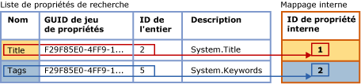
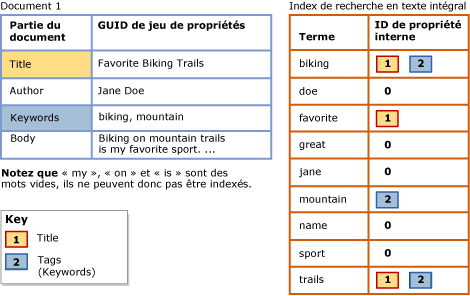

# <a name="search-document-properties-with-search-property-lists"></a>Rechercher les propriétés du document à l’aide des listes de propriétés de recherche
[!INCLUDE[appliesto-ss-asdb-xxxx-xxx-md](../../includes/appliesto-ss-asdb-xxxx-xxx-md.md)]
  Auparavant, les propriétés de document était indiscernables du contenu du corps du document. Cela limitait les requêtes de texte intégral aux recherches génériques sur les documents entiers. Maintenant, vous pouvez configurer un index de recherche en texte intégral pour prendre en charge la recherche portant sur des propriétés, telles que les propriétés Auteur et Titre, pour les types de documents pris en charge dans une colonne de données binaires **varbinary**, **varbinary(max)** (incluant **FILESTREAM**) ou **image** . Cette forme de recherche s'appelle *recherche de propriétés*.  
  
 Le [filtre](../../relational-databases/search/configure-and-manage-filters-for-search.md) associé (IFilter) détermine si la recherche de propriétés est possible sur un type spécifique de document. Pour certains types de document, l'IFilter associé extrait tout ou partie des propriétés définies pour ce le type de document, ainsi que le contenu du corps du document. Vous pouvez configurer un index de recherche en texte intégral de façon à prendre en charge la recherche de propriétés portant uniquement sur les propriétés extraites par un IFilter lors de l'indexation de texte intégral. Parmi les IFilters qui extraient plusieurs propriétés de document, il existe des IFilters pour les types de fichier document Microsoft Office (tels que .docx, .xlsx et .pptx). En revanche, XML IFilter n'émet pas des propriétés.  
  
##  <a name="How_FTS_Works_with_search_properties"></a> Fonctionnement de la recherche en texte intégral avec les propriétés de recherche  
  
### <a name="internal-property-ids"></a>ID de propriétés internes  
 Le moteur d'indexation et de recherche en texte intégral affecte arbitrairement un ID de propriété interne à chaque propriété enregistrée, qui l'identifie de façon unique dans cette liste de recherche particulière et qui est spécifique à cette liste de propriétés de recherche. Par conséquent, si une propriété est ajoutée à plusieurs listes de propriétés de recherche, son ID de propriété interne est susceptible de varier entre les différentes listes.  
  
 Lorsqu’une propriété est enregistrée pour une liste de recherche, le moteur d’indexation et de recherche en texte intégral affecte arbitrairement un *ID de propriété interne* à la propriété. L'ID de propriété interne est un entier qui identifie de façon unique la propriété dans cette liste de propriétés de recherche.  
  
 L'illustration suivante montre une vue logique d'une liste de propriétés de recherche qui spécifie deux propriétés, Title et Keywords. Le nom de la liste de propriétés pour Keywords est « Tags ». Ces propriétés appartiennent au même jeu de propriétés, dont le GUID est F29F85E0-4FF9-1068-AB91-08002B27B3D9. Les identificateurs entiers de propriété sont 2 pour Title et 5 pour Tags (Keywords). Le moteur d'indexation et de recherche en texte intégral mappe arbitrairement chaque propriété à un ID de propriété interne qui est unique à la liste de propriétés de recherche. L'ID de propriété interne pour la propriété Title est 1, et l'ID de propriété interne pour la propriété Tags est 2.  
  
   
  
 L'ID de propriété interne est susceptible d'être différent de l'identificateur entier de la propriété. Si une propriété donnée est enregistrée pour plusieurs listes de propriétés de recherche, un ID de propriété interne différent peut être affecté pour chaque liste de propriétés de recherche. Par exemple, l'ID de propriété interne peut être 4 dans une liste de propriétés de recherche, 1 dans une autre, 3 dans une autre, etc. En revanche, l'identificateur entier de propriété est intrinsèque à la propriété et reste le même partout où la propriété est utilisée.  
  
### <a name="indexing-of-registered-properties"></a>Indexation de propriétés inscrites  
 Une fois qu'un index de recherche en texte intégral est associé à une liste de propriétés de recherche, l'index doit être rempli à nouveau pour indexer les termes de recherche spécifiques à la propriété. Lors de l'indexation de texte intégral, le contenu de toutes les propriétés est stocké dans l'index de recherche en texte intégral avec les autres contenus. Toutefois, lors de l'indexation d'un terme de recherche présent dans une propriété enregistrée, l'indexeur de texte intégral stocke également l'ID de propriété interne correspondant au terme. En revanche, si une propriété n'est pas enregistrée, elle est stockée dans l'index de recherche en texte intégral comme si elle faisait partie du corps du document, et a la valeur zéro comme ID de propriété interne.  
  
 L'illustration suivante montre une vue logique de la façon dont les termes de recherche apparaissent dans un index de recherche en texte intégral associé à la liste de propriétés de recherche figurant dans l'illustration précédente. L'exemple de document Document 1 contient trois propriétés : Title, Author et Keywords, ainsi que le corps du document. Pour les propriétés Title et Keywords, spécifiées dans la liste de propriétés de recherche, des termes de recherche sont associés à leurs ID de propriété internes correspondants dans l'index de recherche en texte intégral. En revanche, le contenu de la propriété Author est indexé comme s'il faisait partie du corps du document. Cela signifie que l'inscription d'une propriété augmente un peu la taille de l'index de recherche en texte intégral, en fonction du volume du contenu stocké dans la propriété.  
  
   
  
 Les termes de recherche de la propriété Title (« Favorite », « Biking », et « Trails ») sont associés à l'ID de propriété interne 1, affecté à Title pour cet index. Les termes de recherche de la propriété Keywords (« biking » et « mountain ») sont associés à l'ID de propriété interne 2, affecté à Tags pour cet index. Pour les termes de recherche de la propriété Author (« Jane » et « Doe ») et les termes de recherche dans le corps du document, l'ID de propriété interne est 0. Le terme « biking » est présent dans la propriété Title, dans la propriété Keywords (Tags) et dans le corps du document. Une recherche de propriété sur « biking » dans la propriété Title ou Keywords (Tags) retournerait ce document dans les résultats. Une requête de texte intégral générique sur « biking » retournerait également ce document, comme si l’index n’avait pas été configuré pour la recherche de propriétés. Une recherche de propriété sur « biking » dans la propriété Author ne retournerait pas ce document.  
  
 Une requête de texte intégral de portée propriété utilise les ID de propriété internes enregistrés pour la liste de propriétés de recherche actuelle de l'index de recherche en texte intégral.  
  
##  <a name="impact"></a> Impact de l'activation de la recherche de propriétés  
 Configurer un index de recherche en texte intégral pour prendre en charge la recherche sur une ou plusieurs propriétés augmente quelque peu la taille de l'index, en fonction du nombre de propriétés spécifiées dans votre liste de propriétés de recherche et du contenu de chaque propriété.  
  
 En testant des corpus standard de documents Microsoft Word, Excel et PowerPoint, nous avons configuré un index de recherche en texte intégral pour indexer des propriétés de recherche types. L'indexation de ces propriétés a augmenté la taille de l'index de recherche en texte intégral d'environ 5 pour cent. Nous estimons que cette augmentation de taille approximative correspondra à la plupart des corpus de documents. Toutefois, l'augmentation de la taille dépend finalement du volume des données de propriété dans un corpus de documents donné, par rapport au volume total des données.  
  
##  <a name="creating"></a> Création d'une liste de propriétés de recherche et activation de la recherche de propriétés  
  
###  <a name="creating_sub"></a> Création d'une liste de propriétés de recherche  
 **Pour créer une liste de propriétés de recherche avec Transact-SQL**  
  
 Utilisez l’instruction [CREATE SEARCH PROPERTY LIST &#40;Transact-SQL&#41;](../../t-sql/statements/create-search-property-list-transact-sql.md) et fournissez au moins un nom pour la liste.  
  
##### <a name="to-create-a-search-property-list-in-management-studio"></a>Pour créer une liste de propriétés de recherche dans Management Studio  
  
1.  Dans l'Explorateur d'objets, développez le serveur.  
  
2.  Développez **Bases de données**, puis développez la base de données dans laquelle vous souhaitez créer la liste de propriétés de recherche.  
  
3.  Développez **Stockage**, puis cliquez avec le bouton droit sur **Listes de propriétés de recherche**.  
  
4.  Sélectionnez **Nouvelle liste de propriétés de recherche**.  
  
5.  Spécifiez le nom de la liste de propriétés.  
  
6.  Éventuellement, spécifiez une autre personne comme propriétaire de la liste de propriétés.  
  
7.  Sélectionnez l'une des options suivantes :  
  
    -   **Créer une liste de propriétés de recherche vide**  
  
    -   **Créer à partir d'une liste de propriétés de recherche existante**  
  
     Pour plus d’informations, consultez [New Search Property List](http://msdn.microsoft.com/library/ffca78e9-8608-4b15-bd38-b2d78da4247a).  
  
8.  [!INCLUDE[clickOK](../../includes/clickok-md.md)]  
  
###  <a name="adding"></a> Ajout de propriétés à une liste de propriétés de recherche  
 La recherche de propriétés requiert la création d'une *liste de propriétés de recherche* et la spécification d'une ou plusieurs propriétés sur lesquelles vous allez pouvoir effectuer des recherches. Lorsque vous ajoutez une propriété à une liste de propriétés de recherche, cette propriété est enregistrée pour cette liste spécifique. Pour ajouter une propriété à une liste de propriétés de recherche, les valeurs suivantes sont nécessaires :  
  
-   GUID du jeu de propriétés  
  
     Chaque propriété de recherche appartient pour un seul jeu de propriétés qui contient un groupe de propriétés associées. Chaque jeu de propriétés est identifié par un identificateur global unique (GUID).  
  
-   Identificateur entier de propriété  
  
     Chaque propriété de recherche possède un identificateur unique dans le jeu de propriétés. Pour une propriété donnée, l’identificateur peut être un entier ou une chaîne ; cependant, la recherche en texte intégral ne prend en charge que des identificateurs entiers.  
  
-   Nom de la propriété  
  
     C'est le nom spécifié par les utilisateurs dans les requêtes de texte intégral pour effectuer une recherche sur la propriété. Un nom de propriété peut contenir des espaces internes. La longueur maximale est de 256 caractères.  
  
     Le nom de propriété peut être l'un des suivants :  
  
    -   Nom canonique Windows de la propriété, tel que **System.Author** ou **System.Contact.HomeAddress**.  
  
    -   Nom convivial dont les utilisateurs se souviennent facilement. Certaines propriétés sont associées à un nom convivial connu, comme « Auteur » ou « Adresse personnelle », mais vous pouvez spécifier le nom qui convient le mieux à vos utilisateurs.  
  
    > [!NOTE]  
    >  Une combinaison donnée d'un GUID du jeu de propriétés et d'un identificateur de propriété doit être unique dans une liste de propriétés de recherche donnée. Cela signifie que vous ne pouvez pas ajouter la même propriété plus d'une fois avec des noms ou des descriptions différents.  
  
-   Description de la propriété (facultatif)  
  
     Lorsque vous ajoutez une propriété de recherche à une liste de propriétés de recherche, vous pouvez fournir une description facultative. Par exemple, vous pouvez fournir des informations sur une propriété dont le nom n'est pas évident, ou vous pouvez décrire le jeu de propriétés de la propriété.  
  
 **Pour obtenir des valeurs pour une liste de propriétés de recherche**  
  
 Consultez [Find Property Set GUIDs and Property Integer IDs for Search Properties](../../relational-databases/search/find-property-set-guids-and-property-integer-ids-for-search-properties.md).  
  
 **Pour ajouter une propriété à une liste de propriétés de recherche avec Transact-SQL**  
  
 Utilisez l’instruction [ALTER SEARCH PROPERTY LIST &#40;Transact-SQL&#41;](../../t-sql/statements/alter-search-property-list-transact-sql.md) avec les valeurs obtenues à l’aide de l’une des méthodes décrites dans l’article [Recherche des GUID du jeu de propriétés et des ID d’entier de propriétés pour les propriétés de recherche](../../relational-databases/search/find-property-set-guids-and-property-integer-ids-for-search-properties.md).  
  
 L'exemple suivant montre l'utilisation de ces valeurs lors de l'ajout d'une propriété à une liste de propriétés de recherche :  
  
```  
ALTER SEARCH PROPERTY LIST DocumentTablePropertyList  
   ADD 'Title'  
   WITH ( PROPERTY_SET_GUID = 'F29F85E0-4FF9-1068-AB91-08002B27B3D9', PROPERTY_INT_ID = 2,   
      PROPERTY_DESCRIPTION = 'System.Title - Title of the item.' );  
```  
  
 **Pour ajouter une propriété à une liste de propriétés de recherche dans Management Studio**  
  
 Utilisez la boîte de dialogue **Propriétés de la liste de propriétés de recherche** pour ajouter ou supprimer des propriétés de recherche. Vous pouvez rechercher des **Listes de propriétés de recherche** dans l'Explorateur d'objets sous le nœud **Stockage** de la base de données associée.  
  
###  <a name="associating"></a> Association d'une liste de propriétés de recherche à un index de recherche en texte intégral  
 Pour qu'un index de recherche en texte intégral prenne en charge la recherche sur les propriétés enregistrées dans une liste de propriétés de recherche, vous devez associer celle-ci à l'index et remplir l'index à nouveau. Remplir à nouveau l'index de recherche en texte intégral crée des entrées d'index pour des termes de recherche spécifiques à la propriété dans chacune des propriétés enregistrées.  
  
 Tant que l'index de recherche en texte intégral est associé à cette liste de propriétés de recherche, la requête de texte intégral peut utiliser l'option PROPERTY du prédicat CONTAINS pour effectuer des recherches sur les propriétés qui sont enregistrées pour cette liste.  
  
 Si vous modifiez la liste des propriétés de recherche associée à un index de recherche en texte intégral, alors l'index doit être reconstruit pour être cohérent. L'index est immédiatement tronqué et reste vide jusqu'à ce qu'à l'exécution du remplissage complet. Pour plus d’informations sur les circonstances dans lesquelles la modification de la liste des propriétés de recherche provoque une reconstruction, consultez la section « Notes » dans [ALTER FULLTEXT INDEX &#40;Transact-SQL&#41;](../../t-sql/statements/alter-fulltext-index-transact-sql.md).  
  
 **Pour associer une liste de propriétés de recherche à un index de recherche en texte intégral avec Transact-SQL**  
  
 Utilisez l’instruction [ALTER FULLTEXT INDEX &#40;Transact-SQL&#41;](../../t-sql/statements/alter-fulltext-index-transact-sql.md) avec la clause `SET SEARCH PROPERTY LIST = <property_list_name>`.  
  
 **Pour associer une liste de propriétés de recherche à un index de recherche en texte intégral à l'aide de Management Studio**  
  
 Spécifiez une valeur pour **Liste de propriétés de recherche** dans la page **Général** de la boîte de dialogue **Propriétés d’index de recherche en texte intégral** .  
  
##  <a name="Ov_CONTAINS_using_PROPERTY"></a> Interrogation des propriétés de recherche avec CONTAINS  
 La syntaxe [CONTAINS](../../t-sql/queries/contains-transact-sql.md) de base pour une requête de texte intégral avec étendue aux propriétés se présente comme suit :  
  
```sql  
SELECT column_name FROM table_name  
  WHERE CONTAINS ( PROPERTY ( column_name, 'property_name' ), '<contains_search_condition>' )  
```  
  
 Par exemple, la requête suivante effectue une recherche sur une propriété indexée, `Title`, dans la colonne `Document` de la table `Production.Document` de la base de données `AdventureWorks` . La requête retourne uniquement des documents dont la propriété `Title` contient la chaîne `Maintenance` ou `Repair`  
  
```  
USE AdventureWorks  
GO  
SELECT Document FROM Production.Document  
  WHERE CONTAINS ( PROPERTY ( Document, 'Title' ), 'Maintenance OR Repair')  
GO  
```  
  
 Cet exemple suppose que l'IFilter pour le document extrait sa propriété du titre, que la propriété de titre est ajoutée à la liste des propriétés de recherche, et que la liste des propriétés de recherche est associée à l'index de recherche en texte intégral.  
  
##  <a name="managing"></a> Gestion des listes des propriétés de recherche  
  
###  <a name="viewing"></a> Affichage et modification d'une liste de propriétés de recherche  
 **Pour modifier une liste de propriétés de recherche avec Transact-SQL**  
  
 Utilisez l’instruction [ALTER SEARCH PROPERTY LIST &#40;Transact-SQL&#41;](../../t-sql/statements/alter-search-property-list-transact-sql.md) pour ajouter ou supprimer des propriétés de recherche.  
  
##### <a name="to-view-and-change-a-search-property-list-in-management-studio"></a>Pour afficher et modifier une liste de propriétés de recherche dans Management Studio  
  
1.  Dans l'Explorateur d'objets, développez le serveur.  
  
2.  Développez **Bases de données**, puis développez la base de données.  
  
3.  Développez **Stockage**.  
  
4.  Développez **Listes de propriétés de recherche** pour afficher les listes de propriétés de recherche.  
  
5.  Cliquez avec le bouton droit sur la liste de propriétés, puis sélectionnez **Propriétés**.  
  
6.  Dans la boîte de dialogue **Éditeur de liste de propriétés de recherche** , utilisez la grille des propriétés pour ajouter ou supprimer des propriétés de recherche :  
  
    1.  Pour supprimer une propriété de document, cliquez sur l'en-tête de ligne à gauche de la propriété et appuyez sur DEL.  
  
    2.  Pour ajouter une propriété de document, cliquez dans la ligne vide en bas de la liste, à droite de **\***, et entrez les valeurs de la nouvelle propriété.  
  
         Pour plus d'informations sur ces valeurs, consultez [Éditeur de liste de propriétés de recherche](http://msdn.microsoft.com/library/0f3ced6e-0dfd-49fc-b175-82378c3d668e). Pour plus d’informations sur la façon d’obtenir ces valeurs pour les propriétés définies par Microsoft, consultez [Recherche des GUID du jeu de propriétés et des ID d’entier de propriétés pour les propriétés de recherche](../../relational-databases/search/find-property-set-guids-and-property-integer-ids-for-search-properties.md). Pour plus d'informations sur les propriétés définies par un éditeur de logiciels indépendant (ISV), consultez la documentation de ce dernier.  
  
7.  [!INCLUDE[clickOK](../../includes/clickok-md.md)]  
  
###  <a name="deleting"></a> Suppression d'une liste de propriétés de recherche  
 Vous ne pouvez pas supprimer une liste de propriétés d'une base de données tant que la liste est associée à un index de recherche en texte intégral.  
  
 **Pour supprimer une propriété d'une liste de propriétés de recherche avec Transact-SQL**  
  
 Utilisez l’instruction [DROP SEARCH PROPERTY LIST &#40;Transact-SQL&#41;](../../t-sql/statements/drop-search-property-list-transact-sql.md).  
  
##### <a name="to-delete-a-search-property-list-in-management-studio"></a>Pour supprimer une liste de propriétés de recherche dans Management Studio  
  
1.  Dans l'Explorateur d'objets, développez le serveur.  
  
2.  Développez **Bases de données**, puis développez la base de données.  
  
3.  Développez **Stockage**, puis développez le nœud **Listes de propriétés de recherche** .  
  
4.  Cliquez avec le bouton droit sur la liste de propriétés à supprimer, puis cliquez sur **Supprimer**.  
  
5.  [!INCLUDE[clickOK](../../includes/clickok-md.md)]  
  
## <a name="see-also"></a> Voir aussi  
 [Find Property Set GUIDs and Property Integer IDs for Search Properties](../../relational-databases/search/find-property-set-guids-and-property-integer-ids-for-search-properties.md)   
 [Configurer et gérer des filtres pour la recherche](../../relational-databases/search/configure-and-manage-filters-for-search.md)  
  
  
