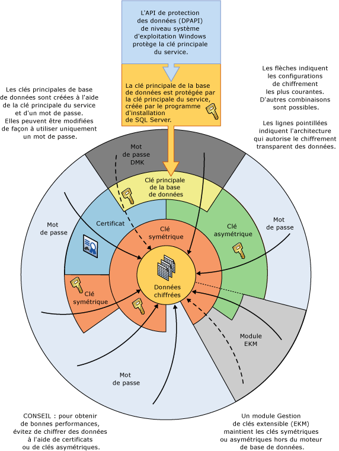

# Hiérarchie de chiffrement
[!INCLUDE[appliesto-ss-asdb-xxxx-xxx-md](../../../includes/appliesto-ss-asdb-xxxx-xxx-md.md)]
  [!INCLUDE[ssNoVersion](../../../includes/ssnoversion-md.md)] chiffre les données avec un chiffrement hiérarchique et une infrastructure de gestion des clés. Chaque couche chiffre la couche qui se trouve en dessous d'elle à l'aide d'une combinaison de certificats, de clés asymétriques et de clés symétriques. Les clés asymétriques et les clés symétriques peuvent être stockées hors de [!INCLUDE[ssNoVersion](../../../includes/ssnoversion-md.md)] dans un module de gestion de clés extensible (EKM, Extensible Key Management).  
  
 L'illustration suivante montre que chaque couche de la hiérarchie de chiffrement chiffre la couche qui se trouve en dessous d'elle, et affiche les configurations de chiffrement les plus communes. L'accès au sommet de la hiérarchie est généralement protégé par un mot de passe.  
  
 ![Affiche des combinaisons de chiffrement dans une pile.] (../../../relational-databases/security/encryption/media/encryption-hierarchy-stack.gif "Affiche des combinaisons de chiffrement dans une pile.")  
  
 Gardez en mémoire les concepts suivants :  
  
-   Pour optimiser les performances, chiffrez les données en utilisant des clés symétriques plutôt que des certificats ou des clés asymétriques.  
  
-   Les clés principales de base de données sont protégées par la clé principale du service. La clé principale du service est créée par le programme d'installation de [!INCLUDE[ssNoVersion](../../../includes/ssnoversion-md.md)] et est chiffrée avec l'API de protection des données (DPAPI) Windows.  
  
-   D'autres hiérarchies de chiffrement avec des couches supplémentaires sont possibles.  
  
-   Un module Gestion de clés extensible (EKM) maintient les clés symétriques ou asymétriques hors de SQL Server.  
  
-   Le chiffrement transparent des données (TDE, Transparent Data Encryption) doit utiliser une clé symétrique appelée la clé de chiffrement de base de données qui est protégée soit par un certificat qui est lui-même protégé par la clé principale de base de données de la base de données MASTER, soit par une clé asymétrique stockée dans un module EKM.  
  
-   La clé principale du service et toutes les clés principales de base de données sont protégées par des clés symétriques.  
  
 L'illustration suivante montre les mêmes informations de manière différente.  
  
   
  
 Ce diagramme illustre les concepts supplémentaires suivants :  
  
-   Dans cette illustration, les flèches indiquent des hiérarchies de chiffrement communes.  
  
-   Les clés symétriques et asymétriques du module EKM peuvent protéger l'accès aux clés symétriques et asymétriques stockées dans [!INCLUDE[ssNoVersion](../../../includes/ssnoversion-md.md)]. La ligne en pointillés associée à EKM indique que les clés du module EKM pourraient remplacer les clés symétriques et asymétriques stockées dans [!INCLUDE[ssNoVersion](../../../includes/ssnoversion-md.md)].  
  
## Mécanismes de chiffrement  
 [!INCLUDE[ssNoVersion](../../../includes/ssnoversion-md.md)] fournit les mécanismes de chiffrement suivants :  
  
-   [!INCLUDE[tsql](../../../includes/tsql-md.md)] fonctions  
  
-   Clés asymétriques  
  
-   Clés symétriques  
  
-   Certificats  
  
-   chiffrement transparent des données  
  
### Fonctions Transact-SQL  
 Des éléments individuels peuvent être chiffrés dès leur insertion ou mise à jour à l’aide de fonctions [!INCLUDE[tsql](../../../includes/tsql-md.md)]. Pour plus d’informations, consultez [ENCRYPTBYPASSPHRASE &#40;Transact-SQL&#41;](../../../t-sql/functions/encryptbypassphrase-transact-sql.md) et [DECRYPTBYPASSPHRASE &#40;Transact-SQL&#41;](../../../t-sql/functions/decryptbypassphrase-transact-sql.md).  
  
### Certificats  
 Un certificat de clé publique, généralement appelé simplement un certificat, est une instruction signée numériquement qui lie la valeur d'une clé publique à l'identité de la personne, de la machine ou du service qui contient la clé privée correspondante. Les certificats sont émis et signés par une autorité de certification. L'entité qui reçoit un certificat d'une autorité de certification est le sujet de ce certificat. En général, les certificats contiennent les informations suivantes.  
  
-   Clé publique du sujet.  
  
-   Informations identifiant le sujet, par exemple son nom et son adresse de messagerie.  
  
-   Période de validité. Il s'agit de la durée pendant laquelle le certificat est valide.  
  
     Un certificat n’est valide que pour la durée spécifiée dans celui-ci. Chaque certificat contient les dates **Valide à partir du** et **Valide jusqu’au** . Ces dates définissent les limites de la période de validité. Lorsque la période de validité d'un certificat est dépassée, un nouveau certificat doit être demandé par le sujet du certificat expiré.  
  
-   Des informations identifiant l'émetteur.  
  
-   Signature numérique de l'émetteur.  
  
     Cette signature atteste de la validité du lien entre la clé publique et les informations identifiant le sujet. (Le processus de signature numérique des informations implique la transformation de celles-ci, ainsi que la présence d'informations secrètes connues de l'expéditeur dans une balise nommée signature.)  
  
 Le principal avantage des certificats est le fait que les hôtes ne sont pas tenus de conserver un jeu de mots de passe pour les sujets individuels. Il leur suffit de placer leur confiance dans un émetteur de certificats, qui peut ensuite signer un nombre illimité de certificats.  
  
 Lorsqu'un hôte, tel qu'un serveur Web sécurisé, désigne un émetteur en tant qu'autorité racine approuvée, l'hôte approuve implicitement les stratégies que l'émetteur a utilisées pour établir les liaisons des certificats qu'il émet. En fait, l'hôte fait confiance à l'émetteur en ce qui concerne la vérification de l'identité du sujet du certificat. Un hôte désigne un émetteur en tant qu'autorité racine de confiance en plaçant le certificat auto-signé de l'émetteur contenant sa clé publique dans le magasin de certificats de l'autorité de certification racine de confiance de l'ordinateur hôte. Les Autorités de certification intermédiaires ou secondaires ne sont approuvées que si elles ont un chemin d'accès de certification valide à partir d'une Autorité de certification racine de confiance.  
  
 L'émetteur peut révoquer un certificat avant qu'il n'expire. La révocation annule la liaison de la clé publique à l'identité qui est déclarée dans le certificat. Chaque émetteur gère une liste de révocation de certificats qui peut être utilisée par des programmes lors de la vérification de la validité de n'importe quel certificat.  
  
 Les certificats auto-signés créés par [!INCLUDE[ssNoVersion](../../../includes/ssnoversion-md.md)] respectent la norme X.509 et prennent en charge les champs X.509 v1.  
  
### Clés asymétriques  
 Une clé asymétrique se compose d'une clé privée et de la clé publique correspondante. Chaque clé peut déchiffrer les données chiffrées par l'autre. Le chiffrement et le déchiffrement asymétriques sont relativement gourmands en ressources, mais ils fournissent un niveau de sécurité supérieur à celui du chiffrement symétrique. Une clé asymétrique peut être utilisée pour chiffrer une clé symétrique en vue d'un stockage dans une base de données.  
  
### Clés symétriques  
 Une clé symétrique est une clé qui est utilisée pour le chiffrement et le déchiffrement. Une clé symétrique permet d'effectuer un chiffrement et un déchiffrement rapides, particulièrement adaptés à l'utilisation courante des données sensibles de la base de données.  
  
### chiffrement transparent des données  
 Le chiffrement transparent des données est un cas spécial de chiffrement à l'aide d'une clé symétrique. L'ensemble de la base de données est chiffré à l'aide de cette clé symétrique, appelée clé de chiffrement de base de données. La clé de chiffrement de base de données est protégée par d'autres clés ou certificats qui sont eux-mêmes protégés par la clé principale de base de données ou par une clé asymétrique stockée dans un module EKM. Pour plus d’informations, consultez [Transparent Data Encryption &#40;TDE&#41;](../../../relational-databases/security/encryption/transparent-data-encryption.md).  
  
## Contenu associé  
 [Sécurisation de SQL Server](../../../relational-databases/security/securing-sql-server.md)  
  
 [Fonctions de sécurité &#40;Transact-SQL&#41;](../../../t-sql/functions/security-functions-transact-sql.md)  
  
##  Voir aussi  
 [Hiérarchie des autorisations &#40;moteur de base de données&#41;](../../../relational-databases/security/permissions-hierarchy-database-engine.md)   
 [Éléments sécurisables](../../../relational-databases/security/securables.md)  
  
  
